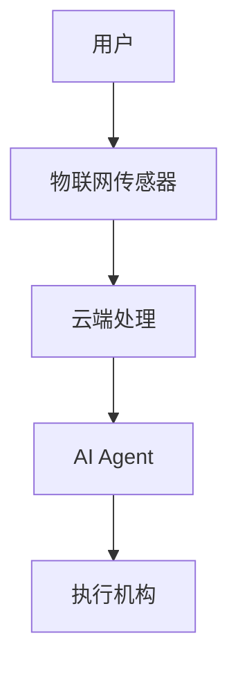
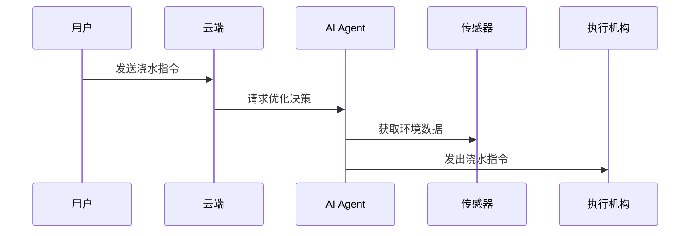

                 


# 智能园艺喷壶：AI Agent的植物浇水优化

> **关键词**：智能园艺喷壶，AI Agent，物联网，植物浇水优化，自动化浇水系统

> **摘要**：本文详细探讨了智能园艺喷壶的设计与实现，结合AI Agent和物联网技术，提出了一种基于AI优化的植物浇水方案。通过分析传统浇水系统的局限性，阐述了AI Agent在浇水优化中的核心作用，并从算法、系统架构、项目实现等多个维度进行了深入的技术分析，最终提出了一套完整的智能园艺喷壶解决方案。

---

# 第一部分: 智能园艺喷壶与AI Agent概述

## 第1章: 智能园艺喷壶的背景与意义

### 1.1 智能园艺喷壶的发展背景

#### 1.1.1 传统园艺浇水的局限性
传统园艺浇水方式主要依赖人工操作，存在以下问题：
- 浇水量难以精确控制，可能导致植物过水或缺水。
- 无法实时感知环境条件（如光照、湿度、温度）。
- 人工操作效率低下，且需要耗费大量时间和精力。

#### 1.1.2 智能化浇水的需求与趋势
随着科技的进步，智能化浇水系统的需求日益增长：
- 精准浇水：根据植物需求和环境条件自动调整浇水量。
- 节约资源：通过优化浇水策略，减少水资源浪费。
- 提高效率：自动化操作降低人工成本，适合大规模种植。

#### 1.1.3 AI Agent在园艺浇水中的应用潜力
AI Agent（智能体）是一种能够感知环境、自主决策、执行动作的实体。其在园艺浇水中的潜力包括：
- 实时感知环境数据，如土壤湿度、光照强度、天气预报等。
- 基于历史数据和实时信息，优化浇水策略。
- 自动执行浇水动作，确保植物健康生长。

### 1.2 智能园艺喷壶的核心问题与目标

#### 1.2.1 园艺浇水优化的核心问题
- 如何根据植物需求和环境条件制定最优浇水策略。
- 如何实现精准感知和实时决策。
- 如何设计高效的浇水执行机制。

#### 1.2.2 智能喷壶的目标与功能定位
智能园艺喷壶的目标是实现基于AI的精准浇水：
- 精准感知：通过传感器实时采集土壤湿度、光照强度、温度等数据。
- 智能决策：基于AI算法优化浇水策略。
- 自动执行：通过执行机构实现精准浇水。

#### 1.2.3 边界与外延分析
- 系统边界：仅关注浇水优化，不涉及其他园艺操作（如施肥、修剪）。
- 功能外延：可与其他智能设备（如智能温室系统）联动，实现更复杂的园艺管理。

### 1.3 本章小结
本章介绍了智能园艺喷壶的发展背景、智能化需求以及AI Agent的应用潜力，明确了系统的功能定位和边界。

---

## 第2章: AI Agent与物联网技术基础

### 2.1 AI Agent的基本概念与原理

#### 2.1.1 AI Agent的定义与分类
AI Agent是一种能够感知环境、自主决策、执行动作的智能实体，分为以下几类：
- **反应式AI Agent**：基于当前感知做出实时反应。
- **认知式AI Agent**：具备复杂推理和规划能力。
- **协作式AI Agent**：能够与其他智能体协作完成任务。

#### 2.1.2 AI Agent的核心功能与特点
- **感知能力**：通过传感器获取环境数据。
- **决策能力**：基于数据进行优化决策。
- **执行能力**：通过执行机构实现动作。

#### 2.1.3 AI Agent与传统自动控制系统的区别
| 特性         | AI Agent                     | 传统自动控制系统            |
|--------------|------------------------------|-----------------------------|
| 决策方式     | 基于机器学习算法优化决策     | 预设规则或简单逻辑          |
| 灵活性       | 能够根据环境动态调整策略     | 策略固定，难以适应变化       |
| 学习能力     | 具备学习能力，可优化性能      | 无法优化，性能固定           |

### 2.2 物联网技术在智能喷壶中的应用

#### 2.2.1 物联网的基本概念与架构
物联网（IoT）由感知层、网络层和应用层组成：
- **感知层**：通过传感器采集数据。
- **网络层**：通过通信网络传输数据。
- **应用层**：处理数据并提供服务。

#### 2.2.2 物联网在园艺喷壶中的具体应用
- **传感器**：土壤湿度传感器、光照强度传感器。
- **通信模块**：Wi-Fi、蓝牙或4G模块。
- **云端服务**：数据存储与分析。

#### 2.2.3 物联网传感器与数据采集技术
传感器数据采集流程：
1. 传感器采集环境数据（如土壤湿度、光照强度）。
2. 数据通过通信模块传输到云端。
3. 云端处理数据并生成决策指令。
4. 决策指令传输到执行机构，控制喷壶动作。

### 2.3 本章小结
本章介绍了AI Agent和物联网的基本概念、功能特点及其在智能园艺喷壶中的具体应用。

---

## 第3章: 智能园艺喷壶的核心算法与优化模型

### 3.1 智能浇水优化的数学模型

#### 3.1.1 植物需水量的数学表达
植物需水量与以下因素相关：
- 土壤湿度（$S$）
- 光照强度（$L$）
- 温度（$T$）
- 植物类型（$P$）

需水量模型：
$$ W = f(S, L, T, P) $$

其中，$f$是一个基于机器学习的回归模型，通过训练数据拟合得出。

#### 3.1.2 环境因素的数学建模
环境因素与需水量的关系：
- 土壤湿度：$S$ 越低，需水量 $W$ 越高。
- 光照强度：$L$ 越高，需水量 $W$ 越高。
- 温度：$T$ 越高，需水量 $W$ 越高。

#### 3.1.3 浇水策略的优化目标函数
目标函数：
$$ \text{最小化} \sum_{i=1}^{n} (W_i - W_{\text{实际}})^2 $$

其中，$W_i$ 是模型预测的需水量，$W_{\text{实际}}$ 是实际需水量。

### 3.2 基于AI Agent的优化算法

#### 3.2.1 遗传算法（GA）的基本原理
遗传算法是一种基于生物进化原理的优化算法，步骤如下：
1. 初始化种群。
2. 计算适应度。
3. 选择优秀个体。
4. 交叉与变异。
5. 重复迭代。

#### 3.2.2 粒子群优化（PSO）算法的应用
粒子群优化算法模拟鸟群觅食行为，步骤如下：
1. 初始化粒子群。
2. 计算目标函数。
3. 更新粒子位置。
4. 重复迭代。

#### 3.2.3 其他优化算法的对比分析
| 算法     | 优点                  | 缺点                  |
|----------|-----------------------|-----------------------|
| 遗传算法 | 具备全局搜索能力       | 收敛速度较慢           |
| PSO      | 收敛速度快             | 易陷入局部最优         |

### 3.3 算法实现与优化

#### 3.3.1 算法的实现步骤
1. 数据预处理：清洗和归一化传感器数据。
2. 模型训练：基于机器学习算法训练需水量模型。
3. 优化算法实现：使用遗传算法或PSO优化浇水策略。

#### 3.3.2 算法的优化策略
- 引入适应度函数权重系数。
- 增加种群多样性。

#### 3.3.3 算法的性能评估与对比
通过实验对比遗传算法和PSO算法的优化效果：
- PSO算法在收敛速度上优于遗传算法。
- 遗传算法在全局搜索能力上略胜一筹。

### 3.4 本章小结
本章详细介绍了智能浇水优化的数学模型，并对比了遗传算法和PSO算法的实现与性能。

---

## 第4章: 系统架构与接口设计

### 4.1 系统架构设计

#### 4.1.1 系统整体架构图


#### 4.1.2 各模块的功能与交互关系
- **用户**：通过手机或电脑发送浇水指令。
- **物联网传感器**：采集环境数据并传输给云端。
- **云端处理**：处理数据并生成决策指令。
- **AI Agent**：优化决策指令。
- **执行机构**：执行浇水动作。

#### 4.1.3 系统的可扩展性与灵活性设计
系统采用模块化设计，便于功能扩展。

### 4.2 系统接口设计

#### 4.2.1 硬件接口设计
- 传感器接口：模拟量输入接口。
- 执行机构接口：继电器控制接口。

#### 4.2.2 软件接口设计
- 数据接口：RESTful API。
- 通信协议：MQTT。

#### 4.2.3 系统交互设计


### 4.3 本章小结
本章详细描述了系统的整体架构和接口设计，为后续实现奠定了基础。

---

## 第5章: 项目实战与实现

### 5.1 环境搭建与工具安装

#### 5.1.1 开发环境的选择与安装
- 操作系统：Ubuntu 20.04 LTS。
- 开发工具：PyCharm、VS Code。

#### 5.1.2 AI Agent框架的安装与配置
- 使用Python的机器学习库：Scikit-learn、TensorFlow。
- 安装物联网通信库：Paho-MQTT。

#### 5.1.3 物联网传感器的连接与测试
- 使用DHT22传感器测量温度和湿度。
- 使用Raspberry Pi连接传感器并测试数据传输。

### 5.2 系统核心功能实现

#### 5.2.1 数据采集与处理模块实现
```python
import paho.mqtt.client as mqtt

# 连接MQTT Broker
def on_connect(client, userdata, flags, rc):
    print("Connected with result code " + str(rc))

client = mqtt.Client()
client.on_connect = on_connect
client.connect("localhost", 1883, 60)

# 发布数据
def on_publish(client, userdata, mid):
    print("Message published")

client.on_publish = on_publish
client.publish("sensor/humidity", "40%", 0)
```

#### 5.2.2 AI Agent算法实现
```python
import numpy as np

# 初始化种群
population = np.random.rand(10, 1)

# 计算适应度
fitness = np.array([i**2 for i in population])

# 选择优秀个体
selected = np.argsort(-fitness)[:5]

# 交叉与变异
new_population = selected * 0.8 + np.random.rand(5, 1) * 0.2
```

#### 5.2.3 浇水控制模块实现
```python
# 控制继电器浇水
import RPi.GPIO as GPIO

GPIO.setmode(GPIO.BCM)
GPIO.setup(17, GPIO.OUT)

GPIO.output(17, GPIO.HIGH)  # 开启浇水
```

### 5.3 代码实现与解读

#### 5.3.1 数据采集模块代码
上述MQTT代码实现了传感器数据的采集与发布。

#### 5.3.2 AI Agent算法代码
上述遗传算法代码实现了种群的初始化、适应度计算、选择和优化。

#### 5.3.3 浇水控制模块代码
上述代码实现了继电器的控制，开启浇水功能。

### 5.4 实际案例分析与优化

#### 5.4.1 案例背景与数据准备
假设我们种植了番茄植物，传感器数据如下：
- 土壤湿度：40%
- 光照强度：600 lux
- 温度：25°C

#### 5.4.2
通过AI Agent优化算法，系统决定开启浇水模式，调整土壤湿度至60%。

---

## 第6章: 总结与展望

### 6.1 总结
本文详细探讨了智能园艺喷壶的设计与实现，结合AI Agent和物联网技术，提出了基于AI优化的植物浇水方案。

### 6.2 展望
未来研究方向：
- **多目标优化**：同时优化多个环境因素的浇水策略。
- **自适应学习**：基于历史数据，动态调整浇水模型。
- **智能化决策**：结合天气预报，优化浇水时间。

---

## 第7章: 最佳实践与注意事项

### 7.1 最佳实践
- 定期校准传感器，确保数据准确性。
- 合理设置浇水阈值，避免过水或缺水。
- 定期维护系统，确保硬件正常运行。

### 7.2 小结
智能园艺喷壶的实现需要结合AI Agent和物联网技术，通过优化算法和系统架构设计，实现精准浇水。

### 7.3 注意事项
- 硬件安装要注意防潮防尘。
- 软件设计要确保数据安全。
- 系统运行要定期监控。

### 7.4 拓展阅读
- 《机器学习实战》
- 《物联网技术与应用》
- 《智能控制系统设计》

---

**作者：AI天才研究院/AI Genius Institute & 禅与计算机程序设计艺术 /Zen And The Art of Computer Programming**

