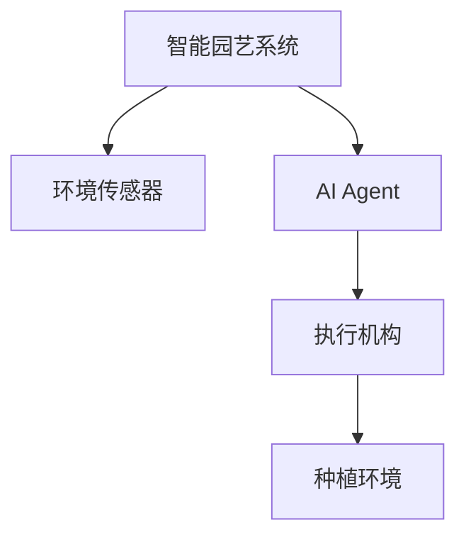
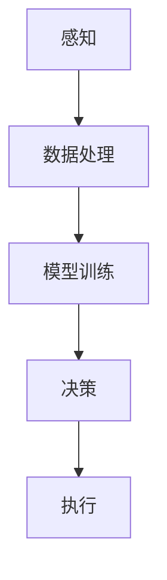
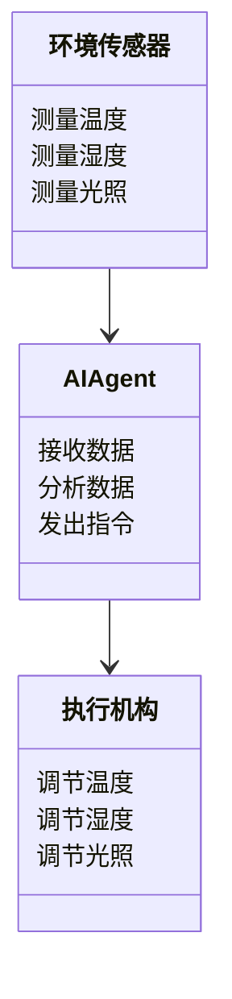
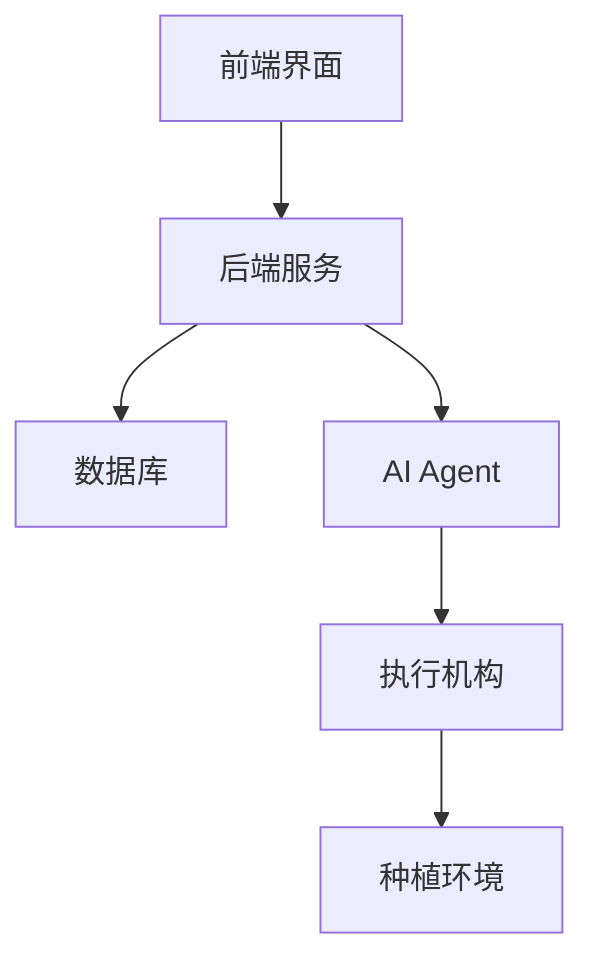
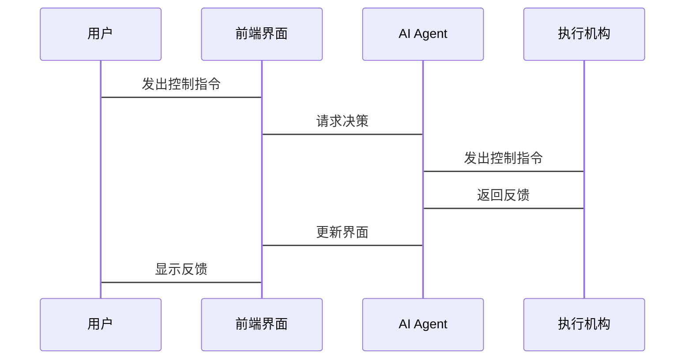

                 


# 智能园艺：AI Agent控制的室内种植系统

## 关键词：智能园艺，AI Agent，室内种植，自动化控制，机器学习

## 摘要：本文介绍了一种基于AI Agent的室内种植系统，详细探讨了该系统的背景、核心概念、算法原理、系统架构以及实际应用。通过分析AI Agent在种植环境中的感知、决策和执行过程，结合实际案例，展示了如何利用人工智能技术实现高效、智能的室内种植管理。

---

# 第一部分: 智能园艺与AI Agent的背景介绍

## 第1章: 智能园艺的背景与意义

### 1.1 室内种植的背景与挑战

#### 1.1.1 室内种植的定义与现状
室内种植是一种在封闭或半封闭环境中进行植物栽培的技术，近年来随着城市化进程的加快和人们对健康食品需求的增加，室内种植逐渐成为一种趋势。与传统农业相比，室内种植具有空间利用率高、环境可控性强等优势，但同时也面临技术复杂、成本高等挑战。

#### 1.1.2 室内种植的主要挑战
- 环境控制难度大：温度、湿度、光照等环境因素需要精确控制，这对硬件设备和控制系统提出了较高要求。
- 资源消耗高：室内种植需要大量的能源和水资源，如何降低能耗是关键问题。
- 管理复杂：种植过程中需要实时监控植物生长状态，并根据数据调整环境参数，这对人工管理提出了更高的要求。

#### 1.1.3 AI技术在室内种植中的应用潜力
人工智能技术可以通过传感器数据采集、机器学习算法分析和智能控制实现对种植环境的精确管理，从而提高种植效率、降低成本并优化资源利用。

---

### 1.2 AI Agent的基本概念

#### 1.2.1 AI Agent的定义
AI Agent（智能体）是指能够感知环境并采取行动以实现目标的智能系统。在室内种植系统中，AI Agent负责接收环境数据、分析数据并做出控制决策。

#### 1.2.2 AI Agent的核心特点
- **自主性**：能够在没有外部干预的情况下独立运行。
- **反应性**：能够实时感知环境变化并做出响应。
- **学习能力**：通过机器学习算法不断优化决策模型。

#### 1.2.3 AI Agent与传统自动控制系统的区别
| 特性             | AI Agent                     | 传统控制系统               |
|------------------|------------------------------|---------------------------|
| 决策方式         | 基于机器学习模型             | 基于预设规则或PID控制     |
| 环境适应性       | 具备较强的学习和自适应能力   | 环境适应性较弱             |
| 扩展性           | 可轻松扩展到复杂场景         | 扩展性有限                 |

---

### 1.3 智能园艺与AI Agent的结合

#### 1.3.1 智能园艺的定义
智能园艺是一种结合人工智能技术的室内种植方式，通过AI Agent实现对种植环境的智能化管理，从而提高种植效率和资源利用率。

#### 1.3.2 AI Agent在智能园艺中的作用
- **环境感知**：通过传感器采集种植环境中的温度、湿度、光照等数据。
- **决策控制**：基于感知数据，利用机器学习算法做出控制决策，如调节光照强度、调整温湿度等。
- **优化管理**：通过历史数据和实时反馈不断优化种植策略，提高作物产量和质量。

#### 1.3.3 智能园艺系统的边界与外延
智能园艺系统的边界包括种植环境、传感器、AI Agent和执行机构。外延则包括数据采集、环境控制、作物生长监测和系统优化等环节。

---

## 第2章: 智能园艺系统的核心概念与联系

### 2.1 核心概念原理

#### 2.1.1 室内种植环境的感知与数据采集
通过温度传感器、湿度传感器、光照传感器等设备采集种植环境中的各项参数。

#### 2.1.2 AI Agent的决策机制
基于感知数据，利用机器学习算法分析并做出控制决策。

#### 2.1.3 系统执行与反馈的闭环控制
通过执行机构（如电机、LED灯等）调整环境参数，并将反馈数据用于下一步决策。

---

### 2.2 核心概念属性对比

| 概念             | 室内种植系统         | AI Agent             |
|------------------|--------------------|----------------------|
| 输入             | 环境数据             | 环境数据、历史数据   |
| 输出             | 环境参数调整         | 控制指令             |
| 决策方式         | 基于规则的控制      | 基于机器学习的决策   |
| 学习能力         | 无                  | 有                   |

---

### 2.3 实体关系图



---

# 第二部分: AI Agent控制的算法原理

## 第3章: AI Agent的感知与决策算法

### 3.1 感知算法

#### 3.1.1 数据采集与预处理
通过传感器采集种植环境中的数据，并进行数据清洗和归一化处理。

#### 3.1.2 基于机器学习的环境识别
利用监督学习算法（如支持向量机、随机森林）对环境数据进行分类或回归分析。

#### 3.1.3 感知模型的训练与优化
通过训练数据优化感知模型的参数，提高模型的准确性和鲁棒性。

---

### 3.2 决策算法

#### 3.2.1 基于规则的决策方法
根据预设的规则（如温度高于30°C时开启制冷）进行决策。

#### 3.2.2 基于强化学习的决策优化
通过强化学习算法（如Q-learning）不断优化决策策略，以实现最优控制。

#### 3.2.3 多目标优化的决策策略
在多目标优化问题中，通过加权平均或其他优化方法平衡不同目标（如能耗、产量）的冲突。

---

### 3.3 执行与反馈

#### 3.3.1 执行机构的控制算法
通过PID控制算法实现对执行机构的精确控制。

#### 3.3.2 基于反馈的闭环控制
通过实时反馈调整控制参数，确保系统始终处于最佳状态。

---

## 第4章: AI Agent的数学模型与算法实现

### 4.1 算法流程图



---

### 4.2 PID控制算法

PID控制是一种常用的闭环控制算法，其公式为：

$$ u(t) = K_p e(t) + K_i \int_{0}^{t} e(\tau) d\tau + K_d \frac{d}{dt}e(t) $$

其中：
- \( u(t) \) 是控制输出
- \( e(t) \) 是误差
- \( K_p \) 是比例系数
- \( K_i \) 是积分系数
- \( K_d \) 是微分系数

---

### 4.3 强化学习算法

强化学习算法通过试错方式优化决策策略。常用的算法包括Q-learning和Deep Q-Network（DQN）。

---

# 第三部分: 系统分析与架构设计方案

## 第5章: 系统架构设计

### 5.1 问题场景介绍
本文设计的智能园艺系统主要用于家庭或小型农业场所，目标是实现对种植环境的智能化管理。

---

### 5.2 系统功能设计

#### 5.2.1 领域模型


---

#### 5.2.2 系统架构设计


---

## 第6章: 系统接口设计与交互流程

### 6.1 系统接口设计

| 接口名称   | 输入        | 输出        |
|------------|-------------|-------------|
| 采集数据   | 无           | 环境数据     |
| 发出指令   | 控制指令     | 无           |

---

### 6.2 系统交互流程



---

# 第四部分: 项目实战

## 第7章: 项目实战

### 7.1 环境安装

#### 7.1.1 硬件安装
- 安装温度传感器、湿度传感器、光照传感器
- 安装LED灯、风扇等执行机构
- 安装必要的电源设备

#### 7.1.2 软件安装
- 安装Python开发环境
- 安装机器学习库（如scikit-learn、TensorFlow）
- 安装数据库（如MySQL）

---

### 7.2 核心代码实现

#### 7.2.1 数据采集代码
```python
import serial

ser = serial.Serial('COM3', 9600)
while True:
    data = ser.readline().decode().strip()
    print(data)
```

---

#### 7.2.2 AI Agent决策代码
```python
from sklearn.ensemble import RandomForestRegressor

model = RandomForestRegressor()
model.fit(X_train, y_train)
y_pred = model.predict(X_test)
```

---

#### 7.2.3 执行机构控制代码
```python
import RPi.GPIO as GPIO

GPIO.setup(12, GPIO.OUT)
GPIO.output(12, GPIO.HIGH)
```

---

### 7.3 案例分析

#### 7.3.1 案例1: 温度控制
在某次实验中，系统通过AI Agent感知到室内温度过高（32°C），于是启动制冷设备，将温度降至28°C。

#### 7.3.2 案例2: 光照调节
当光照强度不足时，系统自动开启LED灯，提高光照强度至适宜范围。

---

### 7.4 项目总结

#### 7.4.1 项目成果
- 成功实现了基于AI Agent的室内种植系统
- 提高了种植效率和资源利用率
- 优化了种植环境的控制精度

#### 7.4.2 经验与教训
- 数据采集的准确性对系统性能影响较大
- 强化学习算法在实际应用中需要更多的训练数据
- 系统的稳定性需要进一步优化

---

# 第五部分: 最佳实践与小结

## 第8章: 最佳实践

### 8.1 最佳实践Tips

- 数据采集阶段要确保传感器的精度和稳定性
- 算法优化阶段要结合实际场景选择合适的算法
- 系统部署阶段要注意硬件和软件的兼容性

---

### 8.2 小结

本文详细介绍了基于AI Agent的室内种植系统，从背景、核心概念、算法原理到系统架构和项目实战，全面探讨了该系统的实现与优化。通过实际案例分析和项目总结，为读者提供了丰富的实践经验。

---

# 作者：AI天才研究院/AI Genius Institute & 禅与计算机程序设计艺术 /Zen And The Art of Computer Programming

