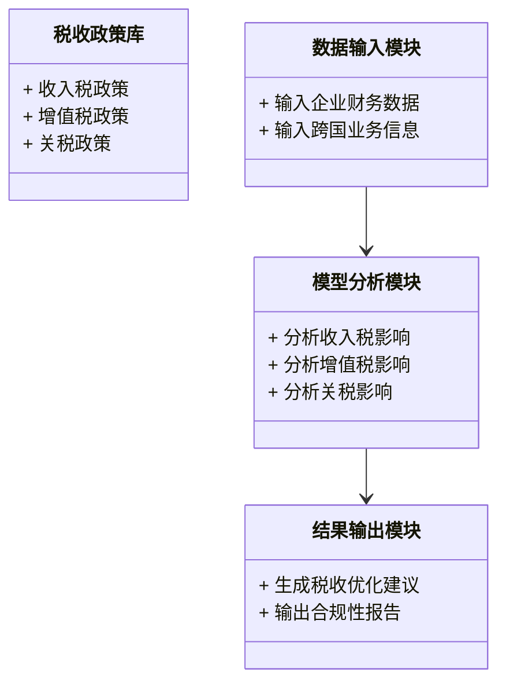
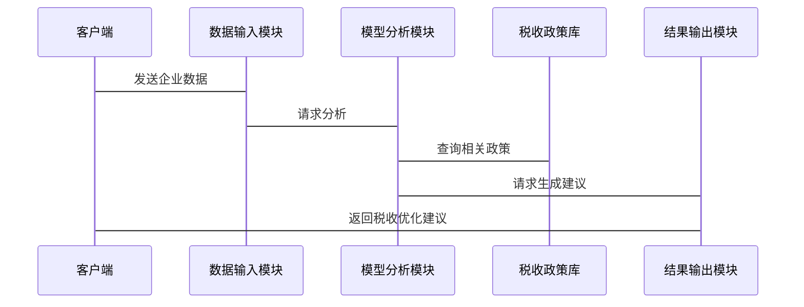

                 


# 智能国际税收筹划建议生成器

> 关键词：智能税收、国际税收、AI税收筹划、税收优化、税务合规、AI技术应用、法律合规

> 摘要：本文探讨了智能国际税收筹划建议生成器的构建与应用，结合生成式AI技术，详细介绍其核心算法、系统架构和实际案例，分析其在国际税收优化中的潜力与挑战。

---

# 第1章: 智能国际税收的背景与意义

## 1.1 智能国际税收的定义与概念

### 1.1.1 国际税收的基本概念

国际税收是指跨国企业和个人在不同国家进行经济活动时，根据各国税法产生的税务义务。涉及的主要税种包括企业所得税、增值税、关税等。国际税收的核心在于理解不同国家的税收政策，优化税务结构，降低税负。

### 1.1.2 智能技术在税收领域的应用

智能技术，特别是人工智能（AI），在税收领域的应用主要体现在自动化数据处理、模式识别和智能决策支持。AI能够通过自然语言处理（NLP）技术分析大量法律文本，提取关键信息，辅助税收筹划。

### 1.1.3 智能国际税收的核心特点

智能国际税收结合了AI技术，能够快速分析跨国业务的税务影响，提供个性化的税收优化建议。其核心特点包括高效性、精准性和合规性。

## 1.2 智能国际税收的现状与发展趋势

### 1.2.1 全球化背景下的税收挑战

随着全球化进程的加快，企业跨国经营日益频繁，面临的税收问题也更加复杂。不同国家的税收政策差异和税收协定的复杂性增加了税务管理的难度。

### 1.2.2 智能技术在国际税收中的应用现状

目前，AI技术在国际税收中的应用还处于起步阶段，但已展现出巨大潜力。部分企业开始尝试使用AI工具进行税务合规性检查和税收优化建议生成。

### 1.2.3 未来智能国际税收的发展方向

未来，智能国际税收将朝着更加智能化、自动化和个性化的方向发展。AI技术将进一步提升税收筹划的效率和准确性，帮助企业在复杂的国际税收环境中找到最优解决方案。

## 1.3 智能国际税收的技术基础

### 1.3.1 人工智能在税收领域的应用

AI技术在税收领域的应用主要体现在数据挖掘、模式识别和智能决策支持。例如，AI可以通过分析企业财务数据，识别潜在的税收优化机会。

### 1.3.2 大语言模型在税收筹划中的作用

大语言模型（如GPT系列）通过自然语言处理技术，能够理解和生成复杂的税务文档，帮助用户快速获取税收政策信息，生成税收优化建议。

### 1.3.3 智能系统在跨国税务规划中的优势

智能系统能够快速分析跨国业务的税务影响，结合各国税收政策，提供个性化的税收优化建议。其优势在于高效性、准确性和可扩展性。

## 1.4 智能国际税收的法律与合规环境

### 1.4.1 国际税收法律框架

国际税收的法律框架主要包括税收协定、OECD模型公约、转让定价规则等。这些法律框架为企业提供了跨国税务规划的依据。

### 1.4.2 智能系统在法律合规中的应用

智能系统可以通过分析法律文本，识别关键条款，帮助企业合规性地进行国际税务规划。例如，系统可以自动识别跨国交易中的潜在风险，提出合规建议。

### 1.4.3 税收筹划的合规性要求

企业在进行国际税务规划时，必须遵守相关法律法规，避免税收避规避行为。智能系统能够帮助企业识别合规边界，确保税收筹划的合法性。

## 1.5 智能国际税收的应用价值

### 1.5.1 提高税收筹划效率

通过AI技术，企业可以快速获取税收政策信息，减少手动查找和分析的时间，提高税收筹划效率。

### 1.5.2 优化企业税务结构

智能系统能够根据企业的具体情况，提供个性化的税收优化建议，帮助企业在不同国家间优化税务结构，降低整体税负。

### 1.5.3 全球化背景下的税务风险管理

智能系统可以帮助企业识别跨国经营中的税务风险，制定应对策略，降低税务争议和罚款的风险。

---

# 第2章: 智能国际税收的核心概念与联系

## 2.1 智能国际税收的核心概念

### 2.1.1 税收筹划的定义与目标

税收筹划是指通过合理安排企业的财务和经营策略，降低税负，实现税务优化的过程。其目标是合法合规地减少税负，提高企业利润。

### 2.1.2 智能系统在税收筹划中的角色

智能系统在税收筹划中扮演着决策支持工具的角色。它通过分析大量数据，提供个性化的税收优化建议，辅助企业做出最优决策。

### 2.1.3 国际税收的核心要素

国际税收的核心要素包括跨国交易、税收政策、税收协定、转让定价和税务合规。这些要素共同影响企业的税务负担。

## 2.2 智能国际税收的核心原理

### 2.2.1 生成式AI模型的工作原理

生成式AI模型（如大语言模型）通过深度学习技术，从大量数据中提取模式，生成符合特定需求的文本或建议。在税收筹划中，模型可以生成税收优化建议，帮助用户快速获取相关信息。

### 2.2.2 大语言模型在税收筹划中的应用

大语言模型可以通过自然语言处理技术，分析税收政策文本，提取关键信息，生成税收优化建议。例如，模型可以识别特定国家的税收优惠政策，帮助企业制定相应的税务策略。

### 2.2.3 智能系统与法律知识库的结合

智能系统通过结合法律知识库，能够快速检索和分析税收政策，提供合规的税收优化建议。知识库的更新和维护是系统准确性的关键。

## 2.3 智能国际税收的概念结构与核心要素

### 2.3.1 系统架构的模块划分

智能国际税收系统通常包括数据输入、模型分析、结果输出和用户交互四个模块。数据输入模块接收企业的财务数据和业务信息；模型分析模块通过AI技术生成税收优化建议；结果输出模块将建议呈现给用户；用户交互模块允许用户与系统进行互动。

### 2.3.2 核心要素的定义与关系

核心要素包括跨国交易、税收政策、AI模型、法律知识库和用户需求。这些要素相互关联，共同影响系统的输出结果。例如，跨国交易的数据输入触发AI模型的分析，生成税收优化建议，用户需求决定了系统的输出形式。

### 2.3.3 系统功能的实现逻辑

系统功能的实现逻辑包括数据处理、模型分析、结果生成和用户反馈。数据处理模块对输入数据进行清洗和预处理；模型分析模块基于预处理后的数据，生成税收优化建议；结果生成模块将建议以用户友好的形式呈现；用户反馈模块收集用户的反馈，优化系统的性能。

---

# 第3章: 智能国际税收的核心算法与数学模型

## 3.1 生成式AI模型的算法原理

### 3.1.1 大语言模型的结构与训练过程

大语言模型通常采用 transformer 架构，包括编码器和解码器两个部分。模型通过自注意力机制，捕捉输入文本中的长距离依赖关系。训练过程包括前向传播和反向传播两个阶段，使用梯度下降算法优化模型参数。

### 3.1.2 模型的生成机制

生成机制基于概率论，模型通过计算每个可能的下一个词的概率分布，选择概率最高的词生成输出。生成过程中，模型可以逐步生成词，直到达到预设的长度或生成结束的标志。

### 3.1.3 模型的训练过程

模型的训练过程包括数据预处理、模型初始化、前向传播、损失计算、反向传播和参数更新。损失函数通常采用交叉熵损失，优化目标是最小化损失函数值。

## 3.2 生成式AI模型在税收筹划中的应用

### 3.2.1 模型的训练与优化

在税收筹划中，模型需要大量相关的法律和税务数据进行训练。数据来源包括各国的税收政策、税收协定和相关法规。模型的优化目标是提高生成建议的准确性和相关性。

### 3.2.2 模型的推理过程

在推理阶段，模型接收用户的输入，如企业的财务数据和业务信息，生成相应的税收优化建议。生成过程需要考虑模型的准确性和效率，确保用户能够快速获得有用的建议。

### 3.2.3 模型的评估与优化

模型的评估通常基于准确率、召回率和F1分数等指标。优化过程包括调整模型参数、增加训练数据和改进模型结构，以提高生成建议的质量。

## 3.3 智能系统中的数学模型

### 3.3.1 概率模型在税收筹划中的应用

概率模型可以用于预测跨国交易的税务风险。例如，模型可以通过分析历史数据，计算某项交易被税务机关调查的概率，帮助企业制定相应的风险管理策略。

### 3.3.2 统计模型在税收优化中的应用

统计模型可以用于分析不同税收政策对企业税负的影响。例如，模型可以分析不同国家的企业所得税率对企业利润的影响，帮助企业选择最优的税务结构。

### 3.3.3 优化模型在税务规划中的应用

优化模型可以用于制定税收优化策略。例如，模型可以通过线性规划方法，优化企业的跨国投资结构，降低整体税负。

---

# 第4章: 智能国际税收的系统分析与架构设计

## 4.1 系统的需求分析

### 4.1.1 问题场景介绍

系统的需求分析通常基于具体的业务场景。例如，企业需要进行跨国投资，需要了解不同国家的税收政策，优化税务结构。系统需要能够快速生成税收优化建议，帮助用户做出决策。

### 4.1.2 项目介绍

项目介绍包括项目的背景、目标和范围。例如，本项目旨在开发一个智能国际税收筹划建议生成器，帮助用户优化跨国投资的税务结构。

## 4.2 系统功能设计

### 4.2.1 领域模型（Mermaid类图）



### 4.2.2 系统架构设计（Mermaid架构图）


### 4.2.3 系统接口设计

系统接口设计包括API接口的设计和数据格式的定义。例如，系统提供一个RESTful API，用户可以通过发送JSON格式的数据，获取税收优化建议。

### 4.2.4 系统交互设计（Mermaid序列图）



---

# 第5章: 智能国际税收的项目实战

## 5.1 项目环境安装

### 5.1.1 安装Python环境

使用Python 3.8或更高版本。安装步骤如下：

```bash
python --version
pip install --upgrade pip
```

### 5.1.2 安装相关库

安装必要的库，如 transformers 和 requests：

```bash
pip install transformers requests
```

## 5.2 系统核心实现

### 5.2.1 核心代码实现

以下是一个简单的生成式AI模型的实现示例：

```python
from transformers import AutoTokenizer, AutoModelForCausalLM
import requests

tokenizer = AutoTokenizer.from_pretrained('gpt2')
model = AutoModelForCausalLM.from_pretrained('gpt2')

def generate_tax_suggestion(input_text):
    inputs = tokenizer.encode(input_text, return_tensors='np')
    outputs = model.generate(inputs, max_length=50, do_sample=True)
    return tokenizer.decode(outputs[0])

print(generate_tax_suggestion("跨国投资的税务影响："))
```

### 5.2.2 代码功能解读

上述代码使用了Hugging Face的Transformers库，加载了GPT-2模型，生成税收优化建议。用户输入跨国投资的具体信息，模型生成相应的税务建议。

### 5.2.3 系统实现细节

系统实现细节包括数据预处理、模型训练和优化、接口设计和用户交互。例如，系统需要对输入数据进行清洗和格式化处理，确保模型能够正确生成建议。

## 5.3 实际案例分析

### 5.3.1 案例背景介绍

假设一家企业在多个国家进行投资，需要优化税务结构。系统可以分析不同国家的税收政策，生成优化建议。

### 5.3.2 案例分析与解读

系统分析跨国投资的税务影响，生成优化建议。例如，建议企业在某国设立子公司，享受税收优惠政策。

### 5.3.3 案例总结与分析

案例分析表明，智能系统能够快速生成税收优化建议，帮助企业降低税负，提高利润。

## 5.4 项目小结

### 5.4.1 项目成果

项目成果包括智能国际税收筹划建议生成器的开发，能够快速生成税收优化建议，帮助企业优化税务结构。

### 5.4.2 项目经验总结

项目经验总结包括系统的实现难点、问题解决方法和未来改进方向。例如，系统的准确性和效率需要进一步优化。

---

# 第6章: 智能国际税收的最佳实践与未来展望

## 6.1 最佳实践

### 6.1.1 合规性原则

在使用智能系统进行国际税收筹划时，必须遵守相关法律法规，确保税收筹划的合规性。

### 6.1.2 数据质量与模型优化

数据质量直接影响系统的准确性。需要确保输入数据的准确性和完整性。模型的优化包括参数调优和结构改进。

### 6.1.3 系统维护与更新

系统需要定期更新，保持税收政策和法规的准确性。模型也需要根据新的数据进行再训练和优化。

## 6.2 小结

智能国际税收筹划建议生成器的开发和应用，标志着税收筹划进入了智能化时代。AI技术的应用，显著提高了税收筹划的效率和准确性。

## 6.3 注意事项

### 6.3.1 合规性风险

在使用智能系统进行税收筹划时，必须注意合规性风险。避免采用税收避规避行为，确保税收筹划的合法性。

### 6.3.2 数据隐私与安全

系统需要保护用户的隐私和数据安全，防止数据泄露和滥用。

## 6.4 未来展望

### 6.4.1 技术发展趋势

未来，随着AI技术的不断发展，智能国际税收系统将更加智能化和自动化。模型的准确性和效率将进一步提高。

### 6.4.2 应用领域拓展

智能系统将拓展到更多领域，如跨国并购、税务风险管理等。系统的应用场景将更加广泛。

### 6.4.3 市场需求与挑战

随着企业跨国经营的增加，市场对智能国际税收系统的需求将不断增加。同时，技术的复杂性和法律的不确定性也带来了挑战。

---

# 结论

智能国际税收筹划建议生成器的开发和应用，标志着税收筹划进入了智能化时代。通过结合生成式AI技术，系统能够快速生成税收优化建议，帮助企业优化税务结构，降低税负。未来，随着AI技术的不断发展，智能国际税收系统将更加智能化和自动化，为企业提供更高效、更精准的税收优化服务。

---

# 作者：AI天才研究院/AI Genius Institute & 禅与计算机程序设计艺术 /Zen And The Art of Computer Programming

