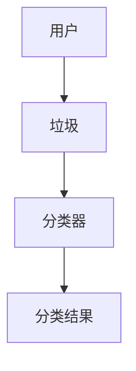
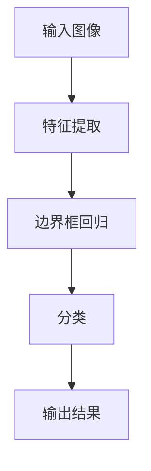
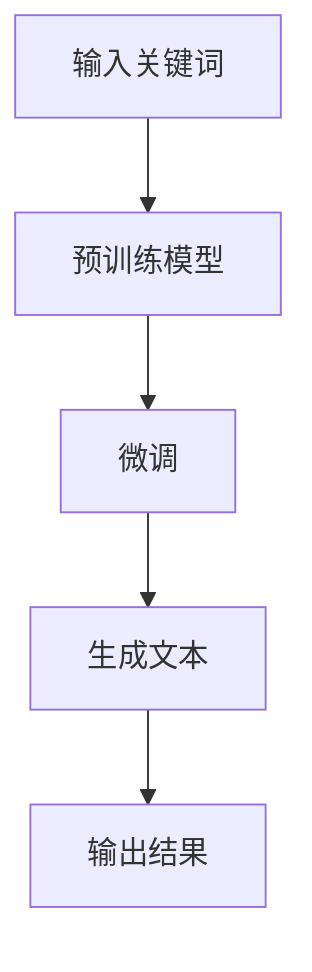
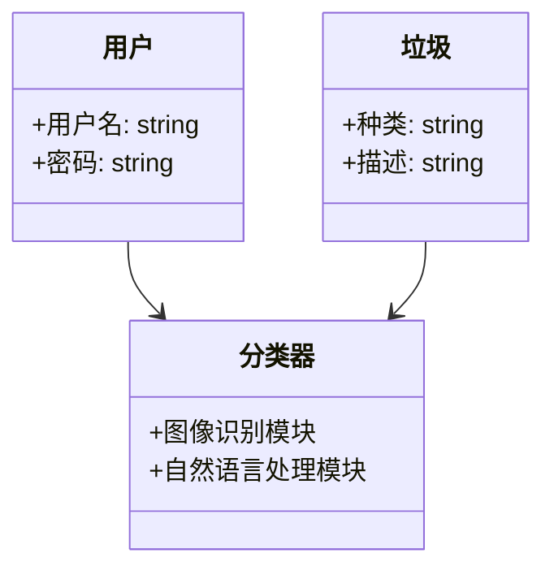
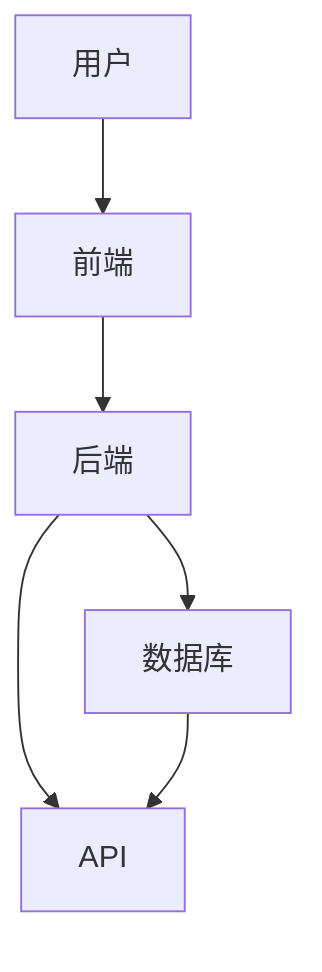
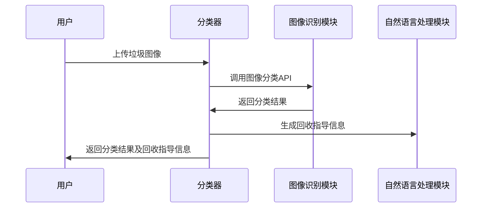

                 


# 智能垃圾分类器：AI Agent的回收指导

---

## 关键词：
智能垃圾分类器，AI Agent，图像识别，自然语言处理，垃圾分类系统，回收指导

---

## 摘要：
本文详细探讨了智能垃圾分类器的设计与实现，基于AI Agent技术，结合图像识别和自然语言处理，构建了一个高效的垃圾分类系统。文章从背景、核心概念、算法原理、系统架构到项目实战，全面解析了智能垃圾分类器的实现过程，并提供了丰富的代码示例和系统设计图，帮助读者理解如何利用AI技术实现智能垃圾分类。

---

## 第一部分: 智能垃圾分类器的背景与概念

### 第1章: 问题背景与描述

#### 1.1 问题背景
在现代社会中，垃圾处理是一个重要且复杂的任务。随着城市化进程的加快，垃圾量急剧增加，传统的垃圾分类方式效率低下，容易出错，且需要大量人工参与。因此，如何利用先进技术实现高效的垃圾分类，成为一个亟待解决的问题。

#### 1.2 问题描述
传统的垃圾分类主要依赖人工操作，存在以下问题：
1. **效率低下**：人工分类速度慢，尤其是在处理大量垃圾时。
2. **准确性差**：人眼疲劳或经验不足可能导致分类错误。
3. **成本高**：需要大量人工投入，增加了垃圾处理的经济成本。

#### 1.3 解决方案
引入AI Agent技术，结合图像识别和自然语言处理，构建智能垃圾分类器。该系统能够自动识别垃圾种类，并指导用户进行分类，从而提高效率和准确性。

#### 1.4 边界与外延
智能垃圾分类器的边界包括：
- 输入：待分类的垃圾图像或文字描述。
- 输出：垃圾的分类结果及回收指导信息。
- 外延：与其他系统的接口，如数据库、用户界面等。

#### 1.5 概念结构
智能垃圾分类器由以下几个核心要素组成：
1. **AI Agent**：负责接收输入、处理数据并输出结果。
2. **图像识别模块**：用于识别垃圾种类。
3. **自然语言处理模块**：用于生成回收指导信息。

---

### 第2章: 核心概念与联系

#### 2.1 核心概念原理
- **AI Agent**：一种能够感知环境并采取行动以实现目标的智能体。在垃圾分类系统中，AI Agent负责接收输入、调用图像识别模块进行分类，并生成回收指导信息。
- **图像识别**：基于深度学习的图像分类技术，用于识别垃圾的种类。
- **自然语言处理**：用于生成与用户交互的自然语言回复，指导用户如何处理垃圾。

#### 2.2 核心概念属性对比
表2-1展示了AI Agent与传统分类算法的对比：

| 属性             | AI Agent                      | 传统分类算法               |
|------------------|-------------------------------|---------------------------|
| 处理方式         | 基于深度学习模型             | 基于规则或浅层学习         |
| 适应性           | 强大，能够自适应新数据         | 较弱，需要人工调整规则       |
| 精准度           | 高，尤其是在大量数据训练下     | 较低，依赖规则的准确性       |
| 可扩展性         | 高，支持新增分类任务         | 低，需要重新训练或调整规则   |

#### 2.3 实体关系图


---

## 第二部分: 算法原理与实现

### 第4章: 图像识别算法

#### 4.1 算法原理
图像识别的核心是基于深度学习的图像分类技术。常用的模型包括YOLO、Faster R-CNN等。以YOLO为例，其原理如下：

1. **特征提取**：使用卷积神经网络提取图像的深层特征。
2. **边界框回归**：预测目标物体的位置和大小。
3. **分类**：对目标物体进行分类，确定其属于哪个类别。

#### 4.2 算法流程图


#### 4.3 代码实现
以下是使用YOLO进行图像分类的Python代码示例：

```python
import tensorflow as tf
from tensorflow.keras import layers

# 加载预训练模型
model = tf.keras.models.load_model('yolov4.h5')

# 定义输入
input_tensor = tf.keras.Input(shape=(224, 224, 3))
# 特征提取
x = layers.Conv2D(64, (3,3), activation='relu')(input_tensor)
x = layers.MaxPooling2D((2,2))(x)
x = layers.Conv2D(128, (3,3), activation='relu')(x)
x = layers.MaxPooling2D((2,2))(x)
# 分类
x = layers.Flatten()(x)
x = layers.Dense(256, activation='relu')(x)
x = layers.Dense(num_classes, activation='softmax')(x)

# 构建模型
model = tf.keras.Model(inputs=input_tensor, outputs=x)
model.summary()
```

#### 4.4 数学模型
图像分类的损失函数通常采用交叉熵损失：
$$ L = -\sum_{i=1}^{n} y_i \log(p_i) $$

其中，$y_i$ 是真实标签，$p_i$ 是预测概率。

---

### 第5章: 自然语言处理算法

#### 5.1 算法原理
自然语言处理用于生成回收指导信息。常用的模型包括BERT、GPT等。以BERT为例，其原理如下：

1. **预训练**：在大规模数据上进行预训练，学习语言的上下文关系。
2. **微调**：针对特定任务（如文本生成）进行微调，生成回收指导信息。

#### 5.2 算法流程图


#### 5.3 代码实现
以下是使用BERT生成回收指导信息的Python代码示例：

```python
import tensorflow as tf
from tensorflow.keras import layers

# 加载预训练模型
bert_model = tf.keras.models.load_model('bert.h5')

# 定义输入
input_ids = tf.keras.Input(shape=(128,), dtype='int32')
input_mask = tf.keras.Input(shape=(128,), dtype='int32')
# 嵌入层
x = bert_model.bert_layers[0](input_ids, input_mask)
x = layers.Dense(256, activation='relu')(x)
x = layers.Dropout(0.1)(x)
x = layers.Dense(512, activation='relu')(x)
x = layers.Dropout(0.1)(x)
# 分类层
output = layers.Dense(50, activation='softmax')(x)

# 构建模型
model = tf.keras.Model(inputs=[input_ids, input_mask], outputs=output)
model.summary()
```

#### 5.4 数学模型
文本生成的损失函数通常采用交叉熵损失：
$$ L = -\sum_{i=1}^{n} y_i \log(p_i) $$

其中，$y_i$ 是真实标签，$p_i$ 是预测概率。

---

## 第三部分: 系统分析与架构设计

### 第6章: 系统分析与架构设计

#### 6.1 问题场景介绍
智能垃圾分类器需要处理以下场景：
1. 用户上传垃圾图像或输入文字描述。
2. 系统识别垃圾种类，并生成回收指导信息。
3. 提供交互界面，方便用户查询和操作。

#### 6.2 系统功能设计
系统功能模块包括：
1. **图像识别模块**：识别垃圾种类。
2. **自然语言处理模块**：生成回收指导信息。
3. **用户界面模块**：与用户交互。

#### 6.3 领域模型


#### 6.4 系统架构设计


#### 6.5 接口设计
- **输入接口**：用户通过前端上传图像或输入文字。
- **输出接口**：系统返回分类结果及回收指导信息。

#### 6.6 交互流程


---

## 第四部分: 项目实战

### 第7章: 项目实战

#### 7.1 环境安装
- 安装Python和相关库：
  ```bash
  pip install tensorflow keras matplotlib
  ```

#### 7.2 核心代码实现
- 图像识别模块：
  ```python
  def classify_image(image_path):
      model = load_model('yolov4.h5')
      image = load_image(image_path)
      prediction = model.predict(image)
      return get_class_name(prediction)
  ```

- 自然语言处理模块：
  ```python
  def generate_guidance(class_name):
      model = load_model('bert.h5')
      input_ids, input_mask = prepare_input(class_name)
      prediction = model.predict([input_ids, input_mask])
      return get_guidance(prediction)
  ```

#### 7.3 代码解读与分析
- **图像识别模块**：使用预训练的YOLO模型进行图像分类，返回垃圾种类。
- **自然语言处理模块**：使用预训练的BERT模型生成回收指导信息。

#### 7.4 案例分析
- **案例1**：用户上传一张废纸图片。
  - 图像识别模块识别为“废纸”。
  - 自然语言处理模块生成指导信息：“废纸属于可回收物，请放入蓝色垃圾桶。”

---

## 第五部分: 总结与展望

### 8.1 最佳实践 tips
- 在部署系统时，确保硬件资源充足，尤其是在处理大量数据时。
- 定期更新模型，以提高分类准确率。

### 8.2 小结
本文详细介绍了智能垃圾分类器的设计与实现，结合AI Agent、图像识别和自然语言处理技术，构建了一个高效的垃圾分类系统。通过本文的讲解，读者可以深入了解智能垃圾分类器的核心原理和实现方法。

### 8.3 注意事项
- 在实际应用中，需注意数据隐私问题，确保用户数据的安全性。
- 系统上线前，建议进行充分的测试，确保各个模块的稳定性和准确性。

### 8.4 拓展阅读
- 《深度学习入门：基于Python和Keras》
- 《自然语言处理实战：基于Python和TensorFlow》

---

## 作者：AI天才研究院/AI Genius Institute & 禅与计算机程序设计艺术 /Zen And The Art of Computer Programming

--- 

本文版权归作者所有，转载请注明出处。

