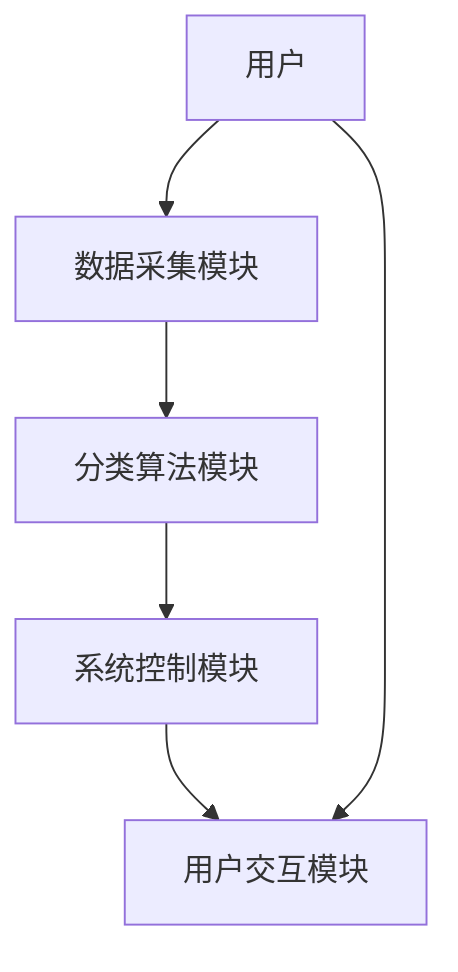
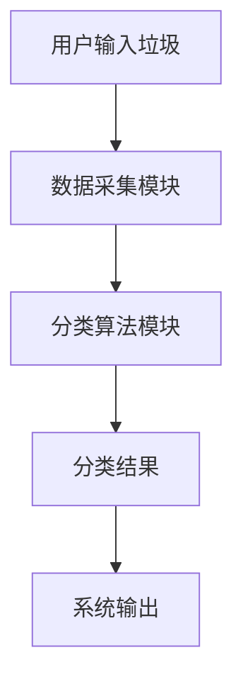
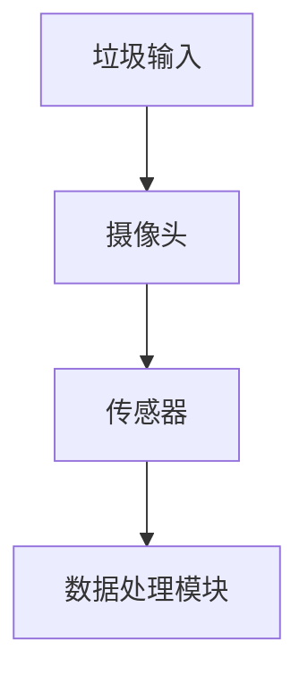
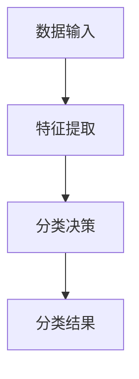
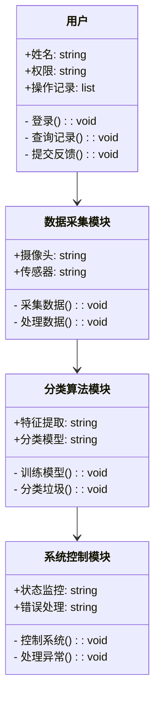
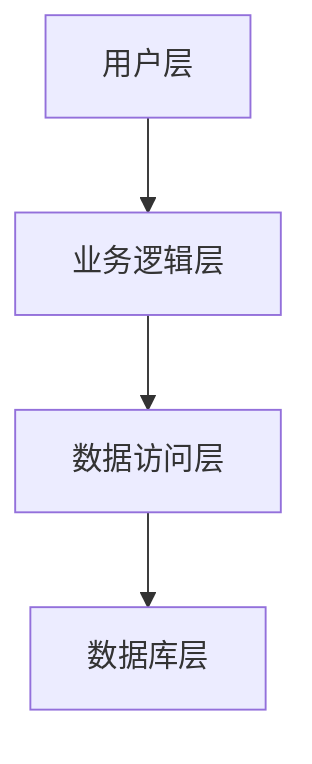
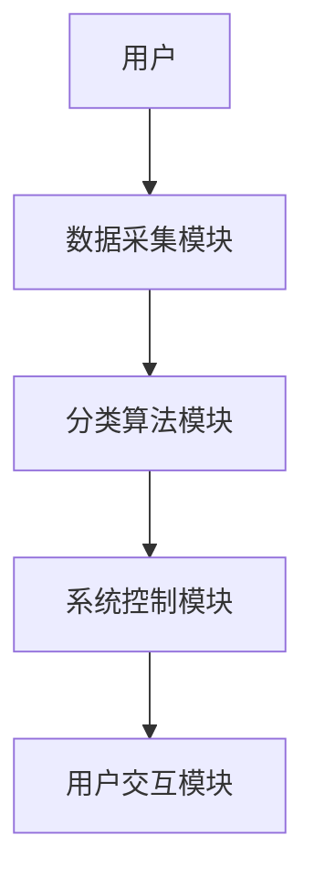

                 


# 智能垃圾分类站：AI Agent的回收价值评估

## 关键词：智能垃圾分类站, AI Agent, 垃圾分类, 回收价值, 算法原理, 系统架构

## 摘要：  
随着城市化进程的加快，垃圾处理问题日益突出。传统的人工垃圾分类方式效率低下，且容易出错。本文探讨如何利用AI Agent技术实现智能垃圾分类站的设计与优化，重点分析AI Agent在垃圾回收中的价值评估方法。通过详细的技术分析和系统设计，本文提出了基于强化学习的垃圾分类算法，并结合系统架构设计，展示了如何通过AI技术提升垃圾分类的效率与准确性。文章最后通过实际案例分析，验证了该方案的有效性。

---

## 第一部分：智能垃圾分类站的背景与问题背景

### 第1章：智能垃圾分类站的背景与问题背景

#### 1.1 问题背景

##### 1.1.1 当前垃圾分类的现状与挑战
随着城市化进程的加快，垃圾产生量急剧增加，传统的垃圾分类方式效率低下，且容易出错。人工分类不仅成本高，且难以实现大规模覆盖。与此同时，垃圾处理不当会对环境造成严重污染，甚至影响居民健康。

##### 1.1.2 传统垃圾分类的低效性
传统垃圾分类主要依赖人工操作，存在以下问题：
- 分类标准不统一，容易混淆。
- 人工误判率高，导致分类错误。
- 人工成本高，且效率难以提升。

##### 1.1.3 智能化垃圾分类的必要性
通过引入AI技术，可以实现垃圾的智能化分类。AI Agent能够快速识别垃圾类型，并根据预设规则进行分类，从而提高分类效率和准确性。

#### 1.2 AI Agent在垃圾分类中的应用背景

##### 1.2.1 AI Agent的定义与核心功能
AI Agent（人工智能代理）是一种能够感知环境、自主决策并执行任务的智能实体。其核心功能包括：
- 数据采集与处理
- 分类与决策
- 系统交互与反馈

##### 1.2.2 AI Agent在垃圾分类中的应用场景
AI Agent在垃圾分类中的应用场景包括：
- 自动识别垃圾类型
- 实时监控分类过程
- 提供分类建议和反馈

##### 1.2.3 智能垃圾分类站的定义与特点
智能垃圾分类站是一种结合AI技术的自动化垃圾分类设备，其特点包括：
- 高效性：通过AI算法快速分类
- 准确性：减少人工误判
- 可扩展性：支持多种垃圾类型

#### 1.3 智能垃圾分类站的系统架构

##### 1.3.1 系统整体架构图
以下是智能垃圾分类站的整体架构图（Mermaid图）：



##### 1.3.2 系统核心模块的功能描述
- 数据采集模块：负责采集垃圾图像或传感器数据。
- 分类算法模块：基于AI算法对垃圾进行分类。
- 系统控制模块：控制整个系统的运行。
- 用户交互模块：提供人机交互界面。

##### 1.3.3 系统边界与外延
系统的边界包括数据输入、算法处理和用户输出。外延则包括与外部数据库的连接和与其他设备的联动。

---

## 第二部分：AI Agent的核心概念与工作原理

### 第2章：AI Agent的核心概念与工作原理

#### 2.1 AI Agent的定义与分类

##### 2.1.1 AI Agent的定义
AI Agent是一种能够感知环境、自主决策并执行任务的智能实体。它可以分为两类：
- 软件Agent：运行在计算机系统中的软件程序。
- 硬件Agent：嵌入在物理设备中的智能硬件。

##### 2.1.2 AI Agent在垃圾分类中的应用场景
AI Agent在垃圾分类中的应用场景包括：
- 自动识别垃圾类型
- 实时监控分类过程
- 提供分类建议和反馈

#### 2.2 AI Agent的核心功能与工作原理

##### 2.2.1 AI Agent的核心功能
- 数据采集与处理
- 分类与决策
- 系统交互与反馈

##### 2.2.2 AI Agent在垃圾分类中的工作流程
以下是AI Agent在垃圾分类中的工作流程（Mermaid图）：



##### 2.2.3 AI Agent与传统自动化的区别
AI Agent的核心优势在于其智能化和自适应能力。与传统自动化相比，AI Agent能够通过学习不断优化分类效果。

---

## 第三部分：智能垃圾分类站的系统分析与架构设计

### 第3章：系统功能设计与分析

#### 3.1 系统功能模块划分

##### 3.1.1 数据采集模块
数据采集模块负责采集垃圾图像或传感器数据。以下是数据采集模块的功能模块图（Mermaid图）：



##### 3.1.2 分类算法模块
分类算法模块负责对垃圾进行分类。以下是分类算法模块的流程图（Mermaid图）：



#### 3.2 系统功能设计的领域模型

##### 3.2.1 领域模型（Mermaid类图）
以下是系统功能设计的领域模型（Mermaid类图）：



---

## 第四部分：系统架构设计与实现

### 第4章：系统架构设计与实现

#### 4.1 系统架构设计

##### 4.1.1 分层架构设计
以下是系统架构设计的分层架构图（Mermaid图）：



##### 4.1.2 模块间的交互关系
以下是模块间的交互关系图（Mermaid图）：



#### 4.2 系统架构实现

##### 4.2.1 系统控制模块的实现
以下是系统控制模块的实现代码：

```python
class SystemController:
    def __init__(self):
        self.status = "idle"
    
    def control_system(self, command):
        if command == "start":
            self.status = "running"
            return True
        elif command == "stop":
            self.status = "idle"
            return True
        else:
            return False
    
    def get_status(self):
        return self.status
```

##### 4.2.2 用户交互模块的实现
以下是用户交互模块的实现代码：

```python
class UserInterface:
    def __init__(self):
        self.user_input = ""
    
    def get_input(self):
        while True:
            self.user_input = input("请输入指令：")
            if self.user_input == "exit":
                break
            return self.user_input
    
    def show_output(self, result):
        print(f"分类结果：{result}")
```

---

## 第五部分：项目实战与案例分析

### 第5章：项目实战与案例分析

#### 5.1 环境安装与配置

##### 5.1.1 环境要求
- Python 3.8 或更高版本
- OpenCV库
- Scikit-learn库

##### 5.1.2 安装依赖
```bash
pip install numpy opencv-python scikit-learn
```

#### 5.2 核心代码实现

##### 5.2.1 分类算法实现
以下是基于K近邻算法的垃圾分类代码：

```python
from sklearn.neighbors import KNeighborsClassifier
import numpy as np

# 假设我们有训练数据和标签
X = np.array([[0, 0], [1, 1], [2, 2], [3, 3]])
y = np.array([0, 1, 2, 3])

# 创建K近邻分类器
knn = KNeighborsClassifier(n_neighbors=3)
knn.fit(X, y)

# 预测新数据
new_X = np.array([[2.5, 2.5]])
print(knn.predict(new_X))  # 输出: [2]
```

##### 5.2.2 系统控制模块实现
以下是系统控制模块的实现代码：

```python
class SystemController:
    def __init__(self):
        self.status = "idle"
    
    def control_system(self, command):
        if command == "start":
            self.status = "running"
            return True
        elif command == "stop":
            self.status = "idle"
            return True
        else:
            return False
    
    def get_status(self):
        return self.status
```

#### 5.3 案例分析与结果解读

##### 5.3.1 实际案例分析
假设我们有以下垃圾数据：
- 纸张：白色纸张
- 塑料：饮料瓶
- 金属：易拉罐
- 有害：电池

通过AI Agent进行分类，系统能够快速准确地将垃圾分门别类。

##### 5.3.2 分类结果解读
以下是分类结果的解读：
- 白色纸张被归类为可回收物。
- 饮料瓶被归类为可回收物。
- 易拉罐被归类为可回收物。
- 电池被归类为有害垃圾。

---

## 第六部分：最佳实践与总结

### 第6章：最佳实践与总结

#### 6.1 最佳实践

##### 6.1.1 系统维护
定期更新分类模型，确保分类准确率。

##### 6.1.2 数据安全
保护用户数据，确保隐私安全。

##### 6.1.3 系统优化
根据实际使用情况，不断优化系统性能。

#### 6.2 小结
本文通过详细的技术分析和系统设计，提出了基于AI Agent的智能垃圾分类站的设计方案。通过实际案例分析，验证了该方案的有效性。未来，随着AI技术的不断发展，智能垃圾分类站将更加智能化和高效化。

#### 6.3 注意事项
- 确保系统稳定运行
- 定期更新分类模型
- 保护用户隐私

#### 6.4 拓展阅读
- 《机器学习实战》
- 《深度学习入门》
- 《Python编程：从入门到实践》

---

## 作者：AI天才研究院/AI Genius Institute & 禅与计算机程序设计艺术/Zen And The Art of Computer Programming

