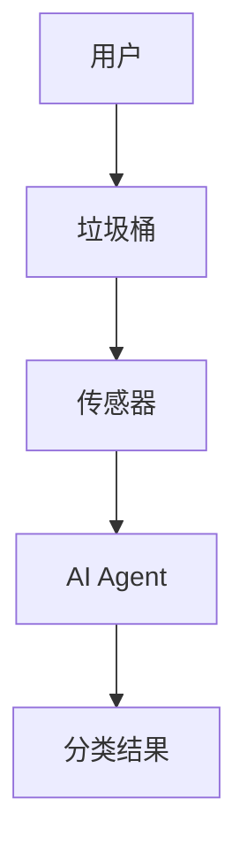
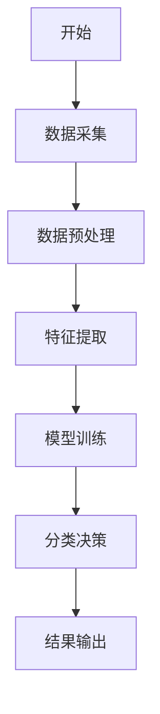
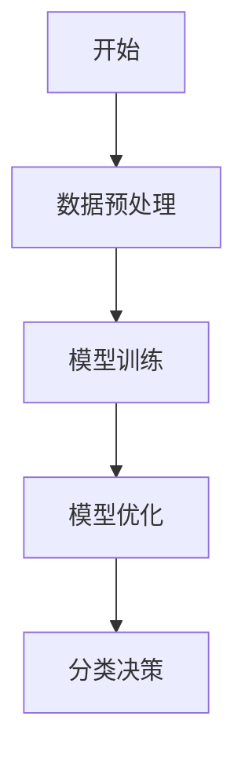
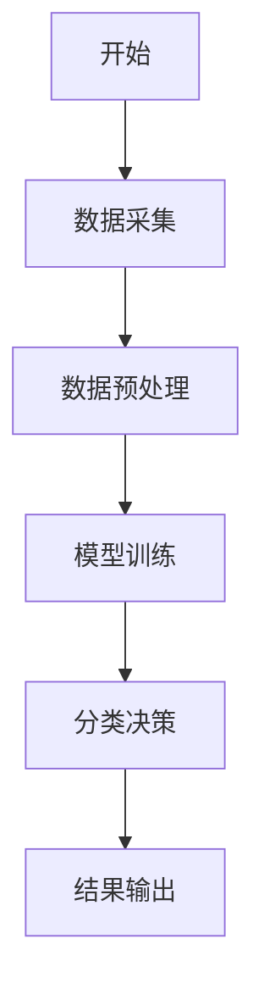
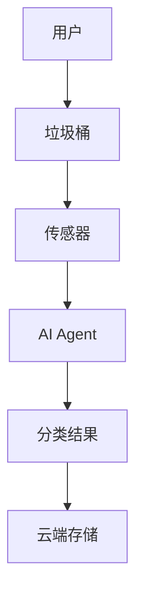

                 


# 智能垃圾桶：AI Agent的废物分类与回收建议

> 关键词：智能垃圾桶，AI Agent，废物分类，机器学习，传感器，数据处理，回收优化

> 摘要：本文探讨了AI Agent在智能垃圾桶中的应用，详细分析了废物分类的算法原理、系统架构设计及实际应用案例。通过结合传感器和机器学习技术，智能垃圾桶能够高效分类和管理废物，提升回收效率和环保效果。

---

# 第1章: 智能垃圾桶与AI Agent的背景与概念

## 1.1 智能垃圾桶的定义与特点

### 1.1.1 智能垃圾桶的定义

智能垃圾桶是一种结合了物联网（IoT）和人工智能（AI）技术的智能设备，能够自动识别和分类 waste materials，并通过传感器和数据处理系统优化回收流程。

### 1.1.2 智能垃圾桶的核心特点

- **自动分类**：通过AI算法实现对不同 waste materials 的识别和分类。
- **实时监测**：内置传感器实时监测垃圾桶的填充状态和环境条件。
- **数据上传**：通过物联网技术将数据上传至云端，便于后续分析和优化。
- **用户交互**：支持用户通过手机APP或其他设备查看垃圾桶状态和回收信息。

### 1.1.3 智能垃圾桶与传统垃圾桶的区别

| 特性                | 传统垃圾桶           | 智能垃圾桶           |
|---------------------|----------------------|----------------------|
| 功能                | 单一的垃圾存储功能    | 多功能：分类、监测、交互 |
| 技术                | 无智能化技术         | 结合AI、IoT技术       |
| 用户体验            | 无交互性             | 支持用户交互和远程监控 |
| 管理效率            | 低效，依赖人工管理    | 高效，自动化管理       |

## 1.2 AI Agent的基本概念

### 1.2.1 AI Agent的定义

AI Agent（人工智能代理）是一种智能实体，能够感知环境并采取行动以实现特定目标。在智能垃圾桶中，AI Agent负责数据处理、分类决策和系统控制。

### 1.2.2 AI Agent的核心特征

- **感知能力**：通过传感器和摄像头获取环境数据。
- **决策能力**：基于数据进行分类和决策。
- **自主性**：能够在无外部干预的情况下独立运行。
- **适应性**：能够根据环境变化调整行为。

### 1.2.3 AI Agent在智能垃圾桶中的应用

- **数据采集**：AI Agent通过传感器和摄像头采集垃圾桶的状态和垃圾类型。
- **分类决策**：利用机器学习算法对垃圾进行分类。
- **系统控制**：根据分类结果控制垃圾桶的机械装置进行垃圾处理。

## 1.3 智能垃圾桶与AI Agent的结合

### 1.3.1 智能垃圾桶的智能化需求

- 高效分类：通过AI算法实现快速、准确的垃圾分类。
- 实时监控：监测垃圾桶的状态，及时通知维护人员。
- 用户交互：提供便捷的用户界面，方便用户查看和管理垃圾桶。

### 1.3.2 AI Agent在废物分类中的作用

- **数据处理**：AI Agent能够高效处理大量数据，确保分类的准确性。
- **决策支持**：通过分析数据，AI Agent能够为垃圾桶的管理和维护提供决策支持。
- **优化回收流程**：AI Agent能够优化垃圾的回收流程，提高回收效率。

### 1.3.3 智能垃圾桶与AI Agent的协同工作模式

1. **数据采集**：AI Agent通过传感器和摄像头采集垃圾桶的状态和垃圾类型。
2. **数据处理**：AI Agent对采集到的数据进行处理，识别垃圾类型。
3. **分类决策**：AI Agent根据识别结果，决定垃圾桶的分类方式。
4. **系统控制**：AI Agent根据分类结果，控制垃圾桶的机械装置进行垃圾处理。

## 1.4 本章小结

本章介绍了智能垃圾桶和AI Agent的基本概念，分析了智能垃圾桶的核心特点和与传统垃圾桶的区别，详细讲解了AI Agent在智能垃圾桶中的作用和协同工作模式。

---

# 第2章: AI Agent的核心原理

## 2.1 AI Agent的核心原理

### 2.1.1 感知层：数据采集与处理

AI Agent通过传感器和摄像头采集垃圾桶的状态和垃圾类型，这些数据包括温度、湿度、垃圾图像等。数据采集后，AI Agent会对这些数据进行预处理，包括去噪、增强和特征提取。

### 2.1.2 计算层：算法实现与决策

AI Agent的核心在于算法实现与决策。基于预处理后的数据，AI Agent利用机器学习算法（如卷积神经网络CNN）进行分类和决策。分类结果用于控制垃圾桶的机械装置进行垃圾处理。

### 2.1.3 执行层：动作输出与反馈

AI Agent根据分类结果，控制垃圾桶的机械装置进行垃圾处理。同时，AI Agent也会根据执行结果进行反馈，优化后续的操作。

## 2.2 AI Agent的实体关系分析

### 2.2.1 实体关系图（ER图）



该ER图展示了智能垃圾桶系统中各实体之间的关系，包括用户、垃圾桶、传感器、AI Agent和分类结果。

## 2.3 AI Agent的算法流程图



该流程图展示了AI Agent在智能垃圾桶中的算法流程，包括数据采集、预处理、特征提取、模型训练、分类决策和结果输出。

## 2.4 本章小结

本章详细讲解了AI Agent的核心原理，包括感知层、计算层和执行层的功能，以及实体关系分析和算法流程图。

---

# 第3章: 算法原理与实现

## 3.1 算法原理

### 3.1.1 数据预处理

数据预处理是AI Agent工作的第一步，主要包括去噪、增强和特征提取。例如，使用OpenCV库对垃圾图像进行预处理，提取边缘、纹理等特征。

### 3.1.2 模型训练

模型训练是AI Agent的核心，通常使用卷积神经网络（CNN）进行图像分类。训练数据需要经过标注和增强，以提高模型的泛化能力。

### 3.1.3 模型优化

模型优化包括参数调整和模型剪枝。通过交叉验证和网格搜索，找到最优的模型参数。同时，使用模型剪枝技术，减少模型的复杂度，提高推理速度。

## 3.2 算法实现

### 3.2.1 数据预处理代码

```python
import cv2

def preprocess_image(image_path):
    # 读取图像
    image = cv2.imread(image_path)
    # 转换为灰度图
    gray = cv2.cvtColor(image, cv2.COLOR_BGR2GRAY)
    # 去噪处理
    denoised = cv2.fastNlMeansDenoising(gray, None, 20, 7, 21)
    return denoised
```

### 3.2.2 模型训练代码

```python
import tensorflow as tf
from tensorflow.keras import layers

def create_model():
    model = tf.keras.Sequential([
        layers.Conv2D(32, (3,3), activation='relu', input_shape=(64, 64, 1)),
        layers.MaxPooling2D((2,2)),
        layers.Conv2D(64, (3,3), activation='relu'),
        layers.MaxPooling2D((2,2)),
        layers.Flatten(),
        layers.Dense(128, activation='relu'),
        layers.Dense(10, activation='softmax')
    ])
    model.compile(optimizer='adam', loss='sparse_categorical_crossentropy', metrics=['accuracy'])
    return model
```

### 3.2.3 模型优化代码

```python
from sklearn.model_selection import GridSearchCV
from keras.wrappers.scikit_learn import KerasClassifier

def model_optimizer():
    model = create_model()
    # 定义参数搜索空间
    param_grid = {
        'batch_size': [10, 20, 30],
        'epochs': [10, 20, 30]
    }
    grid = GridSearchCV(estimator=KerasClassifier(model), param_grid=param_grid, cv=5)
    grid.fit(X_train, y_train)
    best_model = grid.best_estimator_
    return best_model
```

## 3.3 算法流程图



该流程图展示了算法实现的步骤，包括数据预处理、模型训练、模型优化和分类决策。

## 3.4 本章小结

本章详细讲解了AI Agent的算法原理与实现，包括数据预处理、模型训练和优化，以及算法流程图。

---

# 第4章: 系统分析与架构设计

## 4.1 系统功能设计

### 4.1.1 系统功能模块

- **数据采集模块**：负责采集垃圾桶的状态和垃圾类型。
- **数据处理模块**：对采集到的数据进行预处理和特征提取。
- **模型训练模块**：训练机器学习模型，实现垃圾分类。
- **分类决策模块**：根据分类结果，控制垃圾桶的机械装置进行垃圾处理。

### 4.1.2 系统功能流程图



该流程图展示了系统功能设计的流程，包括数据采集、预处理、模型训练、分类决策和结果输出。

## 4.2 系统架构设计

### 4.2.1 系统架构图



该架构图展示了智能垃圾桶系统的整体架构，包括用户、垃圾桶、传感器、AI Agent、分类结果和云端存储。

### 4.2.2 系统接口设计

- **传感器接口**：用于采集垃圾桶的状态和垃圾类型。
- **AI Agent接口**：用于与垃圾桶和云端存储交互。
- **用户接口**：用于用户查看和管理垃圾桶的状态。

## 4.3 系统交互流程图


该流程图展示了系统交互的流程，包括用户、垃圾桶、传感器、AI Agent、分类结果和云端存储。

## 4.4 本章小结

本章详细讲解了智能垃圾桶系统的功能设计、架构设计和交互流程，展示了系统的整体结构和各部分的功能。

---

# 第5章: 项目实战与实现

## 5.1 项目环境搭建

### 5.1.1 环境要求

- **操作系统**：Windows 10或更高版本，或Linux系统。
- **编程语言**：Python 3.6或更高版本。
- **框架与库**：TensorFlow、Keras、OpenCV、scikit-learn等。

### 5.1.2 安装依赖

```bash
pip install tensorflow keras numpy opencv-python scikit-learn
```

## 5.2 系统核心实现

### 5.2.1 数据采集与预处理

```python
import cv2

def preprocess_image(image_path):
    # 读取图像
    image = cv2.imread(image_path)
    # 转换为灰度图
    gray = cv2.cvtColor(image, cv2.COLOR_BGR2GRAY)
    # 去噪处理
    denoised = cv2.fastNlMeansDenoising(gray, None, 20, 7, 21)
    return denoised
```

### 5.2.2 模型训练与优化

```python
from sklearn.model_selection import GridSearchCV
from keras.wrappers.scikit_learn import KerasClassifier

def model_optimizer():
    model = create_model()
    # 定义参数搜索空间
    param_grid = {
        'batch_size': [10, 20, 30],
        'epochs': [10, 20, 30]
    }
    grid = GridSearchCV(estimator=KerasClassifier(model), param_grid=param_grid, cv=5)
    grid.fit(X_train, y_train)
    best_model = grid.best_estimator_
    return best_model
```

### 5.2.3 分类决策与系统控制

```python
import cv2
import tensorflow as tf

def classify_image(image_path, model):
    # 预处理图像
    preprocessed = preprocess_image(image_path)
    # 展开维度
    preprocessed = preprocessed.reshape(1, 64, 64, 1)
    # 预测分类
    prediction = model.predict(preprocessed)
    # 获取分类结果
    predicted_class = tf.argmax(prediction, axis=1).numpy()[0]
    return predicted_class
```

## 5.3 实际案例分析

### 5.3.1 案例背景

某小区安装了智能垃圾桶，用于分类和回收垃圾。通过AI Agent的算法实现，垃圾桶能够准确分类垃圾，并优化回收流程。

### 5.3.2 数据分析

通过对采集到的数据进行分析，AI Agent能够识别出不同类型的垃圾，并根据分类结果进行相应的处理。例如，将可回收物和不可回收物分开存放，提高回收效率。

## 5.4 项目小结

本章通过实际案例分析，展示了智能垃圾桶系统的实现过程，包括环境搭建、数据采集与预处理、模型训练与优化，以及分类决策与系统控制。

---

# 第6章: 最佳实践与拓展

## 6.1 最佳实践

### 6.1.1 数据质量管理

- 确保数据的准确性和完整性，避免噪声干扰。
- 数据增强和标注是提高模型性能的关键。

### 6.1.2 系统优化

- 定期更新模型参数，保持分类精度。
- 优化系统架构，提高系统的响应速度和处理能力。

## 6.2 小结

智能垃圾桶系统的成功实施离不开高质量的数据和高效的系统架构。通过不断优化算法和系统设计，可以进一步提升垃圾桶的分类精度和回收效率。

## 6.3 注意事项

- 数据隐私保护：确保用户数据的安全性，避免数据泄露。
- 系统稳定性：确保系统在长时间运行中的稳定性，减少故障率。
- 可扩展性：设计系统时考虑未来的扩展需求，方便后续的功能添加和性能优化。

## 6.4 拓展阅读

- 《深度学习实战》：深入理解深度学习的基本原理和应用。
- 《Python机器学习》：掌握Python在机器学习中的应用。
- 《物联网技术》：了解物联网技术在智能垃圾桶中的应用。

---

# 作者信息

作者：AI天才研究院/AI Genius Institute & 禅与计算机程序设计艺术 /Zen And The Art of Computer Programming

---

感谢您的阅读！希望这篇文章能够为您提供智能垃圾桶与AI Agent相关领域的深入见解。如需进一步探讨或获取更多资料，请随时联系作者。

