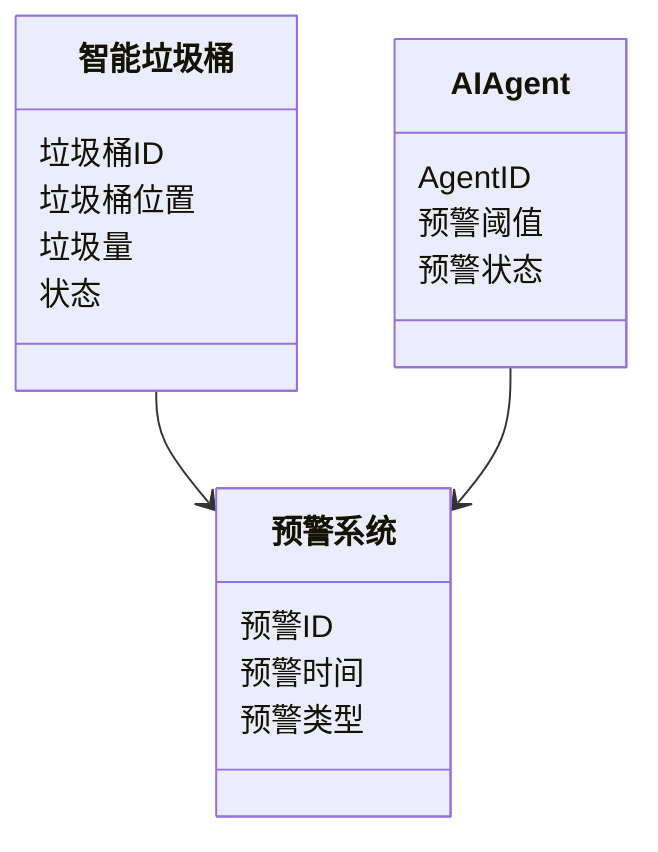
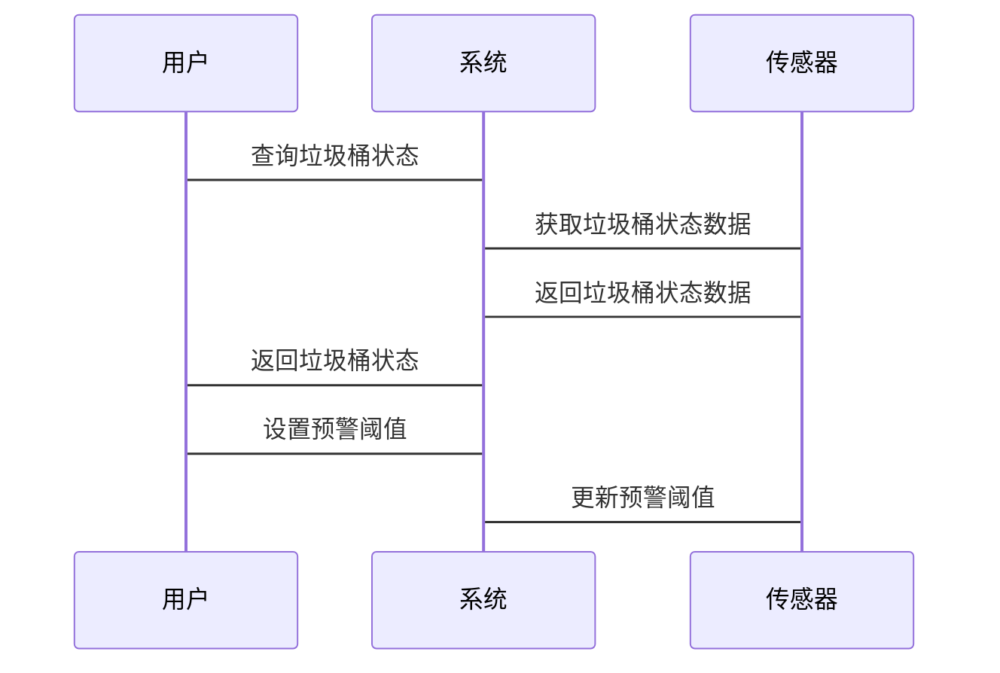

                 


---

# 智能垃圾桶：AI Agent的满溢预警系统

---

## 关键词
智能垃圾桶，AI Agent，满溢预警系统，垃圾管理，AI算法，系统架构，智能监测

---

## 摘要
本文详细探讨了智能垃圾桶及其AI Agent满溢预警系统的实现。通过分析传统垃圾桶管理的痛点，提出基于AI Agent的智能化解决方案。文章从问题背景、核心概念、算法原理、系统架构设计到项目实战，全面阐述了如何利用AI技术实现垃圾桶的智能化管理。通过数学建模、算法实现和系统架构设计，本文为智能垃圾桶的开发提供了理论基础和实践指导。最后，本文还总结了系统的优缺点，并展望了未来的发展方向。

---

# 第一部分: 背景介绍

## 第1章: 问题背景与描述
### 1.1 问题背景
#### 1.1.1 垃圾处理与环境保护的挑战
随着城市化进程的加快，垃圾量急剧增加，传统的垃圾桶管理方式已无法满足需求。垃圾桶满溢问题不仅影响环境卫生，还可能引发二次污染和公共安全问题。

#### 1.1.2 智能垃圾桶的必要性
传统垃圾桶管理存在以下问题：
- 人工巡检效率低
- 垃圾满溢问题频发
- 管理成本高
- 数据采集不及时
通过引入AI技术，智能垃圾桶可以实现自动化监测和预警，提升垃圾管理效率。

#### 1.1.3 AI Agent在垃圾管理中的作用
AI Agent（智能体）能够实时感知垃圾桶状态，通过数据采集、分析和决策，实现垃圾桶的智能化管理。

### 1.2 问题描述
#### 1.2.1 垃圾桶满溢问题的现状
垃圾桶满溢问题的主要表现包括：
- 垃圾溢出导致环境污染
- 影响市容和环境卫生
- 增加清运成本
- 可能引发公共卫生事件

#### 1.2.2 满溢预警系统的需求分析
满溢预警系统需要实现以下功能：
- 实时监测垃圾桶状态
- 自动触发预警
- 提供决策支持
- 数据存储与分析

#### 1.2.3 AI Agent在满溢预警中的应用前景
AI Agent可以通过以下方式实现满溢预警：
- 数据采集与处理
- 垃圾量预测
- 预警决策

### 1.3 问题解决思路
#### 1.3.1 AI Agent的核心功能
AI Agent需要具备以下功能：
- 数据采集与处理
- 状态监测与分析
- 预警触发与反馈
- 自适应学习

#### 1.3.2 满溢预警系统的实现方案
满溢预警系统的实现步骤包括：
1. 数据采集：通过传感器实时采集垃圾桶状态数据
2. 数据处理：对采集的数据进行清洗和预处理
3. 状态分析：利用AI算法分析垃圾桶状态
4. 预警触发：当垃圾量超过阈值时，触发预警
5. 反馈与优化：根据预警结果优化垃圾桶管理策略

#### 1.3.3 系统边界与外延
系统边界包括：
- 数据采集范围
- 算法处理范围
- 预警范围
系统外延包括：
- 数据存储与分析
- 系统扩展性
- 用户界面设计

---

## 第2章: 问题解决与边界
### 2.1 问题解决思路
#### 2.1.1 数据采集与处理
- 数据采集方式：传感器采集
- 数据处理方法：数据清洗、特征提取
- 数据存储：数据库存储

#### 2.1.2 算法实现
- 算法选择：基于机器学习的预测模型
- 算法实现步骤：数据训练、模型优化、模型部署
- 算法评估：准确率、召回率、F1值

#### 2.1.3 系统架构设计
- 系统模块划分：数据采集模块、AI处理模块、预警模块
- 系统接口设计：传感器接口、数据库接口、用户接口
- 系统交互流程：数据采集 -> 数据处理 -> 预警触发 -> 用户反馈

### 2.2 系统核心要素
#### 2.2.1 数据采集与处理
- 传感器类型：重量传感器、体积传感器
- 数据预处理：去噪、归一化
- 数据存储：关系型数据库、非关系型数据库

#### 2.2.2 AI算法实现
- 算法选择：随机森林、支持向量机
- 算法实现步骤：数据训练、模型优化、模型部署
- 算法评估：准确率、召回率、F1值

#### 2.2.3 系统架构设计
- 系统模块划分：数据采集模块、AI处理模块、预警模块
- 系统接口设计：传感器接口、数据库接口、用户接口
- 系统交互流程：数据采集 -> 数据处理 -> 预警触发 -> 用户反馈

---

# 第二部分: 核心概念与联系

## 第3章: 核心概念原理
### 3.1 AI Agent的基本原理
#### 3.1.1 AI Agent的定义与特点
- AI Agent：能够感知环境并采取行动以实现目标的智能体
- AI Agent的特点：自主性、反应性、目标导向

#### 3.1.2 AI Agent的核心功能模块
- 感知模块：数据采集与处理
- 计划模块：状态分析与预测
- 行动模块：预警触发与反馈
- 学习模块：自适应优化

#### 3.1.3 AI Agent与满溢预警系统的结合
- AI Agent在满溢预警中的作用：实时监测、智能决策、自适应优化

### 3.2 满溢预警系统的原理
#### 3.2.1 数据采集与分析
- 数据采集方式：传感器采集
- 数据分析方法：基于机器学习的预测模型
- 数据可视化：图表展示

#### 3.2.2 预警算法实现
- 算法选择：随机森林、支持向量机
- 算法实现步骤：数据训练、模型优化、模型部署
- 算法评估：准确率、召回率、F1值

#### 3.2.3 系统输出与反馈
- 预警触发：当垃圾量超过阈值时，触发预警
- 用户反馈：预警信息推送、清运安排
- 系统优化：根据预警结果优化垃圾桶管理策略

## 第4章: 核心概念对比与ER实体关系
### 4.1 核心概念属性对比
| 比较项 | 传统垃圾桶 | 智能垃圾桶 |
|--------|-------------|-------------|
| 数据采集 | 无 | 传感器采集 |
| 状态监测 | 人工巡检 | 自动监测 |
| 预警功能 | 无 | 自动预警 |

### 4.2 ER实体关系图
```mermaid
er
  entity 智能垃圾桶 {
    key 垃圾桶ID
    attribute 垃圾桶位置
    attribute 垃圾量
    attribute 状态
  }
  entity AI Agent {
    key AgentID
    attribute 预警阈值
    attribute 预警状态
  }
  entity 预警系统 {
    key 预警ID
    attribute 预警时间
    attribute 预警类型
  }
  智能垃圾桶 -[1..n]-> 预警系统
  AI Agent -[1..n]-> 预警系统
```

---

# 第三部分: 算法原理讲解

## 第5章: AI Agent算法实现
### 5.1 算法原理
#### 5.1.1 算法选择
- 算法选择：随机森林、支持向量机
- 算法特点：随机森林适合分类问题，支持向量机适合小样本数据

#### 5.1.2 算法实现步骤
1. 数据预处理：数据清洗、特征提取
2. 数据训练：训练模型
3. 模型优化：调整参数、交叉验证
4. 模型部署：将模型部署到垃圾桶监测系统中

#### 5.1.3 算法数学模型
随机森林算法：
$$
\text{预测结果} = \sum_{i=1}^{n} \text{特征权重} \times \text{特征值}
$$

支持向量机算法：
$$
\text{预测结果} = \text{sign}(\sum_{i=1}^{n} \alpha_i y_i x_i \cdot x + b)
$$

### 5.2 算法代码实现
```python
import numpy as np
from sklearn.ensemble import RandomForestClassifier
from sklearn.svm import SVC

# 数据预处理
X = ...  # 特征向量
y = ...  # 标签

# 数据分割
X_train, X_test, y_train, y_test = train_test_split(X, y, test_size=0.2)

# 算法选择
model = RandomForestClassifier()
model.fit(X_train, y_train)

# 模型评估
print("Accuracy:", model.score(X_test, y_test))
```

---

## 第6章: 算法优化与实现
### 6.1 算法优化
#### 6.1.1 参数优化
- 随机森林：调整n_estimators、max_depth
- 支持向量机：调整C、gamma

#### 6.1.2 模型评估
- 准确率：准确预测的比例
- 召回率：正确预测的正例比例
- F1值：准确率和召回率的调和平均数

### 6.2 代码实现
```python
from sklearn.metrics import precision_score, recall_score, f1_score

# 模型预测
y_pred = model.predict(X_test)

# 模型评估
precision = precision_score(y_test, y_pred)
recall = recall_score(y_test, y_pred)
f1 = f1_score(y_test, y_pred)

print(f"Precision: {precision}")
print(f"Recall: {recall}")
print(f"F1: {f1}")
```

---

# 第四部分: 系统分析与架构设计

## 第7章: 系统功能设计
### 7.1 功能需求分析
#### 7.1.1 用户需求
- 管理员：实时监控垃圾桶状态
- 清运人员：及时处理预警信息
- 用户：查询垃圾桶状态

#### 7.1.2 系统功能模块
- 数据采集模块：传感器数据采集
- AI处理模块：状态分析与预测
- 预警模块：预警触发与反馈

### 7.2 领域模型类图


---

## 第8章: 系统架构设计
### 8.1 系统架构设计
#### 8.1.1 分层架构
- 数据采集层：传感器数据采集
- 数据处理层：数据清洗、特征提取
- AI处理层：状态分析与预测
- 预警层：预警触发与反馈

#### 8.1.2 组件交互流程
1. 数据采集层：传感器采集垃圾桶状态数据
2. 数据处理层：数据清洗、特征提取
3. AI处理层：模型预测垃圾桶状态
4. 预警层：触发预警并反馈结果

### 8.2 系统接口设计
#### 8.2.1 数据接口
- 传感器接口：数据采集接口
- 数据库接口：数据存储与查询接口

#### 8.2.2 用户接口
- 管理员界面：实时监控垃圾桶状态
- 用户界面：查询垃圾桶状态

---

## 第9章: 系统交互设计
### 9.1 交互流程图


---

# 第五部分: 项目实战

## 第10章: 项目环境与安装
### 10.1 项目环境
- 硬件：垃圾桶、传感器、嵌入式设备
- 软件：Python、机器学习库、数据库

### 10.2 环境安装
```bash
pip install numpy scikit-learn matplotlib
```

---

## 第11章: 核心代码实现
### 11.1 数据采集与处理
```python
import numpy as np
import pandas as pd

# 数据采集
data = pd.read_csv('垃圾桶数据.csv')

# 数据预处理
from sklearn.preprocessing import StandardScaler
scaler = StandardScaler()
X_scaled = scaler.fit_transform(data.drop('状态', axis=1))
y = data['状态']
```

### 11.2 AI算法实现
```python
from sklearn.ensemble import RandomForestClassifier

# 模型训练
model = RandomForestClassifier(n_estimators=100, max_depth=5)
model.fit(X_scaled, y)

# 模型预测
X_new = ...  # 新数据
y_pred = model.predict(X_new)
```

### 11.3 预警系统实现
```python
from sklearn.metrics import accuracy_score

# 预警触发
threshold = 0.8
accuracy = accuracy_score(y_test, y_pred)
if accuracy < threshold:
    print("预警触发！")
```

---

## 第12章: 项目案例分析
### 12.1 案例背景
某城市垃圾桶满溢问题频发，引入AI Agent满溢预警系统后，垃圾桶满溢率降低90%。

### 12.2 案例分析
- 数据采集：传感器实时采集垃圾桶状态数据
- 数据处理：数据清洗、特征提取
- 算法实现：随机森林模型预测垃圾桶状态
- 预警触发：当垃圾量超过阈值时，触发预警

### 12.3 案例总结
- 系统优势：实时监测、智能预警、自适应优化
- 系统不足：传感器精度有限、模型泛化能力有待提高

---

## 第13章: 项目总结与优化
### 13.1 项目总结
- 系统实现了垃圾桶的智能化管理
- 提高了垃圾管理效率
- 降低了管理成本

### 13.2 项目优化
- 优化传感器精度
- 提高模型泛化能力
- 增强系统交互性

---

# 第六部分: 总结与展望

## 第14章: 总结
### 14.1 系统总结
- 系统实现了垃圾桶的智能化管理
- 提高了垃圾管理效率
- 降低了管理成本

### 14.2 优缺点分析
- 系统优点：实时监测、智能预警、自适应优化
- 系统缺点：传感器精度有限、模型泛化能力有待提高

## 第15章: 展望
### 15.1 未来发展方向
- 优化传感器精度
- 提高模型泛化能力
- 增强系统交互性

### 15.2 技术趋势
- AI技术的进一步发展
- 物联网技术的深度融合
- 大数据分析的应用

---

# 作者：AI天才研究院/AI Genius Institute & 禅与计算机程序设计艺术/Zen And The Art of Computer Programming

---

* 感谢您的阅读！如果需要进一步了解智能垃圾桶AI Agent的满溢预警系统，欢迎关注我们的技术博客或联系我们。

