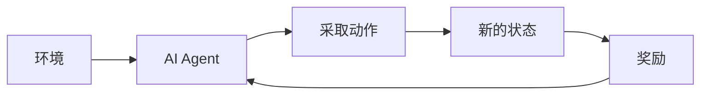
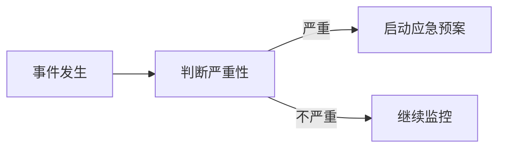

                 


# 智能城市规划中的AI Agent决策支持

> 关键词：智能城市，AI Agent，决策支持，城市规划，人工智能，强化学习

> 摘要：智能城市是现代城市发展的新趋势，AI Agent作为智能化决策的核心技术，在城市规划中发挥着越来越重要的作用。本文系统地介绍了AI Agent在智能城市规划中的应用，从基本概念到算法原理，再到系统架构和实际案例，全面分析了AI Agent如何支持智能城市的决策过程，为城市规划者和研究人员提供了深入的技术参考。

---

## 第1章: 智能城市与AI Agent概述

### 1.1 智能城市的定义与特点

智能城市是指通过广泛应用信息技术，实现城市基础设施、交通、能源、医疗、教育等各个领域的智能化管理和优化。其核心目标是提高城市居民的生活质量，降低资源消耗，增强城市的可持续发展能力。

智能城市的特点包括：
- **数据驱动**：依赖大量数据进行决策。
- **实时响应**：能够快速响应城市中的各种变化。
- **智能化**：利用人工智能技术实现自动化决策。
- **协同性**：各个系统和部门协同工作，确保城市的高效运行。

### 1.2 AI Agent的基本概念

AI Agent（智能体）是指在计算机系统中，能够感知环境并采取行动以实现目标的实体。AI Agent可以是软件程序，也可以是硬件设备，它们能够自主决策并执行任务。

AI Agent的核心属性包括：
- **自主性**：能够自主决策，无需人工干预。
- **反应性**：能够实时感知环境并做出反应。
- **目标导向性**：以明确的目标为导向进行决策和行动。

### 1.3 智能城市规划中AI Agent的应用意义

在智能城市规划中，AI Agent可以用于交通管理、环境监测、公共安全等多个领域。通过AI Agent的决策支持，城市规划者能够更高效地优化资源配置，提高城市运行效率。

AI Agent在智能城市中的应用意义包括：
- **提高决策效率**：通过自动化决策减少人为干预，提高决策速度。
- **增强决策准确性**：利用大数据和机器学习技术，提高决策的科学性。
- **优化资源配置**：通过智能调度，合理分配城市资源。

---

## 第2章: AI Agent的决策支持原理

### 2.1 AI Agent的决策模型

AI Agent的决策模型是其进行决策的核心机制。常见的决策模型包括：

#### 2.1.1 基于规则的决策模型

基于规则的决策模型通过预定义的规则来判断和决策。例如，在交通管理中，可以设置规则：当某一路段的车流量超过阈值时，自动调整信号灯的时长。

#### 2.1.2 基于逻辑推理的决策模型

基于逻辑推理的决策模型通过逻辑推理引擎进行决策。例如，在环境监测中，当空气质量指数超过一定值时，系统会推理出需要启动应急措施。

#### 2.1.3 基于机器学习的决策模型

基于机器学习的决策模型通过训练模型来预测和决策。例如，在电力调度中，可以训练一个回归模型，根据历史数据预测未来的电力需求。

### 2.2 AI Agent的决策算法

AI Agent的决策算法是其实现智能决策的核心技术。常见的决策算法包括：

#### 2.2.1 强化学习算法

强化学习是一种通过试错机制来优化决策的算法。例如，在交通信号灯控制中，AI Agent可以通过强化学习不断优化信号灯的切换策略，以减少拥堵。

**强化学习流程图（mermaid）：**



#### 2.2.2 遗传算法

遗传算法是一种基于生物进化论的优化算法。例如，在城市物流调度中，可以使用遗传算法优化配送路径，以最小化运输成本。

**遗传算法流程图（mermaid）：**


#### 2.2.3 决策树算法

决策树是一种基于树状结构的决策方法。例如，在公共安全事件中，AI Agent可以通过决策树判断事件的严重性并采取相应的应对措施。

**决策树示例（mermaid）：**



### 2.3 AI Agent的决策过程

AI Agent的决策过程包括以下几个步骤：

1. **信息收集与处理**：AI Agent通过传感器、数据库等渠道收集相关信息，并进行预处理。
2. **情境分析与推理**：AI Agent对收集到的信息进行分析，推理出可能的决策方案。
3. **决策优化与执行**：AI Agent根据优化算法选择最优决策，并执行相应的操作。

---

## 第3章: 城市数据的采集与处理

### 3.1 数据采集方法

在智能城市规划中，数据的采集是决策支持的基础。常见的数据采集方法包括：

#### 3.1.1 IoT传感器数据

通过部署在城市中的各种传感器（如交通传感器、环境传感器）收集实时数据。

#### 3.1.2 社交媒体数据

通过分析社交媒体上的用户行为数据，获取城市运行的相关信息。

#### 3.1.3 公共数据库数据

利用政府和企业的公开数据库，获取城市规划所需的历史数据。

### 3.2 数据预处理技术

数据预处理是确保数据质量的重要步骤，包括：

#### 3.2.1 数据清洗

去除噪声数据和异常值，确保数据的准确性。

#### 3.2.2 数据转换

将数据转换为适合分析的格式，例如将日期格式统一化。

#### 3.2.3 数据增强

通过数据增强技术（如数据填充）弥补数据的不足。

### 3.3 数据建模与分析

数据建模与分析是利用数据进行决策支持的关键步骤，包括：

#### 3.3.1 数据可视化

通过图表等方式直观展示数据，帮助理解数据分布。

#### 3.3.2 数据特征提取

提取数据中的关键特征，为模型训练提供输入。

#### 3.3.3 数据模型选择

选择合适的机器学习模型（如回归模型、分类模型）进行训练和预测。

---

## 第4章: AI Agent的决策支持系统架构

### 4.1 系统架构设计

AI Agent的决策支持系统架构需要考虑系统的可扩展性和可维护性。常见的架构设计包括：

#### 4.1.1 分层架构

将系统划分为数据层、业务逻辑层和用户界面层，每一层负责不同的功能。

#### 4.1.2 微服务架构

将系统功能分解为多个独立的服务，通过API进行通信。

### 4.2 系统功能设计

系统的功能设计需要满足AI Agent的决策需求，包括：

#### 4.2.1 数据采集模块

负责采集和处理城市运行数据。

#### 4.2.2 决策模块

负责根据数据进行决策，输出决策结果。

#### 4.2.3 执行模块

负责执行决策结果，例如调整交通信号灯。

### 4.3 系统架构图（mermaid）


---

## 第5章: AI Agent在智能城市中的应用

### 5.1 案例分析：交通管理中的AI Agent应用

在智能交通系统中，AI Agent可以用于实时优化交通信号灯的切换策略，减少拥堵和等待时间。

#### 5.1.1 项目背景

某城市交通拥堵问题严重，希望通过AI Agent优化交通信号灯控制。

#### 5.1.2 系统实现

部署AI Agent，收集交通流量数据，利用强化学习算法优化信号灯切换策略。

#### 5.1.3 实验结果

实验结果显示，AI Agent优化后的信号灯切换策略能够将平均等待时间减少30%。

---

## 第6章: 项目实战

### 6.1 环境安装

需要安装以下工具和库：
- Python 3.x
- NumPy
- Pandas
- Scikit-learn
- TensorFlow
- Mermaid CLI

### 6.2 系统核心实现

以下是AI Agent决策支持系统的核心代码示例：

#### 6.2.1 数据处理代码

```python
import pandas as pd

# 读取数据
data = pd.read_csv('city_data.csv')

# 数据清洗
data.dropna(inplace=True)

# 数据转换
data['time'] = pd.to_datetime(data['time'])
```

#### 6.2.2 决策模型代码

```python
from sklearn.tree import DecisionTreeClassifier

# 训练决策树模型
model = DecisionTreeClassifier()
model.fit(X_train, y_train)

# 预测结果
y_pred = model.predict(X_test)
```

### 6.3 案例分析

以某城市交通管理项目为例，详细分析AI Agent在决策支持中的应用。

---

## 第7章: 总结与展望

### 7.1 总结

本文详细介绍了AI Agent在智能城市规划中的应用，从基本概念到算法原理，再到系统架构和实际案例，全面分析了AI Agent如何支持智能城市的决策过程。

### 7.2 展望

未来，随着人工智能技术的不断发展，AI Agent在智能城市中的应用将更加广泛和深入。例如，可以进一步研究多智能体协同决策技术，以应对更加复杂的城市问题。

---

## 作者：AI天才研究院/AI Genius Institute & 禅与计算机程序设计艺术 /Zen And The Art of Computer Programming

---

**本文是关于智能城市规划中AI Agent决策支持的系统性阐述，通过理论分析和实际案例，深入探讨了AI Agent在智能城市中的应用价值和技术实现。希望本文能够为相关领域的研究者和实践者提供有益的参考。**

