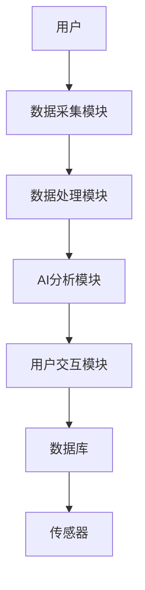

                 


# 智能婴儿床：AI Agent的婴儿睡眠模式分析

---

## 关键词：
智能婴儿床、AI Agent、婴儿睡眠模式、数据采集、机器学习、睡眠分析

---

## 摘要：
本文详细探讨了智能婴儿床中AI Agent的应用，分析婴儿睡眠模式的原理和方法。通过传感器数据采集、机器学习算法和系统架构设计，展示了如何利用AI技术优化婴儿睡眠监测和护理。文章结合实际案例，提供了系统实现的详细步骤，帮助读者理解AI在婴儿床中的应用及其潜在价值。

---

## 第一章：智能婴儿床的背景与概念

### 1.1 智能婴儿床的概念与定义
智能婴儿床是一种结合了物联网和人工智能技术的婴儿床，能够实时监测婴儿的睡眠状态，并通过AI Agent提供智能化的护理建议。其核心在于通过传感器采集数据，利用AI算法分析婴儿的睡眠模式，帮助家长优化婴儿的睡眠质量。

### 1.2 AI Agent在智能婴儿床中的作用
AI Agent（智能体）通过实时数据处理和决策算法，能够自动识别婴儿的睡眠状态，并在必要时发出警报或调整床的环境设置（如温度、湿度）以改善婴儿的睡眠质量。

---

## 第二章：婴儿睡眠模式分析的技术原理

### 2.1 传感器数据采集与处理
智能婴儿床通过多种传感器（如心率传感器、加速度传感器、体温传感器）实时采集婴儿的生理数据和环境数据。

### 2.2 机器学习算法的应用
AI Agent使用机器学习算法对睡眠数据进行分类和预测。常用算法包括：
- **K-最近邻算法（KNN）**：用于睡眠状态分类。
- **支持向量机（SVM）**：用于睡眠阶段的划分。
- **长短期记忆网络（LSTM）**：用于时间序列数据的预测。

### 2.3 睡眠模式分类的数学模型
睡眠模式分类可以通过时间序列分析模型（如ARIMA）或深度学习模型（如LSTM）实现。以下是基于LSTM的时间序列预测模型的数学表达：

$$
LSTM(t) = \text{f}(h(t-1), x(t))
$$

其中，$h(t-1)$ 是前一时刻的隐藏状态，$x(t)$ 是当前时刻的输入数据。

---

## 第三章：系统架构与设计

### 3.1 系统功能设计
智能婴儿床系统的功能模块包括：
1. 数据采集模块：负责采集婴儿的生理数据和环境数据。
2. 数据处理模块：对采集的数据进行预处理和特征提取。
3. AI分析模块：利用机器学习算法对睡眠数据进行分析和分类。
4. 用户交互模块：提供可视化的睡眠分析结果和护理建议。

### 3.2 系统架构设计
以下是智能婴儿床系统的架构图：



### 3.3 系统接口设计
系统主要接口包括：
- **传感器接口**：用于连接各种生理传感器。
- **数据接口**：用于数据的上传和下载。
- **用户接口**：提供友好的人机交互界面。

---

## 第四章：项目实战与实现

### 4.1 环境搭建
项目需要以下环境：
- **硬件**：Arduino或Raspberry Pi控制器，各类传感器模块。
- **软件**：Python编程语言，TensorFlow或Scikit-learn机器学习库。

### 4.2 核心代码实现
以下是基于Python的睡眠模式分类代码示例：

```python
import numpy as np
from sklearn.neighbors import KNeighborsClassifier
from sklearn.model_selection import train_test_split

# 数据预处理
X = np.array(data)
y = np.array(labels)

# 划分训练集和测试集
X_train, X_test, y_train, y_test = train_test_split(X, y, test_size=0.2)

# 初始化KNN分类器
knn = KNeighborsClassifier(n_neighbors=3)

# 训练模型
knn.fit(X_train, y_train)

# 预测睡眠模式
y_pred = knn.predict(X_test)
```

### 4.3 案例分析
通过实际案例分析，展示了AI Agent如何帮助家长优化婴儿的睡眠质量。例如，当婴儿出现浅睡眠状态时，AI Agent会自动调整床的倾斜角度以延长深睡眠时间。

---

## 第五章：系统优化与扩展

### 5.1 系统性能优化
通过优化数据采集频率和算法模型参数，提高系统的准确性和响应速度。

### 5.2 功能扩展
未来可以考虑增加更多功能，如：
- **远程监控**：通过手机APP实时查看婴儿的睡眠状态。
- **智能调节**：自动调整床的温度、湿度和光线以优化睡眠环境。

---

## 第六章：总结与展望

### 6.1 总结
本文详细介绍了智能婴儿床中AI Agent的应用，通过传感器数据采集、机器学习算法和系统架构设计，展示了如何利用AI技术优化婴儿的睡眠模式分析。

### 6.2 未来展望
随着AI技术的不断发展，智能婴儿床将变得更加智能化和个性化，为婴儿提供更加优质的睡眠环境。

---

## 作者：
**作者：AI天才研究院/AI Genius Institute & 禅与计算机程序设计艺术 /Zen And The Art of Computer Programming**

---

## 参考文献：
1. Bishop, C. M. (2006). Pattern Recognition and Machine Learning.
2. Goodfellow, I., Bengio, Y., & Courville, A. (2016). Deep Learning.

