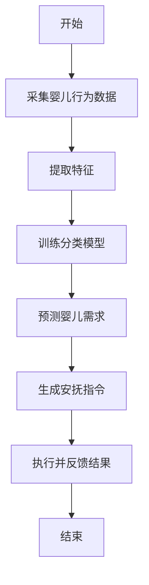

                 


```markdown
# 智能婴儿摇篮：AI Agent的安抚模式优化

> 关键词：智能婴儿摇篮，AI Agent，安抚模式，婴儿护理，人工智能技术

> 摘要：本文详细探讨了AI Agent在智能婴儿摇篮中的应用，特别是如何通过优化安抚模式来提升婴儿护理的效果。文章从背景介绍、核心概念、算法原理、系统架构、项目实战到最佳实践，全面分析了智能婴儿摇篮的设计与实现过程，为相关领域的研究和应用提供了有价值的参考。

---

# 第一部分: 背景介绍

# 第1章: 智能婴儿摇篮与AI Agent概述

## 1.1 问题背景
### 1.1.1 婴儿安抚的传统方式
传统的婴儿安抚主要依赖父母或照顾者的手动操作，如摇晃、轻拍或哼唱。这些方法虽然有效，但存在效率低下、难以量化和个性化的问题，且需要持续的人工干预。

### 1.1.2 现代育儿中的技术需求
随着科技的进步，父母对智能化育儿工具的需求日益增长。现代育儿不仅追求效率，还注重个性化和数据化，希望借助技术手段更科学地照顾婴儿。

### 1.1.3 AI技术在婴儿护理中的潜力
人工智能技术在婴儿护理中的应用潜力巨大。通过AI算法分析婴儿的行为数据，可以实现个性化的安抚方案，提升婴儿的舒适度和安全感。

## 1.2 问题描述
### 1.2.1 婴儿哭闹的常见原因
婴儿哭闹通常由生理需求（如饥饿、尿布湿了）、情绪需求（如需要安慰）或环境因素（如过强的光线或噪音）引起。传统方法难以准确识别并快速响应这些需求。

### 1.2.2 现有婴儿摇篮的局限性
现有的婴儿摇篮大多仅能提供固定的摇晃模式，无法根据婴儿的具体需求进行调整。缺乏智能化的反馈机制，难以实现个性化的安抚。

### 1.2.3 AI Agent在婴儿安抚中的应用前景
AI Agent（智能代理）可以通过实时监测婴儿的行为数据，学习并预测婴儿的需求，提供个性化的安抚方案，显著提升婴儿的舒适度和父母的育儿效率。

## 1.3 解决方案
### 1.3.1 AI Agent的基本概念
AI Agent是一种能够感知环境、执行任务的智能系统。在婴儿摇篮中，AI Agent通过传感器收集婴儿的行为数据，分析并生成相应的安抚指令。

### 1.3.2 安抚模式的优化目标
优化目标包括提高安抚效率、增强个性化、降低误判率和延长产品使用寿命。通过AI算法的优化，可以实现更精准的婴儿需求识别和更高效的安抚策略。

### 1.3.3 智能婴儿摇篮的设计理念
设计理念基于AI技术的核心优势，结合婴儿护理的实际需求，设计出一款能够实时感知、智能分析并执行安抚动作的婴儿摇篮。

## 1.4 边界与外延
### 1.4.1 产品功能的边界
智能婴儿摇篮的核心功能包括数据采集、需求分析和安抚执行。其他功能如音乐播放、远程监控等可根据需求扩展。

### 1.4.2 技术实现的限制
当前技术条件下，AI Agent的性能受限于传感器精度、算法复杂度和硬件计算能力。需要在性能和成本之间找到平衡点。

### 1.4.3 使用场景的扩展
除了家庭使用，智能婴儿摇篮还可应用于婴儿托管中心、医院新生儿病房等场景，进一步扩大其应用范围和市场潜力。

## 1.5 核心要素组成
### 1.5.1 AI算法的核心要素
AI算法包括数据采集、特征提取、模型训练和预测推理四个核心部分。数据采集是基础，特征提取是关键，模型训练是核心，预测推理是输出。

### 1.5.2 婴儿行为数据的采集
通过加速度传感器、心率监测器、体温传感器等设备，实时采集婴儿的行为数据，为AI Agent提供决策依据。

### 1.5.3 系统反馈机制的设计
系统反馈机制通过调整摇晃频率、力度和模式，响应婴儿的行为变化，形成闭环控制，确保婴儿始终处于舒适状态。

---

# 第二部分: 核心概念与联系

# 第2章: AI Agent与安抚模式的关系

## 2.1 核心概念原理
### 2.1.1 AI Agent的基本原理
AI Agent通过感知环境、分析数据、制定策略并执行动作来实现目标。在婴儿摇篮中，AI Agent的任务是分析婴儿行为数据，生成安抚指令。

### 2.1.2 安抚模式的实现机制
安抚模式通过调整摇晃速度、力度和方向，模拟人类的摇晃动作，帮助婴儿放松。AI Agent根据婴儿的行为数据动态调整安抚模式。

### 2.1.3 两者结合的理论基础
基于行为学和认知科学的理论，AI Agent能够模拟人类的安抚行为，通过实时反馈优化安抚策略，实现更高效的婴儿安抚。

## 2.2 概念属性特征对比
| 属性      | AI Agent                          | 安抚模式                          |
|-----------|-----------------------------------|-----------------------------------|
| 输入      | 婴儿行为数据（如心率、加速度）    | 婴儿哭闹强度、时间等              |
| 输出      | 安抚指令（如调整摇晃频率）        | 摇晃速度、力度等                  |
| 目标      | 优化婴儿舒适度                   | 减少婴儿哭闹                      |
| 反馈机制 | 婴儿行为数据的变化                | 婴儿哭闹的减少或停止              |

## 2.3 ER实体关系图
```mermaid
er
    Baby: {id, name, age}
    Agent: {agent_id, type, status}
    Interaction: {interaction_id, baby_id, agent_id, time, result}
    Relationship: Baby -[1..n]-> Interaction
    Relationship: Agent -[1..n]-> Interaction
```

---

# 第三部分: 算法原

## 3.1 算法原理概述
AI Agent通过机器学习算法分析婴儿的行为数据，训练模型以识别婴儿的需求，并生成相应的安抚指令。

### 3.1.1 数据采集与预处理
使用传感器采集婴儿的行为数据，如心率、加速度、体温等，并对数据进行清洗和特征提取。

### 3.1.2 特征提取
从原始数据中提取有用的特征，如哭闹的频率、幅度和持续时间，为模型训练提供输入。

### 3.1.3 模型训练
使用监督学习算法（如随机森林、支持向量机）训练分类模型，识别婴儿的不同需求。

### 3.1.4 模型预测与优化
基于训练好的模型，预测婴儿的需求，并通过反馈机制优化模型性能。

## 3.2 算法流程图


## 3.3 数学模型与公式
模型采用随机森林算法进行分类，公式如下：
$$
\text{预测结果} = \argmax_{i} \sum_{j=1}^{n} \text{特征权重}_j \times \text{特征值}_i
$$

---

# 第四部分: 系统分析与架构设计

## 4.1 系统架构概述
系统架构包括数据采集模块、AI处理模块和执行模块，通过通信模块实现各模块的协同工作。

## 4.2 系统功能设计
### 4.2.1 数据采集模块
负责采集婴儿的行为数据，如心率、加速度等。

### 4.2.2 数据处理模块
对采集到的数据进行预处理和特征提取。

### 4.2.3 AI处理模块
运行机器学习模型，预测婴儿的需求并生成安抚指令。

### 4.2.4 执行模块
根据AI处理模块的指令，调整摇篮的运动参数。

## 4.3 系统架构图


---

# 第五部分: 项目实战

## 5.1 环境安装
需要安装Python、传感器模块和相关机器学习库（如scikit-learn）。

## 5.2 核心代码实现
```python
import numpy as np
from sklearn.ensemble import RandomForestClassifier

# 数据预处理
X = ...  # 特征矩阵
y = ...  # 标签向量

# 训练模型
model = RandomForestClassifier()
model.fit(X, y)

# 预测需求
new_X = ...  # 新的数据
predicted = model.predict(new_X)
```

## 5.3 代码解读
- 数据预处理：对传感器数据进行清洗和特征提取。
- 模型训练：使用随机森林算法训练分类模型。
- 预测与执行：根据模型预测结果生成安抚指令。

## 5.4 案例分析
通过实际案例分析，验证系统的有效性和优化空间。

## 5.5 项目小结
总结项目成果，提出改进建议。

---

# 第六部分: 最佳实践

## 6.1 小结
AI Agent在智能婴儿摇篮中的应用显著提升了婴儿护理的效果，但仍需进一步优化算法和硬件设计。

## 6.2 注意事项
- 数据隐私保护
- 系统稳定性保障
- 用户操作便捷性

## 6.3 拓展阅读
推荐相关领域的书籍和论文，供读者进一步学习。

---

# 作者
作者：AI天才研究院 & 禅与计算机程序设计艺术
```

