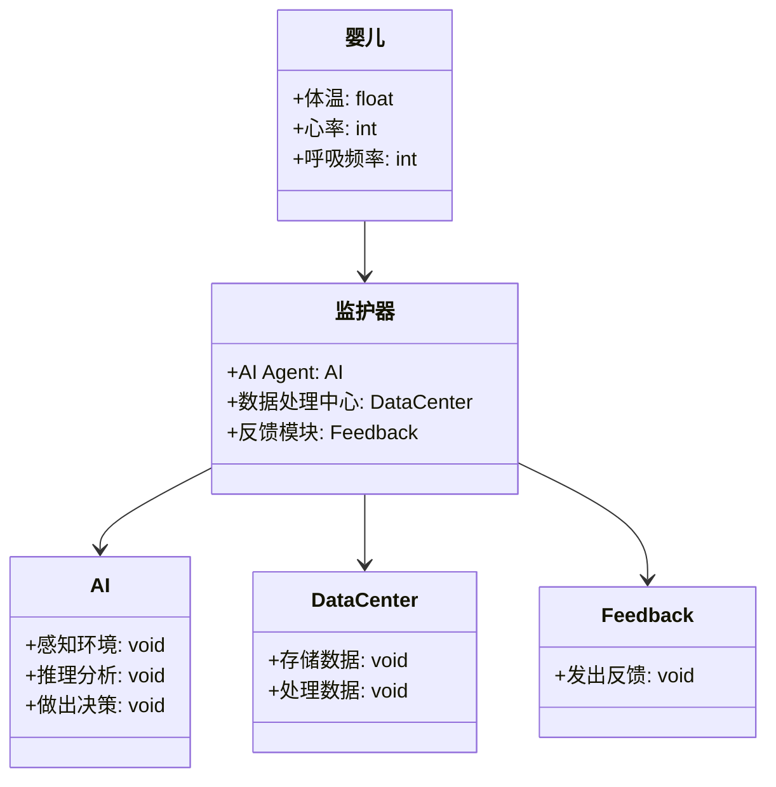
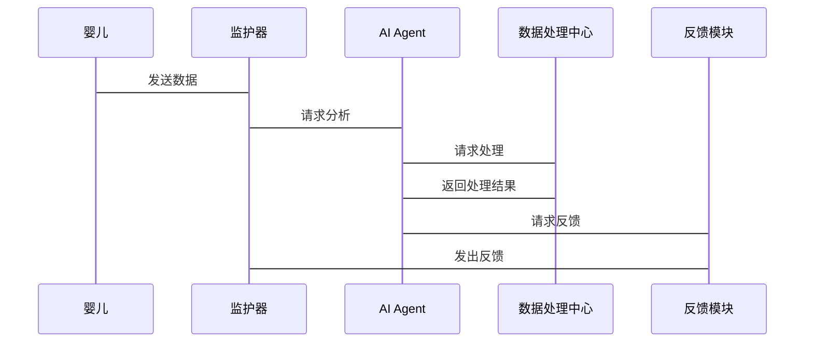

                 


# 智能婴儿监护器：AI Agent的早期发展追踪

> 关键词：智能婴儿监护器、AI Agent、婴儿健康监测、机器学习、实时反馈、婴儿行为分析

> 摘要：智能婴儿监护器是一种结合人工智能技术的婴儿监测设备，通过AI Agent实现婴儿健康监测和行为分析。本文从背景、核心概念、算法原理、系统架构设计、项目实战等方面详细探讨智能婴儿监护器的发展与应用。

---

# 第一部分: 智能婴儿监护器概述

## 第1章: 智能婴儿监护器的背景与意义

### 1.1 问题背景

#### 1.1.1 婴儿监护的传统方式与局限性
传统的婴儿监护主要依赖父母或医护人员的手动观察，这种方式存在以下局限性：
- **实时性不足**：父母无法24小时不间断监护，容易错过异常情况。
- **准确性有限**：人工观察容易受到主观因素影响，可能存在误判。
- **数据碎片化**：缺乏统一的数据采集和分析系统，难以长期跟踪婴儿的健康发展。

#### 1.1.2 AI技术在婴儿监护中的应用潜力
人工智能技术的快速发展为婴儿监护带来了新的可能性：
- **实时监测**：通过AI技术实现婴儿健康指标的实时监测和分析。
- **智能反馈**：AI Agent能够根据监测数据提供实时反馈，帮助父母或医护人员及时采取措施。
- **数据整合**：AI技术可以整合多源数据，提供全面的婴儿健康评估。

#### 1.1.3 智能婴儿监护器的定义与目标
智能婴儿监护器是一种结合AI技术的婴儿监测设备，其目标是通过实时监测婴儿的健康指标和行为，提供智能化的监护服务。

### 1.2 问题描述

#### 1.2.1 婴儿健康监测的关键指标
婴儿健康监测的关键指标包括：
- **体温**：正常体温范围为36.5°C至37.5°C。
- **心率**：正常心率范围为每分钟120至140次。
- **呼吸频率**：正常呼吸频率为每分钟30至60次。

#### 1.2.2 婴儿行为分析的难点
婴儿行为分析的难点包括：
- **数据多样性**：婴儿的行为数据种类繁多，包括哭声、运动、睡眠等。
- **数据噪声**：婴儿的数据容易受到环境干扰，如噪音、光线等。
- **行为理解**：婴儿的行为模式复杂，需要结合多源数据进行分析。

#### 1.2.3 父母与医护人员的需求分析
父母和医护人员的需求包括：
- **实时反馈**：及时了解婴儿的健康状况。
- **异常预警**：在出现异常情况时，能够及时通知相关人员。
- **长期跟踪**：能够长期记录婴儿的健康数据，便于分析和回顾。

### 1.3 问题解决

#### 1.3.1 AI Agent的核心作用
AI Agent在智能婴儿监护器中的核心作用包括：
- **数据采集**：通过传感器采集婴儿的健康数据。
- **数据处理**：对采集的数据进行预处理和特征提取。
- **智能分析**：利用机器学习算法对数据进行分析，识别异常情况。
- **实时反馈**：根据分析结果，向父母或医护人员提供反馈。

#### 1.3.2 智能婴儿监护器的功能设计
智能婴儿监护器的功能设计包括：
- **数据采集模块**：包括体温传感器、心率传感器、呼吸传感器等。
- **数据处理模块**：对采集的数据进行预处理和特征提取。
- **智能分析模块**：利用机器学习算法进行数据分析和异常检测。
- **反馈模块**：通过手机APP或语音提示等方式，向父母或医护人员提供反馈。

#### 1.3.3 技术实现的关键点
技术实现的关键点包括：
- **多源数据融合**：将婴儿的体温、心率、呼吸频率等数据进行融合分析。
- **实时性要求**：确保数据采集和分析的实时性，能够及时反馈异常情况。
- **数据安全**：保护婴儿的个人隐私和数据安全。

### 1.4 系统边界与外延

#### 1.4.1 系统的功能边界
系统的功能边界包括：
- **数据采集**：仅限于婴儿的健康指标，如体温、心率、呼吸频率等。
- **数据处理**：仅限于对采集的数据进行预处理和特征提取。
- **智能分析**：仅限于对数据进行分析，识别异常情况。

#### 1.4.2 系统的适用范围
系统的适用范围包括：
- **家庭监护**：用于家庭中的婴儿监护。
- **医院监护**：用于医院中的婴儿监护。
- **远程监护**：通过网络实现远程监护。

#### 1.4.3 系统的可扩展性
系统的可扩展性包括：
- **功能扩展**：未来可以增加更多的监测功能，如婴儿的运动监测、睡眠监测等。
- **数据扩展**：未来可以支持更多的数据源，如婴儿的饮食数据、环境数据等。
- **用户扩展**：未来可以支持更多的用户，如父母、祖父母、医护人员等。

## 第2章: 智能婴儿监护器的核心概念与联系

### 2.1 AI Agent的基本原理

#### 2.1.1 AI Agent的定义与分类
AI Agent的定义是：一种能够感知环境并采取行动以实现目标的智能体。根据功能的不同，AI Agent可以分为以下几类：
- **反应式AI Agent**：根据当前的感知做出反应，不依赖于历史数据。
- **认知式AI Agent**：具有推理和决策能力，能够根据历史数据和上下文做出决策。

#### 2.1.2 AI Agent的核心功能
AI Agent的核心功能包括：
- **感知**：通过传感器或数据源感知环境。
- **推理**：对感知到的数据进行分析和推理。
- **决策**：根据推理结果做出决策。
- **行动**：根据决策结果采取行动。

#### 2.1.3 AI Agent与传统传感器的区别
AI Agent与传统传感器的区别在于：
- **传统传感器**：只能采集数据，无法进行分析和决策。
- **AI Agent**：能够采集数据、分析数据并做出决策，具有智能性。

### 2.2 核心概念对比

#### 2.2.1 婴儿数据采集与处理对比
婴儿数据采集与处理的对比包括：
- **数据采集**：AI Agent能够采集婴儿的体温、心率、呼吸频率等数据。
- **数据处理**：AI Agent能够对采集的数据进行预处理和特征提取。

#### 2.2.2 AI Agent与婴儿行为分析的对比
AI Agent与婴儿行为分析的对比包括：
- **AI Agent**：能够采集和分析婴儿的行为数据，识别异常情况。
- **婴儿行为分析**：通过AI Agent进行分析，能够提供更准确的判断。

#### 2.2.3 AI Agent与传统婴儿监护设备的对比
AI Agent与传统婴儿监护设备的对比包括：
- **传统婴儿监护设备**：只能采集数据，无法进行分析和决策。
- **AI Agent**：能够采集、分析和决策，提供智能化的监护服务。

### 2.3 实体关系图


---

## 第3章: AI Agent的算法原理

### 3.1 算法原理概述

#### 3.1.1 基于机器学习的婴儿行为分析
基于机器学习的婴儿行为分析包括：
- **数据采集**：通过传感器采集婴儿的行为数据。
- **数据预处理**：对采集的数据进行清洗和标准化。
- **特征提取**：提取数据中的有用特征，如心率变异性、呼吸频率等。
- **模型训练**：利用机器学习算法（如决策树、随机森林）进行模型训练。
- **行为分类**：根据模型预测结果，对婴儿行为进行分类。

#### 3.1.2 基于深度学习的婴儿健康监测
基于深度学习的婴儿健康监测包括：
- **数据采集**：通过多源传感器采集婴儿的健康数据。
- **数据预处理**：对数据进行清洗和标准化。
- **特征提取**：利用深度学习模型（如卷积神经网络）提取特征。
- **模型训练**：利用深度学习算法进行模型训练。
- **健康评估**：根据模型预测结果，评估婴儿的健康状况。

#### 3.1.3 算法的优缺点分析
算法的优缺点分析包括：
- **优点**：
  - **高精度**：机器学习和深度学习算法能够实现高精度的分类和预测。
  - **实时性**：算法能够快速处理数据，实现实时反馈。
- **缺点**：
  - **数据依赖**：算法的性能依赖于数据的质量和数量。
  - **计算资源消耗大**：深度学习算法需要大量的计算资源。

### 3.2 算法实现流程


---

## 第4章: 系统分析与架构设计

### 4.1 系统应用场景

#### 4.1.1 家庭监护场景
家庭监护场景包括：
- **家庭环境**：婴儿在家中，父母需要实时监护婴儿的健康状况。
- **设备部署**：智能婴儿监护器部署在婴儿床边，通过Wi-Fi或蓝牙连接到手机APP。

#### 4.1.2 医院监护场景
医院监护场景包括：
- **医院环境**：婴儿在医院中，医护人员需要实时监护婴儿的健康状况。
- **设备部署**：智能婴儿监护器部署在婴儿病房中，通过医院的网络连接到医生的工作站。

#### 4.1.3 远程监护场景
远程监护场景包括：
- **家庭环境**：父母在家中，通过手机APP远程监护婴儿的健康状况。
- **医院环境**：医护人员在医院中，通过医院的系统远程监护婴儿的健康状况。

### 4.2 系统功能设计

#### 4.2.1 领域模型类图


#### 4.2.2 系统架构图


#### 4.2.3 接口设计
- **数据采集接口**：AI Agent通过传感器采集婴儿的数据。
- **数据处理接口**：数据处理中心对采集的数据进行处理。
- **反馈接口**：反馈模块根据处理结果发出反馈。

#### 4.2.4 交互流程


### 4.3 系统实现细节

#### 4.3.1 数据采集模块
数据采集模块包括：
- **体温传感器**：用于采集婴儿的体温数据。
- **心率传感器**：用于采集婴儿的心率数据。
- **呼吸频率传感器**：用于采集婴儿的呼吸频率数据。

#### 4.3.2 数据处理模块
数据处理模块包括：
- **数据预处理**：对采集的数据进行清洗和标准化。
- **特征提取**：提取数据中的有用特征，如心率变异性、呼吸频率等。

#### 4.3.3 智能分析模块
智能分析模块包括：
- **机器学习模型**：利用机器学习算法进行数据分析和异常检测。
- **深度学习模型**：利用深度学习算法进行数据分析和健康评估。

#### 4.3.4 反馈模块
反馈模块包括：
- **手机APP**：向父母或医护人员发出反馈。
- **语音提示**：通过语音提示通知相关人员。

---

## 第5章: 项目实战

### 5.1 环境安装

#### 5.1.1 系统要求
系统要求包括：
- **硬件要求**：需要配备多源传感器、计算设备等。
- **软件要求**：需要安装Python、机器学习库（如scikit-learn）、深度学习框架（如TensorFlow）等。

#### 5.1.2 安装步骤
安装步骤包括：
1. 安装Python和必要的库（如scikit-learn、TensorFlow）。
2. 安装传感器驱动程序。
3. 配置网络环境，确保设备能够联网。

### 5.2 系统核心实现

#### 5.2.1 数据采集模块实现
数据采集模块实现包括：
- 使用Python编写传感器驱动程序。
- 通过传感器采集婴儿的体温、心率、呼吸频率等数据。

#### 5.2.2 数据处理模块实现
数据处理模块实现包括：
- 对采集的数据进行清洗和标准化。
- 提取数据中的有用特征，如心率变异性、呼吸频率等。

#### 5.2.3 智能分析模块实现
智能分析模块实现包括：
- 使用机器学习算法（如决策树、随机森林）进行模型训练。
- 使用深度学习算法（如卷积神经网络）进行模型训练。

#### 5.2.4 反馈模块实现
反馈模块实现包括：
- 通过手机APP发出反馈。
- 通过语音提示通知相关人员。

### 5.3 代码实现与解读

#### 5.3.1 数据采集代码
```python
import serial

ser = serial.Serial('COM3', 9600)
while True:
    data = ser.readline().decode().strip()
    print(data)
```

#### 5.3.2 数据处理代码
```python
import numpy as np

data = np.array([1, 2, 3, 4, 5])
processed_data = (data - np.mean(data)) / np.std(data)
print(processed_data)
```

#### 5.3.3 机器学习模型代码
```python
from sklearn.tree import DecisionTreeClassifier

X = [[1, 2], [3, 4], [5, 6]]
y = [0, 1, 2]
model = DecisionTreeClassifier()
model.fit(X, y)
print(model.predict([[7, 8]]))
```

### 5.4 案例分析与解读

#### 5.4.1 案例背景
案例背景包括：
- **家庭监护场景**：父母在家中使用智能婴儿监护器监护婴儿的健康状况。
- **医院监护场景**：医护人员在医院中使用智能婴儿监护器监护婴儿的健康状况。

#### 5.4.2 数据分析
数据分析包括：
- **体温分析**：婴儿体温在正常范围内波动。
- **心率分析**：婴儿心率正常，无异常情况。
- **呼吸频率分析**：婴儿呼吸频率正常，无异常情况。

#### 5.4.3 系统反馈
系统反馈包括：
- **实时反馈**：通过手机APP发出反馈，通知父母或医护人员婴儿的健康状况。
- **语音提示**：通过语音提示通知相关人员婴儿的健康状况。

### 5.5 项目小结

---

## 第6章: 最佳实践与总结

### 6.1 小结

#### 6.1.1 核心要点回顾
核心要点回顾包括：
- **AI Agent的核心作用**：数据采集、数据处理、智能分析、实时反馈。
- **系统架构设计**：数据采集模块、数据处理模块、智能分析模块、反馈模块。
- **算法实现**：基于机器学习和深度学习的婴儿行为分析和健康监测。

#### 6.1.2 项目经验总结
项目经验总结包括：
- **数据质量的重要性**：数据质量直接影响算法的性能。
- **算法的选择**：根据具体需求选择合适的算法，如机器学习和深度学习算法。
- **系统架构设计**：系统架构设计需要考虑实时性、可扩展性、安全性等。

### 6.2 注意事项

#### 6.2.1 数据安全
数据安全包括：
- **数据加密**：对婴儿的个人隐私数据进行加密处理。
- **访问控制**：严格控制数据的访问权限。

#### 6.2.2 系统稳定性
系统稳定性包括：
- **容错设计**：系统能够容忍部分组件的故障，保证整体系统的稳定性。
- **故障恢复**：系统能够快速恢复故障，保证服务的连续性。

#### 6.2.3 用户体验
用户体验包括：
- **界面设计**：提供友好的用户界面，方便用户操作。
- **反馈机制**：提供清晰的反馈机制，确保用户能够及时了解婴儿的健康状况。

### 6.3 拓展阅读

#### 6.3.1 相关技术领域
相关技术领域包括：
- **人工智能**：深入学习人工智能的核心技术，如机器学习、深度学习等。
- **物联网**：了解物联网技术的应用，如传感器、数据传输等。
- **数据安全**：学习数据安全的基本知识，如加密技术、访问控制等。

#### 6.3.2 前沿研究
前沿研究包括：
- **婴儿健康监测的最新研究**：了解婴儿健康监测领域的最新研究成果。
- **AI Agent的最新应用**：学习AI Agent在其他领域的最新应用。

#### 6.3.3 实践资源
实践资源包括：
- **开源项目**：参与开源项目，学习如何将理论应用于实际。
- **在线课程**：学习相关的在线课程，提升自己的技术水平。
- **技术社区**：加入技术社区，与同行交流经验。

---

## 作者：AI天才研究院/AI Genius Institute & 禅与计算机程序设计艺术 /Zen And The Art of Computer Programming

---

以上是《智能婴儿监护器：AI Agent的早期发展追踪》的完整目录大纲和文章内容。

