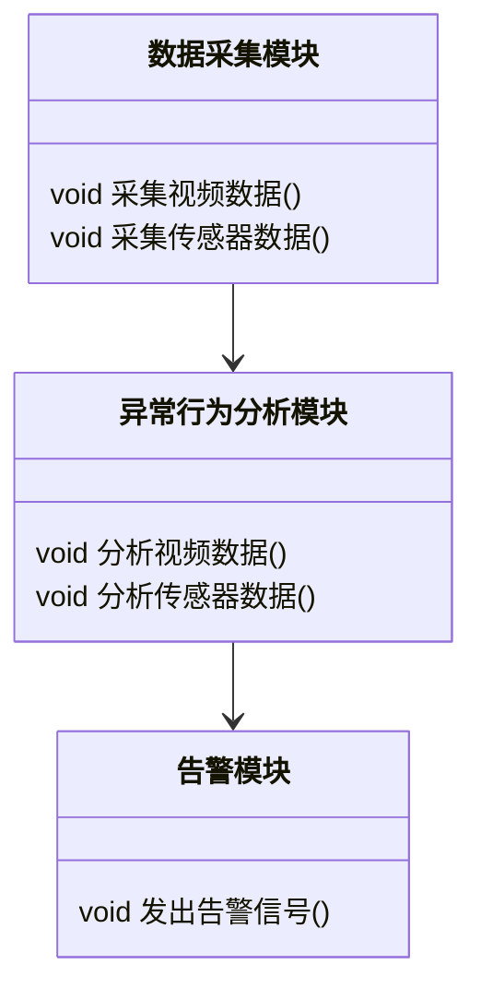
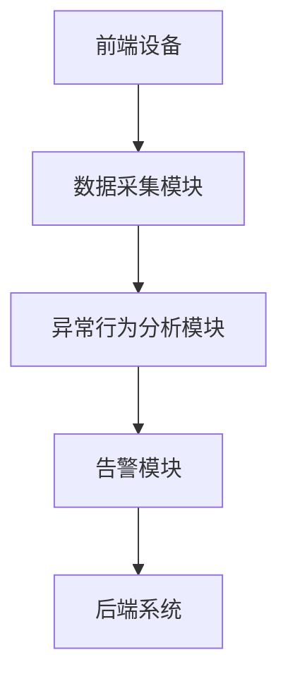
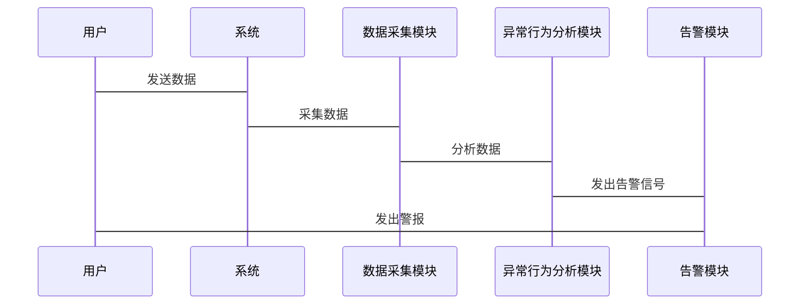

                 


# 《智能安防：AI Agent的异常行为检测》

---

## 关键词：
- 智能安防，AI Agent，异常行为检测，机器学习，深度学习，实时监控

---

## 摘要：
本文将详细探讨AI Agent在智能安防中的应用，重点分析异常行为检测的核心算法、系统架构及实际应用场景。通过结合理论与实践，从算法原理到系统实现，逐步解析AI Agent如何提升智能安防的效率与准确性。文章内容涵盖背景介绍、核心概念、算法原理、系统架构、项目实战及未来展望，为读者提供全面的技术解析。

---

# 第1章: 智能安防的背景与概念

## 1.1 智能安防的定义与特点
### 1.1.1 安防的定义与演变
安全防护（Security Protection，简称安防）是指通过技术手段保护人员、财产、信息等免受威胁和侵害的过程。传统安防主要依赖人力巡逻、物理屏障等手段，而智能安防则通过引入人工智能、大数据、物联网等技术，实现智能化、自动化、实时化的安全防护。

### 1.1.2 智能安防的核心特点
1. **智能化**：利用AI技术实现自主学习、推理和决策。
2. **实时性**：能够快速响应，实时监控和处理异常情况。
3. **数据驱动**：依赖于大量数据进行分析和决策。
4. **集成化**：结合多种技术手段（如视频监控、传感器数据等）实现综合防护。

### 1.1.3 智能安防与传统安防的区别
| 特性       | 传统安防                     | 智能安防                     |
|------------|------------------------------|------------------------------|
| 技术手段   | 物理屏障、人力巡逻           | AI、大数据、物联网             |
| 响应速度   | 较慢，依赖人工判断           | 快速，自动响应               |
| 数据利用   | 有限，主要依赖经验           | 丰富，数据驱动决策           |
| 成本效益   | 较高，依赖人力               | 较低，自动化降低成本           |

---

## 1.2 AI Agent的定义与特点
### 1.2.1 AI Agent的基本概念
AI Agent（人工智能代理）是指具有感知环境、自主决策、执行任务能力的智能实体。在智能安防领域，AI Agent通常表现为软件系统，能够通过摄像头、传感器等设备收集数据，并基于这些数据进行分析和决策。

### 1.2.2 AI Agent的核心能力
1. **感知能力**：通过摄像头、传感器等设备获取环境数据。
2. **决策能力**：基于获取的数据，通过机器学习模型进行分析和判断。
3. **执行能力**：根据决策结果，触发相应的动作（如报警、锁定等）。

### 1.2.3 AI Agent在智能安防中的角色
AI Agent在智能安防中主要扮演以下几个角色：
1. **监控者**：实时监控环境中的异常行为。
2. **决策者**：根据监控数据做出判断，决定是否采取行动。
3. **执行者**：触发相应的安全措施，如报警、封锁出入口等。

---

## 1.3 异常行为检测的背景与意义
### 1.3.1 异常行为检测的定义
异常行为检测是指通过分析行为数据，识别出与正常行为模式不符的异常行为。在智能安防中，异常行为检测主要用于识别潜在的安全威胁，如入侵、盗窃、暴力行为等。

### 1.3.2 异常行为检测的重要性
1. **预防犯罪**：通过及时发现异常行为，预防潜在的安全威胁。
2. **提高效率**：减少人工监控的工作量，提高安全防护的效率。
3. **降低风险**：通过自动化检测，降低人为失误带来的风险。

### 1.3.3 异常行为检测在智能安防中的应用
1. **视频监控**：通过分析视频数据，识别异常行为。
2. **出入口控制**：通过分析人员行为，识别非法入侵。
3. **公共场所安全**：在商场、车站等公共场所，识别潜在的安全威胁。

---

## 1.4 本章小结
本章主要介绍了智能安防的定义与特点，以及AI Agent的核心能力和在智能安防中的角色。同时，还探讨了异常行为检测的背景与意义，为后续章节的深入分析奠定了基础。

---

# 第2章: AI Agent与异常行为检测的核心概念

## 2.1 AI Agent的基本原理
### 2.1.1 AI Agent的感知模块
感知模块是AI Agent的核心组成部分，负责从环境中获取数据。在智能安防中，感知模块主要通过摄像头、传感器等设备获取图像、视频、红外数据等。

### 2.1.2 AI Agent的决策模块
决策模块负责基于感知到的数据，通过机器学习模型进行分析和判断。决策模块的核心是异常行为检测算法，包括基于规则的检测、统计学习和深度学习等方法。

### 2.1.3 AI Agent的执行模块
执行模块负责根据决策模块的判断结果，触发相应的动作。例如，当检测到异常行为时，AI Agent可以通过报警系统、封锁出入口等方式进行响应。

---

## 2.2 异常行为检测的分类与方法
### 2.2.1 基于规则的异常检测
基于规则的异常检测是一种简单但有效的检测方法。通过预定义的规则，系统可以识别出与规则不符的行为。例如，检测到有人在禁止区域内徘徊时触发报警。

### 2.2.2 基于统计学习的异常检测
基于统计学习的异常检测方法通过分析数据的分布特性，识别出异常行为。常用的算法包括局部异常因子分析（LOF）等。

### 2.2.3 基于深度学习的异常检测
基于深度学习的异常检测方法通过训练深度神经网络模型，学习正常行为的特征，并识别出异常行为。常用的模型包括卷积神经网络（CNN）、循环神经网络（RNN）等。

---

## 2.3 AI Agent在异常行为检测中的应用
### 2.3.1 AI Agent的实时监控能力
AI Agent能够实时监控环境中的异常行为，通过快速响应减少安全威胁的发生。

### 2.3.2 AI Agent的自适应学习能力
通过深度学习等技术，AI Agent能够不断学习新的数据，提高异常行为检测的准确性。

### 2.3.3 AI Agent的多场景适应能力
AI Agent能够适应多种场景，如室内监控、公共场所监控等，实现全面的安全防护。

---

## 2.4 核心概念对比表格
表2-1：异常行为检测方法的对比

| 方法类型       | 基于规则 | 基于统计学习 | 基于深度学习 |
|----------------|----------|--------------|--------------|
| 优点           | 简单易实现，规则明确 | 能够发现数据分布中的异常 | 能够学习复杂的非线性特征，检测能力强大 |
| 缺点           | 规则难以覆盖所有场景 | 对数据分布敏感，计算复杂 | 需要大量数据训练，计算资源消耗大 |
| 适用场景       | 简单场景，规则明确 | 数据分布相对稳定的场景 | 复杂场景，非线性特征明显的场景 |

---

## 2.5 ER实体

### 2.5.1 ER图
```mermaid
er
actor: 用户
acted : 参与
system : AI Agent系统
```

---

## 2.6 算法原理

### 2.6.1 基于规则的异常检测
通过预定义的规则，系统可以识别出与规则不符的行为。例如，检测到有人在禁止区域内徘徊时触发报警。

### 2.6.2 基于统计学习的异常检测
局部异常因子分析（LOF）是一种常用的统计学习方法，其核心思想是通过计算每个点的局部密度，识别出异常点。

### 2.6.3 基于深度学习的异常检测
通过训练深度神经网络模型，系统能够学习正常行为的特征，并识别出异常行为。常用的模型包括卷积神经网络（CNN）、循环神经网络（RNN）等。

---

## 2.7 本章小结
本章详细介绍了AI Agent的基本原理，以及异常行为检测的分类与方法。通过对不同检测方法的对比分析，为后续章节的深入探讨奠定了基础。

---

# 第3章: 异常行为检测的算法原理

## 3.1 算法原理概述
异常行为检测的算法主要分为三类：基于规则的检测、基于统计学习的检测和基于深度学习的检测。

---

## 3.2 基于规则的异常检测算法
### 3.2.1 算法原理
基于规则的异常检测通过预定义的规则，识别出与规则不符的行为。

### 3.2.2 优缺点分析
- 优点：简单易实现，规则明确。
- 缺点：难以覆盖所有场景。

### 3.2.3 实际应用
例如，在商场监控中，可以设置规则：在营业时间之外，任何人出现在商场内都是异常行为。

---

## 3.3 基于统计学习的异常检测算法
### 3.3.1 算法原理
局部异常因子分析（LOF）是一种常用的统计学习方法，通过计算每个点的局部密度，识别出异常点。

### 3.3.2 优缺点分析
- 优点：能够发现数据分布中的异常。
- 缺点：对数据分布敏感，计算复杂。

### 3.3.3 实际应用
例如，在视频监控中，可以通过LOF算法识别出与正常行为模式不符的异常行为。

---

## 3.4 基于深度学习的异常检测算法
### 3.4.1 算法原理
通过训练深度神经网络模型，系统能够学习正常行为的特征，并识别出异常行为。

### 3.4.2 优缺点分析
- 优点：能够学习复杂的非线性特征，检测能力强大。
- 缺点：需要大量数据训练，计算资源消耗大。

### 3.4.3 实际应用
例如，在公共场所监控中，可以通过深度学习模型识别出潜在的暴力行为。

---

## 3.5 本章小结
本章详细介绍了异常行为检测的三种主要算法：基于规则的检测、基于统计学习的检测和基于深度学习的检测。通过对不同算法的优缺点分析，帮助读者更好地理解如何选择合适的算法进行实际应用。

---

# 第4章: 系统分析与架构设计

## 4.1 系统分析
### 4.1.1 问题场景
在智能安防系统中，异常行为检测的主要问题包括：如何实时检测异常行为，如何高效处理大量数据，如何保证系统的准确性与稳定性。

### 4.1.2 项目介绍
本项目旨在通过AI Agent实现智能安防中的异常行为检测，提高安全防护的效率和准确性。

---

## 4.2 系统功能设计
### 4.2.1 领域模型


### 4.2.2 系统架构设计


---

## 4.3 系统接口设计
### 4.3.1 接口描述
- 数据采集模块接口：接收前端设备的数据，如视频流、传感器数据等。
- 异常行为分析模块接口：处理数据，识别异常行为，并向告警模块发送信号。
- 告警模块接口：根据异常行为分析模块的信号，触发相应的告警动作。

### 4.3.2 交互流程


---

## 4.4 本章小结
本章通过系统分析与架构设计，详细介绍了智能安防系统中异常行为检测的实现方式。通过领域模型和系统架构图，展示了各模块之间的关系和交互流程。

---

# 第5章: 项目实战

## 5.1 环境安装
### 5.1.1 安装Python
```bash
# 安装Python
sudo apt-get update
sudo apt-get install python3
```

### 5.1.2 安装深度学习框架
```bash
# 安装TensorFlow
pip install tensorflow
```

### 5.1.3 安装其他依赖
```bash
pip install numpy
pip install matplotlib
pip install scikit-learn
```

---

## 5.2 系统核心实现
### 5.2.1 数据预处理
```python
import numpy as np
import cv2

def preprocess_image(image_path):
    # 读取图像
    image = cv2.imread(image_path)
    # 转换为灰度图像
    gray_image = cv2.cvtColor(image, cv2.COLOR_BGR2GRAY)
    return gray_image
```

### 5.2.2 模型训练
```python
from sklearn.neighbors import LocalOutlierFactor

def train_model(X):
    # 训练LOF模型
    clf = LocalOutlierFactor(n_neighbors=20, contamination=0.1)
    clf.fit(X)
    return clf
```

### 5.2.3 异常检测
```python
def detect_anomalies(model, X_test):
    # 预测异常值
    y_pred = model.predict(X_test)
    # 获取异常分数
    y_score = model.decision_function(X_test)
    return y_pred, y_score
```

---

## 5.3 实际案例分析
### 5.3.1 商场安防案例
假设我们有一个商场的监控系统，通过AI Agent实现异常行为检测。当系统检测到有人在禁止区域内徘徊时，会触发报警。

---

## 5.4 本章小结
本章通过实际案例分析，展示了如何在智能安防系统中实现异常行为检测。通过代码示例，帮助读者更好地理解系统实现的细节。

---

# 第6章: 总结与展望

## 6.1 总结
本文详细探讨了AI Agent在智能安防中的应用，重点分析了异常行为检测的核心算法、系统架构及实际应用场景。通过理论与实践的结合，为读者提供了全面的技术解析。

---

## 6.2 优缺点分析
- 优点：AI Agent能够实现智能化、自动化的安全防护，提高效率与准确性。
- 缺点：需要大量的数据训练，计算资源消耗大；算法的准确性和稳定性依赖于模型的训练和优化。

---

## 6.3 未来展望
未来，随着人工智能技术的不断发展，异常行为检测将更加智能化和精准化。可能的发展方向包括：
1. **模型轻量化**：通过优化模型结构，降低计算资源消耗。
2. **多模态融合**：结合多种数据源（如视频、声音、传感器数据等），提高检测的准确性。
3. **联邦学习**：通过联邦学习技术，实现多机构之间的数据共享与模型协作，提高检测能力。

---

## 6.4 本章小结
本章总结了全文的主要内容，并对未来的发展方向进行了展望。通过优缺点分析，帮助读者更好地理解AI Agent在智能安防中的应用前景。

---

# 作者：AI天才研究院/AI Genius Institute & 禅与计算机程序设计艺术 /Zen And The Art of Computer Programming

