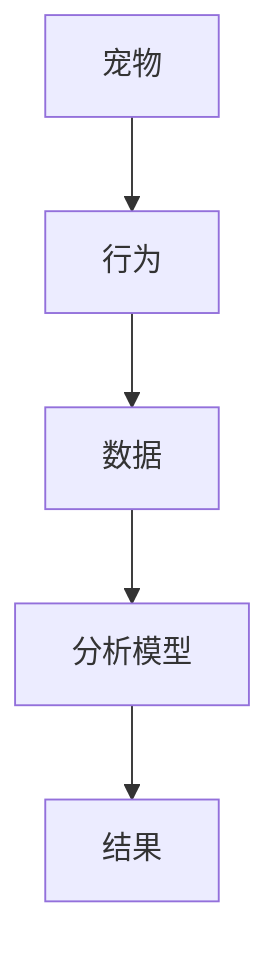
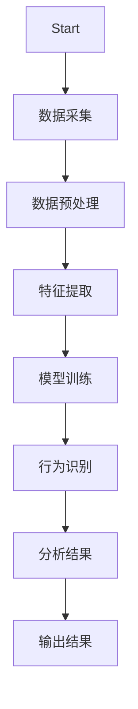
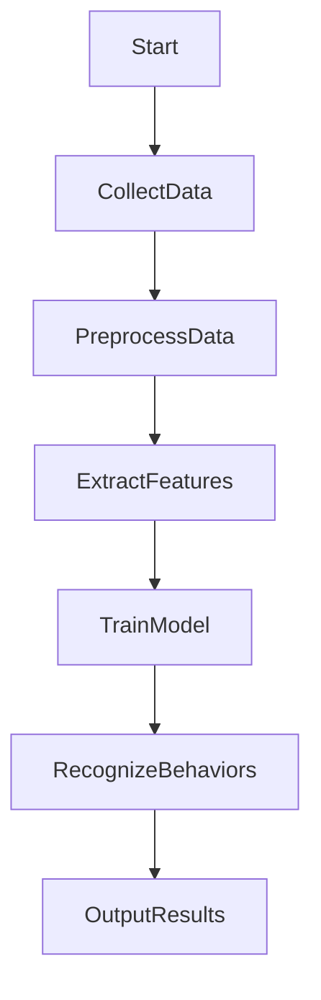
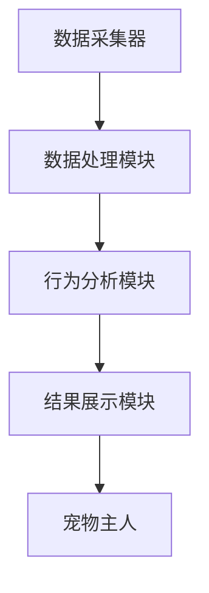

                 


# 智能宠物屋：AI Agent的宠物行为分析

## 关键词
智能宠物屋, AI Agent, 宠物行为分析, 机器学习, 智能算法

## 摘要
智能宠物屋是一种结合AI Agent技术与宠物行为分析的创新解决方案，旨在通过智能感知和分析宠物的行为数据，提供个性化的宠物健康管理服务。本文从背景介绍、核心概念、算法原理、系统架构设计到项目实战，详细阐述了AI Agent在宠物行为分析中的应用，帮助读者理解如何利用人工智能技术实现对宠物行为的智能监测和管理。

---

## 第一部分: 背景介绍

### 第1章: AI Agent的基本概念

#### 1.1 AI Agent的定义与特点
- **AI Agent的定义**  
  AI Agent（人工智能代理）是指能够感知环境、自主决策并执行任务的智能实体。它能够通过传感器获取信息，利用算法进行推理，并根据结果采取行动。
- **AI Agent的核心特点**  
  - **智能性**：能够理解和处理复杂信息。  
  - **自主性**：无需外部干预，自主完成任务。  
  - **反应性**：能够实时感知环境变化并做出反应。  
  - **目标驱动**：以特定目标为导向，优化行动策略。

#### 1.2 宠物行为分析的背景与意义
- **宠物行为分析的背景**  
  随着宠物数量的增加和宠物主人对宠物健康的关注，如何科学地分析宠物行为成为一个重要课题。通过分析宠物的行为数据，可以更好地理解宠物的需求，预防疾病，提升宠物的生活质量。
- **宠物行为分析的意义**  
  - **健康管理**：通过行为分析发现潜在健康问题。  
  - **行为矫正**：帮助宠物主人纠正宠物的不良行为。  
  - **科学研究**：为宠物行为研究提供数据支持。

### 第2章: AI Agent与宠物行为分析的结合
- **AI Agent在宠物行为分析中的作用**  
  AI Agent可以通过传感器实时采集宠物的行为数据（如运动轨迹、活动频率、姿势变化等），利用机器学习算法进行分析和预测，为宠物主人提供科学的建议。
- **宠物行为分析的边界与外延**  
  - **边界**：主要关注宠物的行为数据，不涉及宠物的情感或意图分析。  
  - **外延**：可以扩展到宠物健康管理、宠物行为预测等领域。

---

## 第二部分: 核心概念与原理

### 第3章: 核心概念原理

#### 3.1 AI Agent的核心原理
- **知识表示**  
  AI Agent通过构建知识库，将宠物行为数据转化为可理解的结构化信息。  
- **行为推理**  
  基于知识表示和逻辑推理，AI Agent能够推断出宠物行为的含义。  
- **目标驱动**  
  AI Agent以特定目标（如监测宠物健康）为导向，优化其行动策略。

#### 3.2 宠物行为分析的核心原理
- **数据采集与预处理**  
  通过摄像头、加速度传感器等设备采集宠物的行为数据，并进行清洗和标准化。  
- **行为识别算法**  
  使用机器学习算法（如随机森林、支持向量机）对宠物行为进行分类识别。  
- **行为理解与预测**  
  基于历史数据，预测宠物未来的行为模式，并提供相应的建议。

### 第4章: 实体关系图与流程图

#### 4.1 实体关系图（ER图）


#### 4.2 算法流程图


---

## 第三部分: 算法原理与实现

### 第5章: 算法原理

#### 5.1 算法流程


#### 5.2 核心算法代码实现
```python
import numpy as np
from sklearn.svm import SVC

# 数据预处理
def preprocess_data(data):
    # 标准化数据
    data_mean = np.mean(data, axis=0)
    data_std = np.std(data, axis=0)
    processed_data = (data - data_mean) / data_std
    return processed_data

# 特征提取
def extract_features(processed_data):
    # 提取主成分
    from sklearn.decomposition import PCA
    pca = PCA(n_components=2)
    features = pca.fit_transform(processed_data)
    return features

# 模型训练
def train_model(features, labels):
    model = SVC()
    model.fit(features, labels)
    return model

# 行为识别
def recognize_behavior(new_data, model):
    processed_new_data = preprocess_data(new_data)
    features = extract_features(processed_new_data)
    prediction = model.predict(features)
    return prediction

# 示例数据
data = np.random.rand(100, 10)
labels = np.random.randint(0, 4, 100)

# 训练模型
model = train_model(data, labels)

# 预测新数据
new_data = np.random.rand(1, 10)
result = recognize_behavior(new_data, model)
print(result)
```

#### 5.3 数学公式
- **数据标准化公式**  
  $$ x_{\text{normalized}} = \frac{x - \mu}{\sigma} $$  
  其中，$\mu$ 是均值，$\sigma$ 是标准差。  
- **PCA主成分计算公式**  
  $$ Y = X^T X $$  
  $$ \text{特征值} \lambda_i \text{和对应的特征向量} v_i \text{满足} Y v_i = \lambda_i v_i $$  
  $$ \text{主成分} = X v_i $$  

---

## 第四部分: 系统架构设计

### 第6章: 系统分析与架构设计方案

#### 6.1 问题场景介绍
- **问题描述**  
  宠物主人希望实时监测宠物的行为，并根据行为数据提供健康建议。  
- **目标**  
  构建一个智能宠物屋，实现对宠物行为的实时监测和智能分析。

#### 6.2 系统功能设计
- **数据采集模块**  
  负责采集宠物的行为数据（如运动轨迹、活动频率）。  
- **数据处理模块**  
  对采集到的数据进行清洗和标准化处理。  
- **行为分析模块**  
  使用机器学习算法对宠物行为进行分类和预测。  
- **结果反馈模块**  
  将分析结果反馈给宠物主人，提供相应的建议。

#### 6.3 系统架构设计


#### 6.4 接口设计与交互流程
- **接口设计**  
  - 数据采集器与传感器的接口。  
  - 数据处理模块与行为分析模块的接口。  
  - 结果展示模块与用户的交互界面。  
- **交互流程**  
  1. 数据采集器采集宠物行为数据。  
  2. 数据处理模块对数据进行预处理。  
  3. 行为分析模块对数据进行分类识别。  
  4. 结果展示模块将结果反馈给宠物主人。

---

## 第五部分: 项目实战

### 第7章: 项目实战

#### 7.1 环境安装与配置
- **安装Python环境**  
  使用Anaconda或virtualenv管理Python环境。  
- **安装依赖库**  
  ```bash
  pip install numpy scikit-learn mermaid4jupyter jupyterlab
  ```

#### 7.2 核心代码实现
```python
# 环境配置
import numpy as np
from sklearn.svm import SVC
from sklearn.decomposition import PCA
from sklearn.preprocessing import StandardScaler

# 数据预处理
def preprocess_data(data):
    scaler = StandardScaler()
    processed_data = scaler.fit_transform(data)
    return processed_data

# 特征提取
def extract_features(processed_data):
    pca = PCA(n_components=2)
    features = pca.fit_transform(processed_data)
    return features

# 模型训练
def train_model(features, labels):
    model = SVC()
    model.fit(features, labels)
    return model

# 行为识别
def recognize_behavior(new_data, model):
    processed_new_data = preprocess_data(new_data)
    features = extract_features(processed_new_data)
    prediction = model.predict(features)
    return prediction

# 示例数据
data = np.random.rand(100, 10)
labels = np.random.randint(0, 4, 100)

# 训练模型
model = train_model(data, labels)

# 预测新数据
new_data = np.random.rand(1, 10)
result = recognize_behavior(new_data, model)
print("预测结果:", result)
```

#### 7.3 实际案例分析
- **案例背景**  
  宠物主人希望了解宠物的活动模式，以优化宠物的运动量。  
- **数据采集**  
  使用摄像头采集宠物在24小时内的活动数据。  
- **数据处理与分析**  
  - 预处理数据，提取关键特征（如活动时间、静止时间）。  
  - 使用SVM模型进行行为分类，识别宠物的活动模式。  
- **结果展示**  
  根据分析结果，生成宠物活动报告，提供健康建议。

#### 7.4 项目小结
- **项目目标**  
  实现对宠物行为的实时监测和智能分析。  
- **项目成果**  
  开发了一个基于AI Agent的智能宠物屋系统，能够实时监测和分析宠物行为，为宠物主人提供科学的健康建议。

---

## 第六部分: 最佳实践与总结

### 第8章: 最佳实践与总结

#### 8.1 最佳实践
- **数据质量管理**  
  确保数据的准确性和完整性。  
- **模型优化**  
  使用交叉验证优化模型参数，提高分类准确率。  
- **系统可扩展性**  
  设计模块化的系统架构，方便后续功能的扩展。

#### 8.2 小结
AI Agent与宠物行为分析的结合，为宠物健康管理提供了新的可能性。通过实时监测和智能分析，宠物主人可以更好地了解宠物的需求，预防潜在的健康问题。

#### 8.3 注意事项
- **数据隐私**  
  注意保护宠物主人和宠物的隐私数据。  
- **系统稳定性**  
  确保系统的稳定运行，避免数据丢失或分析错误。  
- **用户体验**  
  提供友好的用户界面，方便宠物主人使用。

#### 8.4 拓展阅读
- **相关技术**  
  深度学习在宠物行为分析中的应用。  
- **未来发展**  
  研究宠物情感分析，进一步提升宠物行为分析的深度和广度。

---

## 作者：AI天才研究院/AI Genius Institute & 禅与计算机程序设计艺术 /Zen And The Art of Computer Programming

