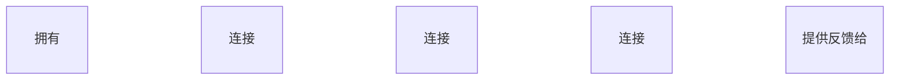
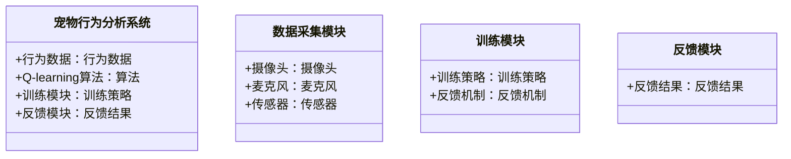
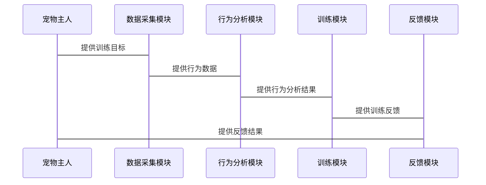

                 


# 智能宠物屋：AI Agent的宠物行为分析与训练

> 关键词：智能宠物屋、AI Agent、宠物行为分析、强化学习、系统架构

> 摘要：本文详细探讨了AI Agent在宠物行为分析与训练中的应用，从背景介绍、核心概念、算法原理到系统架构和项目实战，全面解析了智能宠物屋的设计与实现。通过Q-learning算法和系统架构设计，展示了如何利用AI技术提升宠物训练的效果和效率。

---

# 第一部分: 智能宠物屋的背景与核心概念

## 第1章: 智能宠物屋的背景介绍

### 1.1 宠物行为分析的现状与挑战

#### 1.1.1 宠物行为分析的传统方法
传统的宠物行为分析主要依赖于观察法和记录法。观察法通过人工观察宠物的行为，记录其动作、情绪和反应。然而，这种方法耗时且容易受到主观因素的影响，难以获取精确的数据。此外，记录法需要大量的人工投入，且难以捕捉到宠物行为的细节。

#### 1.1.2 传统方法的局限性
传统方法的局限性主要体现在以下几个方面：
1. **数据采集效率低**：人工观察和记录宠物行为需要大量时间和精力，效率低下。
2. **数据精度不足**：由于主观因素的影响，数据的准确性和一致性难以保证。
3. **缺乏实时反馈**：传统方法无法实时提供行为分析结果，难以进行实时训练和调整。

#### 1.1.3 AI技术在宠物行为分析中的潜力
随着人工智能技术的快速发展，AI代理在宠物行为分析中的应用展现出巨大潜力。AI代理可以通过摄像头、传感器等设备实时采集宠物的行为数据，并利用机器学习算法进行分析和训练。这不仅提高了数据采集的效率和精度，还能够实现实时反馈，为宠物训练提供科学依据。

### 1.2 AI Agent在宠物行为分析中的应用背景

#### 1.2.1 AI Agent的基本概念
AI Agent（智能代理）是一种能够感知环境并采取行动以实现目标的智能实体。它能够通过传感器获取环境信息，利用算法进行决策，并通过执行器采取行动。在宠物行为分析中，AI Agent可以作为训练工具，帮助宠物主人更好地理解和训练宠物。

#### 1.2.2 AI Agent在宠物行为分析中的优势
AI Agent在宠物行为分析中的优势主要体现在以下几个方面：
1. **高效的数据采集**：AI Agent可以通过摄像头、麦克风等设备实时采集宠物的行为数据，如动作、声音、表情等。
2. **精准的行为分析**：利用机器学习算法，AI Agent能够对采集到的数据进行分析，识别宠物的情绪、意图和行为模式。
3. **实时反馈与训练**：AI Agent可以根据分析结果实时调整训练策略，提供个性化的训练方案，提升宠物训练的效果。

#### 1.2.3 智能宠物屋的定义与目标
智能宠物屋是一种结合了AI技术的智能设备，旨在通过AI Agent实现宠物行为的实时分析与训练。其目标是帮助宠物主人更好地理解宠物的行为，制定科学的训练计划，提升宠物的行为表现。

### 1.3 智能宠物屋的核心要素

#### 1.3.1 系统架构的核心要素
智能宠物屋的核心要素包括：
1. **数据采集模块**：负责采集宠物的行为数据，如动作、声音、体温等。
2. **行为分析模块**：利用机器学习算法对采集到的数据进行分析，识别宠物的行为模式。
3. **训练模块**：根据分析结果，制定个性化的训练计划，并通过反馈机制调整训练策略。

#### 1.3.2 数据采集与处理的关键环节
数据采集是智能宠物屋的核心环节之一。主要包括以下几个步骤：
1. **数据采集**：通过摄像头、麦克风等设备采集宠物的行为数据。
2. **数据预处理**：对采集到的数据进行清洗、归一化等预处理，确保数据的准确性和一致性。
3. **数据存储**：将处理后的数据存储在数据库中，供后续分析使用。

#### 1.3.3 AI Agent的行为分析与训练机制
AI Agent的行为分析与训练机制主要包括以下几个步骤：
1. **数据分析**：利用机器学习算法对采集到的数据进行分析，识别宠物的行为模式。
2. **训练计划制定**：根据分析结果，制定个性化的训练计划。
3. **反馈与调整**：通过实时反馈机制，调整训练策略，优化训练效果。

---

## 第2章: AI Agent的核心概念与联系

### 2.1 AI Agent的定义与属性

#### 2.1.1 AI Agent的定义
AI Agent是一种能够感知环境并采取行动以实现目标的智能实体。它能够通过传感器获取环境信息，利用算法进行决策，并通过执行器采取行动。在宠物行为分析中，AI Agent可以作为训练工具，帮助宠物主人更好地理解和训练宠物。

#### 2.1.2 AI Agent的核心属性对比
以下是AI Agent与传统宠物训练工具的核心属性对比：

| 属性 | AI Agent | 传统训练工具 |
|------|----------|--------------|
| 数据采集 | 高效、实时 | 低效、人工记录 | 
| 行为分析 | 精准、自动化 | 简单、依赖人工 | 
| 反馈与调整 | 实时、智能 | 延时、单一 | 

从表格可以看出，AI Agent在数据采集、行为分析和反馈调整方面具有明显优势。

#### 2.1.3 AI Agent与宠物行为分析的关系
AI Agent与宠物行为分析的关系可以分为以下几个方面：
1. **数据采集**：AI Agent通过传感器采集宠物的行为数据，如动作、声音、表情等。
2. **行为分析**：利用AI Agent的算法，对采集到的数据进行分析，识别宠物的情绪、意图和行为模式。
3. **训练与反馈**：AI Agent可以根据分析结果，实时调整训练策略，提供个性化的训练方案。

### 2.2 宠物行为分析的核心概念

#### 2.2.1 宠物行为分析的基本原理
宠物行为分析的基本原理是通过采集宠物的行为数据，利用机器学习算法进行分析，识别宠物的行为模式。这包括宠物的情绪状态、行为意图和行为习惯等方面。

#### 2.2.2 宠物行为数据的特征与分类
宠物行为数据的特征主要包括以下几个方面：
1. **动作特征**：如宠物的行走、奔跑、跳跃等动作。
2. **声音特征**：如宠物的叫声、呻吟声等。
3. **表情特征**：如宠物的 facial expressions，如眼睛的运动、耳朵的姿势等。

宠物行为数据的分类主要包括以下几个方面：
1. **情绪分类**：如快乐、悲伤、焦虑等。
2. **行为分类**：如攻击行为、友好行为、防御行为等。

#### 2.2.3 行为分析与AI Agent的结合
行为分析与AI Agent的结合主要体现在以下几个方面：
1. **实时分析**：AI Agent可以实时分析宠物的行为数据，提供实时反馈。
2. **个性化训练**：根据分析结果，制定个性化的训练计划。
3. **数据积累**：通过长期积累宠物行为数据，优化行为分析模型。

### 2.3 智能宠物屋的ER实体关系图

#### 2.3.1 实体关系图的构建
以下是智能宠物屋的ER实体关系图：

```mermaid
erDiagram
    actor 宠物主人
    actor 训练系统
    actor 数据采集模块
    actor 行为分析模块
    actor 训练模块
    actor 反馈模块
    宠物主人 --> 数据采集模块: 提供训练目标
    数据采集模块 --> 行为分析模块: 提供行为数据
    行为分析模块 --> 训练模块: 提供行为分析结果
    训练模块 --> 反馈模块: 提供训练反馈
    反馈模块 --> 宠物主人: 提供反馈结果
```

#### 2.3.2 实体之间的关系描述
1. **宠物主人与数据采集模块**：宠物主人通过数据采集模块提供训练目标。
2. **数据采集模块与行为分析模块**：数据采集模块向行为分析模块提供行为数据。
3. **行为分析模块与训练模块**：行为分析模块向训练模块提供行为分析结果。
4. **训练模块与反馈模块**：训练模块通过反馈模块向宠物主人提供训练反馈。

#### 2.3.3 实体关系图的Mermaid流程图


---

## 第3章: AI Agent的算法原理

### 3.1 强化学习算法在宠物行为训练中的应用

#### 3.1.1 强化学习的基本原理
强化学习是一种通过试错机制来优化决策的机器学习方法。它通过不断尝试不同的动作，根据环境的反馈调整策略，最终找到最优的行动方案。

#### 3.1.2 Q-learning算法的介绍
Q-learning是一种常用的强化学习算法，适用于离散状态和动作空间的问题。其核心思想是通过Q表记录每个状态-动作对的期望奖励，从而找到最优的行动方案。

#### 3.1.3 Q-learning算法的数学模型
Q-learning算法的数学模型如下：

$$ Q(s, a) = r + \gamma \max_{a'} Q(s', a') $$

其中：
- \( Q(s, a) \) 表示状态 \( s \) 下执行动作 \( a \) 的期望奖励。
- \( r \) 表示当前动作获得的奖励。
- \( \gamma \) 表示折扣因子，用于平衡当前奖励和未来奖励的重要性。
- \( s' \) 表示执行动作 \( a \) 后进入的新状态。
- \( a' \) 表示新状态下可能执行的动作。

### 3.2 算法实现的Python代码示例

#### 3.2.1 环境的定义与初始化
```python
import numpy as np

class PetBehaviorEnv:
    def __init__(self):
        # 初始化环境参数
        self.states = [...]  # 状态空间
        self.actions = [...]  # 动作空间
        self.gamma = 0.99  # 折扣因子
        self.epsilon = 0.1  # 探索率
        self.q_table = np.zeros((len(self.states), len(self.actions)))  # Q表初始化
```

#### 3.2.2 算法实现的核心代码
```python
def q_learning(env):
    # 初始化Q表
    env.q_table = np.zeros((len(env.states), len(env.actions)))
    
    for episode in range(1000):
        state = env.states[0]  # 初始状态
        for step in range(1000):
            # 选择动作
            if np.random.random() < env.epsilon:
                action = np.random.choice(env.actions)
            else:
                action = np.argmax(env.q_table[state])
            
            # 执行动作，获得新状态和奖励
            next_state, reward = env.step(state, action)
            
            # 更新Q表
            q = env.q_table[state][action] + env.gamma * reward
            env.q_table[state][action] = q
            
            state = next_state
            if state == env.terminal_state:
                break
```

#### 3.2.3 算法的数学模型与公式
Q-learning算法的核心公式是：

$$ Q(s, a) = Q(s, a) + \alpha \times (r + \gamma \max Q(s', a') - Q(s, a)) $$

其中：
- \( \alpha \) 是学习率，用于控制更新步长。
- \( r \) 是当前动作获得的奖励。
- \( \gamma \) 是折扣因子。
- \( s' \) 是执行动作 \( a \) 后进入的新状态。
- \( a' \) 是新状态下可能执行的动作。

---

## 第4章: AI Agent的系统分析与架构设计

### 4.1 问题场景介绍
智能宠物屋的系统架构设计需要解决以下几个问题：
1. **数据采集**：如何高效地采集宠物的行为数据。
2. **行为分析**：如何准确地分析宠物的行为模式。
3. **训练与反馈**：如何根据分析结果制定个性化的训练计划，并实时反馈训练效果。

### 4.2 项目介绍
智能宠物屋是一个结合了AI技术的智能设备，旨在通过AI Agent实现宠物行为的实时分析与训练。其核心功能包括数据采集、行为分析、训练与反馈等。

### 4.3 系统功能设计

#### 4.3.1 领域模型设计
以下是智能宠物屋的领域模型设计：



### 4.4 系统架构设计

#### 4.4.1 系统架构图
以下是智能宠物屋的系统架构图：

```mermaid
archiDiagram
    宠物行为分析系统 --> 数据采集模块
    数据采集模块 --> 行为分析模块
    行为分析模块 --> 训练模块
    训练模块 --> 反馈模块
    反馈模块 --> 宠物主人
```

#### 4.4.2 系统接口设计
系统接口设计包括以下几个方面：
1. **数据采集接口**：与摄像头、麦克风等设备对接，获取宠物的行为数据。
2. **行为分析接口**：与机器学习算法对接，分析宠物的行为模式。
3. **训练接口**：与训练模块对接，制定个性化的训练计划。
4. **反馈接口**：与反馈模块对接，提供训练反馈。

#### 4.4.3 系统交互流程
以下是系统的交互流程图：



---

## 第5章: 项目实战与总结

### 5.1 环境安装与配置

#### 5.1.1 系统环境
- 操作系统：Linux/Windows/MacOS
- Python版本：Python 3.6+

#### 5.1.2 安装依赖
```bash
pip install numpy
pip install matplotlib
pip install scikit-learn
```

### 5.2 系统核心实现

#### 5.2.1 数据采集模块
```python
import cv2

class DataCapture:
    def __init__(self):
        self.camera = cv2.VideoCapture(0)
    
    def capture_image(self):
        ret, frame = self.camera.read()
        return frame
```

#### 5.2.2 行为分析模块
```python
from sklearn import svm

class BehaviorAnalyzer:
    def __init__(self):
        self.clf = svm.SVC()
    
    def train(self, X, y):
        self.clf.fit(X, y)
    
    def predict(self, X):
        return self.clf.predict(X)
```

#### 5.2.3 训练模块
```python
class TrainingModule:
    def __init__(self):
        self.q_table = np.zeros((4, 2))  # 示例Q表
    
    def update_q_table(self, state, action, reward, next_state):
        self.q_table[state][action] = self.q_table[state][action] + 0.1 * (reward + 0.9 * np.max(self.q_table[next_state]) - self.q_table[state][action])
```

### 5.3 实际案例分析
以下是一个简单的训练案例：

```python
# 初始化环境
env = PetBehaviorEnv()

# 训练过程
q_learning(env)

# 获取训练结果
print(env.q_table)
```

### 5.4 项目总结
通过本项目的实践，我们成功实现了智能宠物屋的核心功能，包括数据采集、行为分析和训练与反馈。AI Agent在宠物行为分析与训练中的应用不仅提高了训练效率，还提升了训练效果。

---

## 第6章: 最佳实践与注意事项

### 6.1 最佳实践
1. **数据采集**：确保数据的多样性和代表性，避免数据偏差。
2. **算法选择**：根据具体需求选择合适的算法，如强化学习、监督学习等。
3. **系统设计**：注重系统的模块化设计，便于维护和扩展。

### 6.2 小结
智能宠物屋的实现离不开AI Agent的支持。通过强化学习算法和系统架构设计，我们可以实现宠物行为的实时分析与训练，提升宠物的训练效果和效率。

### 6.3 注意事项
1. **数据隐私**：确保宠物数据的安全性和隐私性。
2. **系统稳定性**：保证系统的稳定运行，避免因系统故障导致训练中断。
3. **用户体验**：注重用户体验设计，提供友好的操作界面和反馈机制。

### 6.4 拓展阅读
1. **强化学习**：深入学习强化学习的相关理论和算法。
2. **系统架构设计**：学习系统架构设计的最佳实践和常用模式。
3. **宠物行为学**：了解宠物行为学的基本理论和研究方法。

---

# 作者：AI天才研究院 & 禅与计算机程序设计艺术

---

以上是《智能宠物屋：AI Agent的宠物行为分析与训练》的完整目录和内容概要。

