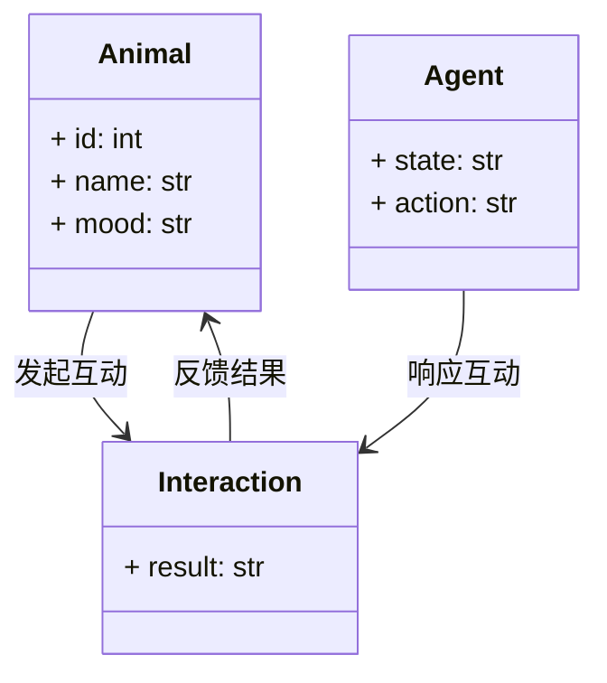
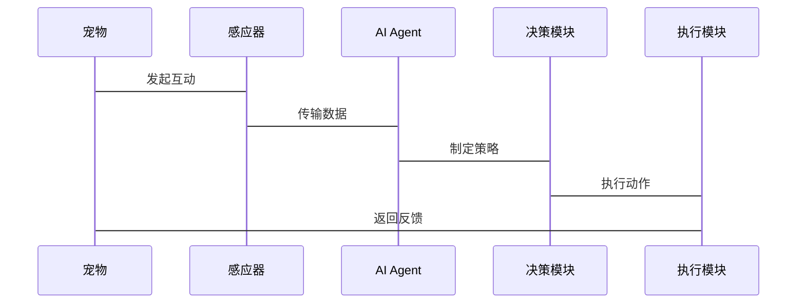

                 


# 智能宠物玩具：AI Agent的互动模式调整

> 关键词：智能宠物玩具，AI Agent，互动模式，强化学习，系统架构，项目实战

> 摘要：随着人工智能技术的快速发展，智能宠物玩具逐渐成为宠物主人和宠物互动的重要工具。本文探讨了AI Agent在智能宠物玩具中的应用，重点分析了AI Agent的互动模式调整方法，包括强化学习算法、系统架构设计、项目实战实现以及最佳实践等。通过本文的分析，读者可以全面了解AI Agent在智能宠物玩具中的核心原理和实际应用。

---

# 第1章: 智能宠物玩具的背景与现状

## 1.1 智能宠物玩具的背景

### 1.1.1 宠物玩具的发展历程

宠物玩具从最初的简单物理玩具，逐渐发展为结合电子技术的智能玩具。近年来，随着人工智能技术的迅速发展，智能宠物玩具开始融入AI Agent技术，实现了更加智能化和个性化的互动模式。

### 1.1.2 智能化趋势的兴起

智能化趋势的兴起源于宠物主人对更高质量互动体验的需求。传统宠物玩具缺乏反馈机制和个性化调整能力，而AI Agent的引入使得宠物玩具能够实时感知宠物行为、理解宠物情绪并做出相应的反馈，从而提升互动的趣味性和有效性。

### 1.1.3 AI Agent在宠物玩具中的应用前景

AI Agent（智能体）是一种能够感知环境、自主决策并执行动作的实体。在宠物玩具中的应用，AI Agent可以通过分析宠物的行为数据，动态调整互动模式，以满足宠物的兴趣和需求。

---

## 1.2 智能宠物玩具的核心问题

### 1.2.1 传统宠物玩具的局限性

传统宠物玩具存在以下局限性：
1. 缺乏互动性：宠物玩具通常只是单向的娱乐工具，无法与宠物进行有效互动。
2. 缺乏个性化：不同宠物的兴趣和行为习惯不同，传统玩具无法根据宠物的特点进行调整。
3. 缺乏反馈机制：无法根据宠物的反应动态调整互动策略。

### 1.2.2 AI Agent在互动中的作用

AI Agent通过感知、决策和执行三个环节，实现对宠物玩具互动模式的动态调整：
1. **感知**：通过传感器或摄像头感知宠物的行为和情绪。
2. **决策**：基于感知数据，利用算法计算出最佳互动策略。
3. **执行**：通过机械或电子设备执行互动动作。

### 1.2.3 互动模式调整的必要性

互动模式调整的必要性体现在以下方面：
1. 提高互动趣味性：根据宠物的兴趣和情绪调整互动方式，增强互动的趣味性。
2. 提高互动有效性：通过动态调整，确保宠物在互动中获得最大乐趣。
3. 适应不同宠物特点：不同宠物的行为习惯和兴趣爱好不同，互动模式需要灵活调整。

---

## 1.3 本章小结

本章介绍了智能宠物玩具的背景与发展历程，分析了传统宠物玩具的局限性，并提出了AI Agent在互动模式调整中的重要作用。通过本章的分析，读者可以理解AI Agent在智能宠物玩具中的应用价值和必要性。

---

# 第2章: AI Agent的基本原理

## 2.1 AI Agent的定义与特点

### 2.1.1 AI Agent的定义

AI Agent是一种能够感知环境、自主决策并执行动作的智能实体。在智能宠物玩具中，AI Agent通过传感器和算法实现与宠物的互动。

### 2.1.2 AI Agent的核心特点

1. **自主性**：AI Agent能够自主决策，无需人工干预。
2. **反应性**：能够实时感知环境并做出反应。
3. **学习能力**：通过强化学习等算法，不断优化互动策略。

### 2.1.3 AI Agent与传统宠物玩具的区别

| 特性 | AI Agent玩具 | 传统宠物玩具 |
|------|---------------|---------------|
| 感知能力 | 强 | 弱 |
| 决策能力 | 强 | 无 |
| 互动模式 | 动态调整 | 固定 |

---

## 2.2 AI Agent的感知、决策与执行

### 2.2.1 感知模块

感知模块是AI Agent与宠物互动的第一步，主要包括以下功能：
1. **数据采集**：通过传感器或摄像头采集宠物的行为数据，如宠物的活动频率、情绪变化等。
2. **数据处理**：对采集到的数据进行预处理和特征提取。

### 2.2.2 决策模块

决策模块基于感知模块提供的数据，通过算法计算出最佳的互动策略。常用的算法包括强化学习和基于规则的决策算法。

### 2.2.3 执行模块

执行模块根据决策模块的指令，通过机械或电子设备执行具体的互动动作，如转动玩具、发出声音等。

---

## 2.3 AI Agent的实体关系图

```mermaid
er
    Animal: 宠物
    Agent: AI Agent
    Interaction: 互动
    Animal --> Interaction: 发起互动
    Agent --> Interaction: 响应互动
    Interaction --> Animal: 反馈结果
```

---

## 2.4 本章小结

本章详细介绍了AI Agent的基本原理，包括感知、决策和执行三个模块，并通过实体关系图展示了AI Agent与宠物之间的互动关系。通过本章的分析，读者可以理解AI Agent在智能宠物玩具中的工作流程。

---

# 第3章: 强化学习在AI Agent中的应用

## 3.1 强化学习的基本原理

### 3.1.1 强化学习的定义

强化学习是一种通过试错方式学习策略的算法。宠物玩具中的AI Agent通过与宠物的互动，逐步优化互动策略，以获得最大的奖励。

### 3.1.2 奖励机制

奖励机制是强化学习的核心。当AI Agent做出正确的互动动作时，宠物会给予积极的反馈（如愉悦的情绪或互动行为），从而强化这种行为。

### 3.1.3 动作空间与状态空间

1. **动作空间**：AI Agent可以执行的互动动作，如“转动玩具”、“发出声音”等。
2. **状态空间**：宠物当前的行为状态，如“安静”、“兴奋”等。

---

## 3.2 Q-learning算法

### 3.2.1 算法流程

Q-learning算法的基本流程如下：
1. **初始化**：初始化Q值表，所有动作的初始Q值为0。
2. **感知**：获取当前状态s。
3. **选择动作**：根据当前状态s选择一个动作a。
4. **执行动作**：执行动作a，观察宠物的反应，获得奖励r和新的状态s'。
5. **更新Q值**：根据Q值更新公式更新Q(s,a)。

### 3.2.2 Q值更新公式

$$ Q(s,a) = Q(s,a) + \alpha (r + \gamma \max Q(s',a') - Q(s,a)) $$

其中：
- $\alpha$ 是学习率。
- $\gamma$ 是折扣因子。

---

## 3.3 实验验证

### 3.3.1 算法实现代码

```python
import numpy as np

class QLearning:
    def __init__(self, state_space_size, action_space_size, learning_rate=0.1, gamma=0.9):
        self.state_space_size = state_space_size
        self.action_space_size = action_space_size
        self.Q = np.zeros((state_space_size, action_space_size))
        self.alpha = learning_rate
        self.gamma = gamma

    def choose_action(self, state, epsilon=0.1):
        if np.random.random() < epsilon:
            return np.random.randint(self.action_space_size)
        else:
            return np.argmax(self.Q[state])

    def update_Q(self, state, action, reward, next_state):
        self.Q[state, action] = self.Q[state, action] + self.alpha * (reward + self.gamma * np.max(self.Q[next_state]) - self.Q[state, action])
```

---

## 3.4 本章小结

本章详细介绍了强化学习在AI Agent中的应用，重点讲解了Q-learning算法的基本原理和实现方法。通过本章的分析，读者可以理解AI Agent如何通过强化学习优化互动策略。

---

# 第4章: 系统分析与架构设计

## 4.1 问题场景介绍

本系统旨在设计一个智能宠物玩具，能够通过AI Agent与宠物进行互动。系统需要实现以下功能：
1. 实时感知宠物的行为和情绪。
2. 根据感知数据动态调整互动模式。
3. 通过机械或电子设备执行互动动作。

---

## 4.2 项目介绍

### 4.2.1 项目目标

本项目的目标是设计一个能够与宠物互动的智能玩具，通过AI Agent实现互动模式的动态调整。

### 4.2.2 项目范围

本项目主要针对家养宠物，支持的互动模式包括：
1. 转动玩具。
2. 发出声音。
3. 模拟宠物主人的互动。

---

## 4.3 系统功能设计

### 4.3.1 领域模型



---

## 4.4 系统架构设计

### 4.4.1 系统架构图

```mermaid
graph TD
    Agent --> Sensor: 获取状态
    Sensor --> Agent: 返回数据
    Agent --> Decision: 制定策略
    Decision --> Agent: 返回策略
    Agent --> Actuator: 执行动作
    Actuator --> Agent: 返回结果
```

---

## 4.5 系统接口设计

### 4.5.1 系统接口

1. **传感器接口**：用于采集宠物的行为数据。
2. **决策接口**：用于接收传感器数据并返回互动策略。
3. **执行接口**：用于执行互动动作。

---

## 4.6 系统交互流程图



---

## 4.7 本章小结

本章通过系统分析与架构设计，明确了智能宠物玩具的系统结构和功能模块。通过本章的分析，读者可以理解AI Agent在智能宠物玩具中的实现方式。

---

# 第5章: 项目实战

## 5.1 环境安装

### 5.1.1 安装Python

```bash
# 安装Python
sudo apt-get install python3
```

### 5.1.2 安装依赖库

```bash
# 安装numpy和scikit-learn
pip install numpy scikit-learn
```

---

## 5.2 系统核心实现

### 5.2.1 核心代码实现

```python
class PetToy:
    def __init__(self):
        self.agent = QLearning(state_space=5, action_space=3)
        self.sensor = Sensor()
        self.actuator = Actuator()

    def interact(self):
        state = self.sensor.get_state()
        action = self.agent.choose_action(state)
        reward, next_state = self.actuator.execute_action(action)
        self.agent.update_Q(state, action, reward, next_state)
```

---

## 5.3 代码应用解读与分析

### 5.3.1 代码功能解读

1. **PetToy类**：负责协调各个模块的工作。
2. **QLearning类**：实现强化学习算法。
3. **Sensor类**：实现传感器功能，采集宠物的状态。
4. **Actuator类**：实现执行器功能，执行互动动作。

---

## 5.4 实际案例分析

### 5.4.1 案例背景

假设有一只猫，喜欢与玩具互动。AI Agent需要通过强化学习算法，动态调整互动模式。

### 5.4.2 案例分析

1. **初始状态**：猫处于安静状态。
2. **选择动作**：AI Agent选择“转动玩具”动作。
3. **执行动作**：玩具开始转动。
4. **反馈结果**：猫表现出兴奋，给予正向反馈。
5. **更新策略**：AI Agent更新Q值表，强化“转动玩具”的动作。

---

## 5.5 本章小结

本章通过项目实战，详细讲解了智能宠物玩具的实现过程。通过本章的分析，读者可以掌握AI Agent在智能宠物玩具中的具体实现方法。

---

# 第6章: 最佳实践

## 6.1 实验小结

通过实验可以发现，强化学习算法能够有效提高互动的趣味性和有效性。AI Agent可以根据宠物的行为动态调整互动模式，从而提高宠物的互动体验。

---

## 6.2 最佳实践 tips

1. **数据采集**：确保传感器能够准确采集宠物的行为数据。
2. **模型调优**：根据实验结果，不断优化强化学习算法的参数。
3. **安全性**：确保玩具的安全性，避免对宠物造成伤害。
4. **伦理问题**：确保玩具的互动不会对宠物的心理健康造成负面影响。

---

## 6.3 本章小结

本章总结了实验结果，并提出了实际应用中的注意事项和优化建议。通过本章的分析，读者可以更好地理解AI Agent在智能宠物玩具中的实际应用。

---

# 作者

作者：AI天才研究院/AI Genius Institute & 禅与计算机程序设计艺术 /Zen And The Art of Computer Programming

---

通过本文的分析，读者可以全面了解AI Agent在智能宠物玩具中的核心原理和实际应用。本文从背景介绍、核心概念、算法原理、系统架构到项目实战，层层深入，帮助读者掌握AI Agent在智能宠物玩具中的实现方法。

