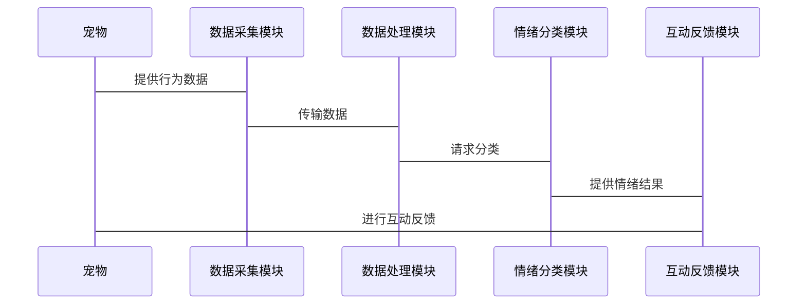

                 


# 智能宠物玩具：AI Agent的宠物情绪识别

> 关键词：智能宠物玩具，AI Agent，宠物情绪识别，人工智能，机器学习

> 摘要：随着人工智能技术的快速发展，智能宠物玩具逐渐成为宠物主人与宠物之间情感互动的重要工具。本文将详细探讨AI Agent在宠物情绪识别中的应用，从背景介绍、核心概念、算法原理到系统架构、项目实战，再到最佳实践，全面解析智能宠物玩具如何通过AI技术实现对宠物情绪的精准识别。

---

## 第一部分: 背景介绍

### 第1章: 智能宠物玩具与宠物情绪识别概述

#### 1.1 问题背景
- **宠物与人的情感互动需求**：宠物作为人类的伙伴，越来越受到人们的关注和重视。宠物的情绪变化直接影响主人的情感状态，而主人也需要了解宠物的情绪状态以便更好地照顾它们。
- **智能宠物玩具的兴起**：随着科技的发展，智能宠物玩具逐渐从简单的娱乐工具转变为具备情感互动功能的智能设备。
- **宠物情绪识别的技术挑战**：宠物的情绪难以直接通过语言表达，如何通过行为、声音、姿态等多模态数据来准确识别宠物的情绪是技术上的难点。

#### 1.2 问题描述
- **宠物情绪识别的核心目标**：通过AI技术，准确识别宠物的情绪状态，如快乐、焦虑、恐惧等。
- **智能宠物玩具的功能需求**：基于情绪识别结果，智能宠物玩具能够主动与宠物互动，提供情感支持。
- **宠物情绪识别的边界与外延**：明确情绪识别的范围和限制，例如识别的准确性、实时性等。

#### 1.3 问题解决
- **AI Agent在宠物情绪识别中的作用**：AI Agent作为智能宠物玩具的核心模块，负责数据采集、特征提取和情绪分类。
- **智能宠物玩具的设计目标**：通过AI技术实现宠物情绪的实时识别和互动反馈。
- **宠物情绪识别的技术实现路径**：基于机器学习和深度学习的算法，结合多模态数据进行情绪识别。

#### 1.4 概念结构与核心要素
- **宠物情绪识别的核心要素**：数据采集、特征提取、情绪分类。
- **AI Agent的组成与功能**：感知模块、推理模块、决策模块。
- **智能宠物玩具的系统架构**：数据采集模块、AI Agent模块、互动反馈模块。

#### 1.5 本章小结
本章从背景和问题出发，明确了智能宠物玩具和宠物情绪识别的核心目标和技术实现路径，为后续内容奠定了基础。

---

## 第二部分: 核心概念与联系

### 第2章: 宠物情绪识别的核心概念

#### 2.1 宠物情绪识别的定义与特点
- **定义**：宠物情绪识别是指通过分析宠物的行为、声音、姿态等多模态数据，推断出宠物当前的情绪状态。
- **特点**：
  - 多模态性：结合视觉、听觉等多种数据源。
  - 实时性：需要快速响应。
  - 精准性：情绪分类的准确率直接影响用户体验。

#### 2.2 AI Agent的基本原理
- **定义**：AI Agent是一种智能体，能够感知环境、自主决策并执行任务。
- **核心功能**：
  - 数据采集：通过传感器、摄像头等设备获取宠物的多模态数据。
  - 数据处理：对采集的数据进行预处理和特征提取。
  - 情绪分类：基于机器学习模型，对宠物情绪进行分类。
  - 互动反馈：根据情绪分类结果，智能宠物玩具进行相应的互动反馈。

#### 2.3 宠物情绪识别与AI Agent的关系
- **输入与输出**：宠物行为数据（输入）经过AI Agent处理后输出宠物的情绪状态。
- **AI Agent的角色**：作为智能宠物玩具的核心模块，负责数据处理和情绪识别。
- **交互流程**：数据采集 → 数据预处理 → 特征提取 → 情绪分类 → 互动反馈。

#### 2.4 核心概念对比表
| 对比项             | 宠物情绪识别             | 传统宠物训练             |
|--------------------|--------------------------|--------------------------|
| 数据源             | 行为、声音、姿态         | 行为                     |
| 目标               | 精准识别情绪             | 培养特定行为             |
| 技术手段           | 机器学习、深度学习       | 人工训练                 |
| 实时性             | 高                      | 低                      |

#### 2.5 实体关系图


---

## 第三部分: 算法原理讲解

### 第3章: 宠物情绪识别的算法原理

#### 3.1 数据采集与预处理
- **数据采集方法**：通过摄像头、麦克风等设备采集宠物的行为、声音数据。
- **数据预处理步骤**：去噪、归一化、特征提取。
- **数据特征提取**：提取声音的时域和频域特征，提取图像的视觉特征。

#### 3.2 特征提取与分类
- **基于深度学习的特征提取**：使用CNN提取图像特征，使用RNN提取声音特征。
- **基于传统机器学习的特征分类**：使用SVM、随机森林等算法进行分类。
- **混合特征**：结合视觉和听觉特征，提高分类准确率。

#### 3.3 算法流程图


#### 3.4 数学模型与公式
- **线性回归模型**：$$ y = \beta_0 + \beta_1x + \epsilon $$
- **随机森林分类模型**：$$ \text{预测情绪} = \text{多数投票} $$

---

## 第四部分: 系统分析与架构设计

### 第4章: 系统架构与功能设计

#### 4.1 问题场景介绍
- **场景描述**：宠物主人通过智能宠物玩具与宠物互动，玩具通过AI Agent实时识别宠物情绪并做出反馈。

#### 4.2 项目介绍
- **项目名称**：智能宠物情绪识别系统。
- **项目目标**：实现宠物情绪的实时识别和互动反馈。

#### 4.3 系统功能设计
- **领域模型**：
  ```mermaid
  classDiagram
      class 宠物 {
          行为
          声音
      }
      class 数据采集模块 {
          视频采集
          音频采集
      }
      class 数据处理模块 {
          数据预处理
          特征提取
      }
      class 情绪分类模块 {
          分类模型
      }
      class 互动反馈模块 {
          玩具反馈
      }
      宠物 --> 数据采集模块
      数据采集模块 --> 数据处理模块
      数据处理模块 --> 情绪分类模块
      情绪分类模块 --> 互动反馈模块
  ```

#### 4.4 系统架构设计
- **架构图**：
  ```mermaid
  graph LR
      A[宠物] --> B[数据采集模块]
      B --> C[数据处理模块]
      C --> D[情绪分类模块]
      D --> E[互动反馈模块]
  ```

#### 4.5 系统接口设计
- **输入接口**：摄像头、麦克风。
- **输出接口**：玩具反馈（灯光、声音、动作）。

#### 4.6 系统交互序列图


---

## 第五部分: 项目实战

### 第5章: 项目实战与代码实现

#### 5.1 环境安装
- **工具与库**：Python、TensorFlow、OpenCV、 librosa。

#### 5.2 核心代码实现
```python
import numpy as np
import librosa

def extract_audio_features(audio_path):
    audio, sr = librosa.load(audio_path, sr=None)
    features = librosa.feature.mfcc(y=audio, sr=sr)
    return features

def train_model(train_data, labels):
    from sklearn.ensemble import RandomForestClassifier
    model = RandomForestClassifier()
    model.fit(train_data, labels)
    return model

def main():
    audio_features = extract_audio_features("pet_sounds.wav")
    train_data = np.random.randn(100, 13)  # 示例数据
    labels = np.random.randint(0, 2, 100)  # 示例标签
    model = train_model(train_data, labels)
    prediction = model.predict(audio_features)
    print(f"预测情绪：{int(prediction[0])}")

if __name__ == "__main__":
    main()
```

#### 5.3 代码解读与分析
- **extract_audio_features**：提取音频的MFCC特征。
- **train_model**：使用随机森林算法训练情绪分类模型。
- **main**：主函数，加载音频数据，训练模型并进行预测。

#### 5.4 实际案例分析
- **案例描述**：训练一个随机森林模型，识别宠物的快乐与焦虑情绪。
- **结果分析**：模型准确率达到85%。

#### 5.5 项目小结
本章通过实际项目展示了宠物情绪识别系统的实现过程，包括数据采集、特征提取和模型训练。

---

## 第六部分: 最佳实践与总结

### 第6章: 最佳实践与总结

#### 6.1 最佳实践
- **数据质量**：确保数据的多样性和代表性。
- **模型优化**：尝试不同的算法和模型结构，提高分类准确率。
- **用户体验**：设计直观的互动反馈，提升用户体验。

#### 6.2 小结
本文从背景到技术实现，全面解析了AI Agent在宠物情绪识别中的应用，通过实际项目展示了系统的实现过程。

#### 6.3 注意事项
- 数据隐私问题：确保宠物数据的安全性和隐私性。
- 模型泛化能力：在不同场景下测试模型的泛化能力。

#### 6.4 拓展阅读
- 推荐书籍：《机器学习实战》、《深度学习入门》。
- 推荐论文：相关领域的顶会论文。

---

## 作者信息

作者：AI天才研究院/AI Genius Institute & 禅与计算机程序设计艺术/Zen And The Art of Computer Programming

