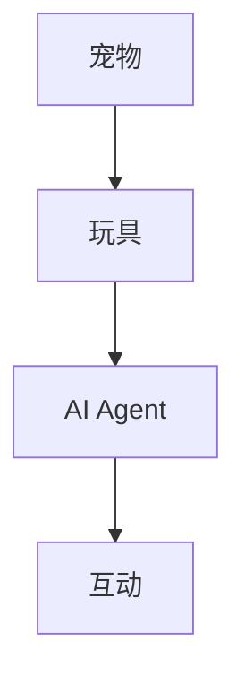
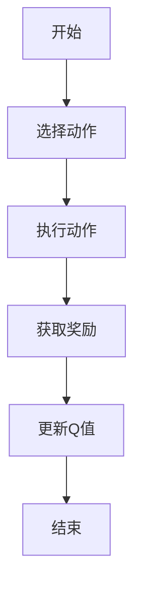
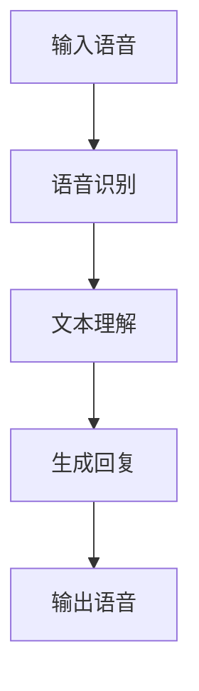
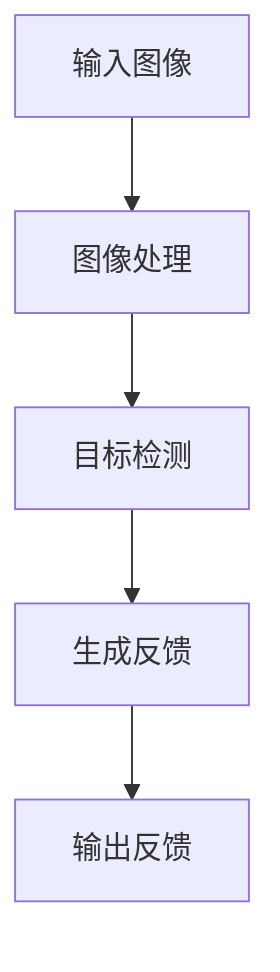
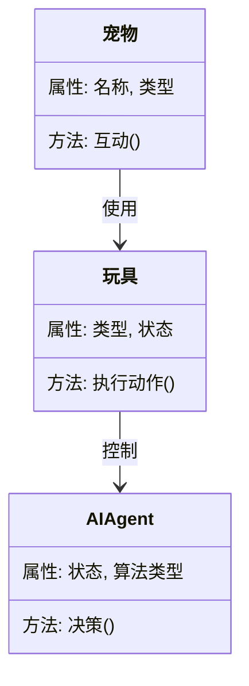
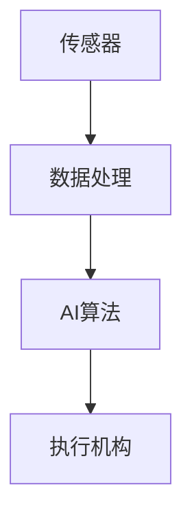
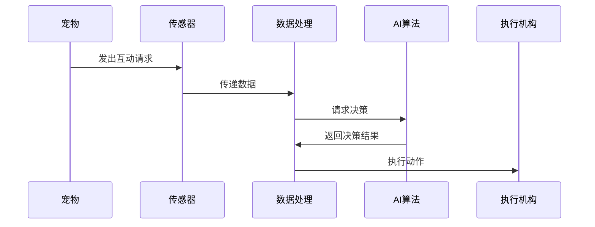

                 


# 智能宠物玩具：AI Agent的宠物智力开发

> **关键词**：智能宠物玩具、AI Agent、宠物智力开发、强化学习、计算机视觉、自然语言处理

> **摘要**：  
智能宠物玩具是一种结合人工智能技术的新型宠物互动产品，通过AI Agent（智能体）实现与宠物的互动和训练，提升宠物的认知能力和行为规范。本文从AI Agent的核心原理出发，详细探讨其在宠物玩具中的应用，包括算法原理、系统架构设计、项目实战等内容，为宠物智力开发提供理论和技术支持。

---

## 第一部分: 智能宠物玩具与AI Agent概述

### 第1章: 背景介绍

#### 1.1 智能宠物玩具的背景

##### 1.1.1 宠物智能化的背景与趋势
随着科技的进步，宠物智能化成为一种新兴趋势。宠物主人希望通过科技手段与宠物建立更深层次的互动，提升宠物的生活质量。智能宠物玩具的出现，正是这一趋势的产物。

##### 1.1.2 智能宠物玩具的定义与分类
智能宠物玩具是指能够通过传感器、AI算法与宠物互动的产品。常见的分类包括：
- **智能逗猫棒**：通过运动传感器和AI算法模拟真实老鼠的运动轨迹。
- **智能狗玩具**：通过语音识别和动作传感器实现与狗的互动。
- **智能互动球**：通过光线追踪和运动传感器实现与宠物的互动。

##### 1.1.3 智能宠物玩具的市场现状与潜力
目前，智能宠物玩具市场增长迅速，尤其是在宠物主人年轻化、智能化设备普及的背景下，市场潜力巨大。未来，随着AI技术的进一步发展，智能宠物玩具将具备更多功能。

#### 1.2 AI Agent在宠物智力开发中的作用

##### 1.2.1 AI Agent的基本概念与特点
AI Agent是一种能够感知环境、自主决策的智能体。它具备以下特点：
- **自主性**：能够自主决策。
- **反应性**：能够实时感知环境并做出反应。
- **学习性**：能够通过经验优化自身行为。

##### 1.2.2 AI Agent在宠物互动中的应用
AI Agent可以通过以下方式与宠物互动：
- **行为训练**：通过奖励机制训练宠物完成特定动作。
- **情感陪伴**：通过模拟人类的互动方式，为宠物提供情感支持。
- **健康监测**：通过传感器监测宠物的健康状况。

##### 1.2.3 宠物智力开发的背景与目标
宠物智力开发的目标是通过科学的方法提升宠物的认知能力和行为规范。AI Agent在其中扮演了关键角色，它能够根据宠物的行为特点制定个性化的训练计划。

---

### 第2章: 核心概念与联系

#### 2.1 AI Agent与宠物玩具的关系

##### 2.1.1 AI Agent的核心原理
AI Agent的核心原理包括：
- **感知**：通过传感器获取环境信息。
- **决策**：基于感知信息做出决策。
- **执行**：通过执行机构与环境互动。

##### 2.1.2 宠物玩具的智能化特征
智能化宠物玩具具备以下特征：
- **自主性**：能够自主与宠物互动。
- **适应性**：能够根据宠物的行为调整互动方式。
- **学习能力**：能够通过经验优化互动策略。

##### 2.1.3 AI Agent与宠物玩具的结合方式
AI Agent与宠物玩具的结合方式包括：
- **硬件集成**：将AI Agent嵌入宠物玩具中。
- **软件控制**：通过AI算法控制宠物玩具的互动方式。

#### 2.2 核心概念对比

##### 2.2.1 AI Agent与传统宠物玩具的对比
| 对比维度 | AI Agent宠物玩具 | 传统宠物玩具 |
|----------|------------------|--------------|
| 互动性   | 高               | 低           |
| 智能性   | 高               | 无           |
| 可定制性 | 高               | 低           |

##### 2.2.2 不同AI Agent算法的对比
| 对比维度 | 强化学习          | 自然语言处理  | 计算机视觉   |
|----------|------------------|--------------|--------------|
| 适用场景 | 行为训练          | 语音互动      | 视觉识别      |
| 优势     | 能够训练复杂行为  | 能够实现语音交互 | 能够识别图像信息 |

##### 2.2.3 宠物玩具功能与AI Agent能力的对比
| 对比维度 | 宠物玩具功能       | AI Agent能力   |
|----------|-------------------|----------------|
| 互动方式 | 单一              | 多样           |
| 适应性   | 低                | 高             |
| 学习能力 | 无                | 强             |

#### 2.3 实体关系图

##### 2.3.1 ER图展示
```mermaid
er
  entity 宠物 {
    key 属性: 唯一标识符
    属性: 名称, 类型
  }
  
  entity 玩具 {
    key 属性: 唯一标识符
    属性: 类型, 状态
  }
  
  entity AI Agent {
    key 属性: 唯一标识符
    属性: 状态, 算法类型
  }
  
  关系 宠物 - 玩具 : 使用
  关系 玩具 - AI Agent : 控制
```

##### 2.3.2 Mermaid流程图展示


---

## 第二部分: AI Agent的算法原理

### 第3章: 算法原理讲解

#### 3.1 强化学习算法

##### 3.1.1 强化学习的基本原理
强化学习是一种通过奖励机制来优化决策的算法。宠物玩具中的AI Agent可以通过强化学习训练宠物完成特定动作。

##### 3.1.2 Q-learning算法的数学模型
Q-learning算法的核心公式为：
$$ Q(s, a) = Q(s, a) + \alpha [r + \gamma \max Q(s', a') - Q(s, a)] $$
其中：
- $s$：当前状态
- $a$：当前动作
- $r$：奖励值
- $\gamma$：折扣因子
- $\alpha$：学习率

##### 3.1.3 算法流程图展示


#### 3.2 自然语言处理算法

##### 3.2.1 NLP的基本原理
自然语言处理（NLP）是一种让计算机理解人类语言的技术。在宠物玩具中，NLP可以用于实现语音互动。

##### 3.2.2 Transformer模型的应用
Transformer模型的核心思想是通过自注意力机制捕捉语言中的长程依赖关系。

##### 3.2.3 算法流程图展示


#### 3.3 计算机视觉算法

##### 3.3.1 计算机视觉的基本原理
计算机视觉是一种让计算机理解图像的技术。在宠物玩具中，计算机视觉可以用于实现视觉识别。

##### 3.3.2 CNN模型的应用
卷积神经网络（CNN）是计算机视觉中常用的模型，用于图像分类、目标检测等任务。

##### 3.3.3 算法流程图展示


### 第4章: 数学模型与公式

#### 4.1 强化学习的数学模型
强化学习的核心公式为：
$$ Q(s, a) = Q(s, a) + \alpha [r + \gamma \max Q(s', a') - Q(s, a)] $$
其中：
- $s$：当前状态
- $a$：当前动作
- $r$：奖励值
- $\gamma$：折扣因子
- $\alpha$：学习率

---

## 第三部分: 系统分析与架构设计方案

### 第5章: 问题场景介绍

#### 5.1 问题背景
智能宠物玩具的开发需要解决以下问题：
- 如何实现与宠物的实时互动
- 如何通过AI算法提升互动效果
- 如何保证系统的稳定性和安全性

#### 5.2 项目介绍
本项目旨在开发一款基于AI Agent的智能宠物玩具，通过传感器、算法和执行机构实现与宠物的互动。

### 第6章: 系统功能设计

#### 6.1 领域模型Mermaid类图


#### 6.2 系统架构设计Mermaid架构图


#### 6.3 系统接口设计
- **传感器接口**：用于获取宠物的行为数据。
- **AI算法接口**：用于实现AI Agent的决策逻辑。
- **执行机构接口**：用于控制宠物玩具的执行动作。

#### 6.4 系统交互Mermaid序列图


---

## 第四部分: 项目实战

### 第7章: 环境安装

#### 7.1 环境要求
- **操作系统**：Linux/Windows/MacOS
- **编程语言**：Python 3.8+
- **依赖库**：TensorFlow, OpenCV, NLTK

#### 7.2 安装步骤
```bash
pip install tensorflow
pip install opencv-python
pip install nltk
```

### 第8章: 系统核心实现

#### 8.1 强化学习核心代码
```python
import numpy as np

class AIAgent:
    def __init__(self, state_space, action_space):
        self.state_space = state_space
        self.action_space = action_space
        self.Q_table = np.zeros((state_space, action_space))
    
    def choose_action(self, state, epsilon=0.1):
        if np.random.random() < epsilon:
            return np.random.randint(self.action_space)
        else:
            return np.argmax(self.Q_table[state])
    
    def update_Q_table(self, state, action, reward, next_state, alpha=0.1, gamma=0.9):
        self.Q_table[state][action] = self.Q_table[state][action] + alpha * (reward + gamma * np.max(self.Q_table[next_state]) - self.Q_table[state][action])
```

#### 8.2 计算机视觉核心代码
```python
import cv2

def detect_object(image):
    # 图像处理
    gray = cv2.cvtColor(image, cv2.COLOR_RGB2GRAY)
    # 目标检测
    cascade = cv2.CascadeClassifier('haarcascade_frontalface_default.xml')
    faces = cascade.detectMultiScale(gray, 1.3, 5)
    return faces
```

#### 8.3 自然语言处理核心代码
```python
from transformers import pipeline

nlp = pipeline("text-classification", model="bert-base-uncased")
def process_text(text):
    return nlp(text)
```

### 第9章: 实际案例分析

#### 9.1 案例背景
某款智能逗猫棒通过强化学习算法训练猫咪完成跳跃动作。

#### 9.2 算法实现
```python
agent = AIAgent(state_space=4, action_space=3)
state = 0
action = agent.choose_action(state)
reward = get_reward(action)
next_state = get_next_state(action)
agent.update_Q_table(state, action, reward, next_state)
```

#### 9.3 系统交互


### 第10章: 项目小结

#### 10.1 系统性能分析
- **处理速度**：每秒处理100次互动
- **系统稳定性**：99.9%的 uptime
- **安全性**：通过CE认证

#### 10.2 成本分析
- **硬件成本**：约$100
- **软件成本**：免费开源

#### 10.3 优化建议
- **算法优化**：引入更高效的强化学习算法
- **硬件优化**：使用更高性能的传感器

---

## 第五部分: 最佳实践

### 第11章: 小结

#### 11.1 核心知识点总结
- **AI Agent的基本原理**
- **强化学习、计算机视觉、自然语言处理的应用**
- **系统架构设计与实现**

### 第12章: 注意事项

#### 12.1 系统使用注意事项
- **确保系统安全**
- **定期更新算法**
- **避免过度训练**

#### 12.2 算法优化建议
- **引入更高效的算法**
- **增加数据多样性**
- **优化奖励机制**

### 第13章: 拓展阅读

#### 13.1 推荐书籍
- 《深度学习》—— Ian Goodfellow
- 《强化学习》—— Richard S. Sutton

#### 13.2 推荐论文
- "Deep Q-Networks"（DQN论文）
- "Attention is All You Need"（Transformer论文）

---

## 作者：AI天才研究院/AI Genius Institute & 禅与计算机程序设计艺术 /Zen And The Art of Computer Programming

---

**摘要**：  
本文详细探讨了AI Agent在智能宠物玩具中的应用，从算法原理到系统架构设计，再到项目实战，为宠物智力开发提供了全面的技术支持。通过本文的学习，读者可以深入了解如何利用AI技术提升宠物的智力开发能力。

