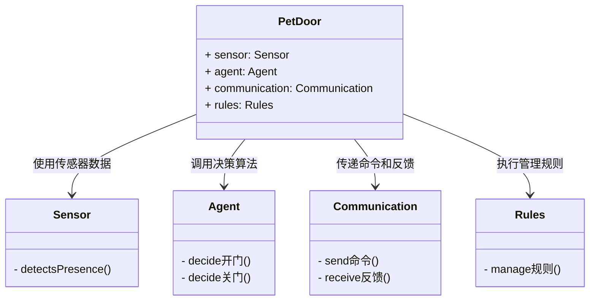
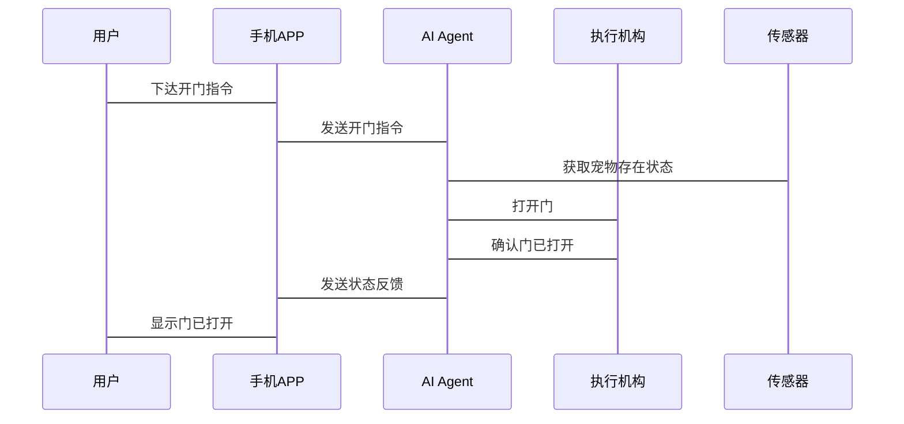

                 


# 智能宠物门：AI Agent的宠物出入管理

> 关键词：智能宠物门，AI Agent，物联网，宠物管理，智能家居

> 摘要：本文深入探讨了智能宠物门的设计与实现，结合AI Agent技术与物联网技术，详细讲解了智能宠物门的核心概念、算法原理、系统架构、项目实战等内容，帮助读者全面理解智能宠物门的技术实现与应用场景。

---

## 第1章: 智能宠物门的背景与概念

### 1.1 智能宠物门的背景介绍

#### 1.1.1 宠物出入管理的传统方式
在传统家庭中，宠物的出入管理通常依赖于手动操作。主人需要在宠物外出时手动开关门，或者设置固定时间让宠物自由进出。这种方式不仅不方便，还存在安全隐患，例如宠物可能在主人不在时意外逃脱或被外界入侵。

#### 1.1.2 传统宠物门的痛点与局限性
传统宠物门的主要问题包括：
- **手动操作**：主人需要手动开关门，增加了不便。
- **安全性差**：无法有效防止未经授权的人员进入。
- **缺乏智能化**：无法根据宠物的行为或环境变化自动调整门的状态。

#### 1.1.3 智能宠物门的出现与发展趋势
随着智能家居和物联网技术的普及，智能宠物门应运而生。它结合了AI Agent技术和物联网设备，能够实现宠物出入的智能化管理。智能宠物门的发展趋势包括：
- **自动化控制**：通过AI Agent实现自动开关门。
- **远程监控**：主人可以通过手机APP远程控制门的状态。
- **智能化管理**：基于宠物行为数据分析，优化宠物出入管理。

### 1.2 智能宠物门的核心概念

#### 1.2.1 智能宠物门的定义与组成
智能宠物门是一种结合了AI Agent和物联网技术的智能设备，用于管理宠物的出入。其主要组成部分包括：
- **传感器模块**：用于检测宠物的存在和环境变化。
- **AI Agent模块**：负责决策和控制门的开关。
- **通信模块**：实现与手机APP或其他智能设备的通信。
- **执行机构**：负责门的开闭动作。

#### 1.2.2 AI Agent在智能宠物门中的角色
AI Agent（智能代理）在智能宠物门中扮演着核心角色，负责：
- **数据采集**：接收传感器传来的数据，如宠物的存在、环境温度等。
- **决策判断**：基于数据和预设规则，判断是否打开或关闭门。
- **执行控制**：通过通信模块和执行机构，控制门的状态。

#### 1.2.3 智能宠物门的功能与应用场景
智能宠物门的主要功能包括：
- **自动开关门**：根据宠物的行为自动打开或关闭门。
- **远程控制**：主人可以通过手机APP远程控制门的状态。
- **智能化管理**：基于宠物的行为数据分析，优化出入管理。

其应用场景包括：
- **家庭宠物管理**：帮助主人更好地管理宠物的出入。
- **智能家居集成**：与其他智能家居设备协同工作，实现全屋智能化管理。
- **宠物寄养服务**：为宠物寄养提供智能化的出入管理解决方案。

---

## 第2章: 智能宠物门的核心概念与联系

### 2.1 AI Agent的核心原理

#### 2.1.1 AI Agent的定义与分类
AI Agent（智能代理）是一种能够感知环境、做出决策并采取行动的智能系统。根据功能和应用的不同，AI Agent可以分为：
- **简单反射型Agent**：基于简单的条件反射做出决策。
- **基于模型的反应式Agent**：基于环境模型和当前状态做出决策。
- **基于知识的Agent**：利用知识库和推理引擎进行复杂决策。

#### 2.1.2 AI Agent的基本架构
AI Agent的基本架构包括：
- **感知器**：用于感知环境信息。
- **推理器**：用于处理感知信息并做出决策。
- **执行器**：用于执行决策结果。

#### 2.1.3 AI Agent的决策机制
AI Agent的决策机制可以基于以下几种方式：
- **规则引擎**：通过预设的规则进行决策。
- **机器学习模型**：通过训练模型进行预测和决策。
- **混合式决策**：结合规则和机器学习模型进行决策。

### 2.2 智能宠物门的系统架构

#### 2.2.1 系统组成与功能模块
智能宠物门的系统架构包括以下模块：
- **传感器模块**：包括红外传感器、重量传感器等，用于检测宠物的存在和环境变化。
- **AI Agent模块**：负责数据处理、决策和控制。
- **通信模块**：包括Wi-Fi、蓝牙等通信接口，用于与手机APP或其他设备通信。
- **执行机构**：包括电机、舵机等，用于控制门的开闭。

#### 2.2.2 系统的输入输出接口
系统的输入接口包括：
- **传感器输入**：宠物的存在、环境温度等。
- **用户输入**：通过手机APP或按钮输入的控制指令。

系统的输出接口包括：
- **门的开闭状态**：通过执行机构控制门的开闭。
- **反馈信息**：通过通信模块向手机APP发送状态反馈。

#### 2.2.3 系统的通信协议与数据流
系统采用MQTT协议进行通信，数据流如下：
1. 传感器检测到宠物的存在，发送信号到AI Agent模块。
2. AI Agent模块处理数据，做出决策。
3. AI Agent模块通过通信模块向手机APP发送状态反馈。
4. 用户通过手机APP发送控制指令到AI Agent模块。
5. AI Agent模块控制执行机构，调整门的状态。

### 2.3 核心概念对比表

| 比较项        | AI Agent                 | 传统自动门                 |
|---------------|--------------------------|-----------------------------|
| 功能          | 自动开关门、远程控制     | 自动开关门                 |
| 决策方式      | 基于AI算法               | 基于固定规则               |
| 适用场景      | 宠物出入管理、智能家居     | 工厂、仓库等                 |
| 连接方式      | 支持物联网连接           | 仅支持本地控制             |

### 2.4 ER实体关系图

```mermaid
er
  actor: 用户
  agent: AI Agent
  door: 智能宠物门
  sensor: 传感器
  communication: 通信模块
  rules: 管理规则
  actor --> agent: 下达指令
  agent --> door: 控制门的开闭
  sensor --> agent: 提供环境数据
  communication --> agent: 传递数据
  rules --> agent: 执行管理规则
```

---

## 第3章: AI Agent的算法原理

### 3.1 AI Agent的决策算法

#### 3.1.1 基于规则的决策算法
基于规则的决策算法是一种简单但有效的决策方式，适用于规则明确的场景。例如，当检测到宠物的存在时，门自动打开。

**规则示例**：
- 如果传感器检测到宠物存在，则门打开。
- 如果门打开时间超过预设时间，则门自动关闭。

#### 3.1.2 基于机器学习的决策算法
基于机器学习的决策算法能够根据历史数据进行学习，优化决策策略。例如，可以训练一个分类模型，根据宠物的行为数据判断是否需要开门。

**算法流程**：
1. 收集宠物的行为数据，包括时间、位置、传感器数据等。
2. 对数据进行预处理，提取特征。
3. 训练一个分类模型（如决策树、随机森林）。
4. 使用模型进行预测，判断是否需要开门。

#### 3.1.3 基于混合式的决策算法
混合式决策算法结合了规则和机器学习的优势，能够处理复杂场景。例如，当检测到宠物存在时，首先基于规则判断是否开门，然后再通过机器学习模型进行优化。

---

### 3.2 AI Agent的数学模型与公式

#### 3.2.1 分类函数
分类函数用于将输入数据映射到不同的类别。常用的分类函数包括：
- **线性分类函数**：$f(x) = w \cdot x + b$
- **非线性分类函数**：$f(x) = \sigma(w \cdot x + b)$，其中$\sigma$是sigmoid函数。

#### 3.2.2 损失函数
损失函数用于衡量模型预测值与真实值之间的差异。常用的损失函数包括：
- **均方误差（MSE）**：$$L = \frac{1}{n}\sum_{i=1}^{n}(y_i - \hat{y}_i)^2$$
- **交叉熵损失**：$$L = -\frac{1}{n}\sum_{i=1}^{n} y_i \log(\hat{y}_i) + (1 - y_i)\log(1 - \hat{y}_i)$$

---

## 第4章: 智能宠物门的系统分析与架构设计

### 4.1 系统分析

#### 4.1.1 问题场景介绍
宠物出入管理的核心问题包括：
- **安全性**：防止未经授权的人员进入。
- **智能化**：根据宠物行为自动调整门的状态。
- **远程控制**：主人可以通过手机APP远程管理门的状态。

#### 4.1.2 项目介绍
本项目旨在设计并实现一个智能宠物门系统，结合AI Agent技术和物联网技术，实现宠物出入的智能化管理。

---

### 4.2 系统功能设计

#### 4.2.1 领域模型


#### 4.2.2 系统架构设计


#### 4.2.3 系统接口设计
- **传感器接口**：提供宠物存在状态的信号。
- **通信接口**：支持Wi-Fi或蓝牙通信，与手机APP交互。
- **执行机构接口**：控制门的开闭状态。

#### 4.2.4 系统交互流程


---

## 第5章: 项目实战

### 5.1 环境安装

#### 5.1.1 硬件安装
- **传感器**：安装在门附近，用于检测宠物的存在。
- **执行机构**：安装在门上，用于控制门的开闭。
- **通信模块**：安装在设备上，支持Wi-Fi或蓝牙通信。

#### 5.1.2 软件安装
- **AI Agent模块**：安装在本地服务器或云端，运行决策算法。
- **手机APP**：安装在用户手机上，用于远程控制和状态监控。

### 5.2 系统核心实现

#### 5.2.1 核心代码实现
```python
import serial
import time

# 初始化传感器
sensor = Sensor()
# 初始化AI Agent
agent = Agent()
# 初始化通信模块
communication = Communication()
# 初始化执行机构
actuator = Actuator()

while True:
    # 检测宠物存在
    presence = sensor.detect()
    # 调用决策算法
    decision = agent.decide(presence)
    # 执行决策
    if decision == 'open':
        actuator.open()
    elif decision == 'close':
        actuator.close()
    # 传递状态反馈
    communication.send_feedback('门已打开')
    time.sleep(1)
```

#### 5.2.2 代码解读
- **传感器检测**：通过传感器检测宠物的存在状态。
- **AI Agent决策**：根据传感器数据和预设规则，做出开门或关门的决策。
- **执行机构控制**：根据决策结果，控制门的开闭状态。
- **通信反馈**：通过通信模块向手机APP发送状态反馈。

### 5.3 实际案例分析

#### 5.3.1 案例背景
某用户希望实现智能宠物门，管理自家宠物的出入。用户的需求包括：
- **自动开关门**：宠物在家时自动开门，宠物外出后自动关门。
- **远程监控**：用户可以通过手机APP查看门的状态。
- **安全防护**：防止未经授权的人员进入。

#### 5.3.2 实施过程
1. **硬件安装**：安装传感器、执行机构和通信模块。
2. **软件开发**：开发AI Agent模块和手机APP。
3. **系统集成**：将硬件和软件集成，实现智能化管理。
4. **测试优化**：通过测试优化算法和系统性能。

#### 5.3.3 实施结果
- **自动开关门**：宠物在家时自动开门，宠物外出后自动关门。
- **远程监控**：用户可以通过手机APP实时查看门的状态。
- **安全防护**：通过AI Agent算法，有效防止未经授权的人员进入。

---

## 第6章: 最佳实践与小结

### 6.1 最佳实践

#### 6.1.1 系统维护
- 定期检查传感器和执行机构，确保设备正常运行。
- 更新AI Agent算法，优化决策性能。

#### 6.1.2 安全注意事项
- 设置强密码，防止未经授权的人员入侵系统。
- 定期更新系统软件，修复潜在的安全漏洞。

#### 6.1.3 用户体验优化
- 提供友好的用户界面，方便用户操作。
- 提供详细的使用手册，帮助用户更好地使用系统。

### 6.2 小结
智能宠物门结合了AI Agent技术和物联网技术，能够实现宠物出入的智能化管理。通过本文的详细讲解，读者可以全面理解智能宠物门的设计与实现过程。未来，随着AI技术的不断发展，智能宠物门的功能将更加智能化和多样化。

### 6.3 注意事项
- 在安装和使用智能宠物门时，需注意系统的安全性，防止未经授权的人员入侵。
- 定期维护系统，确保设备的正常运行。

### 6.4 拓展阅读
- **智能家居**：了解智能家居的概念和应用场景。
- **AI Agent**：深入学习AI Agent的原理和应用。
- **物联网技术**：掌握物联网技术的核心原理和实现方法。

---

## 作者：AI天才研究院/AI Genius Institute & 禅与计算机程序设计艺术 /Zen And The Art of Computer Programming

