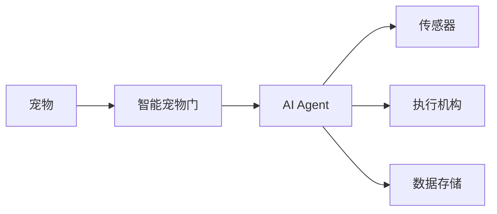
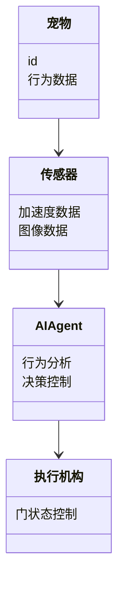
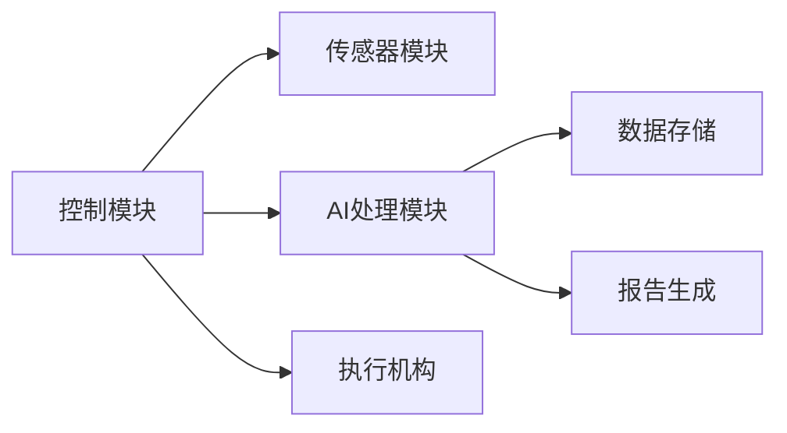
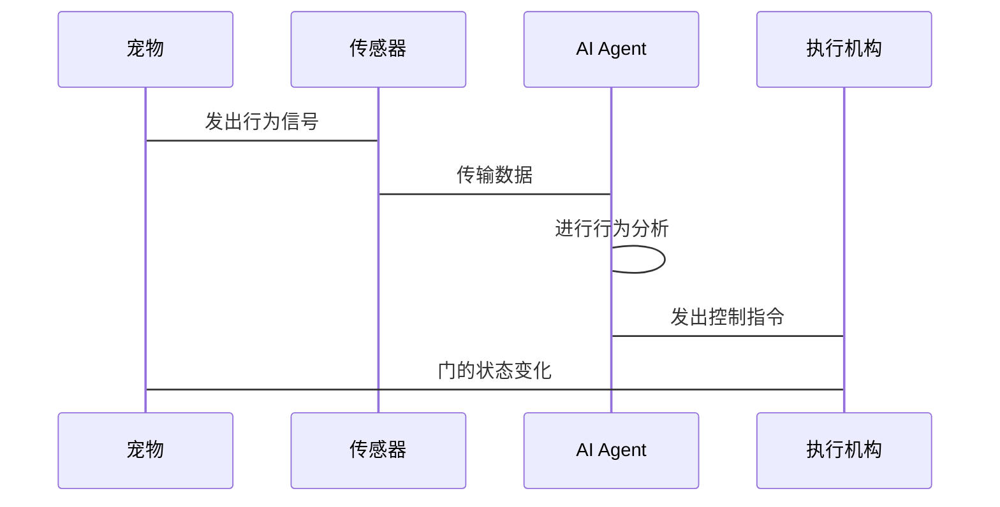

                 


# 智能宠物门：AI Agent的宠物出入行为分析

## 关键词：智能宠物门，AI Agent，宠物行为分析，机器学习，智能系统

## 摘要：本文深入探讨了智能宠物门的设计与实现，结合AI Agent技术，分析宠物出入行为，提供智能化解决方案。文章从背景分析、核心概念、算法原理、系统架构到项目实战，全面解析智能宠物门的技术细节与应用场景。

---

## 目录大纲

### 第一部分：智能宠物门的背景与概述

#### 第1章：智能宠物门的背景与问题分析

##### 1.1 问题背景
- 1.1.1 宠物出入管理的传统方式与局限性
  - 传统宠物门的机械结构与钥匙操作
  - 手动管理宠物出入的繁琐性与低效性
  - 传统方式在宠物行为分析中的不足
- 1.1.2 智能化宠物管理的需求驱动
  - 宠物主人对智能化管理的期待
  - 智能家居的发展趋势与宠物管理的结合
- 1.1.3 智能宠物门的市场现状与发展趋势
  - 智能宠物门的市场渗透率与用户需求
  - 技术进步推动智能宠物门的普及

##### 1.2 问题描述
- 1.2.1 宠物出入行为的复杂性
  - 不同宠物的行为差异
  - 宠物情绪与行为对出入管理的影响
- 1.2.2 智能宠物门的功能需求
  - 自动识别宠物身份
  - 实时监控宠物出入行为
  - 智能决策宠物出入权限
- 1.2.3 用户痛点与需求分析
  - 用户对宠物出入管理的便捷性需求
  - 对宠物行为的理解与干预的需求
  - 宠物安全与主人安心的双重需求

##### 1.3 问题解决思路
- 1.3.1 AI Agent在宠物出入管理中的应用
  - AI Agent的核心功能与优势
  - AI Agent如何实现宠物行为分析
- 1.3.2 智能宠物门的设计目标与核心功能
  - 自动识别与身份验证
  - 智能行为分析与决策
  - 实时监控与数据记录
- 1.3.3 解决方案的技术路线与实现路径
  - 结合AI算法与智能硬件的技术方案
  - 系统模块化设计与功能实现

##### 1.4 边界与外延
- 1.4.1 智能宠物门的适用场景与限制
  - 宠物种类的适用性
  - 环境条件的限制
  - 系统兼容性与扩展性
- 1.4.2 与其他智能家居设备的协同
  - 智能宠物门与家庭物联网的整合
  - 多设备协同工作的重要性
- 1.4.3 系统的可扩展性与兼容性
  - 系统升级与功能扩展
  - 跨平台与多设备支持

##### 1.5 概念结构与核心要素
- 1.5.1 智能宠物门的核心功能模块
  - 传感器模块：用于感知宠物行为
  - AI处理模块：用于分析与决策
  - 执行机构：用于门的开关控制
- 1.5.2 AI Agent的行为分析模型
  - 数据采集与预处理
  - 行为特征提取与分类
  - 行为模式识别与预测
- 1.5.3 系统的输入输出关系与数据流
  - 系统输入：宠物行为数据、环境数据
  - 系统输出：门的控制指令、行为分析结果
  - 数据流：从传感器到AI处理模块再到执行机构

---

### 第二部分：AI Agent的核心概念与原理

#### 第2章：AI Agent的基本原理

##### 2.1 AI Agent的定义与分类
- 2.1.1 定义
  - AI Agent的定义与基本特征
  - 智能代理在宠物行为分析中的应用
- 2.1.2 分类
  - 基于智能水平的分类
  - 基于应用场景的分类
  - 基于数据处理能力的分类

##### 2.2 AI Agent的核心概念与属性特征
- 2.2.1 核心概念对比
  | 概念                | 描述                                                                 |
  |---------------------|----------------------------------------------------------------------|
  | 行为识别            | 通过传感器数据识别宠物的具体行为（如坐、卧、跑等）                         |
  | 行为分析            | 对宠物行为的模式、频率、偏好等进行统计与分析                               |
  | 智能决策            | 基于行为分析结果，决策是否允许宠物出入                                      |
- 2.2.2 属性特征对比
  | 属性                | 特征                                                                 |
  |---------------------|----------------------------------------------------------------------|
  | 数据处理能力        | 支持多模态数据（如图像、声音、动作）                                        |
  | 行为识别精度        | 高精度识别宠物行为（>95%识别率）                                            |
  | 实时性               | 实时处理宠物行为数据，响应时间<1秒                                          |

##### 2.3 AI Agent的行为分析模型
- 2.3.1 模型结构
  - 数据采集与预处理
    - 多模态数据融合：图像、声音、动作数据的采集与预处理
  - 特征提取与分类
    - 使用卷积神经网络（CNN）提取视觉特征
    - 使用循环神经网络（RNN）处理时序行为数据
  - 行为模式识别与预测
    - 基于随机森林或支持向量机（SVM）进行分类
    - 使用长短期记忆网络（LSTM）进行行为序列预测
- 2.3.2 模型训练与优化
  - 数据集构建与标注
  - 模型训练与调参
  - 模型评估与优化
    - 准确率、召回率、F1分数的计算与优化

##### 2.4 实体关系与架构


---

#### 第3章：算法原理与实现

##### 3.1 算法原理
- 3.1.1 数据流与处理流程
  ```mermaid
  graph TD
      S[传感器数据] --> P[预处理]
      P --> F[特征提取]
      F --> M[模型预测]
      M --> D[决策结果]
  ```

##### 3.2 算法实现
- 3.2.1 代码实现
  ```python
  import numpy as np
  from sklearn.svm import SVC
  from sklearn.metrics import accuracy_score

  # 示例数据：行为特征向量
  X = np.array([[1, 2, 3], [4, 5, 6], [7, 8, 9]])
  y = np.array([0, 1, 0])  # 0代表禁止，1代表允许

  # 训练SVM模型
  model = SVC()
  model.fit(X, y)

  # 测试数据
  X_test = np.array([[10, 11, 12]])
  y_pred = model.predict(X_test)
  print("预测结果:", y_pred)
  print("准确率:", accuracy_score([1], y_pred))
  ```

##### 3.3 数学模型与公式
- 3.3.1 概率模型
  $$ P(y|x) = \frac{P(x|y)P(y)}{P(x)} $$
- 3.3.2 决策树模型
  - 使用ID3或C4.5算法构建决策树
  - 决策树节点分裂条件：信息增益最大化
- 3.3.3 支持向量机模型
  $$ \text{最大化} \quad \frac{1}{||w||} $$
  $$ \text{约束} \quad y_i(w \cdot x_i + b) \geq 1 $$

##### 3.4 算法优化与调参
- 3.4.1 参数优化
  - SVM的C和gamma参数调整
  - 决策树的剪枝参数调整
- 3.4.2 优化策略
  - 使用网格搜索（Grid Search）进行参数优化
  - 交叉验证评估模型性能

---

#### 第4章：系统分析与架构设计方案

##### 4.1 系统分析
- 4.1.1 问题场景
  - 宠物出入行为的实时监控与分析
  - 多设备协同工作
  - 系统的可扩展性与维护性

##### 4.2 系统功能设计
- 4.2.1 领域模型


##### 4.3 系统架构设计
- 4.3.1 架构图


##### 4.4 接口与交互设计
- 4.4.1 系统接口
  - 传感器接口：UART/I2C/蓝牙/WiFi
  - AI处理模块接口：API接口
  - 执行机构接口：GPIO控制
- 4.4.2 交互序列图


---

#### 第5章：项目实战

##### 5.1 环境安装
- 5.1.1 安装Python环境
  - 安装Python 3.8以上版本
  - 安装必要的库：numpy, scikit-learn, matplotlib
- 5.1.2 安装硬件设备
  - 传感器：Raspberry Pi + MPU6050
  - AI处理模块：Raspberry Pi或树莓派
  - 执行机构：电动门锁

##### 5.2 系统核心实现
- 5.2.1 数据采集与预处理
  ```python
  import numpy as np
  import pandas as pd

  # 示例数据采集
  data = pd.read_csv('pet_behavior.csv')
  # 数据预处理
  data = data.dropna().astype(int)
  ```

- 5.2.2 行为分析与决策
  ```python
  from sklearn.svm import SVC
  model = SVC()
  model.fit(data.drop('label', axis=1), data['label'])
  ```

- 5.2.3 门的控制逻辑
  ```python
  import RPi.GPIO as GPIO

  # 示例代码：控制门的开闭
  GPIO.setmode(GPIO.BCM)
  GPIO.setup(17, GPIO.OUT)
  GPIO.output(17, GPIO.HIGH)  # 开门
  ```

##### 5.3 代码应用与分析
- 5.3.1 代码解读
  - 数据采集与预处理的逻辑
  - AI模型的训练与预测
  - 门的控制逻辑
- 5.3.2 案例分析
  - 模型在实际场景中的表现
  - 系统的鲁棒性与适应性

##### 5.4 项目小结
- 5.4.1 系统实现的关键点
  - 数据采集的准确性与实时性
  - AI模型的训练与优化
  - 硬件与软件的协同工作
- 5.4.2 系统实现的价值
  - 提高宠物管理的智能化水平
  - 增强宠物主人的使用体验
  - 为智能家居的进一步发展提供参考

---

### 第三部分：系统优化与未来展望

#### 第6章：最佳实践与未来展望

##### 6.1 最佳实践
- 6.1.1 小结
  - 项目实现的关键点总结
  - 系统设计的优缺点
- 6.1.2 注意事项
  - 数据隐私与安全
  - 系统维护与更新
  - 硬件设备的兼容性
- 6.1.3 拓展阅读
  - AI在宠物行为分析中的其他应用
  - 智能家居的最新发展
  - 机器学习在动物行为学中的应用

##### 6.2 未来展望
- 6.2.1 技术进步对智能宠物门的影响
  - 更高精度的传感器与AI算法
  - 更强大的计算能力与边缘计算
- 6.2.2 宠物行为分析的未来方向
  - 多模态数据的深度融合
  - 实时行为预测与干预
  - 智能宠物门的个性化定制

---

### 作者：AI天才研究院/AI Genius Institute & 禅与计算机程序设计艺术 /Zen And The Art of Computer Programming

