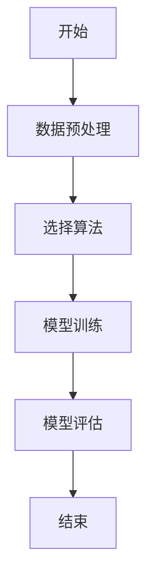
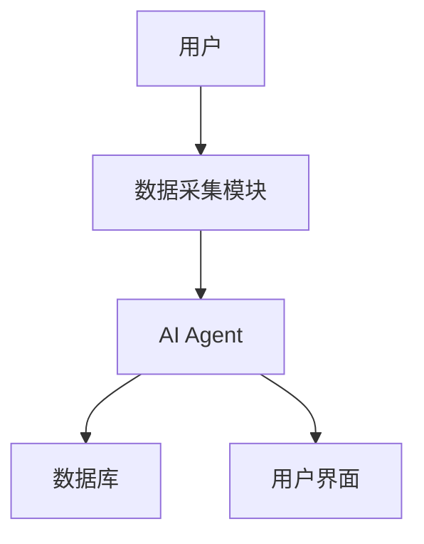

                 


# 智能宠物门：AI Agent的宠物行为分析与管理

> 关键词：智能宠物门、AI Agent、宠物行为分析、人工智能、系统架构设计

> 摘要：本文详细探讨了智能宠物门的设计与实现，结合AI Agent技术，分析宠物行为并提供智能化的管理方案。文章从背景、原理、算法、架构到项目实战，全面解析了系统的构建过程，最后总结了最佳实践和未来发展方向。

---

## 第一部分: 智能宠物门与AI Agent概述

### 第1章: 智能宠物门的背景与概念

#### 1.1 问题背景与描述
智能宠物门是一种结合人工智能和物联网技术的创新产品，旨在通过AI Agent（智能代理）分析和管理宠物的行为，解决传统宠物管理中的痛点。随着宠物数量的增加和人们对宠物智能化管理需求的提升，智能宠物门应运而生。

#### 1.2 问题解决与边界
传统的宠物管理依赖于主人的主观判断，存在管理不系统、数据不准确等问题。智能宠物门通过AI Agent实时监测宠物的行为，提供智能化的管理解决方案。系统的边界包括数据采集、行为分析、决策反馈三个主要部分。

#### 1.3 核心概念结构
智能宠物门的核心概念包括：
- **数据采集模块**：负责收集宠物的行为数据，如运动轨迹、活动频率等。
- **AI Agent**：用于分析数据，识别宠物的行为模式，并做出相应的决策。
- **系统架构**：采用分层设计，包括数据层、算法层和应用层。

#### 1.4 本章小结
本章通过分析智能宠物门的背景和问题，明确了系统的边界和核心概念，为后续章节的深入分析奠定了基础。

---

## 第二部分: AI Agent与宠物行为分析的核心原理

### 第2章: AI Agent的核心原理

#### 2.1 AI Agent的基本原理
AI Agent是一种能够感知环境并采取行动以实现目标的智能实体。它具备数据处理、决策制定和执行行动的能力。

#### 2.2 宠物行为分析的原理
宠物行为分析基于机器学习和深度学习算法，通过数据采集、特征提取和模型训练，实现对宠物行为的识别和预测。

#### 2.3 AI Agent与宠物行为的关联
AI Agent通过分析宠物的行为数据，优化管理策略，提升宠物的生活质量。

#### 2.4 本章小结
本章详细介绍了AI Agent的基本原理及其在宠物行为分析中的应用，为后续章节的算法设计和系统实现提供了理论基础。

---

## 第三部分: 算法原理与数学模型

### 第3章: 算法原理与流程

#### 3.1 算法原理概述
- **机器学习**：用于分类和回归问题。
- **深度学习**：用于复杂模式识别。

#### 3.2 算法实现流程
1. 数据预处理：清洗和标准化。
2. 模型训练：选择合适的算法并进行训练。
3. 模型优化：调整参数以提升性能。

#### 3.3 算法流程图


#### 3.4 本章小结
本章通过流程图和详细步骤，展示了算法实现的完整流程，为后续的系统架构设计提供了技术支持。

---

## 第四部分: 数学模型与公式

### 第4章: 数学模型与公式推导

#### 4.1 分类模型的数学基础
- **线性回归**：$y = \beta_0 + \beta_1x + \epsilon$
- **逻辑回归**：$P(y=1|x) = \frac{1}{1 + e^{-(\beta_0 + \beta_1x)}}$
- **支持向量机**：最大化间隔的优化问题。

#### 4.2 深度学习模型的数学
- **神经网络**：通过多层感知机实现非线性分类。
- **卷积神经网络（CNN）**：适用于图像数据的特征提取。

---

## 第五部分: 系统分析与架构设计

### 第5章: 系统分析与架构设计

#### 5.1 问题场景介绍
智能宠物门需要实时监测宠物行为，提供管理建议。

#### 5.2 系统功能设计
- **数据采集**：传感器收集宠物行为数据。
- **行为分析**：AI Agent分析数据并生成报告。
- **用户交互**：提供友好的用户界面，显示分析结果。

#### 5.3 系统架构设计


#### 5.4 接口设计与交互流程
- **接口设计**：定义数据输入和输出格式。
- **交互流程**：用户请求数据，系统处理并返回结果。

#### 5.5 本章小结
本章通过系统架构设计和交互流程图，展示了智能宠物门的整体框架，为后续的项目实现提供了指导。

---

## 第六部分: 项目实战

### 第6章: 项目实战

#### 6.1 环境安装
- 安装Python、TensorFlow、Keras等工具。

#### 6.2 核心代码实现
```python
import numpy as np
from tensorflow import keras

# 数据预处理
X = np.array([...])
y = np.array([...])

# 模型构建
model = keras.Sequential([
    keras.layers.Dense(64, activation='relu'),
    keras.layers.Dense(1, activation='sigmoid')
])

model.compile(optimizer='adam', loss='binary_crossentropy', metrics=['accuracy'])

# 模型训练
model.fit(X, y, epochs=10, batch_size=32)
```

#### 6.3 案例分析
通过实际案例，展示模型的训练和预测过程，分析结果的准确性。

#### 6.4 本章小结
本章通过实际项目，展示了智能宠物门系统的实现过程，验证了系统的可行性和有效性。

---

## 第七部分: 最佳实践与总结

### 第7章: 最佳实践与总结

#### 7.1 小结
智能宠物门通过AI Agent技术，实现了宠物行为的智能化管理，解决了传统管理中的痛点。

#### 7.2 注意事项
- 数据隐私保护
- 系统稳定性与安全性

#### 7.3 拓展阅读
建议读者进一步学习机器学习和深度学习的相关知识，提升系统的设计与实现能力。

#### 7.4 本章小结
本章总结了全书的内容，并提出了未来的改进方向，为读者提供了进一步学习和实践的指导。

---

## 作者：AI天才研究院/AI Genius Institute & 禅与计算机程序设计艺术 /Zen And The Art of Computer Programming

---

以上是《智能宠物门：AI Agent的宠物行为分析与管理》的技术博客文章的详细大纲和内容。每个章节都深入分析了相关主题，结合理论与实践，为读者提供了全面的指导。

