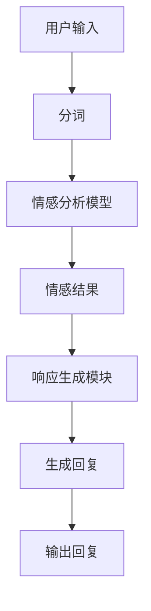
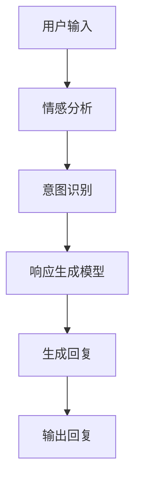
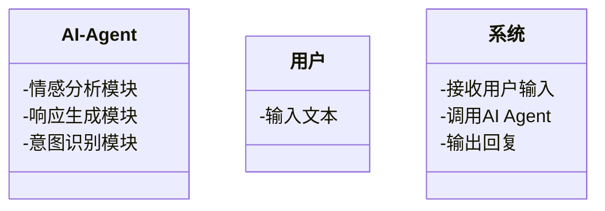
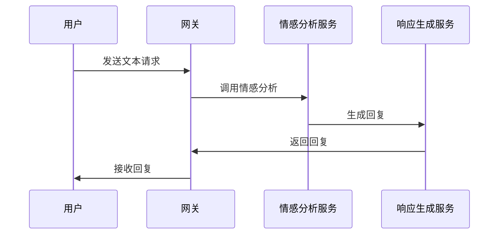

                 


# 智能客服中心：AI Agent的情感分析与响应

> **关键词**：智能客服中心，AI Agent，情感分析，响应生成，自然语言处理，机器学习

> **摘要**：本文深入探讨智能客服中心中AI Agent的情感分析与响应生成技术，结合实际应用场景，分析其核心算法、系统架构及实现方法。从基础理论到项目实战，全面解析如何利用自然语言处理和机器学习技术提升智能客服的效率与用户体验。

---

## 引言

### 1.1 智能客服中心的发展与AI Agent的引入

#### 1.1.1 传统客服中心的局限性
传统客服中心依赖人工坐席执行标准化流程，存在效率低、成本高、用户体验不稳定等问题。AI Agent的引入，通过自动化处理和智能交互，显著提升了客服效率和用户体验。

#### 1.1.2 智能客服中心的发展趋势
随着自然语言处理（NLP）和机器学习技术的进步，智能客服中心逐渐从规则驱动转向数据驱动，AI Agent成为核心工具。

#### 1.1.3 AI Agent在智能客服中的作用
AI Agent通过情感分析和响应生成技术，实现对用户意图的精准识别和高效反馈，显著降低人工干预需求。

### 1.2 AI Agent的基本概念与特点

#### 1.2.1 AI Agent的定义与分类
AI Agent是一种智能实体，能够感知环境、理解用户需求并执行任务。根据功能可分为规则驱动型、数据驱动型和混合型。

#### 1.2.2 AI Agent的核心功能与优势
核心功能包括自然语言理解、意图识别和响应生成，优势体现在高效性、准确性、7x24小时可用性。

#### 1.2.3 AI Agent与传统客服机器人的区别
AI Agent具有更强的自主学习和决策能力，能够处理复杂场景，而传统机器人主要依赖预设规则。

### 1.3 本书的目的与结构安排
本书旨在系统讲解AI Agent在智能客服中心中的应用，涵盖情感分析与响应生成的核心算法、系统架构设计和项目实战。

---

## 第二部分: 情感分析与响应生成的基础知识

### 2.1 情感分析的基本概念

#### 2.1.1 情感分析的定义与作用
情感分析是通过文本内容判断用户情感倾向的技术，用于识别用户情绪，如正面、负面或中性。

#### 2.1.2 情感分析的分类与应用场景
分类包括句子级、文档级和Aspect-based情感分析，应用场景涵盖客服反馈、社交媒体监控等。

### 2.2 响应生成的基本原理

#### 2.2.1 响应生成的定义与目标
响应生成是根据用户输入生成合适回复的过程，目标是提供准确、相关和自然的回应。

#### 2.2.2 响应生成的技术路线
基于规则的生成、模板填充和基于模型的生成是主要技术路线，深度学习模型如Transformer在生成中表现出色。

### 2.3 情感分析与响应生成的关系

#### 2.3.1 情感分析在响应生成中的作用
情感分析帮助理解用户情绪，指导生成合适的回复，提升用户体验。

#### 2.3.2 响应生成对情感分析的反馈影响
生成的回复可以作为反馈，进一步优化情感分析模型，形成闭环系统。

---

## 第三部分: 情感分析的核心算法与实现

### 3.1 情感分析的算法原理

#### 3.1.1 基于规则的情感分析方法
通过预设规则和关键词匹配进行情感分类，适用于特定场景，但灵活性有限。

#### 3.1.2 统计模型的情感分析方法
利用机器学习算法如SVM和NB，基于特征工程进行分类，准确性较高但依赖特征提取。

#### 3.1.3 深度学习模型的情感分析方法
采用CNN、RNN和Transformer模型，通过端到端训练提升性能，尤其适用于复杂文本分析。

### 3.2 响应生成的算法原理

#### 3.2.1 基于规则的响应生成
通过预设规则和模板生成回复，适用于简单场景，但灵活性有限。

#### 3.2.2 统计模型的响应生成
利用机器学习模型预测最佳回复，结合情感分析结果优化生成内容。

#### 3.2.3 基于深度学习的响应生成
采用Seq2Seq模型和预训练语言模型如GPT，生成高质量回复，但计算资源需求较高。

### 3.3 情感分析与响应生成的流程

#### 3.3.1 情感分析流程图


#### 3.3.2 响应生成流程图


### 3.4 情感分析的Python实现

#### 3.4.1 使用SVM进行情感分析
```python
from sklearn.svm import SVC
from sklearn.feature_extraction.text import TfidfVectorizer

# 数据预处理
X = data['text']
y = data['label']

# 特征提取
vectorizer = TfidfVectorizer()
X_vec = vectorizer.fit_transform(X)

# 训练模型
model = SVC()
model.fit(X_vec, y)
```

#### 3.4.2 情感分析的数学模型
情感分析的分类问题可以用逻辑回归模型表示：
$$ P(y|x) = \frac{e^{\beta x}}{1 + e^{\beta x}} $$

---

## 第四部分: 系统分析与架构设计方案

### 4.1 智能客服中心的场景介绍

#### 4.1.1 用户咨询场景
用户通过文本或语音输入问题，AI Agent进行分析并生成回复。

#### 4.1.2 多轮对话场景
AI Agent需保持上下文理解，支持多轮对话，提升用户体验。

### 4.2 系统功能设计

#### 4.2.1 领域模型类图


#### 4.2.2 系统架构图


### 4.3 系统接口设计

#### 4.3.1 API接口定义
使用RESTful API，接口包括：
- POST /analyze 情感分析接口
- POST /generate 响应生成接口

#### 4.3.2 交互流程图


---

## 第五部分: 项目实战

### 5.1 环境搭建

#### 5.1.1 安装Python和相关库
安装`scikit-learn`、`tensorflow`和`transformers`等库，配置Python环境。

#### 5.1.2 安装工具链
安装Jupyter Notebook和Git，用于代码开发和版本控制。

### 5.2 核心代码实现

#### 5.2.1 情感分析代码
```python
import tensorflow as tf
from tensorflow.keras import layers

# 定义模型
model = tf.keras.Sequential([
    layers.Embedding(vocabulary_size, embedding_dim),
    layers.Dropout(0.5),
    layers.Conv1D(filters, kernel_size, padding='valid'),
    layers.MaxPooling1D(pool_size),
    layers.Dense(hidden_dim, activation='relu'),
    layers.Dense(2, activation='sigmoid')
])
```

#### 5.2.2 响应生成代码
```python
import transformers

# 加载预训练模型
tokenizer = transformers.AutoTokenizer.from_pretrained('gpt2')
model = transformers.AutoModelForCausalLM.from_pretrained('gpt2')
```

### 5.3 案例分析

#### 5.3.1 情感分析案例
分析用户评论，识别情感倾向，生成相应回复。

#### 5.3.2 响应生成案例
根据用户输入，生成个性化回复，提升用户体验。

### 5.4 项目总结

#### 5.4.1 实战经验
强调数据质量、模型调优和场景适配的重要性。

#### 5.4.2 项目意义
通过项目实战，验证算法效果，积累实际经验，为后续优化提供参考。

---

## 第六部分: 案例分析与经验分享

### 6.1 案例分析

#### 6.1.1 情感分析案例
分析用户反馈，优化情感分析模型，提升准确率。

#### 6.1.2 响应生成案例
通过实际对话数据，评估生成效果，优化回复策略。

### 6.2 经验分享

#### 6.2.1 实施经验
强调数据预处理、模型选择和调参的重要性。

#### 6.2.2 注意事项
提示可能遇到的问题，如数据偏差、模型过拟合等，提出解决方案。

### 6.3 拓展阅读

#### 6.3.1 推荐技术书籍
推荐《Deep Learning》和《自然语言处理实战》等书籍。

#### 6.3.2 学术论文
推荐阅读ACL会议的相关论文，了解最新研究进展。

---

## 第七部分: 总结与展望

### 7.1 总结

#### 7.1.1 核心内容回顾
回顾文章内容，强调AI Agent在智能客服中的重要作用。

#### 7.1.2 本次学习的收获
总结通过学习所获得的知识和技能，提升对NLP技术的理解。

### 7.2 展望

#### 7.2.1 未来技术趋势
预测情感分析和响应生成技术的未来发展方向，如多模态交互和自适应学习。

#### 7.2.2 个人职业发展
鼓励读者持续学习，关注技术动态，提升专业能力。

---

## 作者：AI天才研究院/AI Genius Institute & 禅与计算机程序设计艺术/Zen And The Art of Computer Programming

---

以上为《智能客服中心：AI Agent的情感分析与响应》的详细目录大纲，涵盖了从理论到实践的各个方面，适合技术爱好者和专业人士深入学习和实践。

