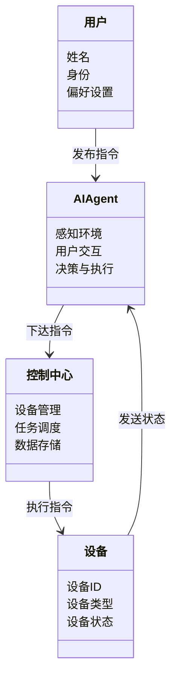
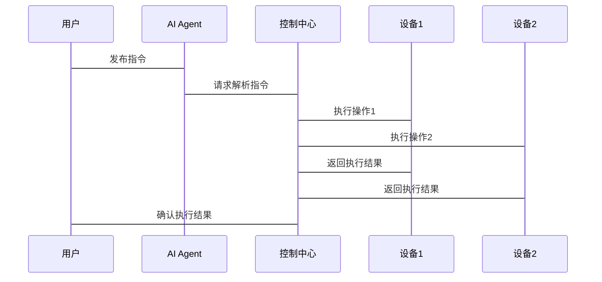

                 


# 智能家居中的AI Agent控制中心

## 关键词：智能家居，AI Agent，控制中心，系统集成，安全，人工智能

## 摘要：  
智能家居作为物联网（IoT）和人工智能（AI）技术的重要应用领域，正在迅速改变我们的生活方式。本文深入探讨了智能家居中AI Agent控制中心的设计与实现，分析了其在系统集成、安全性和用户体验方面的挑战与解决方案。通过理论分析和实际案例，本文揭示了AI Agent如何通过智能交互和自主决策优化智能家居的功能，并展望了其未来的发展趋势。

---

# 第1章: 智能家居与AI Agent概述

## 1.1 智能家居的概念与现状

### 1.1.1 智能家居的定义与背景  
智能家居是指通过物联网技术将家中的设备（如灯光、空调、安防系统等）连接到一个统一的平台，实现智能化的控制与管理。智能家居的核心目标是提高居住的舒适性、安全性和能源效率。

智能家居的发展可以追溯到20世纪90年代，但随着AI和IoT技术的进步，智能家居的概念逐渐从简单的自动化控制发展为基于AI的智能决策系统。

### 1.1.2 智能家居的发展历程  
智能家居经历了三个主要阶段：  
1. **自动化阶段**：通过传感器和简单逻辑控制设备，如灯光的定时开关。  
2. **网络化阶段**：设备通过网络连接，实现远程控制和数据共享。  
3. **智能化阶段**：引入AI技术，设备能够自主学习和决策，提供个性化的服务。

### 1.1.3 当前智能家居的市场现状  
目前，智能家居市场呈现快速增长态势，主要厂商包括谷歌（Google Nest）、亚马逊（Alexa）、苹果（HomeKit）等。智能家居设备的种类也日益增多，包括智能音箱、智能灯泡、智能门锁等。

---

## 1.2 AI Agent的基本概念

### 1.2.1 什么是AI Agent  
AI Agent（智能体）是指能够感知环境并采取行动以实现目标的智能系统。AI Agent在智能家居中的角色是接收用户的指令、分析环境数据，并协调各个设备执行任务。

### 1.2.2 AI Agent的核心功能与特点  
AI Agent的核心功能包括：  
- **感知环境**：通过传感器获取数据，如温度、湿度、光照等。  
- **理解用户需求**：通过自然语言处理（NLP）技术解析用户的指令。  
- **决策与执行**：根据用户需求和环境数据，生成行动计划并执行。  
- **学习与优化**：通过机器学习算法不断优化自身的决策能力。

### 1.2.3 AI Agent在智能家居中的作用  
AI Agent在智能家居中的作用主要体现在：  
- 提供智能化的交互界面，如智能音箱（Alexa、Google Assistant）。  
- 协调多个设备的工作，实现复杂的任务，如联动控制灯光、空调和安防系统。  
- 根据用户习惯和环境数据，提供个性化的服务，如自动调节室内温度。

---

## 1.3 智能家居中的AI Agent控制中心

### 1.3.1 控制中心的定义与作用  
AI Agent控制中心是智能家居的核心，负责接收用户的指令、协调设备的运行，并管理系统的整体流程。控制中心通过AI算法实现智能化的决策和优化。

### 1.3.2 控制中心与智能家居设备的关系  
控制中心与智能家居设备的关系是双向的：  
- 设备向控制中心发送数据，如温度、状态等。  
- 控制中心向设备发送控制指令，如开启或关闭设备。  
- 通过AI算法，控制中心能够根据历史数据和当前环境优化设备的运行。

### 1.3.3 控制中心的演进与发展趋势  
随着AI技术的进步，控制中心正在从简单的逻辑控制向自主学习和决策方向发展。未来的控制中心将更加智能化，能够处理更复杂的任务，并与更多的设备和系统实现无缝连接。

---

## 1.4 本章小结  
- 智能家居的发展经历了自动化、网络化和智能化三个阶段。  
- AI Agent是智能家居的核心，能够通过感知、决策和执行实现智能化的设备控制。  
- AI Agent控制中心是智能家居的枢纽，负责协调设备运行和优化系统性能。

---

# 第2章: AI Agent的基本原理

## 2.1 AI Agent的定义与分类

### 2.1.1 AI Agent的定义  
AI Agent是一种能够感知环境、采取行动以实现目标的智能系统。它可以基于规则、基于知识或基于学习进行决策。

### 2.1.2 AI Agent的分类  
AI Agent主要分为以下几类：  
1. **基于规则的AI Agent**：通过预定义的规则进行决策，适用于简单的场景。  
2. **基于知识的AI Agent**：利用知识库进行推理和决策，适用于复杂的场景。  
3. **基于学习的AI Agent**：通过机器学习算法不断优化决策能力，适用于动态变化的场景。

---

## 2.2 AI Agent的核心技术

### 2.2.1 自然语言处理（NLP）  
NLP技术使得AI Agent能够理解和生成自然语言，实现与用户的自然交互。例如，用户可以通过语音指令告诉AI Agent：“我回家了”，AI Agent会自动打开门锁、调节室内温度等。

### 2.2.2 机器学习  
机器学习是AI Agent实现智能化决策的核心技术。通过监督学习、无监督学习和强化学习，AI Agent能够从数据中学习用户的习惯和环境特征，优化自身的决策能力。

### 2.2.3 知识图谱  
知识图谱是AI Agent理解复杂语义的基础。通过构建家庭设备、用户习惯和环境特征的知识图谱，AI Agent能够更好地理解用户的需求并提供个性化的服务。

---

## 2.3 AI Agent与智能家居的结合

### 2.3.1 AI Agent在智能家居中的应用  
AI Agent在智能家居中的应用包括：  
- **智能交互**：通过语音或手势控制设备。  
- **自动化控制**：根据环境数据自动调节设备状态。  
- **个性化服务**：根据用户习惯提供定制化的服务。

### 2.3.2 智能家居中AI Agent的实现方式  
AI Agent的实现方式主要有以下几种：  
1. **云端AI Agent**：通过云服务器进行数据处理和决策。  
2. **本地AI Agent**：在智能家居设备本地运行AI算法。  
3. **混合式AI Agent**：结合云端和本地计算，实现更高效的决策。

### 2.3.3 AI Agent与智能家居设备的交互机制  
AI Agent与智能家居设备的交互机制主要包括：  
- **数据传输**：设备向AI Agent发送状态数据，AI Agent向设备发送控制指令。  
- **事件触发**：设备检测到特定事件（如温度变化）后，触发AI Agent的响应。  
- **用户交互**：用户通过语音或手势与AI Agent进行交互。

---

## 2.4 本章小结  
- AI Agent的核心技术包括NLP、机器学习和知识图谱。  
- AI Agent在智能家居中的应用主要体现在智能交互、自动化控制和个性化服务。  
- AI Agent与智能家居设备的交互机制包括数据传输、事件触发和用户交互。

---

## 2.5 系统分析与架构设计方案

### 2.5.1 问题场景介绍  
智能家居系统中，用户希望通过语音指令控制多个设备，同时设备之间能够协同工作。例如，用户说“我要睡觉了”，系统需要自动关闭灯光、调节温度、开启安防系统。

### 2.5.2 项目介绍  
本项目旨在设计一个基于AI Agent的智能家居控制中心，能够实现设备的智能控制和协同工作。

### 2.5.3 系统功能设计  
以下是系统功能的领域模型：  



### 2.5.4 系统架构设计  
以下是系统架构的mermaid图：


### 2.5.5 系统接口设计  
系统接口主要包括：  
- 用户与AI Agent的交互接口（如语音指令）。  
- 设备与控制中心的通信接口（如MQTT协议）。  
- 控制中心与AI Agent的协作接口。

### 2.5.6 系统交互设计  
以下是系统交互的mermaid图：



---

## 2.6 项目实战

### 2.6.1 环境安装  
以下是安装环境的配置：  
- 操作系统：Linux（推荐Ubuntu 20.04）  
- Python版本：3.8+  
- 依赖库：Python的Flask框架、MQTT库、自然语言处理库（如spaCy）

### 2.6.2 核心实现源代码  
以下是AI Agent控制中心的核心代码示例：

```python
import mqtt
from flask import Flask
import spacy

# 初始化NLP模型
nlp = spacy.load("en_core_web_sm")

# 初始化MQTT客户端
client = mqtt.Client()
client.connect("localhost", 1883, 60)

# 初始化Flask应用
app = Flask(__name__)

@app.route("/control", methods=["POST"])
def control():
    # 获取用户指令
    data = request.get_json()
    instruction = data["instruction"]
    
    # 解析指令
    doc = nlp(instruction)
    action = doc.ents[0].text
    
    # 发送控制指令
    client.publish(f"home/{action}/control", "execute")
    
    return jsonify({"status": "success"})

if __name__ == "__main__":
    app.run(debug=True)
```

### 2.6.3 代码应用解读与分析  
上述代码实现了以下功能：  
- 使用Flask框架创建一个API接口，接收用户的指令。  
- 使用spaCy进行自然语言处理，解析用户的指令内容。  
- 使用MQTT协议将控制指令发送给智能家居设备。  
- 返回确认信息，告知用户指令执行结果。

### 2.6.4 实际案例分析  
假设用户发布指令：“请帮我调节室温到25度”。  
- AI Agent解析指令，识别出“调节室温”和“25度”。  
- AI Agent通过MQTT协议向智能空调发送“设置温度为25度”的指令。  
- 智能空调执行指令，并向AI Agent反馈执行结果。

### 2.6.5 项目小结  
通过上述实现，我们可以看到AI Agent控制中心的核心功能包括：  
- 接收用户的指令并解析。  
- 通过MQTT协议与设备通信。  
- 提供API接口供用户交互。

---

## 2.7 最佳实践 Tips  
- 在实际应用中，建议使用更复杂的NLP模型（如BERT）来提高指令解析的准确性。  
- 系统的安全性至关重要，建议在MQTT通信中启用SSL/TLS加密。  
- 为了提高系统的实时性，可以采用边缘计算技术，将部分计算任务放在本地设备上。

---

## 2.8 数学公式讲解  
以下是机器学习算法的核心公式：  
- 线性回归的损失函数：  
$$ \text{MSE} = \frac{1}{n}\sum_{i=1}^{n}(y_i - \hat{y_i})^2 $$  
- 逻辑回归的损失函数：  
$$ \text{Log Loss} = -\frac{1}{n}\sum_{i=1}^{n}(y_i \log p_i + (1-y_i)\log (1-p_i)) $$  
- 支持向量机的目标函数：  
$$ \text{Minimize} \quad \frac{1}{2}||\mathbf{w}||^2 $$  
  $$ \text{Subject to} \quad y_i(\mathbf{w} \cdot \mathbf{x}_i + b) \geq 1 $$  

---

## 2.9 小结  
- AI Agent的核心技术包括NLP、机器学习和知识图谱。  
- 通过系统架构设计和实际案例分析，我们可以更好地理解AI Agent在智能家居中的应用。  
- 未来的智能家居系统将更加智能化和个性化，AI Agent将在其中发挥越来越重要的作用。

---

# 下一章：AI Agent控制中心的系统集成与安全（待续）

---

**作者：AI天才研究院 & 禅与计算机程序设计艺术**

