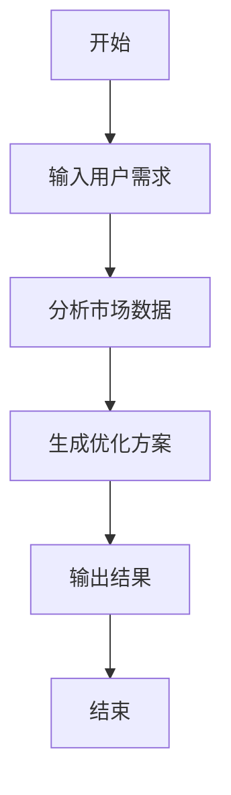
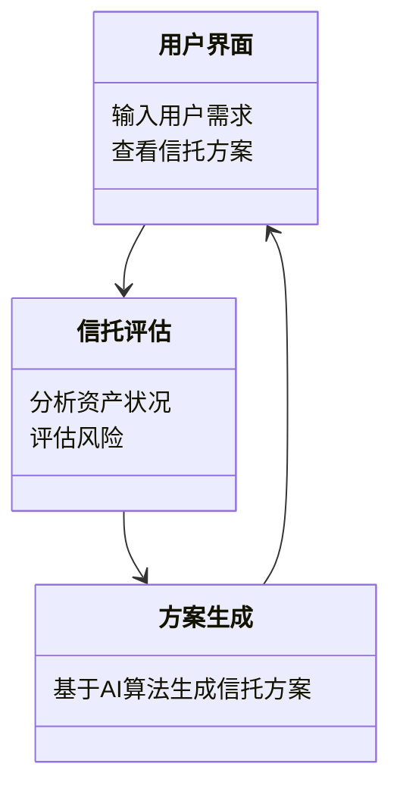

                 


# 智能家族信托规划助手

## 关键词：智能家族信托，AI算法，资产配置，风险管理，税务规划

## 摘要：智能家族信托规划助手是一种结合人工智能技术的创新工具，旨在优化家族财富传承、风险管理与税务规划。本文将详细探讨智能家族信托的核心概念、技术实现、算法原理及实际应用，帮助读者全面了解其优势与价值。

---

## 第1章：智能家族信托规划助手的背景与概念

### 1.1 家族信托的基本概念

#### 1.1.1 信托的基本概念
- 信托是一种法律关系，涉及委托人、受托人和受益人。
- 受托人根据委托人的意愿，管理和分配信托资产，确保受益人的利益。

#### 1.1.2 家族信托的核心特点
- **资产隔离**：保护家族财富，避免债务风险。
- **财富传承**：按照委托人意愿分配资产，确保家族财富的延续。
- **税务优化**：合理避税，降低税务负担。

#### 1.1.3 家族信托的法律框架
- 不同国家和地区对信托的法律有不同的规定，需遵守当地法律。

### 1.2 智能家族信托的定义与优势

#### 1.2.1 智能家族信托的定义
- 智能家族信托是传统家族信托与人工智能技术的结合。
- 利用AI算法优化资产配置、风险管理和税务规划。

#### 1.2.2 智能家族信托与传统家族信托的区别
| 特性                | 传统家族信托              | 智能家族信托              |
|---------------------|---------------------------|---------------------------|
| 资产管理方式         | 手动管理                  | AI辅助自动化管理          |
| 决策效率            | 低效，依赖人工判断        | 高效，基于数据驱动决策    |
| 风险管理能力        | 有限，依赖受托人经验      | 强大，实时监控与预警      |

#### 1.2.3 智能家族信托的优势
- **高效性**：AI算法快速分析市场动态，优化资产配置。
- **准确性**：基于大数据分析，降低人为错误风险。
- **实时性**：实时监控资产状态，及时调整策略。

### 1.3 家族信托的目标与意义

#### 1.3.1 家族财富传承的目标
- 确保家族财富的长期传承，避免因继承问题引发的纠纷。

#### 1.3.2 家族信托在风险管理中的作用
- 隔离债务风险，保护家族资产。
- 提供风险预警，提前制定应对措施。

#### 1.3.3 家族信托对税务规划的影响
- 合理避税，降低税务负担。
- 利用信托结构优化税务规划，提高资产利用率。

---

## 第2章：智能家族信托的核心概念与技术实现

### 2.1 智能家族信托的法律与技术结合

#### 2.1.1 信托法律框架与智能技术的关系
- 智能合约的法律合规性需与信托法律框架结合，确保合法有效。

#### 2.1.2 智能合约在家族信托中的应用
- 自动化执行信托协议，确保条款按约定执行。

#### 2.1.3 数据隐私与信托合规性
- 确保信托数据的安全性，符合隐私保护法规。

### 2.2 家族信托中的智能决策机制

#### 2.2.1 智能决策的基本原理
- 利用AI算法分析市场、税务和法律因素，制定最优决策。

#### 2.2.2 基于AI的信托资产配置
- 根据市场波动和受益人需求，动态调整资产配置。

#### 2.2.3 智能风险预警系统
- 实时监控信托资产的风险，提前发出预警。

### 2.3 智能家族信托的系统架构

#### 2.3.1 系统功能模块划分
- 用户界面：供用户输入需求和查看结果。
- 信托评估：分析当前资产状况，评估风险。
- 方案生成：基于AI算法生成信托规划方案。

#### 2.3.2 系统输入与输出的定义
- 输入：用户需求、市场数据。
- 输出：优化后的信托方案、风险预警。

#### 2.3.3 系统边界与外部接口
- 与外部数据库、市场数据接口对接。

---

## 第3章：智能家族信托的核心算法与数学模型

### 3.1 智能家族信托的算法原理

#### 3.1.1 基于AI的信托资产分配算法
- 使用机器学习模型预测市场趋势，优化资产分配。

#### 3.1.2 风险评估与优化算法
- 利用风险评估模型，动态调整资产配置。

#### 3.1.3 智能合约的执行逻辑
- 根据预设条件，自动执行信托协议。

### 3.2 数学模型与公式

#### 3.2.1 资产分配的数学模型
$$ \text{资产分配比例} = \frac{\text{家庭成员需求}}{\text{总信托资产}} $$

#### 3.2.2 风险评估的数学公式
$$ \text{风险指数} = \sum (\text{风险因素} \times \text{权重}) $$

#### 3.2.3 智能合约的执行公式
$$ \text{合约状态} = \text{条件判断}(\text{触发事件}) $$

### 3.3 算法流程图（使用 Mermaid）



---

## 第4章：智能家族信托的系统架构设计

### 4.1 项目介绍

#### 4.1.1 项目背景
- 优化家族信托的资产配置和风险管理。

#### 4.1.2 项目目标
- 提供智能化的信托规划工具，帮助用户优化资产配置和降低风险。

### 4.2 系统功能设计

#### 4.2.1 领域模型设计


#### 4.2.2 系统架构设计
```mermaid
container 智能家族信托系统 {
    class 用户界面 {
        输入需求
        查看结果
    }
    class 信托评估模块 {
        分析市场数据
        评估风险
    }
    class 方案生成模块 {
        基于AI算法生成方案
    }
    用户界面 --> 信托评估模块
    信托评估模块 --> 方案生成模块
    方案生成模块 --> 用户界面
}
```

---

## 第5章：智能家族信托的项目实战

### 5.1 环境安装

#### 5.1.1 安装Python
```bash
python --version
pip install --upgrade pip
```

#### 5.1.2 安装依赖库
```bash
pip install numpy pandas scikit-learn
```

### 5.2 核心代码实现

#### 5.2.1 资产分配算法
```python
import numpy as np
import pandas as pd
from sklearn.linear_model import LinearRegression

# 示例数据
data = {
    '资产类别': ['股票', '债券', '现金'],
    '预期收益': [0.1, 0.05, 0.02]
}
df = pd.DataFrame(data)

# 训练模型
model = LinearRegression()
model.fit(df[['资产类别']], df['预期收益'])

# 预测资产分配比例
predicted_returns = model.predict(df[['资产类别']])
asset_weights = np.exp(predicted_returns) / np.sum(np.exp(predicted_returns))
```

#### 5.2.2 风险评估模型
```python
def risk_assessment(risk_factors):
    weights = [0.3, 0.2, 0.15, 0.1, 0.1, 0.1]
    return sum(risk_factors[i] * weights[i] for i in range(len(risk_factors)))

risk_factors = [0.8, 0.6, 0.7, 0.5, 0.4, 0.3]
risk_index = risk_assessment(risk_factors)
```

---

## 第6章：案例分析与未来发展

### 6.1 案例分析

#### 6.1.1 案例背景
- 家族企业面临债务风险，需优化资产配置。

#### 6.1.2 智能家族信托的应用
- 使用AI算法优化资产分配，降低债务风险。

### 6.2 未来发展

#### 6.2.1 技术发展趋势
- AI算法的优化，提升信托规划的准确性。

#### 6.2.2 应用场景扩展
- 智能家族信托在跨国资产配置中的应用。

---

## 第7章：结论

智能家族信托规划助手通过结合人工智能技术，优化家族财富管理的各个方面。未来，随着AI算法的不断进步，智能家族信托将在财富传承、风险管理等领域发挥更大的作用。

---

## 作者：AI天才研究院/AI Genius Institute & 禅与计算机程序设计艺术 /Zen And The Art of Computer Programming

---

这篇博客文章全面介绍了智能家族信托规划助手的核心概念、技术实现和实际应用，帮助读者深入了解其优势与价值。

