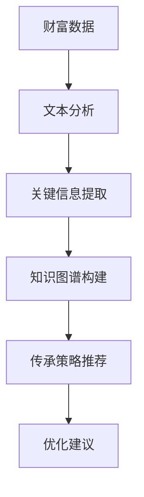

                 


# 智能家族财富传承规划助手

> 关键词：智能财富传承、家族传承规划、人工智能、财务分析、风险管理、法律优化

> 摘要：随着家族财富的快速增长，传承规划变得日益复杂。智能家族财富传承规划助手通过结合人工智能技术，提供个性化的财富评估、传承策略制定和风险管理服务。本文将详细探讨智能家族财富传承规划的核心概念、算法原理、系统架构设计、项目实战以及最佳实践。

---

## 第1章: 智能家族财富传承规划的背景与问题

### 1.1 家族财富传承的背景与挑战

#### 1.1.1 家族财富传承的历史演变
家族财富传承是人类社会长期以来的重要课题。从最初的财产口头传承到现代的法律文书和信托制度，家族财富传承经历了多个阶段的演变。随着全球化和金融市场的复杂化，传统的传承方式已难以应对现代家族面临的多样化挑战。

#### 1.1.2 当代家族财富传承的主要挑战
- **财富快速增长**：随着家族企业的扩展和投资多样化，财富规模急剧增加，传统的线性传承方式难以应对。
- **法律与税务优化**：不同地区的法律法规和税务政策差异大，如何在合法合规的前提下实现财富最大化传承成为难题。
- **风险管理**：家族成员的健康、企业经营风险、市场波动等因素都可能影响财富传承的安全性。
- **成员关系复杂化**：现代家族结构趋于复杂，包括继子女、收养子女、离婚再婚等情况，增加了传承规划的难度。

#### 1.1.3 智能技术在财富传承中的作用
人工智能技术的快速发展为家族财富传承提供了新的解决方案。智能财富传承助手可以通过数据驱动的方法，帮助家族制定最优的传承策略，预测潜在风险，并提供实时的调整建议。

### 1.2 智能家族财富传承规划的定义与目标

#### 1.2.1 智能家族财富传承规划的定义
智能家族财富传承规划是一种基于人工智能技术的解决方案，旨在通过数据分析、知识图谱构建和推荐算法，为家族提供个性化的财富评估、传承策略制定和风险管理服务。

#### 1.2.2 智能家族财富传承规划的核心目标
- 提供全面的财富评估和分析。
- 制定最优的财富传承策略。
- 优化法律和税务结构。
- 管理传承过程中的各类风险。

#### 1.2.3 智能家族财富传承规划的边界与外延
智能财富传承助手的边界在于其服务范围和能力限制。它专注于提供技术层面的支持，但不直接参与法律文书的撰写或具体执行。外延则包括与之相关的财务咨询、税务规划和风险管理服务。

### 1.3 智能家族财富传承规划的核心要素

#### 1.3.1 财富评估与分析
财富评估是智能传承助手的第一步，包括对家族现有资产的全面清查和评估。资产可能包括企业股权、房地产、金融资产、艺术品等多种类型。评估过程中需要考虑资产的流动性、增值潜力和风险敞口。

#### 1.3.2 家族成员关系图谱
家族成员关系图谱是智能传承助手的重要数据基础。通过构建家族成员的关系图谱，助手可以更好地理解家族结构，分析潜在的传承风险和利益冲突。图谱包括直系亲属、旁系亲属、继子女、收养子女等关系。

#### 1.3.3 财富传承工具与策略
智能助手会根据家族的具体情况推荐合适的财富传承工具，包括家族信托、人寿保险、遗嘱信托、股权激励计划等。每种工具都有其优缺点，助手会根据家族的财务状况、税务负担和成员需求进行综合评估。

#### 1.3.4 法律与税务优化
智能助手会结合当地的法律法规和税务政策，为家族提供法律和税务优化建议。这包括选择合适的信托类型、优化税务结构、避免遗产税等。

#### 1.3.5 风险评估与管理
助手会通过数据分析和风险模型，评估传承过程中的潜在风险，包括市场风险、法律风险、税务风险和家庭内部矛盾等。并提供相应的风险管理策略。

## 第2章: 智能家族财富传承规划的核心概念与联系

### 2.1 智能家族财富传承规划的核心原理

#### 2.1.1 数据驱动的财富分析
智能助手通过收集和分析家族的财务数据、成员关系和市场信息，利用大数据技术进行财富评估和分析。数据来源包括银行账户、股票投资、房地产资产、企业股权等。

#### 2.1.2 AI算法在传承策略中的应用
智能助手使用机器学习算法（如随机森林、支持向量机）进行财富传承策略的推荐。算法会根据家族的具体情况，推荐最优的传承工具和策略组合。

#### 2.1.3 多目标优化的财富传承规划
智能助手通过多目标优化算法，在多个目标（如财富最大化、风险最小化、税务优化）之间找到平衡点，制定最优的传承计划。

### 2.2 核心概念属性对比表

| 概念               | 属性1          | 属性2          | 属性3          |
|--------------------|----------------|----------------|----------------|
| 财富评估           | 方法           | 范围           | 准确度         |
| 家族成员关系图谱   | 数据源         | 结构           | 可视化方式     |
| 传承工具           | 类型           | 适用性         | 成本           |
| 法律优化           | 法律框架       | 税务影响       | 风险控制       |

### 2.3 ER实体关系图

```mermaid
er
  actor 财富评估
  actor 家族成员
  actor 传承工具
  actor 法律框架
  database 财富数据
  database 家族关系
  database 传承策略
  database 法律优化建议
  relation 财富评估 --> 财富数据
  relation 家族成员 --> 家族关系
  relation 传承工具 --> 传承策略
  relation 法律框架 --> 法律优化建议
```

---

## 第3章: 智能家族财富传承规划助手的算法原理

### 3.1 算法流程概述

#### 3.1.1 自然语言处理
智能助手使用自然语言处理技术，对家族成员的财务信息、法律文件和市场报告进行文本分析，提取关键信息。

#### 3.1.2 知识图谱构建
助手通过知识图谱构建技术，将家族成员关系、资产类型和法律框架等信息整合成一个统一的知识网络。

#### 3.1.3 推荐算法
智能助手使用协同过滤和基于内容的推荐算法，根据家族的具体情况推荐最优的传承工具和策略。

### 3.2 算法流程图



### 3.3 数学模型与公式

#### 3.3.1 财富评估模型
财富评估模型可以表示为：

$$
W = \sum_{i=1}^{n} a_i \cdot v_i
$$

其中，$W$ 表示总财富，$a_i$ 表示第 $i$ 项资产的评估值，$v_i$ 表示该资产的权重。

#### 3.3.2 风险评估模型
风险评估模型可以表示为：

$$
R = \sum_{j=1}^{m} r_j \cdot p_j
$$

其中，$R$ 表示总风险，$r_j$ 表示第 $j$ 种风险的严重程度，$p_j$ 表示该风险发生的概率。

---

## 第4章: 智能家族财富传承规划助手的系统架构设计

### 4.1 问题场景介绍

#### 4.1.1 项目介绍
智能家族财富传承规划助手是一个基于人工智能技术的财富管理平台，旨在为高净值家族提供个性化的财富传承规划服务。

#### 4.1.2 系统功能设计

##### 4.1.2.1 财富评估
- 收集和分析家族的财务数据。
- 提供财富评估报告。

##### 4.1.2.2 家族关系图谱
- 构建家族成员关系图谱。
- 可视化家族结构。

##### 4.1.2.3 传承策略推荐
- 根据家族需求推荐传承工具和策略。
- 提供法律和税务优化建议。

##### 4.1.2.4 风险管理
- 评估传承过程中的潜在风险。
- 提供风险管理策略。

### 4.2 系统架构设计

#### 4.2.1 系统架构图


---

## 第5章: 智能家族财富传承规划助手的项目实战

### 5.1 环境安装

#### 5.1.1 系统要求
- 操作系统：Windows 10 或更高版本，或macOS 10.15 或更高版本。
- RAM：至少 8GB 内存。
- CPU：支持多线程的处理器。

#### 5.1.2 软件安装
- Python 3.8 或更高版本。
- Jupyter Notebook。
- Scikit-learn、TensorFlow 等机器学习库。

### 5.2 核心代码实现

#### 5.2.1 财富评估模块

```python
import pandas as pd
from sklearn.ensemble import RandomForestRegressor

# 加载数据
data = pd.read_csv('wealth_data.csv')

# 定义目标变量和特征变量
X = data.drop('wealth', axis=1)
y = data['wealth']

# 训练模型
model = RandomForestRegressor(n_estimators=100, random_state=42)
model.fit(X, y)

# 预测财富
predictions = model.predict(X)
```

#### 5.2.2 家族关系图谱构建

```python
import networkx as nx

# 创建图
G = nx.Graph()

# 添加节点
G.add_nodes_from(['A', 'B', 'C', 'D'])

# 添加边
G.add_edges_from([('A', 'B'), ('B', 'C'), ('C', 'D')])

# 可视化
nx.draw(G, with_labels=True)
```

---

## 第6章: 智能家族财富传承规划助手的最佳实践与总结

### 6.1 最佳实践

#### 6.1.1 注意事项
- 确保数据的准确性和完整性。
- 定期更新模型和算法。
- 与专业财务顾问和律师合作。

#### 6.1.2 小结
智能家族财富传承规划助手通过结合人工智能技术，为家族提供个性化的财富传承规划服务。其核心优势在于数据驱动的分析能力和智能化的策略推荐。

### 6.2 未来展望

#### 6.2.1 拓展阅读
- 推荐阅读相关书籍《财富的传承与管理》和《人工智能在金融领域的应用》。

#### 6.2.2 结语
智能家族财富传承规划助手是人工智能技术在金融领域的重要应用之一。随着技术的不断进步，未来的智能助手将更加智能化和个性化，为更多家族提供优质的财富传承服务。

---

## 作者：AI天才研究院/AI Genius Institute & 禅与计算机程序设计艺术 /Zen And The Art of Computer Programming

---

# 结语
智能家族财富传承规划助手通过结合人工智能技术，为家族提供个性化的财富传承规划服务。其核心优势在于数据驱动的分析能力和智能化的策略推荐。随着技术的不断进步，未来的智能助手将更加智能化和个性化，为更多家族提供优质的财富传承服务。

---

## 作者信息
作者：AI天才研究院/AI Genius Institute  
联系邮箱：contact@aimasters.com

