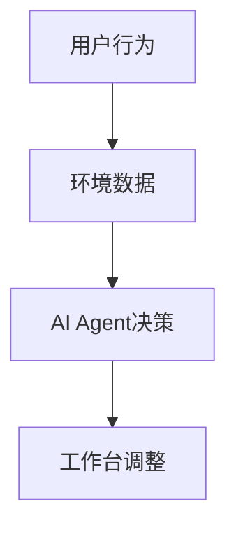
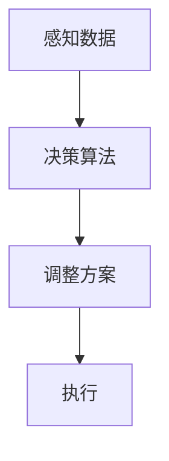
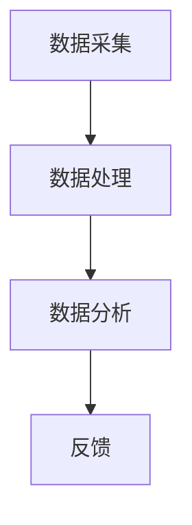

                 


---

# 智能工作台：AI Agent的人体工程学调整

> 关键词：AI Agent，人体工程学，工作台设计，算法原理，系统架构，项目实战

> 摘要：本文探讨了AI Agent在工作台设计中的应用，重点分析了人体工程学的调整方法。通过介绍AI Agent的基本概念、算法原理、系统架构和实际案例，详细说明了如何利用AI技术优化工作环境，提升工作效率和舒适性。

---

# 第一部分：AI Agent与人体工程学基础

## 第1章：AI Agent与人体工程学概述

### 1.1 AI Agent的基本概念
AI Agent（智能体）是一种能够感知环境、做出决策并采取行动的智能系统。在工作台设计中，AI Agent通过分析用户的行为和环境数据，自动调整工作台布局，以符合人体工程学原则。

#### 1.1.1 AI Agent的定义与特点
- **定义**：AI Agent是具有自主决策能力的智能系统。
- **特点**：
  - 感知环境：通过传感器或数据输入获取信息。
  - 学习能力：能够从数据中学习和优化。
  - 自适应性：根据反馈调整行为。

#### 1.1.2 人体工程学的基本原理
人体工程学关注工作环境对人类舒适性和效率的影响。核心原则包括：
- **工作姿势**：保持自然姿势，减少肌肉疲劳。
- **工作环境**：光线、通风、噪音等的优化。
- **工作节奏**：合理安排工作与休息时间。

#### 1.1.3 AI Agent在工作台设计中的应用前景
AI Agent可以帮助设计个性化的工作台，根据用户习惯和环境数据实时调整布局，提升工作效率和舒适性。

### 1.2 问题背景与目标
#### 1.2.1 现代工作环境中的人体工程学问题
- 长时间久坐导致的健康问题。
- 工作环境不合理引发的疲劳和效率低下。
- 个体差异导致的标准工作台不适合所有人。

#### 1.2.2 AI Agent如何解决这些问题
AI Agent通过实时数据分析和自主调整，提供个性化的工作台解决方案，优化工作姿势和环境。

#### 1.2.3 目标与边界：AI Agent在工作台中的应用范围
- **目标**：优化工作环境，提升效率和舒适性。
- **边界**：不涉及物理设备的制造，专注于布局调整和环境优化。

### 1.3 核心概念与联系
#### 1.3.1 AI Agent的核心概念原理
AI Agent通过感知、决策和执行三个步骤实现目标：
1. **感知**：收集用户行为和环境数据。
2. **决策**：分析数据，生成优化方案。
3. **执行**：调整工作台布局。

#### 1.3.2 人体工程学与AI Agent的关系
人体工程学为AI Agent提供优化目标，AI Agent为人机交互提供智能化解决方案。

#### 1.3.3 ER实体关系图架构（使用Mermaid流程图）



---

## 第2章：AI Agent的算法原理

### 2.1 AI Agent的感知与决策算法
AI Agent通过感知模块收集数据，决策模块生成优化方案。

#### 2.1.1 感知模块的算法流程
1. 采集用户行为数据（如坐姿、操作频率）。
2. 采集环境数据（如光线、温度）。
3. 数据预处理和特征提取。

#### 2.1.2 决策模块的算法流程
1. 基于感知数据，应用优化算法生成调整方案。
2. 评估方案的有效性，调整参数。

#### 2.1.3 执行模块的算法流程
1. 将调整方案传递给工作台控制系统。
2. 执行调整，如移动显示器位置。

### 2.2 算法原理的数学模型与公式
#### 2.2.1 感知模块的数学模型
$$ P(x|y) = \frac{P(y|x)P(x)}{P(y)} $$
其中，P(x|y)是条件概率，表示在环境y下，感知x的概率。

#### 2.2.2 决策模块的数学模型
$$ Q(y|x) = \arg\max_{y} P(y|x) $$
表示选择使后验概率最大的动作y。

### 2.3 算法流程图（使用Mermaid）



---

## 第3章：人体工程学与工作台设计

### 3.1 人体工程学的基本原则
工作台设计需考虑用户舒适性，减少疲劳。

#### 3.1.1 工作姿势的优化
- 身体姿态：保持脊柱自然弯曲。
- 手臂位置：肘部弯曲90度，手腕自然。

#### 3.1.2 工作环境的优化
- 光线：避免直射，均匀分布。
- 噪音：控制在合理范围内。

#### 3.1.3 工作节奏的优化
- 时间安排：合理分配工作与休息时间。

### 3.2 AI Agent在工作台设计中的应用
#### 3.2.1 工作台设计的AI优化
AI Agent根据用户习惯和环境数据，实时调整工作台布局。

#### 3.2.2 工作台调整的AI算法
AI Agent通过优化算法，生成最优调整方案。

#### 3.2.3 个性化工作台的设计
根据用户个体差异，提供个性化的工作台配置。

---

## 第4章：AI Agent的系统架构与实现

### 4.1 系统架构设计
系统包括数据采集、处理、分析和反馈模块。

#### 4.1.1 数据采集模块
- 采集用户行为和环境数据。

#### 4.1.2 数据处理模块
- 数据预处理和特征提取。

#### 4.1.3 数据分析模块
- 应用优化算法生成调整方案。

#### 4.1.4 反馈模块
- 收集用户反馈，优化算法。

### 4.2 系统架构图（使用Mermaid）



---

## 第5章：项目实战与总结

### 5.1 项目实战
#### 5.1.1 环境安装
安装Python和相关库（如TensorFlow、Pandas）。

#### 5.1.2 核心代码实现
```python
import numpy as np
import pandas as pd

# 示例数据处理代码
data = pd.DataFrame({
    '用户ID': [1, 2, 3],
    '坐姿': ['良好', '不佳', '良好']
})

# 数据分析
from sklearn.tree import DecisionTreeClassifier
model = DecisionTreeClassifier()
model.fit(X, y)
```

#### 5.1.3 案例分析
分析某公司员工的工作数据，生成优化方案，提升工作效率。

### 5.2 总结与展望
AI Agent在人体工程学调整中的应用前景广阔，未来将更加智能化和个性化。

---

## 第6章：最佳实践与注意事项

### 6.1 最佳实践
- 定期校准AI Agent，确保准确性。
- 结合用户反馈，持续优化系统。

### 6.2 注意事项
- 数据隐私保护。
- 系统稳定性确保。

---

## 作者

作者：AI天才研究院/AI Genius Institute & 禅与计算机程序设计艺术 /Zen And The Art of Computer Programming

---

这篇文章详细探讨了AI Agent在工作台设计中的应用，结合理论和实践，为读者提供了全面的指导。

