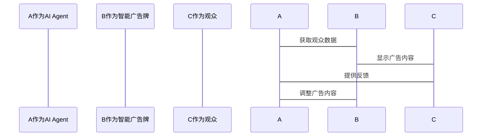

                 


# 智能广告牌：AI Agent的实时内容调整

## 关键词
智能广告牌, AI Agent, 实时内容调整, 机器学习, 动态内容优化

## 摘要
本文探讨了智能广告牌结合AI Agent实现实时内容调整的技术细节。首先介绍智能广告牌的背景与应用，分析AI Agent在其中的核心作用。接着深入讲解AI Agent的工作原理，包括感知、决策和执行模块。通过具体的算法实现和系统架构设计，展示如何利用AI Agent实现广告内容的实时优化。最后通过项目实战和最佳实践，总结如何高效应用AI Agent提升智能广告牌的性能与用户体验。

---

# 第一部分: 智能广告牌与AI Agent概述

## 第1章: 智能广告牌的背景与应用

### 1.1 智能广告牌的定义与特点

#### 1.1.1 传统广告牌的局限性
传统广告牌内容固定，无法根据环境变化（如时间、天气、观众行为）实时调整，导致广告效果受限。

#### 1.1.2 智能广告牌的核心特征
- **实时性**：能够根据实时数据调整广告内容。
- **动态性**：内容可以根据观众行为、环境变化等动态优化。
- **智能化**：利用AI技术进行内容推荐和优化。

#### 1.1.3 智能广告牌的市场应用前景
随着AI技术的成熟和数字化广告需求的增长，智能广告牌在零售、交通、公共领域等场景的应用前景广阔。

---

### 1.2 AI Agent的基本概念

#### 1.2.1 什么是AI Agent
AI Agent（人工智能代理）是一种能够感知环境、自主决策并执行任务的智能体。在智能广告牌中，AI Agent负责实时分析数据并调整广告内容。

#### 1.2.2 AI Agent的核心功能
- **感知**：收集和分析环境数据（如观众行为、时间、天气等）。
- **决策**：基于数据分析生成最优广告内容。
- **执行**：将决策结果转化为实际广告展示。

#### 1.2.3 AI Agent与传统广告的区别
| 特性        | 传统广告牌          | 智能广告牌（AI Agent驱动） |
|-------------|---------------------|-----------------------------|
| 内容调整     | 静态或周期性调整     | 实时动态调整                 |
| 个性化推荐   | 无或有限            | 高度个性化                   |
| 数据驱动     | 少或无              | 数据驱动强                   |

---

### 1.3 智能广告牌与AI Agent的结合

#### 1.3.1 智能广告牌的实时调整需求
- **实时观众分析**：根据观众的行为和特征动态调整广告内容。
- **环境适应性**：根据天气、时间等因素调整广告内容。
- **效果优化**：通过实时反馈优化广告策略。

#### 1.3.2 AI Agent在智能广告牌中的作用
AI Agent通过实时感知和决策，确保广告内容能够快速响应环境变化和观众需求。

#### 1.3.3 智能广告牌实时调整的实现路径
1. 数据采集与处理
2. AI Agent分析数据
3. 内容生成与优化
4. 实时展示与反馈

---

## 第2章: AI Agent的核心概念与原理

### 2.1 AI Agent的核心概念

#### 2.1.1 感知层
AI Agent通过传感器、摄像头等设备感知环境数据，例如：
- 观众的人口统计数据（年龄、性别等）。
- 观看时间、地点等信息。
- 环境条件（天气、光照等）。

#### 2.1.2 决策层
AI Agent基于感知数据，利用机器学习模型生成最优广告内容。例如：
- 使用协同过滤推荐算法为不同观众推荐合适的内容。
- 基于时间序列预测模型预测最佳广告展示时间。

#### 2.1.3 执行层
AI Agent将决策结果转化为实际操作，例如：
- 更新广告内容。
- 调整广告展示顺序。

---

### 2.2 AI Agent的感知机制

#### 2.2.1 数据采集与处理
AI Agent通过多种传感器和数据源采集实时信息，例如：
- 观众的行为数据（点击、停留时间等）。
- 时间、天气等环境数据。

#### 2.2.2 数据分析与特征提取
- 使用统计方法分析数据，提取关键特征。
- 通过数据清洗和预处理提高数据质量。

#### 2.2.3 数据驱动的实时调整
AI Agent根据分析结果实时调整广告内容，例如：
- 根据观众兴趣推荐相关产品广告。
- 根据天气变化调整广告主题（如夏季推广清凉产品）。

---

### 2.3 AI Agent的决策机制

#### 2.3.1 基于规则的决策
- 制定简单的规则，如“如果时间是晚上，显示打折信息”。
- 适用于场景简单的情况，但灵活性较低。

#### 2.3.2 基于模型的决策
- 使用机器学习模型（如随机森林、神经网络）进行预测和推荐。
- 适用于复杂场景，能够捕捉数据中的非线性关系。

#### 2.3.3 基于反馈的优化
- 根据实时反馈（如点击率、转化率）不断优化广告策略。
- 使用在线学习算法（如增量学习）更新模型。

---

### 2.4 AI Agent的执行机制

#### 2.4.1 内容生成与优化
- 生成多样化的广告内容，确保覆盖不同观众群体。
- 优化广告文案、排版等元素，提升吸引力。

#### 2.4.2 内容展示与反馈
- 将优化后的广告内容实时展示在屏幕上。
- 收集观众反馈（如点击、停留时间）用于后续优化。

#### 2.4.3 实时调整与迭代
- 根据反馈持续优化广告策略。
- 使用自动化工具实现快速迭代和调整。

---

## 第3章: 智能广告牌的系统架构与设计

### 3.1 系统架构概述

#### 3.1.1 分层架构设计
智能广告牌系统通常采用分层架构，包括：
- **数据采集层**：负责数据的采集和预处理。
- **计算层**：进行数据分析和模型推理。
- **展示层**：实时展示广告内容。

#### 3.1.2 组件间的交互关系
- 数据采集层向计算层传递实时数据。
- 计算层根据数据生成优化策略并传递给展示层。
- 展示层将结果反馈给计算层，用于进一步优化。

#### 3.1.3 系统的可扩展性设计
- 使用模块化设计，便于功能扩展。
- 支持多设备接入，实现大规模部署。

---

### 3.2 数据采集与处理模块

#### 3.2.1 数据源的多样性
- 多种传感器（如摄像头、麦克风）。
- 数据接口（如天气API、用户行为日志）。

#### 3.2.2 数据预处理与清洗
- 去除噪声数据，确保数据质量。
- 标准化处理，便于后续分析。

#### 3.2.3 数据存储与管理
- 使用数据库存储结构化数据。
- 使用分布式存储系统处理大规模数据。

---

### 3.3 AI Agent的算法实现

#### 3.3.1 算法选择与优化
- 根据具体场景选择合适的算法，例如：
  - 时间序列预测：预测广告点击率。
  - 协同过滤：推荐个性化广告内容。

#### 3.3.2 算法的实时性要求
- 确保算法能够在短时间内完成推理，满足实时调整需求。

#### 3.3.3 算法的可解释性
- 选择可解释性较强的算法（如线性回归、决策树），便于分析和优化。

---

### 3.4 系统接口与交互设计

#### 3.4.1 API的设计与实现
- 设计RESTful API，实现数据的上传和命令的接收。
- 使用JSON格式传递数据，确保兼容性。

#### 3.4.2 用Mermaid画出系统交互序列图


#### 3.4.3 系统的交互流程
1. AI Agent通过传感器获取观众数据。
2. 分析数据生成优化策略。
3. 将优化后的广告内容传递给智能广告牌展示。
4. 收集观众反馈，持续优化广告策略。

---

## 第4章: 智能广告牌的数学模型与算法实现

### 4.1 数学模型

#### 4.1.1 线性回归模型
用于预测广告点击率：
$$ y = \beta_0 + \beta_1 x_1 + \beta_2 x_2 + \dots + \beta_n x_n $$
其中，$y$是预测的点击率，$x_i$是特征变量，$\beta_i$是回归系数。

#### 4.1.2 时间序列预测模型
使用ARIMA模型预测广告点击率的变化趋势。

---

### 4.2 算法实现

#### 4.2.1 Python代码实现
```python
import pandas as pd
from sklearn.linear_model import LinearRegression

# 数据加载
data = pd.read_csv('ad_clicks.csv')

# 特征与目标变量分离
X = data[['age', 'gender', 'time']]
y = data['click_rate']

# 模型训练
model = LinearRegression()
model.fit(X, y)

# 预测
new_ad = {'age': 25, 'gender': 'F', 'time': 'morning'}
new_ad_encoded = pd.get_dummies(new_ad)
predicted_click_rate = model.predict(new_ad_encoded.values.reshape(1, -1))
print(predicted_click_rate)
```

#### 4.2.2 算法优化
- 使用交叉验证优化模型参数。
- 处理数据不平衡问题（如类别不平衡）。

---

## 第5章: 项目实战

### 5.1 环境安装与配置

#### 5.1.1 安装Python与相关库
```bash
pip install numpy pandas scikit-learn matplotlib
```

#### 5.1.2 安装广告牌硬件
- 摄像头、显示屏、传感器等硬件设备。

---

### 5.2 核心代码实现

#### 5.2.1 数据采集模块
```python
import cv2

# 采集视频流数据
cap = cv2.VideoCapture(0)
while cap.isOpened():
    ret, frame = cap.read()
    if not ret:
        break
    # 处理帧数据
    # ...
    cv2.imshow('frame', frame)
    if cv2.waitKey(1) == ord('q'):
        break
```

#### 5.2.2 AI Agent算法实现
```python
from sklearn.ensemble import RandomForestClassifier

# 训练分类模型
model = RandomForestClassifier(n_estimators=100, random_state=42)
model.fit(X_train, y_train)

# 预测广告内容
predicted_content = model.predict(X_test)
```

---

### 5.3 实际案例分析

#### 5.3.1 案例背景
某商场希望通过智能广告牌实时调整广告内容，吸引更多的顾客。

#### 5.3.2 数据分析
- 采集观众的人口统计数据和停留时间。
- 分析不同时间段的广告点击率。

#### 5.3.3 算法优化
- 使用协同过滤推荐算法为不同观众推荐个性化广告内容。
- 根据实时反馈优化广告策略。

---

### 5.4 项目小结

#### 5.4.1 成功经验
- 数据采集的准确性和及时性至关重要。
- 算法的选择和优化直接影响广告效果。

#### 5.4.2 项目总结
通过AI Agent实现智能广告牌的实时内容调整，能够显著提升广告效果和用户体验。关键在于数据的采集与处理、算法的选择与优化，以及系统的稳定运行。

---

## 第6章: 最佳实践与注意事项

### 6.1 最佳实践

#### 6.1.1 数据质量
- 确保数据的准确性和完整性。
- 处理噪声数据，提升模型性能。

#### 6.1.2 模型调优
- 使用交叉验证优化模型参数。
- 处理数据不平衡问题。

#### 6.1.3 系统维护
- 定期更新模型和系统软件。
- 监控系统运行状态，及时处理异常。

---

### 6.2 注意事项

#### 6.2.1 数据隐私
- 确保观众数据的隐私安全，遵守相关法律法规。

#### 6.2.2 系统稳定性
- 设计容错机制，确保系统在异常情况下仍能正常运行。

#### 6.2.3 用户体验
- 优化广告内容展示方式，提升用户体验。
- 避免过度频繁的广告切换，防止观众反感。

---

## 第7章: 总结与展望

### 7.1 总结
智能广告牌结合AI Agent，能够实现广告内容的实时动态调整，显著提升广告效果和用户体验。通过本文的详细讲解，读者可以全面了解智能广告牌的核心概念、系统架构、算法实现及实际应用。

---

### 7.2 展望
未来，随着AI技术的进一步发展，智能广告牌将更加智能化和个性化。例如：
- 使用更复杂的深度学习模型进行内容推荐。
- 结合增强现实技术，提供更丰富的广告展示形式。

---

## 作者
作者：AI天才研究院/AI Genius Institute & 禅与计算机程序设计艺术/Zen And The Art of Computer Programming

---

本文详细介绍了智能广告牌结合AI Agent实现实时内容调整的技术细节，从理论到实践，为读者提供了一个全面的视角。希望本文能够为相关领域的研究和应用提供有价值的参考。

