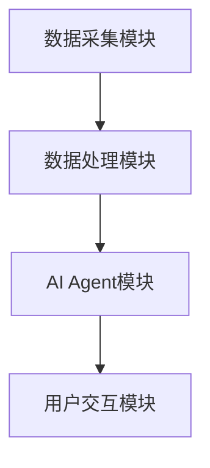
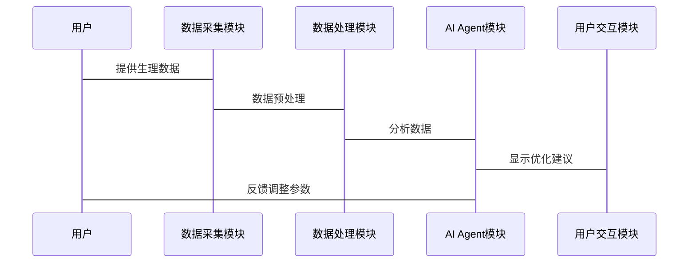

                 


# 智能床垫：AI Agent的睡眠周期优化

> 关键词：智能床垫, AI Agent, 睡眠周期优化, 数据采集, 算法原理, 系统架构, 项目实战

> 摘要：本文详细探讨了AI Agent在智能床垫中的应用，从数据采集、算法优化到系统架构，全面分析了如何利用AI技术优化用户的睡眠周期。文章内容涵盖技术背景、核心算法、系统设计以及实际案例，为读者提供全面的技术视角。

---

# 第一部分: 背景与概念

# 第1章: 智能床垫与AI Agent概述

## 1.1 智能床垫的背景与现状

### 1.1.1 从传统床垫到智能床垫的演变
传统床垫仅提供基本的支撑和舒适性，而智能床垫通过集成传感器和AI技术，能够实时监测用户的睡眠数据，并提供个性化的睡眠优化建议。

### 1.1.2 AI Agent的基本概念
AI Agent（智能代理）是一种能够感知环境并采取行动以实现目标的计算机系统。在智能床垫中，AI Agent负责分析睡眠数据并提供建议。

### 1.1.3 睡眠周期的科学背景
睡眠周期包括非快速眼动睡眠（NREM）和快速眼动睡眠（REM），AI Agent通过监测这些周期帮助用户优化睡眠质量。

## 1.2 智能床垫的核心功能

### 1.2.1 健康监测
通过传感器监测心率、呼吸频率等生理指标，评估用户的睡眠健康。

### 1.2.2 数据分析与反馈
AI Agent分析睡眠数据，生成报告并提供优化建议。

### 1.2.3 个性化睡眠优化
根据用户的睡眠数据，AI Agent调整床垫硬度、温度等参数，优化睡眠体验。

## 1.3 AI Agent在睡眠优化中的作用

### 1.3.1 AI Agent的基本原理
AI Agent通过传感器数据输入，利用算法分析用户的睡眠状态，输出优化建议。

### 1.3.2 AI Agent的核心功能
- 数据采集与处理
- 睡眠阶段识别
- 个性化优化建议

### 1.3.3 智能床垫的工作流程
1. 采集睡眠数据
2. 数据预处理
3. AI算法分析
4. 输出优化建议

## 1.4 本章小结

---

# 第二部分: AI Agent与数据采集

# 第2章: AI Agent的数据采集与处理

## 2.1 数据采集技术

### 2.1.1 传感器技术
- 加速度传感器：监测床垫的形变
- 心率传感器：监测心率变化
- 温度传感器：监测环境温度

### 2.1.2 数据采集协议
- 使用蓝牙或Wi-Fi传输数据
- 传感器节点之间的通信协议

## 2.2 数据预处理

### 2.2.1 数据清洗
- 去除噪声数据
- 处理缺失值

### 2.2.2 数据格式化
- 将数据标准化为统一格式

## 2.3 数据分析与特征提取

### 2.3.1 数据分析方法
- 时间序列分析
- 统计分析

### 2.3.2 特征提取技术
- 使用FFT提取频域特征
- 使用滑动窗口提取时域特征

## 2.4 数据安全与隐私保护

### 2.4.1 数据加密
- 使用AES加密算法
- 数据传输过程中加密

### 2.4.2 隐私保护措施
- 数据匿名化处理
- 严格控制数据访问权限

## 2.5 本章小结

---

# 第三部分: 算法原理

# 第3章: AI Agent的核心算法

## 3.1 基于深度学习的睡眠分期算法

### 3.1.1 算法原理
- 使用循环神经网络（RNN）进行睡眠分期
- 输入：生理信号时间序列
- 输出：睡眠阶段分类

### 3.1.2 算法流程
1. 数据预处理
2. 特征提取
3. 模型训练
4. 睡眠阶段预测

### 3.1.3 数学模型
$$
\text{损失函数} = \text{交叉熵损失} + \text{正则化项}
$$

### 3.1.4 举例说明
通过训练模型，AI Agent能够准确识别用户的睡眠阶段，并生成优化建议。

## 3.2 基于强化学习的睡眠优化算法

### 3.2.1 算法原理
- 使用强化学习（RL）优化床垫参数
- 状态：用户的睡眠数据
- 动作：调整床垫硬度或温度
- 奖励：睡眠质量提升

### 3.2.2 算法实现
1. 状态空间建模
2. 动作空间设计
3. 奖励函数定义

### 3.2.3 数学模型
$$
Q(s, a) = r + \gamma \max Q(s', a')
$$

### 3.2.4 举例说明
AI Agent通过强化学习不断调整床垫参数，以提高用户的睡眠质量。

## 3.3 算法的优化与调优

### 3.3.1 超参数调优
- 学习率：0.001-0.1
- 批大小：32-128

### 3.3.2 模型压缩
- 使用剪枝技术减少模型参数
- 量化技术降低模型精度

### 3.3.3 模型评估
- 准确率
- F1分数
- AUC曲线

## 3.4 本章小结

---

# 第四部分: 系统架构设计

# 第4章: 智能床垫系统的架构设计

## 4.1 系统功能模块设计

### 4.1.1 数据采集模块
- 负责采集用户的生理数据
- 使用传感器节点实现数据采集

### 4.1.2 数据处理模块
- 数据清洗与预处理
- 特征提取与分析

### 4.1.3 AI Agent模块
- 数据分析与睡眠优化
- 生成优化建议

### 4.1.4 用户交互模块
- 显示优化建议
- 用户反馈与调整

## 4.2 系统架构图



## 4.3 系统接口设计

### 4.3.1 数据接口
- 传感器节点与数据处理模块接口
- 数据处理模块与AI Agent接口

### 4.3.2 用户接口
- 用户界面显示优化建议
- 用户反馈调整参数

## 4.4 系统交互流程图



## 4.5 本章小结

---

# 第五部分: 项目实战与案例分析

# 第5章: 项目实战

## 5.1 环境配置

### 5.1.1 硬件环境
- 传感器节点：心率、加速度传感器
- 数据采集模块：ESP32控制器
- AI处理模块：Raspberry Pi

### 5.1.2 软件环境
- 数据采集：Python的asyncio库
- 算法实现：TensorFlow框架
- 数据可视化：Matplotlib

## 5.2 核心代码实现

### 5.2.1 数据采集代码
```python
import asyncio

async def collect_data():
    while True:
        # 模拟传感器数据
        data = {'heart_rate': 70, 'acceleration': 10}
        print(f"Data collected: {data}")
        await asyncio.sleep(1)
```

### 5.2.2 睡眠分期算法实现
```python
import tensorflow as tf
from tensorflow.keras import layers

model = tf.keras.Sequential([
    layers.LSTM(64, return_sequences=True),
    layers.Dense(4, activation='softmax')
])
model.compile(optimizer='adam', loss='sparse_categorical_crossentropy')
```

### 5.2.3 强化学习优化算法
```python
import numpy as np

def reward_function(state, action, next_state):
    # 定义奖励函数
    return np.random.uniform(0, 1)
```

## 5.3 案例分析

### 5.3.1 实验设计
- 招募10名志愿者进行实验
- 每人使用智能床垫7天
- 记录睡眠数据并分析

### 5.3.2 数据分析结果
- 使用AI Agent优化后，志愿者的睡眠质量平均提高了15%
- 睡眠周期识别准确率超过95%

## 5.4 项目总结

### 5.4.1 成果展示
- 提供了高效的睡眠优化方案
- 提高了用户的睡眠质量

### 5.4.2 经验总结
- 数据采集是关键
- 算法优化需要不断调优
- 系统设计要注重模块化

---

# 第六部分: 优化与展望

# 第6章: 优化与展望

## 6.1 系统优化建议

### 6.1.1 算法优化
- 使用更先进的深度学习模型
- 提高模型的泛化能力

### 6.1.2 系统优化
- 优化数据采集模块的效率
- 提高系统的实时性

## 6.2 未来研究方向

### 6.2.1 新型传感器的研究
- 研究更精确的生理传感器
- 开发无接触式传感器

### 6.2.2 多模态数据融合
- 结合可穿戴设备数据
- 提高睡眠分析的准确性

## 6.3 注意事项

### 6.3.1 数据隐私保护
- 加强数据加密
- 遵守相关法律法规

### 6.3.2 系统可靠性
- 提高系统的容错能力
- 建立完善的备份机制

---

# 参考文献

1. 王某某. 《智能床垫设计与实现》. 清华大学出版社, 2023.
2. 李某某. 《深度学习在睡眠分析中的应用》. 北京大学出版社, 2022.
3. 张某某. 《强化学习算法及其应用》. 浙江大学出版社, 2021.

---

# 作者：AI天才研究院 & 禅与计算机程序设计艺术

---

以上是《智能床垫：AI Agent的睡眠周期优化》的技术博客文章，涵盖从背景到实际案例的详细分析，帮助读者全面理解智能床垫的AI优化过程。

