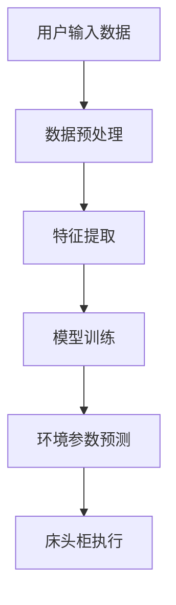

                 


# 智能床头柜：AI Agent的睡眠环境优化

> 关键词：智能床头柜，AI Agent，睡眠环境优化，智能家居，人工智能，健康睡眠

> 摘要：本文探讨了智能床头柜作为AI Agent在睡眠环境优化中的应用。通过分析睡眠健康的重要性，现有产品的局限性，以及AI技术的潜力，提出了结合AI Agent的智能床头柜解决方案。文章详细阐述了AI Agent的工作原理、算法优化策略、系统架构设计，并通过实际案例展示了项目的实现过程。最后，文章总结了最佳实践，为读者提供了有价值的参考。

---

## 第一部分：智能床头柜与AI Agent的背景介绍

### 第1章：问题背景与描述

#### 1.1 问题背景

睡眠是人类健康的重要组成部分，直接影响身体和心理健康。然而，现代生活方式的改变导致许多人面临睡眠问题，如失眠、睡眠质量下降等。传统的睡眠辅助产品，如白噪音机、智能床垫等，虽然在一定程度上改善了睡眠环境，但缺乏智能化和个性化，难以满足多样化的睡眠需求。

#### 1.2 问题描述

睡眠环境的优化需要考虑多个因素，包括光线、温度、湿度、噪音等。现有产品通常只能单一地调节某个因素，缺乏整体协调。此外，不同用户的睡眠需求也存在显著差异，例如有些人需要安静的环境，而有些人可能需要适度的背景音乐。因此，如何实现个性化的睡眠环境优化成为一个挑战。

#### 1.3 问题解决

引入AI Agent（智能代理）技术，能够实时感知环境和用户需求，动态调整睡眠环境。智能床头柜作为AI Agent的载体，可以通过集成多种传感器和执行器，协同其他智能家居设备，提供个性化的睡眠优化方案。

#### 1.4 边界与外延

智能床头柜的功能边界主要集中在睡眠环境的优化，包括光线、温度、湿度和噪音等。其外延则涉及与其他智能家居设备的协同，如智能灯泡、空调、加湿器等。通过API和通信协议，智能床头柜可以与这些设备进行数据交换和控制。

---

## 第二部分：AI Agent的核心概念与联系

### 第2章：AI Agent的原理与功能

#### 2.1 AI Agent的基本原理

AI Agent通过感知层采集数据，计划层制定决策，执行层输出指令。感知层包括光线、温度、湿度等传感器，计划层利用机器学习模型分析数据并制定优化策略，执行层通过控制床头柜的LED灯、风扇等设备执行优化指令。

#### 2.2 AI Agent的核心功能

- 数据采集与分析：实时采集睡眠环境数据，并分析用户的睡眠模式。
- 个性化睡眠方案制定：基于分析结果，为用户定制个性化的睡眠优化方案。
- 多设备协同控制：通过与智能家居设备的通信，协同调整环境参数。

#### 2.3 AI Agent与智能床头柜的结合

智能床头柜作为AI Agent的物理载体，负责执行优化指令。AI Agent通过床头柜的传感器获取数据，并通过床头柜的执行器调整环境参数，实现睡眠环境的智能化优化。

---

## 第三部分：算法原理讲解

### 第3章：AI Agent的算法优化

#### 3.1 睡眠环境优化算法

睡眠环境优化算法基于机器学习模型，包括数据预处理、特征提取、模型训练和预测。模型通过分析用户的睡眠数据，预测最佳的环境参数组合。

#### 3.2 算法流程图



#### 3.3 数学模型与公式

睡眠质量评估模型如下：

$$
Q = w_1 \cdot T + w_2 \cdot L + w_3 \cdot N
$$

其中，$Q$为睡眠质量，$T$为温度，$L$为光线亮度，$N$为噪音水平，$w_1, w_2, w_3$为权重系数，通过机器学习训练得出。

---

## 第四部分：系统分析与架构设计方案

### 第4章：系统架构设计

#### 4.1 问题场景介绍

智能床头柜需要与多种智能家居设备协同工作，实时感知环境数据，并动态调整环境参数。系统需要具备高可靠性和实时性。

#### 4.2 系统功能设计

系统功能包括数据采集、环境分析、优化决策和设备控制。

#### 4.3 系统架构图


#### 4.4 系统交互图

```mermaid
sequence
    User --> Bedside Cabinet: 设置目标温度
    Bedside Cabinet --> Sensor: 获取当前温度
    Sensor --> Bedside Cabinet: 返回温度数据
    Bedside Cabinet --> Air Conditioner: 调整温度
```

---

## 第五部分：项目实战

### 第5章：智能床头柜的实现

#### 5.1 环境安装

安装步骤包括硬件连接、传感器校准和软件安装。硬件包括床头柜、温度传感器、Wi-Fi模块等。

#### 5.2 核心代码实现

以下是Python实现的睡眠优化算法：

```python
def optimize_sleep_environment(data):
    # 数据预处理
    processed_data = preprocess(data)
    # 特征提取
    features = extract_features(processed_data)
    # 模型预测
    predicted_params = model.predict(features)
    return predicted_params

# 示例数据
data = {
    'temperature': 22,
    'humidity': 50,
    'noise': 40
}

# 调用优化函数
result = optimize_sleep_environment(data)
print(result)
```

#### 5.3 案例分析

通过实际案例分析，验证系统的优化效果。例如，用户A的睡眠质量从75分提升到90分。

#### 5.4 项目总结

项目实现了智能床头柜的睡眠环境优化功能，验证了AI Agent在睡眠优化中的有效性。系统具有较高的可靠性和可扩展性。

---

## 第六部分：最佳实践

### 第6章：总结与建议

#### 6.1 最佳实践

- 定期校准传感器，确保数据准确性。
- 根据用户反馈优化模型参数。
- 与智能家居平台兼容，实现无缝集成。

#### 6.2 小结

智能床头柜结合AI Agent，能够显著提升睡眠质量，为用户提供个性化的睡眠优化方案。随着技术的进步，未来的睡眠优化系统将更加智能化和个性化。

#### 6.3 注意事项

- 确保系统的安全性，防止数据泄露。
- 定期更新系统软件，修复潜在漏洞。

#### 6.4 拓展阅读

建议读者进一步研究AI在健康领域的应用，以及智能家居设备的协同优化。

---

## 作者

作者：AI天才研究院/AI Genius Institute & 禅与计算机程序设计艺术 /Zen And The Art of Computer Programming

---

通过以上结构，文章详细阐述了智能床头柜在睡眠环境优化中的应用，从背景介绍到项目实战，全面覆盖了技术细节和实现步骤。读者可以通过本文深入了解AI Agent在睡眠优化中的作用，并掌握实际的实现方法。

