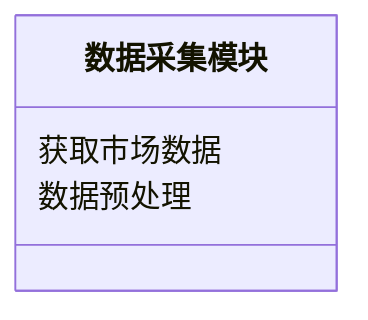
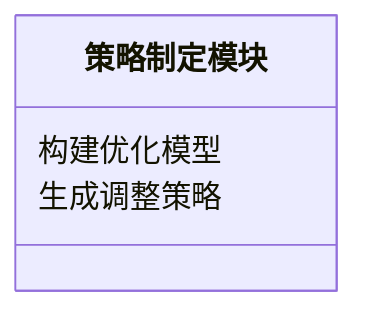
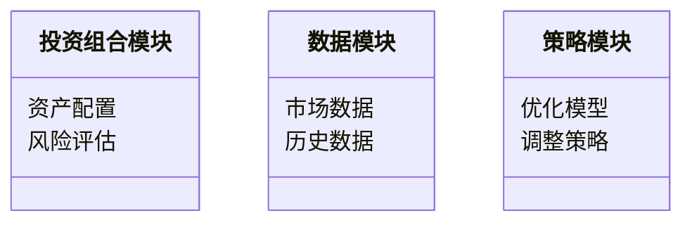

                 


# 智能投资组合再平衡技术

---

## 关键词：
智能投资组合、再平衡技术、算法优化、系统架构、风险管理、机器学习

---

## 摘要：
智能投资组合再平衡技术通过结合先进的数学模型和算法优化，实现对投资组合的动态调整，以应对市场波动和风险变化。本文将从背景、概念、算法、系统设计到实际应用，全面探讨智能再平衡技术的核心原理和实现方法，为投资者和开发者提供深度的技术解析。

---

# 第一部分: 智能投资组合再平衡技术概述

## 第1章: 投资组合再平衡的基本概念

### 1.1 投资组合再平衡的背景与意义

#### 1.1.1 传统投资组合管理的局限性
传统的投资组合管理依赖于定期的人工调整，这种方法难以及时捕捉市场波动，且效率低下。随着金融市场的复杂化，投资者需要一种更高效、更智能的解决方案。

#### 1.1.2 再平衡的定义与作用
再平衡是指根据市场变化和个人投资目标，调整资产配置以优化收益和风险的过程。它通过定期重新分配资产，确保投资组合与预定目标一致。

#### 1.1.3 智能再平衡的背景与发展趋势
智能再平衡利用人工智能和大数据技术，实时分析市场动态，实现自动化和智能化的资产调整，显著提升了投资效率和风险管理能力。

---

### 1.2 智能投资组合再平衡的核心概念

#### 1.2.1 智能再平衡的定义
智能再平衡通过算法和模型，实时分析市场数据，动态调整资产配置，以优化投资组合的表现。

#### 1.2.2 智能再平衡的特点
- **实时性**：基于实时市场数据进行调整。
- **自动化**：利用算法自动执行再平衡操作。
- **智能化**：结合机器学习模型预测市场趋势。

#### 1.2.3 智能再平衡的核心要素
- 数据采集与处理。
- 风险收益模型构建。
- 自动化调整算法。

---

### 1.3 智能再平衡与传统再平衡的对比

#### 1.3.1 传统再平衡的优缺点
- **优点**：策略简单，易于操作。
- **缺点**：效率低，难以应对快速市场变化。

#### 1.3.2 智能再平衡的优势
- 高效性：实时调整，快速响应市场变化。
- 精准性：基于复杂模型，优化资产配置。

#### 1.3.3 两者的主要区别与应用场景
智能再平衡适用于高频交易和复杂市场环境，而传统再平衡适用于长期稳健投资。

---

## 本章小结
智能投资组合再平衡技术通过结合先进技术，显著提升了投资效率和风险控制能力，为现代投资管理提供了新的解决方案。

---

## 第2章: 数学模型与算法原理

### 2.1 投资组合优化的数学模型

#### 2.1.1 均值-方差优化模型
目标是最小化投资组合的方差，同时满足收益要求。

$$\text{Minimize } \sigma^2 \text{ subject to } \mu \geq \text{target return}$$

#### 2.1.2 Markowitz有效前沿理论
通过构建无风险收益曲线，确定最优风险收益组合。

$$\text{有效前沿：} \mu = \max \text{ for } \sigma \text{ given } r_f$$

#### 2.1.3 风险中性化与收益最大化模型
在控制风险的前提下，最大化收益。

$$\text{Maximize } \mu \text{ subject to } \sigma \leq \text{target risk}$$

---

### 2.2 再平衡算法的核心原理

#### 2.2.1 动态调整策略
根据市场波动，动态调整各资产的权重。

#### 2.2.2 基于机器学习的预测模型
利用历史数据训练模型，预测未来市场趋势。

#### 2.2.3 基于遗传算法的优化方法
通过模拟进化过程，找到最优资产配置。

---

### 2.3 常用再平衡算法的比较

#### 2.3.1 时间驱动再平衡算法
定期（如每月或每季度）调整资产配置。

#### 2.3.2 价格驱动再平衡算法
根据资产价格变化，触发再平衡。

#### 2.3.3 组合波动率驱动再平衡算法
当波动率超过阈值时，调整组合。

---

## 本章小结
数学模型和算法是智能再平衡的核心，通过优化模型和高效算法，实现精准的资产调整。

---

## 第3章: 系统架构设计

### 3.1 系统模块划分

#### 3.1.1 数据采集模块
负责获取实时市场数据和历史数据。



#### 3.1.2 策略制定模块
构建优化模型，生成调整策略。



#### 3.1.3 再平衡执行模块
根据策略执行实际调整操作。

#### 3.1.4 性能评估模块
评估调整效果，优化模型。

---

### 3.2 系统功能设计

#### 3.2.1 领域模型设计（Mermaid 类图）


#### 3.2.2 系统架构设计（Mermaid 架构图）


---

## 本章小结
系统架构设计确保了智能再平衡技术的高效实施和管理。

---

# 第四部分: 智能投资组合再平衡的项目实战

## 第4章: 项目实战与案例分析

### 4.1 项目背景与目标
构建一个基于机器学习的投资组合再平衡系统，实现自动化调整。

### 4.2 项目环境安装
- Python 3.8+
- Pandas, NumPy, Scikit-learn
- Matplotlib

### 4.3 核心代码实现

#### 4.3.1 数据采集与预处理
```python
import pandas as pd
import numpy as np

# 采集数据
data = pd.read_csv('market_data.csv')
# 数据清洗
data.dropna(inplace=True)
```

#### 4.3.2 模型构建与训练
```python
from sklearn.model_selection import train_test_split
from sklearn.ensemble import RandomForestRegressor

X = data.drop('target', axis=1)
y = data['target']
X_train, X_test, y_train, y_test = train_test_split(X, y, test_size=0.2)
model = RandomForestRegressor().fit(X_train, y_train)
```

#### 4.3.3 再平衡策略执行
```python
def rebalance(weights, model):
    predicted_return = model.predict(weights)
    if predicted_return < target_return:
        adjust_weights(weights, 'increase_risk')
    else:
        adjust_weights(weights, 'decrease_risk')

def adjust_weights(weights, strategy):
    if strategy == 'increase_risk':
        weights *= 1.1
    else:
        weights *= 0.9
```

### 4.4 实际案例分析
通过具体案例展示系统在不同市场环境下的表现，验证算法的有效性。

---

## 本章小结
通过项目实战，验证了智能再平衡技术的实际应用价值。

---

## 第五部分: 最佳实践与未来展望

## 第5章: 最佳实践与未来趋势

### 5.1 投资组合再平衡的最佳实践

#### 5.1.1 性能优化
- 使用分布式计算加速处理。
- 优化数据结构，提升访问效率。

#### 5.1.2 风险管理
- 设置止损点，控制最大风险敞口。
- 定期评估模型，更新参数。

#### 5.1.3 数据处理
- 使用高效数据存储方案。
- 增强数据清洗流程，确保数据质量。

### 5.2 未来研究方向

#### 5.2.1 更复杂的风险模型
- 结合多因子模型，提升预测精度。

#### 5.2.2 更高效的算法
- 研究分布式优化算法，提升计算速度。

#### 5.2.3 更智能的决策系统
- 引入强化学习，优化投资决策。

---

## 本章小结
智能再平衡技术未来将更加智能化和高效化，为投资管理带来更大变革。

---

## 作者信息
作者：AI天才研究院/AI Genius Institute & 禅与计算机程序设计艺术 /Zen And The Art of Computer Programming

---

**结语：**
智能投资组合再平衡技术通过结合先进的数学模型和算法优化，显著提升了投资管理的效率和准确性。随着技术的不断进步，未来将有更多创新应用于这一领域，为投资者带来更大的收益和风险控制能力。

