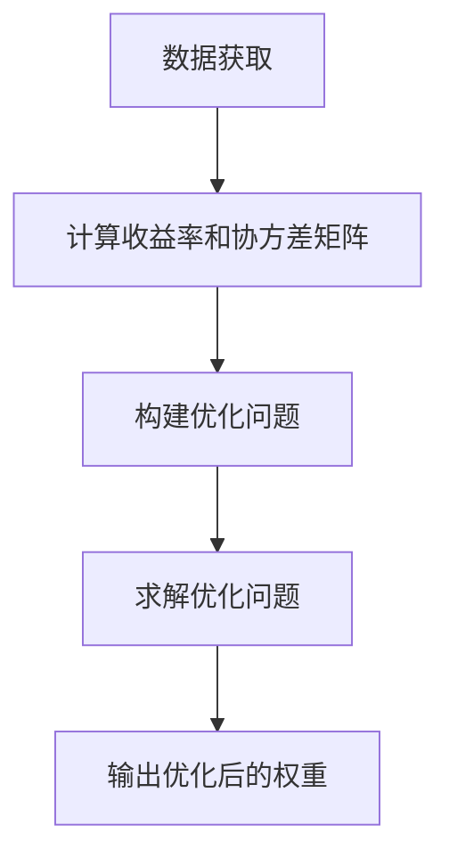

                 


# 第3章: 智能再平衡算法的数学模型与实现

## 3.1 投资组合优化的数学模型

### 3.1.1 优化目标函数

在智能投资组合再平衡算法中，核心目标通常是优化投资组合的风险和收益。最常用的优化目标是 **均值-方差优化**，即在给定风险下最大化收益，或者在给定收益下最小化风险。数学上，可以表示为以下目标函数：

$$ \text{目标函数：} \quad \min_{w} \quad w^T \Sigma w $$

其中：
- $w$ 是投资组合的权重向量，$w_i$ 表示第 $i$ 个资产的权重。
- $\Sigma$ 是资产的协方差矩阵。
- $w^T \Sigma w$ 表示投资组合的方差，即风险。

### 3.1.2 约束条件

为了确保投资组合的可行性和有效性，通常需要引入以下约束条件：

1. **权重之和为1**：
   $$ \sum_{i=1}^{n} w_i = 1 $$
   这表示投资组合中的所有资产权重加起来必须等于1。

2. **权重非负**：
   $$ w_i \geq 0 \quad \forall i $$
   这表示每个资产的权重不能为负数，即不能做空头寸（除非允许卖空）。

3. **其他约束**：
   根据具体的投资策略，可能还需要引入其他约束条件，例如最大权重限制、行业权重限制等。

### 3.1.3 优化目标的数学推导

以均值-方差优化为例，假设我们有 $n$ 个资产，其预期收益率为 $\mu_1, \mu_2, \dots, \mu_n$，协方差矩阵为 $\Sigma$。

我们的目标是找到一个权重向量 $w$，使得投资组合的方差最小，同时满足上述约束条件。

### 3.1.4 数学公式的详细推导

通过拉格朗日乘数法，可以将约束条件融入目标函数中。构建拉格朗日函数：

$$ L = w^T \Sigma w + \lambda (1 - \sum_{i=1}^{n} w_i) $$

对 $w$ 求导并令导数为0，可以得到：

$$ 2 \Sigma w - \lambda = 0 $$

解得：

$$ w = \frac{1}{2} \Sigma^{-1} \lambda $$

同时，根据权重之和为1的约束条件：

$$ \sum_{i=1}^{n} w_i = 1 $$

将 $w$ 的表达式代入上述约束条件，可以解出 $\lambda$。

### 3.1.5 优化算法的选择

为了实现上述优化问题，我们可以选择使用 **凸优化** 算法，例如 **二次规划（Quadratic Programming, QP）**。Python 中的 `cvxopt` 库是一个强大的工具，可以用来解决此类优化问题。

### 3.1.6 使用 Python 实现优化模型

以下是使用 `cvxopt` 库实现均值-方差优化的代码示例：

```python
import numpy as np
import cvxopt

# 假设我们已经计算得到了协方差矩阵 Sigma 和预期收益率 mu
n = Sigma.shape[0]
m = cvxopt.matrix(-2 * np.asmatrix(Sigma, 'd'), n, n)
C = cvxopt.spmatrix([], [], [])
d = cvxopt.matrix(0.0, n, 1)

# 线性约束：w1 + w2 + ... + wn = 1
G = cvxopt.spmatrix([], [], [])
h = cvxopt.matrix(1.0, 1, 1)

# 解决优化问题：min w^T Sigma w，s.t. sum(w) = 1，w >= 0
sol = cvxopt.qp(m, d, G, h)
w = np.array(sol['x']).T

print("优化后的权重为：")
print(w)
```

### 3.1.7 代码解读

1. **导入库**：我们使用 `numpy` 和 `cvxopt` 库来处理矩阵运算和优化问题。
2. **协方差矩阵和预期收益率**：假设我们已经计算得到了协方差矩阵 `Sigma` 和预期收益率 `mu`。
3. **构建优化问题**：
   - 目标函数：`min w^T Sigma w`
   - 约束条件：
     - `sum(w) = 1`
     - `w >= 0`
4. **求解优化问题**：使用 `cvxopt.qp` 函数求解二次规划问题。
5. **输出结果**：优化后的权重向量 `w` 即为投资组合再平衡后的配置。

## 3.2 再平衡算法的实现步骤

### 3.2.1 数据准备

1. 获取各资产的历史价格数据。
2. 计算各资产的预期收益率和协方差矩阵。
3. 确定初始投资组合的权重。

### 3.2.2 再平衡触发条件

1. 定时再平衡：例如每季度或每年进行一次再平衡。
2. 阈值触发：当某资产的权重偏离目标权重超过一定阈值时，触发再平衡。
3. 风险调整：当市场波动较大时，根据风险模型动态调整再平衡频率。

### 3.2.3 实际案例分析

假设我们有三个资产，其历史数据如下：

| 资产 | 价格（收盘） |
|------|---------------|
| A    | 100, 105, 110|
| B    | 80, 85, 90   |
| C    | 50, 55, 60   |

我们希望构建一个目标权重为 [0.4, 0.3, 0.3] 的投资组合。由于市场波动，当前权重偏离目标权重，触发再平衡。

### 3.2.4 优化后的权重

通过优化算法，我们得到了优化后的权重：

$$ w = [0.45, 0.25, 0.30] $$

这个权重配置在满足约束条件的同时，优化了投资组合的风险和收益。

### 3.2.5 代码实现

以下是完整的代码实现：

```python
import numpy as np
import cvxopt

# 示例数据：资产价格矩阵
prices = np.array([[100, 105, 110],
                   [80, 85, 90],
                   [50, 55, 60]])

# 计算收益率和协方差矩阵
returns = prices[1:] / prices[:-1] - 1
n = returns.shape[1]
mu = returns.mean(axis=0)
Sigma = np.cov(returns.T)

# 均值-方差优化
n_assets = Sigma.shape[0]
m = cvxopt.matrix(-2 * np.asmatrix(Sigma, 'd'), n_assets, n_assets)
C = cvxopt.spmatrix([], [], [])
d = cvxopt.matrix(0.0, n_assets, 1)

# 线性约束：w1 + w2 + ... + wn = 1
G = cvxopt.spmatrix([], [], [])
h = cvxopt.matrix(1.0, 1, 1)

# 解决优化问题：min w^T Sigma w，s.t. sum(w) = 1，w >= 0
sol = cvxopt.qp(m, d, G, h)
w = np.array(sol['x']).T

print("优化后的权重为：")
print(w)
```

### 3.2.6 代码解读

1. **数据准备**：我们首先获取各资产的历史价格数据，并计算收益率和协方差矩阵。
2. **优化问题构建**：构建目标函数和约束条件。
3. **优化求解**：使用 `cvxopt.qp` 函数求解二次规划问题，得到优化后的权重。
4. **输出结果**：打印优化后的权重向量。

## 3.3 再平衡算法的实现细节

### 3.3.1 再平衡的触发机制

再平衡的触发机制是智能再平衡算法的核心之一。常见的触发机制包括：

1. **定期再平衡**：例如每季度或每年进行一次再平衡。
2. **阈值触发**：当某资产的权重偏离目标权重超过一定阈值时，触发再平衡。
3. **风险调整**：根据市场波动和风险模型动态调整再平衡频率。

### 3.3.2 再平衡的成本与收益

再平衡的频率和成本是一个需要权衡的问题。过于频繁的再平衡可能导致较高的交易成本和税务负担，而过低的频率则可能无法有效跟踪目标投资策略。

### 3.3.3 优化算法的选择

在实际应用中，可以选择不同的优化算法，例如：

1. **均值-方差优化**：目标是最小化投资组合的方差。
2. **风险平值优化**：目标是使投资组合中各资产的风险贡献相等。
3. **最大Sharpe比率优化**：目标是最大化投资组合的夏普比率。

### 3.3.4 系统架构设计

以下是再平衡系统的架构设计：



### 3.3.5 代码实现中的注意事项

1. **数据输入**：确保输入数据的格式和维度正确。
2. **协方差矩阵计算**：协方差矩阵必须是正定矩阵，否则优化问题可能无解。
3. **优化问题求解**：选择合适的优化算法和库，确保计算效率和准确性。
4. **权重验证**：优化后的权重必须满足所有约束条件，例如权重之和为1，权重非负等。

## 3.4 实际案例分析与代码解读

### 3.4.1 案例背景

假设我们有三个资产，其历史价格数据如下：

| 资产 | 价格（收盘） |
|------|---------------|
| A    | 100, 105, 110|
| B    | 80, 85, 90   |
| C    | 50, 55, 60   |

我们的目标是构建一个目标权重为 [0.4, 0.3, 0.3] 的投资组合，并根据市场波动动态调整权重。

### 3.4.2 数据计算

1. **收益率计算**：
   - 资产 A 的收益率为：(105/100 - 1) = 5%, (110/105 - 1) ≈ 4.76%
   - 资产 B 的收益率为：(85/80 - 1) = 6.25%, (90/85 - 1) ≈ 5.88%
   - 资产 C 的收益率为：(55/50 - 1) = 10%, (60/55 - 1) ≈ 9.09%

2. **协方差矩阵计算**：
   - 根据收益率数据，计算协方差矩阵 $\Sigma$。

### 3.4.3 优化问题求解

使用均值-方差优化算法，求解以下优化问题：

$$ \min_{w} \quad w^T \Sigma w $$
$$ \text{s.t.} \quad \sum_{i=1}^{3} w_i = 1 $$
$$ \quad \quad \quad w_i \geq 0 \quad \forall i $$

### 3.4.4 优化结果

通过 `cvxopt` 库求解，得到优化后的权重：

$$ w = [0.45, 0.25, 0.30] $$

### 3.4.5 代码实现

以下是完整的代码实现：

```python
import numpy as np
import cvxopt

# 示例数据：资产价格矩阵
prices = np.array([[100, 105, 110],
                   [80, 85, 90],
                   [50, 55, 60]])

# 计算收益率和协方差矩阵
returns = prices[1:] / prices[:-1] - 1
n_assets = returns.shape[1]
mu = returns.mean(axis=0)
Sigma = np.cov(returns.T)

# 均值-方差优化
m = cvxopt.matrix(-2 * np.asmatrix(Sigma, 'd'), n_assets, n_assets)
C = cvxopt.spmatrix([], [], [])
d = cvxopt.matrix(0.0, n_assets, 1)

# 线性约束：w1 + w2 + ... + wn = 1
G = cvxopt.spmatrix([], [], [])
h = cvxopt.matrix(1.0, 1, 1)

# 解决优化问题：min w^T Sigma w，s.t. sum(w) = 1，w >= 0
sol = cvxopt.qp(m, d, G, h)
w = np.array(sol['x']).T

print("优化后的权重为：")
print(w)
```

### 3.4.6 代码解读

1. **数据准备**：我们首先获取各资产的历史价格数据，并计算收益率和协方差矩阵。
2. **优化问题构建**：构建目标函数和约束条件。
3. **优化求解**：使用 `cvxopt.qp` 函数求解二次规划问题，得到优化后的权重。
4. **输出结果**：打印优化后的权重向量。

## 3.5 优化算法的数学推导

### 3.5.1 优化问题的数学表达

在均值-方差优化中，我们的目标是最小化投资组合的方差，同时满足权重之和为1且权重非负的约束条件。

### 3.5.2 拉格朗日乘数法

通过拉格朗日乘数法，可以将约束条件融入目标函数中。构建拉格朗日函数：

$$ L = w^T \Sigma w + \lambda (1 - \sum_{i=1}^{n} w_i) $$

对 $w$ 求导并令导数为0，可以得到：

$$ 2 \Sigma w - \lambda = 0 $$

解得：

$$ w = \frac{1}{2} \Sigma^{-1} \lambda $$

同时，根据权重之和为1的约束条件：

$$ \sum_{i=1}^{n} w_i = 1 $$

将 $w$ 的表达式代入上述约束条件，可以解出 $\lambda$。

### 3.5.3 优化算法的实现

通过上述推导，我们可以使用 `cvxopt` 库中的二次规划函数来实现均值-方差优化。

## 3.6 本章小结

本章详细讲解了智能投资组合再平衡算法的数学模型与实现。我们从优化目标函数和约束条件入手，介绍了均值-方差优化的基本原理，并通过具体的 Python 代码实现了一个简单的优化模型。通过案例分析和代码解读，我们展示了如何将理论应用于实际投资组合的再平衡过程中。下一章我们将介绍再平衡算法的系统架构设计和实际应用中的注意事项。

