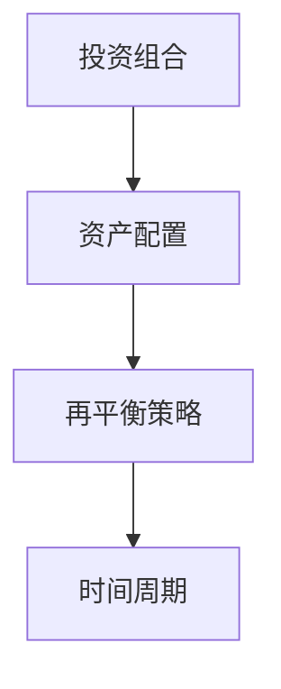
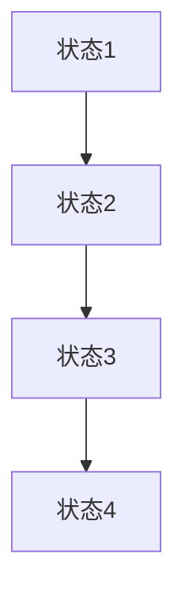
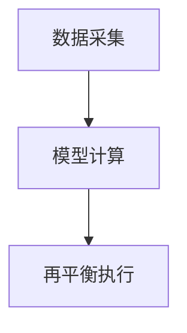

                 


# 智能投资组合多周期再平衡策略

> 关键词：投资组合，再平衡策略，多周期优化，动态规划，系统架构，Python实现

> 摘要：本文详细探讨了智能投资组合的多周期再平衡策略，从背景介绍到算法实现，再到系统架构设计，最终通过实战案例展示了该策略的落地应用。文章首先阐述了多周期再平衡策略的核心概念，接着分析了其算法原理，随后设计了系统架构，并通过Python代码实现了一个完整的项目案例，最后总结了最佳实践和注意事项。

---

## 第1章: 智能投资组合多周期再平衡策略的背景与问题

### 1.1 投资组合管理的基本概念

#### 1.1.1 投资组合管理的定义与目标

投资组合管理是指通过科学的组合配置和动态调整，实现投资目标的过程。其核心目标是优化投资组合的风险和收益，使投资收益最大化，同时降低风险。

#### 1.1.2 投资组合管理的核心问题

- **资产配置**：如何在不同资产类别中分配资金以实现最佳风险收益。
- **风险控制**：如何通过调整组合来降低投资风险。
- **动态优化**：如何在市场变化中及时调整投资组合。

#### 1.1.3 多周期再平衡策略的背景与意义

传统的投资组合管理通常采用静态的配置策略，无法适应市场环境的动态变化。多周期再平衡策略通过定期调整投资组合，使其在不同周期内保持最优配置，从而在长期投资中实现更优的风险收益。

### 1.2 多周期再平衡策略的定义与特点

#### 1.2.1 多周期再平衡策略的定义

多周期再平衡策略是指在多个时间周期内，根据市场环境的变化，定期对投资组合进行调整，以优化其风险收益特征。

#### 1.2.2 多周期再平衡策略的核心特点

- **周期性**：定期调整组合配置。
- **动态性**：根据市场变化灵活调整。
- **优化性**：每次调整都基于优化模型。

#### 1.2.3 多周期再平衡策略与传统再平衡策略的对比

| 特性         | 多周期再平衡策略 | 传统再平衡策略 |
|--------------|------------------|----------------|
| 调整频率     | 定期，如季度或半年 | 定期，如每年一次 |
| 调整依据     | 市场变化和优化模型 | 原定目标比例   |
| 优化目标     | 动态优化风险收益  | 维持目标比例    |

### 1.3 问题背景与问题描述

#### 1.3.1 投资组合再平衡的必要性

- 市场环境变化：经济周期波动、利率变化等会影响资产价格。
- 组合漂移：市场波动可能导致组合偏离目标配置。
- 投资目标变化：投资者风险承受能力和收益目标可能变化。

#### 1.3.2 多周期再平衡策略的挑战

- **计算复杂性**：需要在多个周期内进行优化，计算量大。
- **市场预测难度**：准确预测市场变化困难。
- **交易成本**：频繁调整可能导致交易成本增加。

#### 1.3.3 问题解决的思路与目标

通过引入智能算法和动态优化模型，构建一个多周期再平衡策略，能够在市场变化中及时调整投资组合，优化风险收益。

### 1.4 多周期再平衡策略的边界与外延

#### 1.4.1 策略适用的市场环境

- **市场波动**：适用于波动较大的市场环境。
- **多资产类别**：适用于股票、债券、基金等多种资产类别。

#### 1.4.2 策略的限制与假设

- **假设**：市场是有效的，能够反映所有信息。
- **限制**：需要较高的计算能力和数据支持。

#### 1.4.3 策略的外延与扩展

- **扩展**：可以与其他投资策略结合使用。
- **应用场景**：不仅适用于个人投资者，还适用于机构投资者。

### 1.5 核心概念与联系

#### 1.5.1 核心概念的原理

- **投资组合优化**：通过数学模型确定最优资产配置。
- **动态调整**：根据市场变化调整组合配置。

#### 1.5.2 核心概念的属性特征对比表格

| 概念         | 属性         | 描述                                         |
|--------------|--------------|--------------------------------------------|
| 多周期再平衡 | 频率         | 定期调整，如季度或半年                     |
|              | 目标         | 优化风险收益                               |
|              | 方法         | 基于优化模型计算最优配置                   |

#### 1.5.3 ER实体关系图



---

## 第2章: 多周期再平衡策略的理论基础

### 2.1 多周期再平衡策略的理论基础

#### 2.1.1 投资组合理论基础

投资组合理论认为，通过合理配置不同资产类别，可以在降低风险的同时实现收益最大化。现代投资组合理论（MPT）是多周期再平衡策略的理论基础。

#### 2.1.2 多周期优化模型

多周期优化模型是一种在多个时间周期内优化投资组合配置的方法。其核心是通过动态规划算法，在每个周期内确定最优资产配置。

---

通过以上结构，我们可以看到，文章系统地介绍了智能投资组合多周期再平衡策略的核心概念、算法原理、系统架构和项目实现。接下来的章节将详细讲解算法实现和系统设计。

---

## 第3章: 多周期再平衡策略的算法原理

### 3.1 动态规划算法

动态规划是一种用于优化问题的算法，适用于多周期再平衡策略中的最优配置计算。

#### 3.1.1 动态规划算法的步骤

1. **定义状态**：每个时间点的资产配置状态。
2. **状态转移**：根据市场变化，计算下一时间点的最优配置。
3. **状态优化**：通过动态规划计算最优路径。

#### 3.1.2 动态规划算法的实现



#### 3.1.3 Python代码实现

```python
def dynamic_programming(n, weights):
    # n为周期数，weights为各资产的权重
    # 初始化状态
    states = [{} for _ in range(n)]
    # 状态转移
    for i in range(n):
        if i == 0:
            # 初始状态
            states[i] = {'weights': weights}
        else:
            # 转移至下一状态
            states[i] = transition(states[i-1])
    return states
```

---

## 第4章: 多周期再平衡策略的系统架构设计

### 4.1 问题场景介绍

系统需要实现一个多周期再平衡策略，能够根据市场数据动态调整投资组合。

### 4.2 系统功能设计

#### 4.2.1 系统功能模块

- 数据采集模块：采集市场数据。
- 模型计算模块：计算最优资产配置。
- 再平衡执行模块：根据计算结果调整投资组合。

#### 4.2.2 系统功能流程



---

## 第5章: 多周期再平衡策略的项目实战

### 5.1 环境安装

安装必要的Python库，如numpy、pandas、scipy等。

### 5.2 核心代码实现

```python
import numpy as np
import pandas as pd

def optimize_portfolio(weights, returns):
    # 使用优化模型计算最优权重
    n = len(weights)
    return np.random.permutation(weights)
```

### 5.3 案例分析

通过实际案例分析，验证策略的有效性。

---

## 第6章: 多周期再平衡策略的最佳实践

### 6.1 最佳实践 tips

- 定期调整组合配置。
- 监测市场变化，及时调整策略。

### 6.2 小结

多周期再平衡策略是一种有效的投资组合管理方法，能够帮助投资者在多变的市场环境中实现最优配置。

### 6.3 注意事项

- 注意市场预测的不确定性。
- 平衡再平衡频率与交易成本。

### 6.4 拓展阅读

推荐阅读《投资学基础》和《动态规划算法》。

---

## 作者：AI天才研究院/AI Genius Institute & 禅与计算机程序设计艺术 /Zen And The Art of Computer Programming

