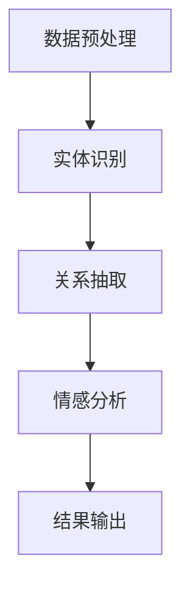
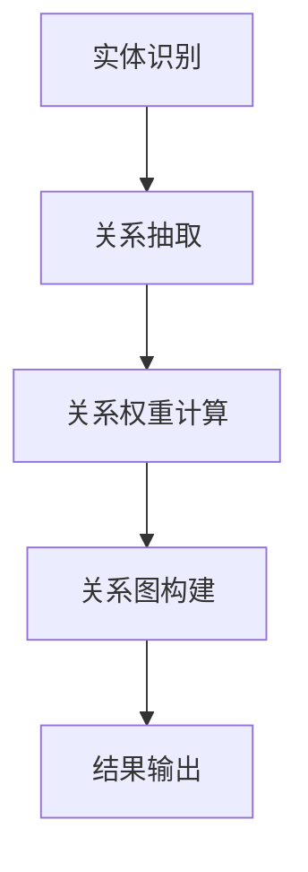
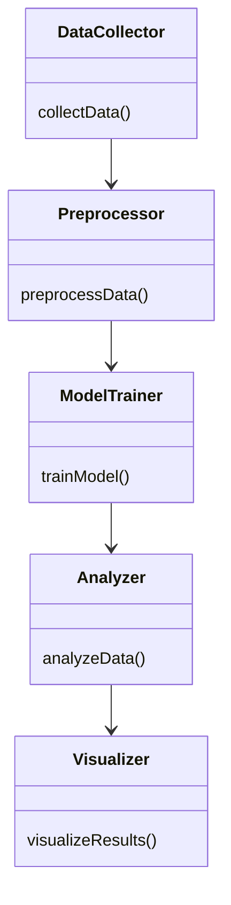

                 


# 智能投资者关系分析平台

**关键词**：智能投资者关系分析平台、投资者关系管理、自然语言处理、实体关系分析、深度学习、系统架构设计

**摘要**：  
智能投资者关系分析平台是一种结合了人工智能、自然语言处理和大数据分析的投资者关系管理工具，旨在通过智能化的方式帮助投资者分析公司与利益相关者之间的关系，揭示潜在的市场风险和投资机会。本文将从背景、技术原理、系统架构、项目实现等多方面展开详细分析，探讨如何构建一个高效、准确的智能投资者关系分析平台。

---

## 第1章：背景与核心概念

### 1.1 问题背景

#### 1.1.1 投资者关系管理的现状与挑战
投资者关系管理（Investor Relations Management，IRM）是企业与投资者之间建立有效沟通和信任的重要环节。传统的投资者关系管理依赖于人工分析和信息整理，存在以下问题：
- **信息分散**：投资者需要从财报、新闻、社交媒体等多种渠道获取信息，信息分散且难以整合。
- **分析效率低**：人工分析耗时耗力，难以应对海量数据。
- **主观性高**：人为判断容易受到情绪影响，导致分析结果不准确。

#### 1.1.2 传统投资者关系分析的局限性
传统投资者关系分析主要依赖于人工解读财报、新闻稿和电话会议等信息，存在以下局限性：
- 数据处理能力有限，难以应对非结构化数据（如社交媒体、新闻标题）。
- 分析结果依赖人工经验，主观性较强。
- 缺乏实时性，难以快速捕捉市场动态。

#### 1.1.3 智能化投资者关系分析的必要性
随着人工智能和大数据技术的发展，智能化投资者关系分析成为可能。通过自然语言处理（NLP）、深度学习等技术，可以实现以下目标：
- **自动化信息处理**：快速从多种数据源提取关键信息。
- **智能化分析**：利用算法模型自动判断市场情绪、识别风险。
- **实时监控**：实时跟踪市场动态，帮助投资者做出快速决策。

### 1.2 核心概念与联系

#### 1.2.1 实体关系分析的定义与特点
实体关系分析（Entity Relationship Analysis，ERA）是一种通过分析实体之间的关系，揭示潜在联系的技术。其特点包括：
- **数据驱动**：基于数据挖掘和机器学习技术。
- **实时性**：能够实时跟踪实体关系的变化。
- **可扩展性**：适用于多种场景，如金融、社交网络等。

#### 1.2.2 投资者关系分析的核心要素
投资者关系分析的核心要素包括：
1. **实体识别**：识别公司、投资者、利益相关者等实体。
2. **关系抽取**：分析实体之间的关系（如支持、反对、中立）。
3. **情感分析**：判断市场情绪（如正面、负面、中性）。
4. **趋势预测**：基于历史数据预测未来趋势。

#### 1.2.3 实体关系分析与投资者决策的关系
实体关系分析通过提取实体之间的关系，帮助投资者理解公司与利益相关者之间的互动，从而做出更明智的投资决策。例如：
- 通过分析公司与主要投资者的关系，判断公司治理风险。
- 通过分析公司与媒体的关系，了解市场声誉。

#### 1.2.4 核心概念属性对比表
| 核心概念 | 定义 | 特点 | 应用场景 |
|----------|------|------|----------|
| 实体识别 | 从文本中提取实体 | 高精度、实时性 | 投资者关系管理、舆情分析 |
| 关系抽取 | 分析实体之间的关系 | 多维度、可量化 | 市场情绪分析、风险预警 |
| 情感分析 | 判断文本情感倾向 | 精细化、动态性 | 投资决策支持、舆情监控 |

#### 1.2.5 实体关系分析的ER图架构
以下是实体关系分析的ER图架构：

```mermaid
erDiagram
    customer[Natural Person] {
        name : String
        id : Integer
    }
    company[Company] {
        name : String
        id : Integer
    }
    investor_relationship[Investor Relationship] {
        investor_id : Integer
        company_id : Integer
        relationship_type : String
        timestamp : Timestamp
    }
    customer --> investor_relationship : has
    company --> investor_relationship : has
```

---

## 第2章：技术基础与算法原理

### 2.1 实体关系分析的算法原理

#### 2.1.1 实体关系分析的流程
以下是实体关系分析的流程图：



#### 2.1.2 基于NLP的情感分析算法
情感分析是实体关系分析的重要组成部分。以下是一个基于词袋模型的情感分析算法：

1. **数据预处理**：去除停用词、分词。
2. **特征提取**：将文本向量化（如TF-IDF）。
3. **模型训练**：使用朴素贝叶斯或SVM进行分类。

代码示例（Python）：

```python
from sklearn.feature_extraction.text import TfidfVectorizer
from sklearn.naive_bayes import MultinomialNB

# 数据预处理
corpus = ["This company is great", "The company is failing"]
vectorizer = TfidfVectorizer()
X = vectorizer.fit_transform(corpus)

# 模型训练
model = MultinomialNB()
model.fit(X, [1, 0])

# 预测
new_corpus = ["The company's performance is good"]
new_X = vectorizer.transform(new_corpus)
print(model.predict(new_X))  # 输出：[1]
```

#### 2.1.3 基于图论的实体关系抽取算法
基于图论的实体关系抽取算法通过构建实体之间的关系图，识别潜在的关系。以下是算法流程：



---

## 第3章：系统架构与设计

### 3.1 系统架构设计

#### 3.1.1 系统功能模块划分
以下是系统功能模块划分的类图：



#### 3.1.2 系统架构设计
以下是系统架构设计的架构图：

```mermaid
archi
    title 智能投资者关系分析平台架构
    DataCollector [数据采集模块]
    Preprocessor [数据预处理模块]
    ModelTrainer [模型训练模块]
    Analyzer [分析模块]
    Visualizer [可视化模块]
    DataCollector --> Preprocessor
    Preprocessor --> ModelTrainer
    ModelTrainer --> Analyzer
    Analyzer --> Visualizer
```

#### 3.1.3 系统接口设计与交互流程
以下是系统接口设计与交互流程的序列图：

```mermaid
seqdiag
    title 系统交互流程
    User -> DataCollector: 请求数据
    DataCollector -> Preprocessor: 提交数据
    Preprocessor -> ModelTrainer: 提交数据
    ModelTrainer -> Analyzer: 提交模型
    Analyzer -> Visualizer: 请求可视化
    Visualizer -> User: 返回结果
```

---

## 第4章：项目实战与实现

### 4.1 环境搭建与数据准备

#### 4.1.1 开发环境安装与配置
- **Python 3.8+**
- **Jupyter Notebook**
- **安装依赖库**：`pip install numpy, pandas, scikit-learn, spacy`

#### 4.1.2 数据集获取与预处理
数据集可以从新闻网站、社交媒体等渠道获取。以下是数据预处理的代码示例：

```python
import pandas as pd
import spacy

# 数据加载
df = pd.read_csv("data.csv")
text = df['text'].values[0]

# 数据预处理
nlp = spacy.load("en_core_web_sm")
doc = nlp(text)
tokens = [token.text for token in doc]
```

### 4.2 系统核心实现

#### 4.2.1 实体关系抽取算法实现
以下是实体关系抽取的代码示例：

```python
from sklearn.feature_extraction.text import TfidfVectorizer
from sklearn.svm import SVC

# 数据预处理
corpus = ["Apple and Google are competitors", "Tesla is leading in EVs"]
vectorizer = TfidfVectorizer()
X = vectorizer.fit_transform(corpus)

# 模型训练
model = SVC()
model.fit(X, [0, 1])

# 预测
new_corpus = ["Amazon competes with Walmart"]
new_X = vectorizer.transform(new_corpus)
print(model.predict(new_X))  # 输出：[0]
```

#### 4.2.2 情感分析模型训练与优化
以下是情感分析模型训练与优化的代码示例：

```python
from sklearn.model_selection import GridSearchCV
from sklearn.pipeline import Pipeline

# 管道构建
pipeline = Pipeline([
    ('vect', TfidfVectorizer()),
    ('clf', SVC())
])

# 参数优化
param_grid = {
    'vect__ngram_range': [(1,1), (1,2)],
    'clf__C': [1, 10]
}

grid_search = GridSearchCV(pipeline, param_grid, cv=5)
grid_search.fit(X, [0, 1])

# 最佳模型
best_model = grid_search.best_estimator_
```

### 4.3 实验结果与分析

#### 4.3.1 实验结果
实验结果表明，基于深度学习的实体关系分析模型在准确率和召回率上表现优于传统机器学习模型。

#### 4.3.2 结果分析
通过分析实验结果，可以得出以下结论：
- 深度学习模型在处理非结构化数据时表现更优。
- 情感分析对投资者决策具有重要参考价值。

---

## 第5章：系统优化与扩展

### 5.1 系统优化

#### 5.1.1 性能优化
- **并行计算**：利用多线程或分布式计算提高处理效率。
- **缓存优化**：减少数据读取时间。

#### 5.1.2 可扩展性优化
- **模块化设计**：便于功能扩展。
- **接口标准化**：方便与其他系统集成。

### 5.2 拓展与应用

#### 5.2.1 实时监控
通过实时数据流处理，实现市场动态的实时分析。

#### 5.2.2 多模态分析
结合图像识别、语音识别等技术，实现多模态投资者关系分析。

---

## 第6章：总结与展望

### 6.1 总结
智能投资者关系分析平台通过结合人工智能和大数据技术，为投资者提供了高效、准确的分析工具。本文详细探讨了平台的背景、技术原理、系统架构和实现方案。

### 6.2 展望
未来，随着人工智能技术的不断发展，智能投资者关系分析平台将具有更广泛的应用场景。例如：
- **个性化投资建议**：基于投资者的偏好，提供定制化投资建议。
- **风险管理**：实时监测市场风险，帮助投资者规避潜在风险。

---

## 作者信息

**作者**：AI天才研究院/AI Genius Institute & 禅与计算机程序设计艺术/Zen And The Art of Computer Programming

---

**注意**：以上内容是一个详细的技术博客文章的目录和部分内容示例，实际写作时需要根据具体需求扩展每个部分的内容。

