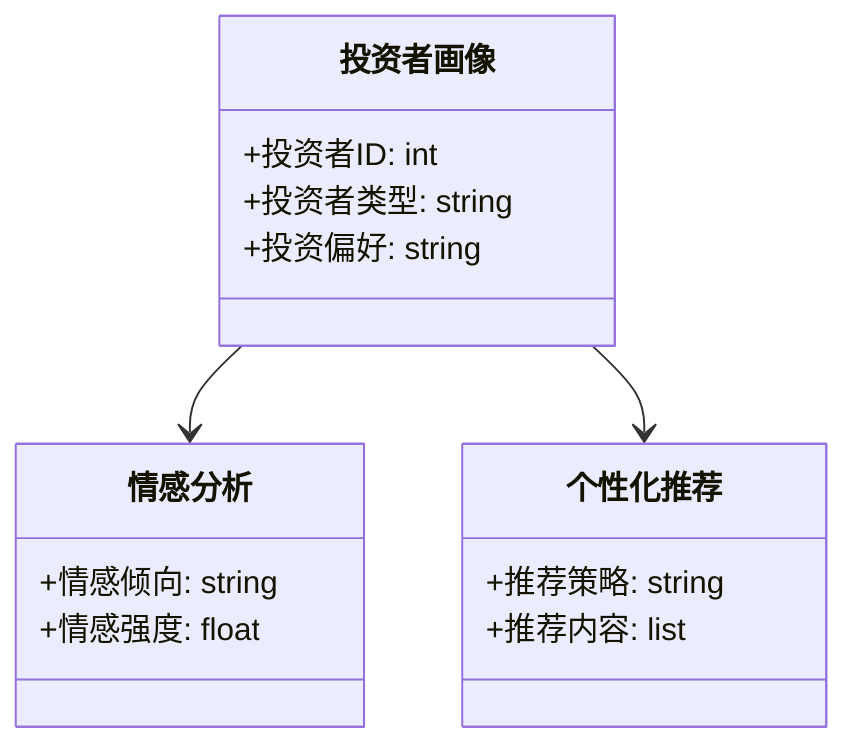
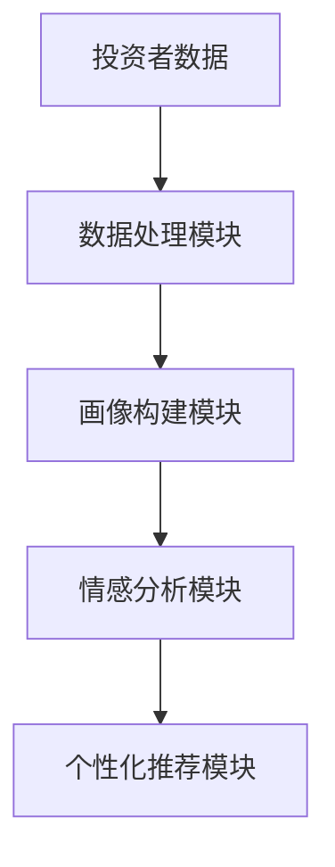

                 


# 智能投资者关系管理平台

**关键词**：智能投资者关系管理、人工智能、投资者画像、情感分析、信息处理

**摘要**：智能投资者关系管理平台利用人工智能技术，通过投资者画像、情感分析和信息处理，提升投资者关系管理的效率和精准度。本文详细探讨其核心概念、算法原理、系统架构及项目实战，帮助读者全面理解并应用该平台。

---

# 第一部分: 背景介绍

## 第1章: 传统投资者关系管理的痛点

### 1.1 投资者关系管理的定义与现状
投资者关系管理（IRM）是企业与投资者之间建立有效沟通和管理的过程，旨在提升投资者对企业信息的获取和理解，增强投资者信任感和满意度。然而，随着金融市场的发展，传统IRM方法面临数据量大、信息复杂、反馈滞后等问题，难以满足投资者的多样化需求。

### 1.2 传统投资者关系管理的局限性
- **信息处理效率低**：传统方法依赖人工处理大量投资者数据，耗时且容易出错。
- **个性化服务不足**：难以针对不同投资者提供定制化服务。
- **反馈滞后**：传统方法通常无法实时分析投资者情绪和需求。

### 1.3 智能投资者关系管理的提出
智能投资者关系管理通过引入人工智能技术，解决传统IRM的痛点。利用自然语言处理、机器学习等技术，智能平台能够高效处理投资者数据，实时分析情感，提供个性化服务。

### 1.4 智能投资者关系管理的边界与外延
智能投资者关系管理专注于通过AI技术优化投资者体验，其边界包括数据采集、情感分析和个性化推荐，外延则涉及投资者画像和信息处理。

---

## 第2章: 智能投资者关系管理的核心要素

### 2.1 投资者画像的构建
投资者画像是基于投资者行为、偏好和反馈构建的个性化模型，帮助企业更好地理解投资者需求。构建投资者画像是通过收集和分析投资者数据，利用聚类分析等技术，将投资者分为不同类别。

### 2.2 投资者需求的分类
投资者需求多样化，包括信息获取、投资决策支持等。通过分析投资者的行为和反馈，可以将需求分为几类，并提供相应的服务。

### 2.3 投资者画像与需求分析的联系
投资者画像是需求分析的基础，通过画像识别投资者群体，进而分析其具体需求，制定个性化的服务策略。

---

# 第二部分: 核心概念与联系

## 第3章: 投资者画像的核心概念

### 3.1 投资者画像的构建过程
- **数据采集**：收集投资者的基本信息、投资行为数据等。
- **数据预处理**：清洗和归一化数据，确保数据质量。
- **聚类分析**：利用K-means算法将投资者分为不同群体。

### 3.2 投资者画像的属性特征
- **年龄**：不同年龄段投资者的风险偏好不同。
- **投资金额**：金额大小影响投资者对信息的需求。
- **投资类型**：股票、基金等不同类型的投资者关注点不同。

### 3.3 投资者画像与需求分析的关系
通过投资者画像识别投资者群体，进而分析其具体需求，制定个性化的服务策略。

---

## 第4章: 投资者需求的分类与分析

### 4.1 投资者需求的分类
- **信息需求**：投资者需要及时准确的市场信息。
- **决策支持需求**：投资者需要专业的投资建议。
- **互动需求**：投资者希望与企业保持良好的互动。

### 4.2 投资者需求分析的关键点
- **实时性**：投资者需要及时的信息反馈。
- **个性化**：不同投资者的需求差异显著。
- **准确性**：信息的准确性和相关性至关重要。

### 4.3 投资者需求与画像的关系
投资者画像帮助识别投资者群体，需求分析则针对每个群体提供具体服务。

---

# 第三部分: 核心概念之间的关系

## 第5章: 投资者画像与需求分析的关系

### 5.1 投资者画像对需求分析的支持
通过构建投资者画像，企业可以更准确地识别投资者需求，制定个性化的服务策略。

### 5.2 投资者需求分析对画像的反馈
投资者的需求反馈可以帮助优化投资者画像，提高画像的准确性和适用性。

---

## 第6章: 投资者画像与需求分析的联系

### 6.1 投资者画像与需求分析的相互作用
通过不断分析投资者需求，优化投资者画像，实现画像与需求分析的动态平衡。

### 6.2 投资者画像与需求分析的协同效应
两者协同工作，能够显著提升投资者关系管理的效率和精准度。

---

# 第四部分: 算法原理

## 第7章: 自然语言处理在投资者关系管理中的应用

### 7.1 自然语言处理的核心算法
- **分词**：将文本分割成词语。
- **词性标注**：识别词语的词性。
- **情感分析**：判断文本的情感倾向。

### 7.2 投资者情感分析的实现
通过自然语言处理技术，分析投资者评论中的情感倾向，帮助企业了解投资者情绪。

### 7.3 情感分析的数学模型
$$
P(\text{正面}|x) = \frac{\text{正面词数}}{\text{总词数}}
$$

### 7.4 情感分析的代码实现
```python
from textblob import TextBlob
text = "这个公司的业绩很好"
blob = TextBlob(text)
print(blob.sentiment.polarity)
```

---

## 第8章: 机器学习在投资者画像构建中的应用

### 8.1 机器学习的核心算法
- **聚类分析**：K-means算法。
- **分类算法**：决策树、随机森林。

### 8.2 投资者画像的构建步骤
1. 数据预处理。
2. 特征提取。
3. 模型训练。
4. 模型评估。

### 8.3 聚类分析的数学模型
$$
\text{目标函数} = \sum_{i=1}^{k} \sum_{j=1}^{n_i} \|x_j - c_i\|^2
$$

### 8.4 聚类分析的代码实现
```python
from sklearn.cluster import KMeans
X = [[1,2], [3,4], [5,6]]
model = KMeans(n_clusters=2)
model.fit(X)
print(model.labels_)
```

---

# 第五部分: 系统分析与架构设计

## 第9章: 系统功能设计

### 9.1 领域模型设计
通过Mermaid类图展示系统的各个模块及其关系。



### 9.2 系统架构设计
通过Mermaid架构图展示系统的整体架构。



### 9.3 接口设计
- **数据接口**：与数据库交互。
- **API接口**：提供给前端调用。

### 9.4 交互设计
通过Mermaid序列图展示系统的交互流程。

```mermaid
sequenceDiagram
   投资者发起请求->>数据处理模块
   数据处理模块->>画像构建模块
   画像构建模块->>情感分析模块
    情感分析模块->>个性化推荐模块
    个性化推荐模块->>投资者
```

---

# 第六部分: 项目实战

## 第10章: 环境安装与配置

### 10.1 环境要求
- Python 3.8及以上。
- 安装相关库：numpy, pandas, scikit-learn, textblob。

### 10.2 安装步骤
```bash
pip install numpy pandas scikit-learn textblob
```

---

## 第11章: 核心代码实现

### 11.1 投资者画像的构建代码
```python
from sklearn.cluster import KMeans
import pandas as pd

# 假设我们有投资者数据
data = pd.DataFrame({
    '投资金额': [1000, 2000, 1500],
    '投资类型': ['股票', '基金', '债券']
})

# 数据预处理
# 特征提取
X = data[['投资金额', '投资类型']]

# 模型训练
model = KMeans(n_clusters=2)
model.fit(X)

# 获取聚类结果
data['投资者类型'] = model.labels_
print(data)
```

### 11.2 情感分析的代码实现
```python
from textblob import TextBlob

text = "这个公司的业绩很好"
blob = TextBlob(text)
print(blob.sentiment.polarity)  # 输出情感倾向
```

---

## 第12章: 项目案例分析

### 12.1 案例背景
某企业希望通过智能投资者关系管理平台，提升投资者体验。

### 12.2 数据处理与分析
通过数据处理和分析，构建投资者画像，并进行情感分析，制定个性化推荐策略。

### 12.3 实施效果
实施后，投资者满意度显著提升，互动频率增加。

---

## 第13章: 项目小结

### 13.1 核心代码总结
通过代码实现投资者画像和情感分析，提升投资者关系管理的效率。

### 13.2 案例分析总结
智能投资者关系管理平台能够显著提升投资者体验和企业竞争力。

---

# 第七部分: 最佳实践

## 第14章: 实战经验总结

### 14.1 小结
智能投资者关系管理平台通过人工智能技术，显著提升投资者关系管理的效率和精准度。

### 14.2 注意事项
- 数据隐私保护。
- 模型的持续优化。

### 14.3 拓展阅读
建议读者进一步学习自然语言处理和机器学习的相关知识，深入了解智能投资者关系管理的更多应用场景。

---

# 作者

**作者**：AI天才研究院/AI Genius Institute & 禅与计算机程序设计艺术 /Zen And The Art of Computer Programming

---

通过以上结构，我详细地分析了智能投资者关系管理平台的背景、核心概念、算法原理、系统架构和项目实战，帮助读者全面理解并应用这一技术。

