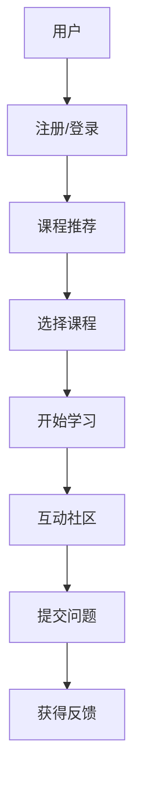
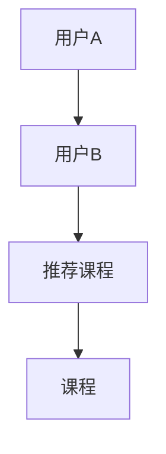

                 


# 智能投资者教育平台开发

## 关键词：智能投资者教育、人工智能、大数据、教育平台、系统设计

## 摘要：智能投资者教育平台通过结合人工智能和大数据技术，为投资者提供个性化、实时化的学习和决策支持。本文详细探讨了平台的背景、技术基础、系统设计、核心算法实现以及项目实战，帮助读者深入了解智能投资者教育平台的开发与应用。

---

## 第一部分: 背景与概述

### 第1章: 智能投资者教育平台的背景与概述

#### 1.1 什么是智能投资者教育平台
智能投资者教育平台是一种利用人工智能和大数据技术，为投资者提供个性化学习、实时数据分析与反馈的在线教育平台。平台通过智能推荐系统、自然语言处理等技术，帮助投资者提升金融知识和投资能力。

#### 1.2 投资者教育的重要性
投资者教育是帮助个人和机构投资者做出明智决策的关键。传统的投资者教育依赖于线下讲座和书籍，难以满足个性化和实时性的需求。随着人工智能和大数据技术的发展，智能投资者教育平台能够提供更加精准和高效的教育服务。

#### 1.3 智能投资者教育平台的技术背景
人工智能和大数据技术在金融领域的广泛应用，使得投资者教育更加智能化。通过机器学习算法，平台能够分析投资者的行为和需求，提供个性化的学习内容和投资建议。大数据技术则帮助平台收集和分析海量金融数据，为投资者提供实时的市场动态和趋势分析。

#### 1.4 平台的核心价值
智能投资者教育平台的核心价值在于提供个性化的学习体验、实时的数据分析与反馈，以及社区互动与知识共享。通过这些功能，平台能够帮助投资者提升金融知识，优化投资决策，降低投资风险。

#### 1.5 本章小结
本章介绍了智能投资者教育平台的定义、重要性、技术背景和核心价值，为后续章节的深入分析奠定了基础。

---

## 第二部分: 技术基础与核心概念

### 第2章: 人工智能与大数据在投资者教育中的应用

#### 2.1 人工智能的基本概念
人工智能（AI）是指模拟人类智能的计算机系统，包括机器学习、自然语言处理、计算机视觉等技术。在投资者教育中，AI被用于个性化推荐、情感分析和智能客服等领域。

#### 2.2 大数据技术的核心概念
大数据技术指的是处理海量、多样化数据的方法，包括数据采集、存储、处理、分析和可视化。在投资者教育中，大数据技术用于分析市场动态、用户行为和投资偏好。

#### 2.3 人工智能与大数据的结合
人工智能与大数据的结合使得投资者教育更加智能化。通过大数据分析，AI算法能够精准识别投资者的需求，提供个性化的学习内容和投资建议。例如，基于机器学习的推荐系统可以根据投资者的历史行为和市场数据，推荐相关的课程和投资策略。

---

## 第三部分: 系统设计与架构

### 第3章: 智能投资者教育平台的系统设计

#### 3.1 系统功能模块划分
智能投资者教育平台的功能模块包括用户管理、课程推荐、互动社区、数据分析和个性化学习。每个模块都有其独特的功能和交互方式。

#### 3.2 系统架构设计
系统的架构设计采用分层架构，包括前端、后端和数据层。前端负责用户界面，后端负责业务逻辑，数据层负责存储和处理数据。模块之间的交互通过API实现，确保系统的高效和可扩展性。

#### 3.3 系统流程图
以下是系统的流程图，展示了用户注册、登录、课程推荐和互动社区的主要流程：



---

## 第四部分: 核心算法与实现

### 第4章: 智能投资者教育平台的核心算法实现

#### 4.1 协同过滤算法
协同过滤是一种基于用户行为的推荐算法，广泛应用于课程推荐系统。以下是协同过滤的流程图：



#### 4.2 协同过滤算法的Python实现
以下是协同过滤算法的Python代码示例：

```python
import numpy as np
from sklearn.metrics.pairwise import cosine_similarity

# 示例数据：用户-课程评分矩阵
user_course_matrix = np.array([
    [4, 3, 0],
    [3, 5, 0],
    [0, 0, 4]
])

# 计算余弦相似性
similarity = cosine_similarity(user_course_matrix)

# 定义推荐函数
def recommend_courses(user_id, similarity_matrix, user_course_matrix):
    # 获取当前用户的相似用户
    similar_users = np.where(similarity_matrix[user_id] > 0.5)[0]
    # 计算推荐分数
    recommendation_scores = np.mean(user_course_matrix[similar_users], axis=0)
    # 推荐分数降序排序
    recommended_courses = np.argsort(-recommendation_scores)
    return recommended_courses

# 示例推荐
user_id = 0
recommended_courses = recommend_courses(user_id, similarity, user_course_matrix)
print("Recommended courses for user", user_id, ":", recommended_courses)
```

#### 4.3 基于深度学习的情感分析算法
以下是基于深度学习的情感分析算法的Python代码示例：

```python
import tensorflow as tf
from tensorflow.keras import layers

# 示例数据：用户评论
comments = [
    "This course is very helpful!",
    "The content is confusing.",
    "I love this course!"
]

# 数据预处理
tokenizer = tf.keras.preprocessing.text.Tokenizer(num_words=1000)
tokenizer.fit_on_texts(comments)
sequences = tokenizer.texts_to_sequences(comments)
x = tf.keras.preprocessing.sequence.pad_sequences(sequences, maxlen=10)
y = [1, 0, 1]

# 模型构建
model = tf.keras.Sequential([
    layers.Embedding(1000, 16),
    layers.LSTM(32),
    layers.Dense(2, activation='softmax')
])
model.compile(loss='sparse_categorical_crossentropy', optimizer='adam', metrics=['accuracy'])

# 训练模型
model.fit(x, y, epochs=5, batch_size=32)

# 情感分析
new_comment = "This course is great!"
new_sequence = tokenizer.texts_to_sequences([new_comment])
new_x = tf.keras.preprocessing.sequence.pad_sequences(new_sequence, maxlen=10)
prediction = model.predict(new_x)
print("Prediction:", prediction)
```

---

## 第五部分: 项目实战

### 第5章: 智能投资者教育平台的开发与实现

#### 5.1 开发环境搭建
开发智能投资者教育平台需要以下环境：
- Python 3.8+
- Jupyter Notebook
- TensorFlow 2.5+
- scikit-learn 0.24+

#### 5.2 核心模块实现
以下是平台的核心模块实现，包括用户管理、课程推荐和数据分析：

```python
# 用户管理模块
class UserManager:
    def __init__(self):
        self.users = {}

    def register(self, user_id, username, password):
        self.users[user_id] = {'username': username, 'password': password}

    def login(self, user_id, password):
        if user_id in self.users and self.users[user_id]['password'] == password:
            return True
        return False

# 课程推荐模块
class CourseRecommender:
    def __init__(self, user_course_matrix):
        self.user_course_matrix = user_course_matrix

    def recommend(self, user_id):
        # 协同过滤算法
        similar_users = np.where(cosine_similarity(self.user_course_matrix)[user_id] > 0.5)[0]
        recommendation_scores = np.mean(self.user_course_matrix[similar_users], axis=0)
        recommended_courses = np.argsort(-recommendation_scores)
        return recommended_courses

# 数据分析模块
class DataAnalyzer:
    def __init__(self, market_data):
        self.market_data = market_data

    def analyze(self, start_date, end_date):
        # 示例分析
        filtered_data = self.market_data[(self.market_data['date'] >= start_date) & (self.market_data['date'] <= end_date)]
        return filtered_data
```

#### 5.3 测试与优化
测试平台的功能，包括用户注册、登录、课程推荐和数据分析。根据测试结果优化算法和系统架构，确保平台的高效性和稳定性。

#### 5.4 实际案例分析
以实际市场数据为例，展示平台如何进行数据分析和课程推荐，帮助投资者做出明智的决策。

---

## 第六部分: 总结与展望

### 第6章: 智能投资者教育平台的总结与展望

#### 6.1 本章总结
智能投资者教育平台通过结合人工智能和大数据技术，为投资者提供了个性化的学习和决策支持。平台的核心功能包括用户管理、课程推荐、互动社区和数据分析，能够有效提升投资者的金融知识和投资能力。

#### 6.2 未来展望
未来，智能投资者教育平台可以通过引入更多先进的技术，如区块链和虚拟现实，进一步提升平台的安全性和沉浸式体验。同时，平台可以扩展更多的功能模块，如智能投资顾问和实时市场预警，为投资者提供更加全面的服务。

---

## 作者：AI天才研究院/AI Genius Institute & 禅与计算机程序设计艺术 /Zen And The Art of Computer Programming

