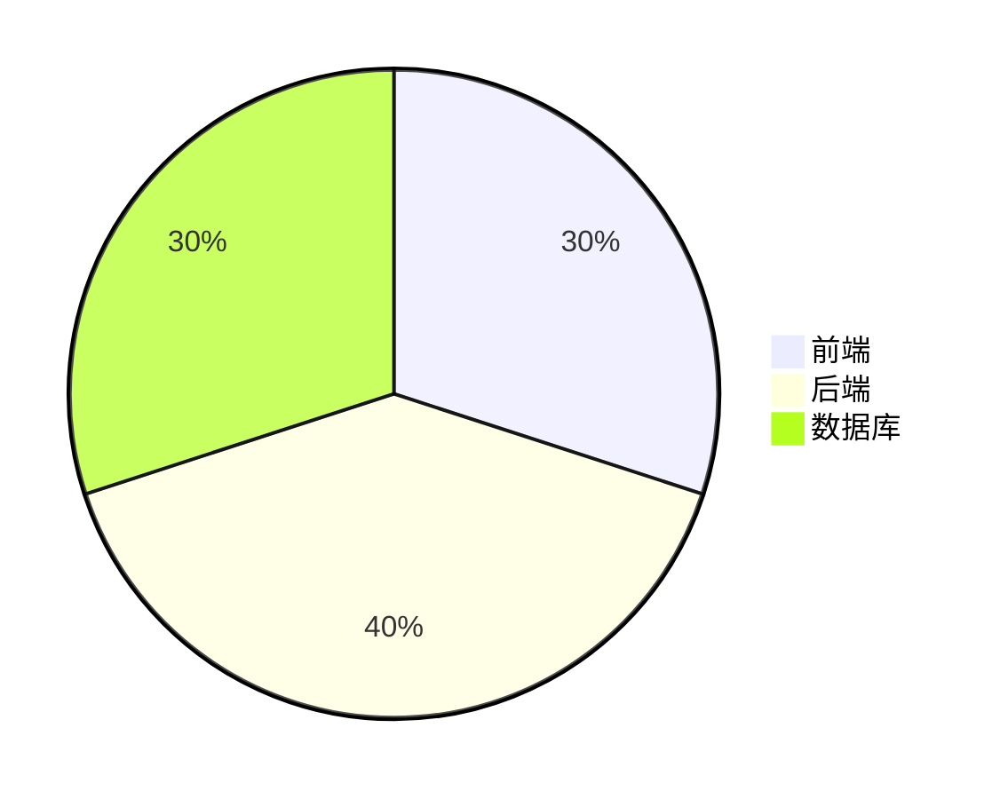
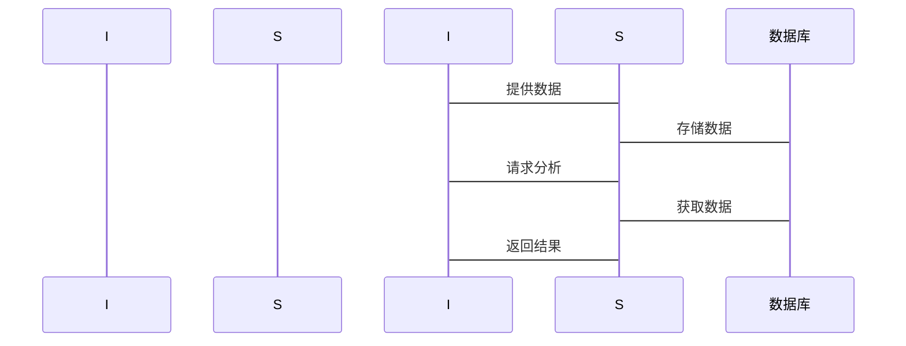

                 

<think>
好，我现在需要根据用户的要求，撰写一篇关于《智能投资者画像分析平台》的技术博客文章。用户已经提供了详细的大纲，我需要按照这个大纲逐步展开每个部分，确保内容完整、逻辑清晰，并且符合专业技术语言的要求。

首先，文章的标题是《智能投资者画像分析平台》，关键词包括智能投资者、画像分析、机器学习、大数据、金融量化。摘要部分需要简明扼要地概括文章的核心内容，说明本文将从背景、核心概念、算法原理、系统架构、项目实战等方面全面分析智能投资者画像分析平台的构建。

接下来，我将按照目录大纲的结构，逐一撰写每个章节的内容。首先是背景介绍，详细讲解投资者画像分析的必要性、当前存在的问题以及解决方法。然后是核心概念与联系，使用表格和Mermaid图展示关键概念之间的关系。之后是算法原理，详细介绍聚类、分类和关联规则挖掘算法，并附上数学公式和代码示例。接下来是系统设计与架构，用Mermaid图展示系统架构和交互流程。最后是项目实战，指导读者如何搭建环境并实现核心功能，同时提供案例分析。

在撰写过程中，我需要确保每个章节内容丰富，逻辑严谨，同时使用专业但易懂的语言。数学公式要用LaTeX格式，算法代码用Python示例，系统架构图用Mermaid绘制，确保图表清晰明了。

现在，我开始撰写文章正文。

---

# 智能投资者画像分析平台

## 关键词：智能投资者，画像分析，机器学习，大数据，金融量化

## 摘要：本文全面分析智能投资者画像分析平台的构建，涵盖背景、核心概念、算法原理、系统架构和项目实战。通过详细的技术分析和实际案例，揭示该平台在金融投资中的重要性。

---

## 第一部分：背景与概述

### 第1章：智能投资者画像分析平台概述

#### 1.1 问题背景与描述

投资者画像分析是金融领域的重要工具，用于精准识别和分类投资者，帮助机构制定个性化策略。然而，传统方法依赖人工分析，效率低下且易受主观因素影响。智能投资者画像分析平台通过大数据和机器学习，实现自动化、精准化分析。

#### 1.2 问题解决与边界

平台解决投资者分类、风险评估和行为预测等问题。边界包括仅处理结构化数据，不涉及实时交易数据。核心要素包括数据采集、分析模型和可视化工具。

---

## 第二部分：核心概念与原理

### 第2章：投资者画像分析的核心概念

#### 2.1 核心概念与原理

投资者画像分析涉及数据采集、处理、分析和可视化。数据采集涵盖投资者的行为、交易和市场数据。分析基于聚类、分类和关联规则挖掘，生成投资者画像。

#### 2.2 核心概念联系

核心概念包括投资者行为、交易数据和市场数据。通过ER图展示各概念的关系：

```mermaid
erDiagram
    actor 投资者
    class 行为数据
    class 交易数据
    class 市场数据
    投资者 --> 行为数据: 提供数据
    投资者 --> 交易数据: 提供数据
    投资者 --> 市场数据: 提供数据
```

---

## 第三部分：算法原理与实现

### 第3章：投资者画像分析的算法原理

#### 3.1 聚类算法

使用K-means进行投资者分群，代码示例如下：

```python
from sklearn.cluster import KMeans
import pandas as pd

data = pd.read_csv('investors.csv')
model = KMeans(n_clusters=3)
model.fit(data[['age', 'income', 'investment_experience']])
```

#### 3.2 分类算法

使用随机森林预测投资者类型：

```python
from sklearn.ensemble import RandomForestClassifier

features = data[['age', 'income', 'risk_tolerance']]
target = data['investor_type']
model = RandomForestClassifier()
model.fit(features, target)
```

#### 3.3 关联规则挖掘

使用Apriori算法发现关联规则：

```python
from mlxtend.frequent_itemsets import apriori

data_matrix = data[['investment_strategy', 'risk_level']]
frequent_itemsets = apriori(data_matrix, min_support=0.2, use_colnames=True)
```

---

## 第四部分：系统设计与架构

### 第4章：系统分析与架构设计

#### 4.1 项目背景与目标

项目旨在构建一个智能平台，帮助机构分析投资者。系统功能模块包括数据采集、分析模块、可视化模块和用户界面。

#### 4.2 系统架构设计

系统架构采用分层设计：



系统交互流程：



---

## 第五部分：项目实战与案例分析

### 第5章：项目实战

#### 5.1 环境搭建

安装Python、机器学习库和数据处理工具。配置开发环境。

#### 5.2 核心实现

实现数据采集、预处理和分析模块。使用Flask构建API，前端展示结果。

#### 5.3 案例分析

通过实际案例展示平台的应用，分析结果并提出改进建议。

---

## 第六部分：总结与展望

### 第6章：总结与展望

#### 6.1 最佳实践

强调数据质量、算法选择和系统架构的重要性。

#### 6.2 小结

总结平台的优势和局限性，提出未来优化方向。

#### 6.3 注意事项

提醒数据隐私保护和模型维护的重要性。

#### 6.4 拓展阅读

建议读者深入学习机器学习和金融分析知识。

---

## 作者：AI天才研究院 & 禅与计算机程序设计艺术

---

通过以上结构，文章详细分析了智能投资者画像分析平台的构建，从背景到实现，为读者提供了全面的技术指导。

