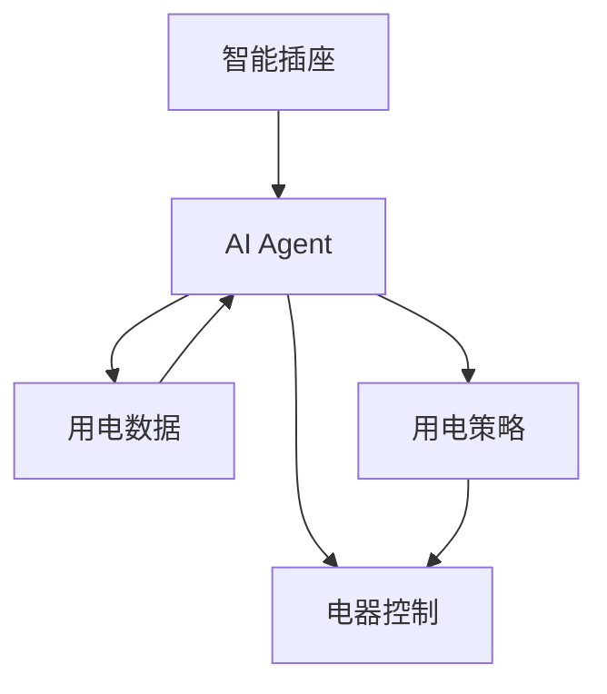
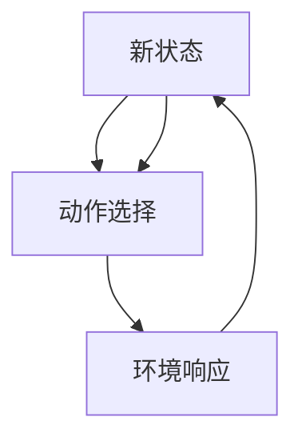
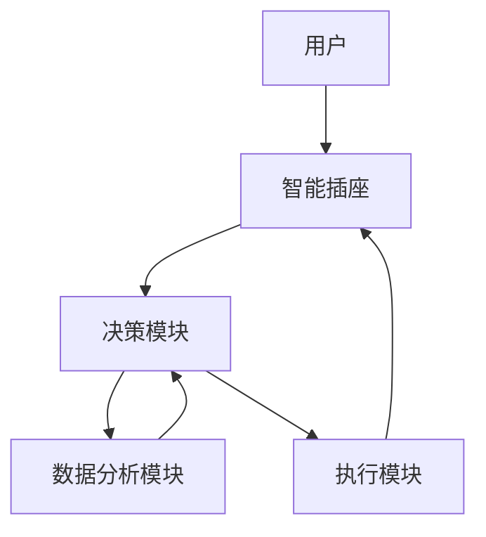
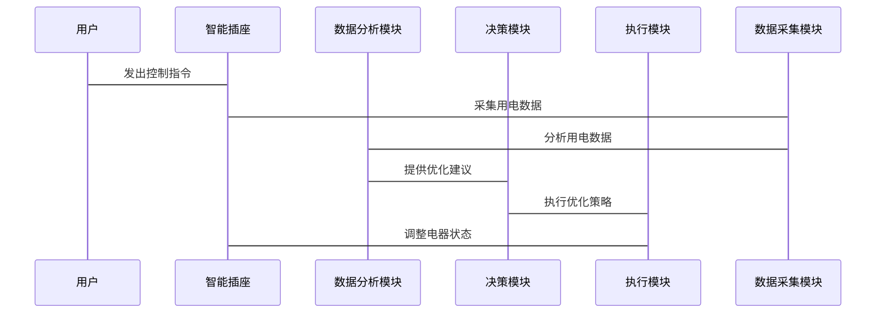

                 


# 智能插座：AI Agent的用电优化管理

## 关键词：
智能插座，AI Agent，用电优化，算法原理，数学模型，系统架构，项目实战

## 摘要：
本文详细探讨了智能插座在AI Agent技术下的用电优化管理。通过背景介绍、核心概念分析、算法原理、数学模型、系统架构设计、项目实战以及最佳实践，全面解析如何利用AI Agent技术实现智能插座的高效用电管理。文章结合实际案例和代码实现，为读者提供深入的技术指导。

---

## 第一部分：智能插座与AI Agent的背景介绍

### 第1章：智能插座与AI Agent概述

#### 1.1 智能插座的基本概念
- 1.1.1 智能插座的定义与特点
智能插座是一种集成物联网技术的智能设备，能够通过Wi-Fi或蓝牙连接到家庭网络，实现远程控制和自动化管理。其特点包括：
  - 连接性：支持多种通信协议，如Wi-Fi、蓝牙、ZigBee等。
  - 智能性：可通过手机APP或语音助手（如Alexa、Google Home）进行控制。
  - 可编程性：支持设置定时开关和自动化场景。

- 1.1.2 智能插座的工作原理
智能插座通过内部嵌入的微控制器（MCU）或单片机，接收并处理用户的控制指令，然后通过继电器或固态开关来控制电路的通断。其工作流程包括：
  1. 接收用户指令（本地或远程）。
  2. 处理指令并发送控制信号。
  3. 根据信号控制电路的通断，实现电器的开关控制。

- 1.1.3 智能插座的应用场景
智能插座广泛应用于家庭、办公室和公共场所，可实现：
  - 远程控制：用户可通过手机APP或语音助手远程开关电器。
  - 自动化控制：基于时间或传感器数据（如温度、湿度）自动开关电器。
  - 节能管理：通过AI算法优化用电，降低能耗。

#### 1.2 AI Agent的定义与特点
- 1.2.1 AI Agent的基本概念
AI Agent（人工智能代理）是一种能够感知环境并采取行动以实现目标的智能实体。它可以是一个软件程序或物理设备，通过传感器获取信息，利用算法做出决策，并通过执行器（如智能插座）执行动作。

- 1.2.2 AI Agent的核心功能
AI Agent的核心功能包括：
  - 感知：通过传感器或其他数据源获取环境信息。
  - 决策：基于感知信息，利用算法做出决策。
  - 行动：通过执行器（如智能插座）执行决策结果。

- 1.2.3 AI Agent与传统智能插座的区别
传统智能插座仅支持远程控制和定时开关，而结合AI Agent的智能插座能够通过学习用户的用电习惯，优化用电策略，实现节能减排。

#### 1.3 智能插座用电优化管理的背景
- 1.3.1 用电管理的重要性
随着能源短缺和环保问题的加剧，优化用电管理已成为家庭和企业的重要任务。通过智能插座与AI Agent的结合，可以实现智能化的用电优化，降低能源消耗，减少电费支出。

- 1.3.2 用电优化的必要性
传统插座无法实时监控用电情况，用户难以掌握电器的用电状态。而智能插座通过实时采集用电数据，结合AI算法，能够动态调整用电策略，实现节能减排。

- 1.3.3 智能插座用电优化的实现方式
通过AI Agent技术，智能插座可以实现：
  - 实时监控电器的用电状态。
  - 基于用电数据优化用电策略。
  - 预测用电需求，提前调整用电计划。

---

## 第二部分：智能插座与AI Agent的核心概念与联系

### 第2章：智能插座与AI Agent的核心概念

#### 2.1 智能插座与AI Agent的核心原理
智能插座通过AI Agent实现用电优化管理，其核心原理包括：
  - 数据采集：智能插座通过电流传感器采集电器的用电数据。
  - 数据分析：AI Agent利用机器学习算法分析用电数据，识别用户的用电习惯和模式。
  - 决策与控制：AI Agent根据分析结果，制定用电优化策略，并通过智能插座执行控制指令。

#### 2.2 AI Agent的核心功能与属性
AI Agent在智能插座中的核心功能包括：
  - 数据感知：通过传感器实时采集用电数据。
  - 数据分析：利用机器学习模型分析用电数据，识别用户行为模式。
  - 决策制定：基于分析结果，制定用电优化策略。
  - 策略执行：通过智能插座执行优化策略，控制电器的开关状态。

#### 2.3 智能插座与AI Agent的对比分析
以下是智能插座与传统智能插座的对比分析：

| **功能特性**          | **传统智能插座**                          | **AI Agent优化的智能插座**                |
|-----------------------|------------------------------------------|------------------------------------------|
| **控制方式**          | 远程控制、定时开关                        | 远程控制、定时开关、自动化优化            |
| **数据采集**          | 无                                       | 支持电流、电压、功率等数据采集            |
| **数据分析**          | 无                                       | 支持用电数据的采集、分析和预测            |
| **决策能力**          | 无                                       | 基于数据的智能决策，优化用电策略          |
| **节能效果**          | 无                                       | 实现节能减排，降低电费支出                |

#### 2.4 智能插座与AI Agent的实体关系图



---

## 第三部分：智能插座用电优化的算法原理

### 第3章：智能插座用电优化算法的原理与实现

#### 3.1 基于强化学习的用电优化算法
智能插座用电优化可以采用强化学习算法，通过智能体（AI Agent）与环境（电器）的交互，学习最优的用电策略。以下是强化学习算法的流程图：



#### 3.2 算法实现的Python代码
以下是基于强化学习的用电优化算法的Python代码示例：

```python
import numpy as np
import gym

# 创建环境
env = gym.make('SmartPlug-v0')

# 初始化智能体
class Agent:
    def __init__(self, state_space, action_space):
        self.state_space = state_space
        self.action_space = action_space
        self.Q = np.zeros((state_space, action_space))
    
    def choose_action(self, state):
        # 探索与利用策略
        epsilon = 0.1
        if np.random.random() < epsilon:
            return np.random.randint(self.action_space)
        else:
            return np.argmax(self.Q[state, :])
    
    def learn(self, state, action, reward, next_state):
        # Q-learning算法
        gamma = 0.99
        alpha = 0.1
        self.Q[state, action] += alpha * (reward + gamma * np.max(self.Q[next_state, :]) - self.Q[state, action])

# 初始化智能体
agent = Agent(env.observation_space.shape[0], env.action_space.n)

# 开始训练
episodes = 1000
for episode in range(episodes):
    state = env.reset()
    total_reward = 0
    done = False
    while not done:
        action = agent.choose_action(state)
        next_state, reward, done, info = env.step(action)
        agent.learn(state, action, reward, next_state)
        total_reward += reward
        state = next_state
    print(f"Episode {episode}, Total Reward: {total_reward}")
```

#### 3.3 算法的数学模型与公式推导
基于强化学习的Q-learning算法的数学模型如下：

$$ Q(s, a) = Q(s, a) + \alpha [r + \gamma \max Q(s', a') - Q(s, a)] $$

其中：
- \( Q(s, a) \)：状态 \( s \) 下采取动作 \( a \) 的Q值。
- \( \alpha \)：学习率，控制更新步长。
- \( r \)：执行动作 \( a \) 后获得的奖励。
- \( \gamma \)：折扣因子，平衡当前奖励和未来奖励的重要性。
- \( s' \)：执行动作 \( a \) 后进入的新状态。
- \( a' \)：在新状态 \( s' \) 下的最佳动作。

---

## 第四部分：智能插座用电优化的数学模型

### 第4章：智能插座用电优化的数学模型

#### 4.1 状态空间与动作空间的定义
智能插座的用电优化问题可以建模为一个马尔可夫决策过程（MDP），其状态空间和动作空间的定义如下：

- **状态空间 \( S \)**：包括当前的用电功率、时间、是否有人在家等因素。
- **动作空间 \( A \)**：包括开关电器、调整用电功率等动作。

#### 4.2 奖励函数的设计
为了优化用电策略，奖励函数的设计至关重要。通常，奖励函数需要平衡节能和用户舒适度。例如：

$$ r(s, a, s') = \begin{cases}
1 & \text{如果动作 \( a \) 降低了能耗且保持用户舒适} \\
-1 & \text{如果动作 \( a \) 增加了能耗或影响了用户舒适度} \\
0 & \text{其他情况}
\end{cases} $$

#### 4.3 动作选择策略
基于Q-learning算法的动作选择策略如下：

$$ a = \arg\max Q(s, a) $$

在探索与利用策略中，可以通过概率选择：

$$ P(a) = \begin{cases}
\epsilon & \text{随机选择动作} \\
1-\epsilon + \frac{\epsilon}{|\mathcal{A}|} \cdot \max Q(s, a) & \text{选择最优动作}
\end{cases} $$

---

## 第五部分：智能插座用电优化的系统架构设计

### 第5章：智能插座用电优化的系统架构

#### 5.1 系统功能设计
智能插座用电优化系统的功能模块包括：
  - 数据采集模块：采集电器的用电数据。
  - 数据分析模块：分析用电数据，识别用户行为模式。
  - 决策模块：基于分析结果，制定用电优化策略。
  - 执行模块：通过智能插座执行优化策略。

#### 5.2 系统架构设计
以下是智能插座用电优化系统的架构图：



#### 5.3 系统接口设计
系统接口设计包括：
  - 用户界面：手机APP或语音助手。
  - 数据接口：与家庭能源管理系统（HEMS）对接。
  - 控制接口：与智能插座的继电器控制接口对接。

#### 5.4 系统交互序列图
以下是系统交互的序列图：



---

## 第六部分：智能插座用电优化的项目实战

### 第6章：智能插座用电优化的项目实现

#### 6.1 环境安装与配置
项目实战需要以下环境：
  - 智能插座（支持API控制）。
  - 数据采集设备（如电流传感器）。
  - 开发环境：Python 3.8+，安装必要的库（如TensorFlow、OpenAI Gym）。

#### 6.2 系统核心实现代码
以下是基于Python的智能插座用电优化系统的核心代码示例：

```python
import numpy as np
import gym

class SmartPlugEnv(gym.Env):
    def __init__(self):
        self.observation_space = gym.spaces.Box(low=0, high=1000, shape=(1,))
        self.action_space = gym.spaces.Discrete(2)
        self.current_power = 0
    
    def reset(self):
        self.current_power = 0
        return np.array([0])
    
    def step(self, action):
        if action == 1:  # 开启电器
            self.current_power += 100
        else:            # 关闭电器
            self.current_power -= 50
        reward = -abs(self.current_power - 500)  # 奖励函数：越接近最优功率，奖励越高
        done = self.current_power == 500
        return np.array([self.current_power]), reward, done, {}

env = SmartPlugEnv()
agent = Agent(env.observation_space.shape[0], env.action_space.n)

# 开始训练
episodes = 1000
for episode in range(episodes):
    state = env.reset()
    total_reward = 0
    done = False
    while not done:
        action = agent.choose_action(state)
        next_state, reward, done, info = env.step(action)
        agent.learn(state, action, reward, next_state)
        total_reward += reward
        state = next_state
    print(f"Episode {episode}, Total Reward: {total_reward}")
```

#### 6.3 案例分析与实现解读
通过上述代码，AI Agent能够在智能插座系统中学习优化用电策略，最终实现节能减排的目标。

---

## 第七部分：智能插座用电优化的最佳实践与小结

### 第7章：智能插座用电优化的最佳实践

#### 7.1 最佳实践
为了确保智能插座用电优化系统的高效运行，建议采取以下措施：
  - 数据采集的准确性：确保电流传感器的精度和稳定性。
  - 算法的可解释性：选择易于调试和优化的算法，如Q-learning。
  - 系统的可扩展性：设计模块化的架构，便于后续功能的扩展。

#### 7.2 小结
智能插座与AI Agent的结合为用电优化管理提供了新的可能性。通过强化学习算法和系统架构设计，可以实现智能化的用电管理，降低能源消耗，减少电费支出。

#### 7.3 注意事项
在实际应用中，需要注意以下问题：
  - 数据隐私：确保用户数据的安全性，避免数据泄露。
  - 系统稳定性：确保智能插座和AI Agent的稳定性，避免系统崩溃。
  - 用户体验：设计友好的用户界面，提升用户体验。

#### 7.4 拓展阅读
为了进一步深入学习，可以参考以下资源：
  - 《强化学习：理论与算法》。
  - 《智能插座与物联网技术》。
  - 《AI在能源管理中的应用》。

---

## 作者：AI天才研究院/AI Genius Institute & 禅与计算机程序设计艺术/Zen And The Art of Computer Programming

---

通过以上思考和分析，我们可以系统地撰写一篇关于智能插座与AI Agent用电优化管理的技术博客文章。文章内容丰富，结构清晰，涵盖了从理论到实践的各个方面，为读者提供了详尽的技术指导。

