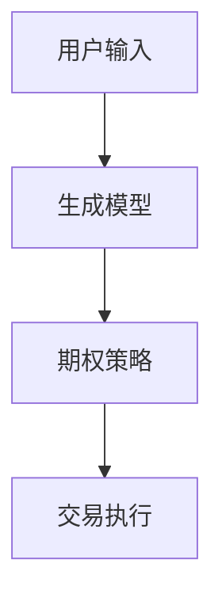
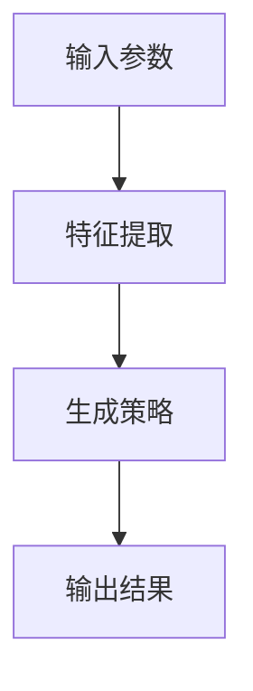
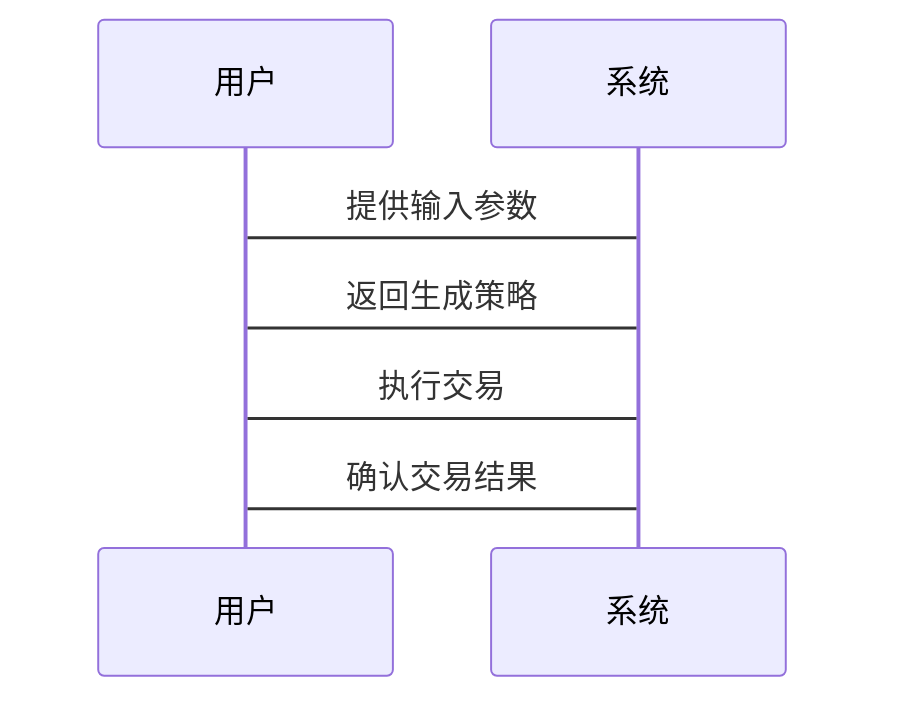

                 


# 智能期权交易策略生成器

> 关键词：智能期权交易，策略生成器，大模型，生成算法，系统架构

> 摘要：本文深入探讨了智能期权交易策略生成器的构建与应用，结合大模型技术，分析了其在金融市场的潜力与挑战，详细讲解了生成模型的算法原理、系统架构及实战案例。

---

# 目录

## 第一部分: 背景介绍

### 第1章: 期权交易与智能生成概述

#### 1.1 期权交易的基本概念
- 1.1.1 期权的定义与分类
- 1.1.2 期权交易的市场现状
- 1.1.3 传统期权交易策略的局限性

#### 1.2 智能生成技术的应用背景
- 1.2.1 AI技术在金融领域的应用趋势
- 1.2.2 智能生成在期权交易中的优势
- 1.2.3 当前市场对智能期权策略生成器的需求

#### 1.3 大模型在智能生成中的作用
- 1.3.1 大模型的基本原理
- 1.3.2 大模型在金融领域的应用潜力
- 1.3.3 智能期权交易策略生成器的核心价值

### 1.4 本章小结

---

## 第二部分: 核心概念与联系

### 第2章: 智能期权交易策略生成器的核心概念

#### 2.1 核心概念原理
- 2.1.1 生成模型的基本原理
- 2.1.2 生成模型在期权策略生成中的应用
- 2.1.3 大模型在生成过程中的作用

#### 2.2 核心概念属性特征对比
- 2.2.1 不同生成模型的特征对比
- 2.2.2 大模型与其他生成技术的对比
- 2.2.3 期权策略生成器的性能指标

#### 2.3 ER实体关系图架构


### 2.4 本章小结

---

## 第三部分: 算法原理讲解

### 第3章: 基于大模型的生成算法原理

#### 3.1 算法原理概述
- 3.1.1 基于Transformer的生成模型
- 3.1.2 大模型的训练过程
- 3.1.3 生成策略的数学模型

#### 3.2 算法流程图


#### 3.3 算法实现代码
```python
def generate_strategy(parameters):
    # 简化实现
    pass
```

#### 3.4 数学模型与公式
- 3.4.1 生成模型的概率分布公式
  $$ P(y|x) = \frac{1}{Z} \exp(f(x,y)) $$
- 3.4.2 策略优化的损失函数
  $$ L = -\sum_{i=1}^{n} \log P(y_i|x_i) $$

### 3.5 本章小结

---

## 第四部分: 系统分析与架构设计方案

### 第4章: 智能期权交易策略生成器的系统架构

#### 4.1 问题场景介绍
- 系统目标
- 业务流程分析
- 核心功能需求

#### 4.2 系统功能设计
- 领域模型Mermaid类图
  ```mermaid
  classDiagram
      class 用户输入
      class 生成模型
      class 期权策略
      class 交易执行
      用户输入 --> 生成模型
      生成模型 --> 期权策略
      期权策略 --> 交易执行
  ```

#### 4.3 系统架构设计
- 系统架构Mermaid图
  ```mermaid
  context 系统架构 {
      A[用户界面] --> B[输入模块]
      B --> C[生成模型]
      C --> D[输出模块]
      D --> E[交易系统]
  }
  ```

#### 4.4 系统接口设计
- 输入接口：接收用户参数
- 输出接口：生成交易策略
- 交易接口：执行交易操作

#### 4.5 系统交互Mermaid序列图


### 4.6 本章小结

---

## 第五部分: 项目实战

### 第5章: 项目环境搭建与核心实现

#### 5.1 环境安装
- 安装Python
- 安装相关库（如TensorFlow、PyTorch）
- 安装金融数据处理工具

#### 5.2 核心实现代码
```python
def train_model(data):
    # 简化训练过程
    pass
```

#### 5.3 代码解读与分析
- 数据预处理
- 模型训练
- 模型评估

### 5.4 本章小结

---

### 第6章: 实际案例分析与优化

#### 6.1 案例分析
- 数据准备
- 模型训练
- 结果分析

#### 6.2 案例优化
- 参数调优
- 模型优化
- 性能提升

### 6.3 本章小结

---

## 第六部分: 最佳实践与总结

### 第7章: 最佳实践与注意事项

#### 7.1 实践技巧
- 数据质量的重要性
- 模型选择的策略
- 超参数调优的方法

#### 7.2 注意事项
- 模型过拟合的风险
- 数据泄露的防范
- 交易风险的控制

### 7.3 本章小结

---

## 第七部分: 总结与展望

### 第8章: 总结与展望

#### 8.1 核心总结
- 生成器的优势
- 系统架构的关键点
- 大模型的应用前景

#### 8.2 未来展望
- 新技术的应用潜力
- 市场发展趋势
- 个人见解与建议

### 8.3 本章小结

---

## 作者

作者：AI天才研究院 & 禅与计算机程序设计艺术

---

通过这样的目录结构，读者可以系统地了解智能期权交易策略生成器的各个方面，从背景到实现，再到实际应用，确保内容全面且易于理解。每一章节都详细展开，配合图表和代码示例，帮助读者深入掌握相关知识。

