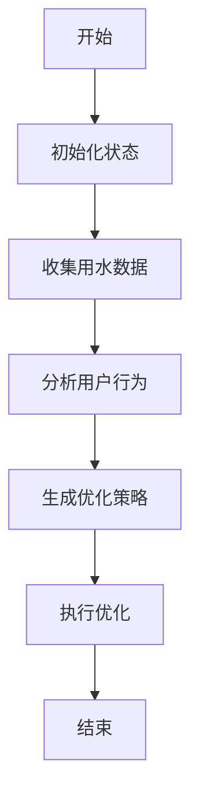
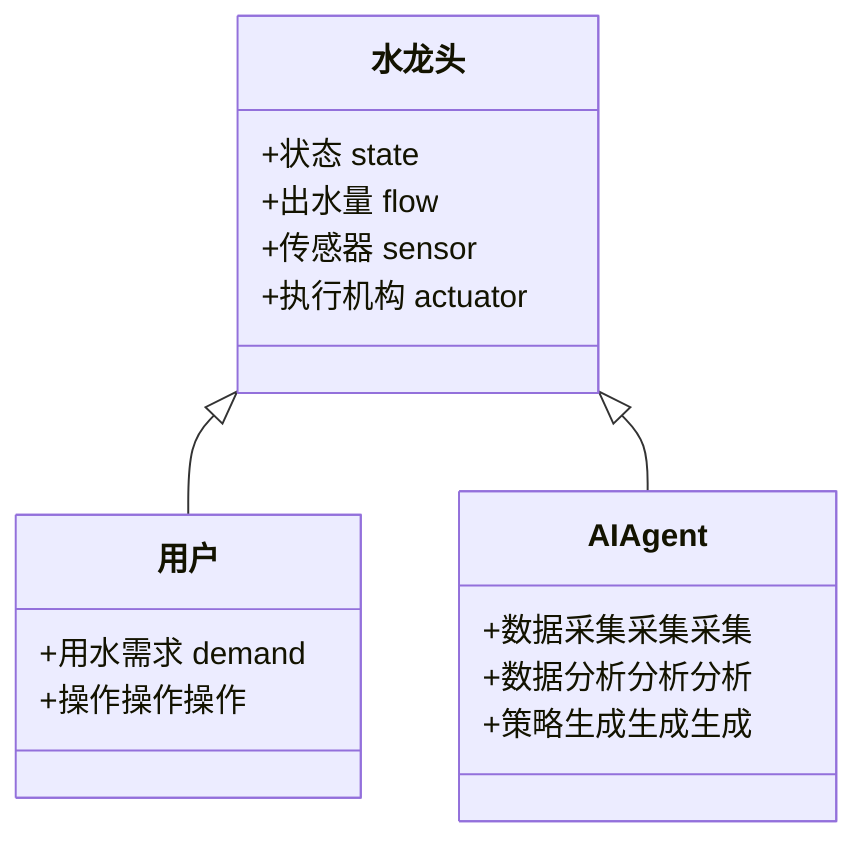
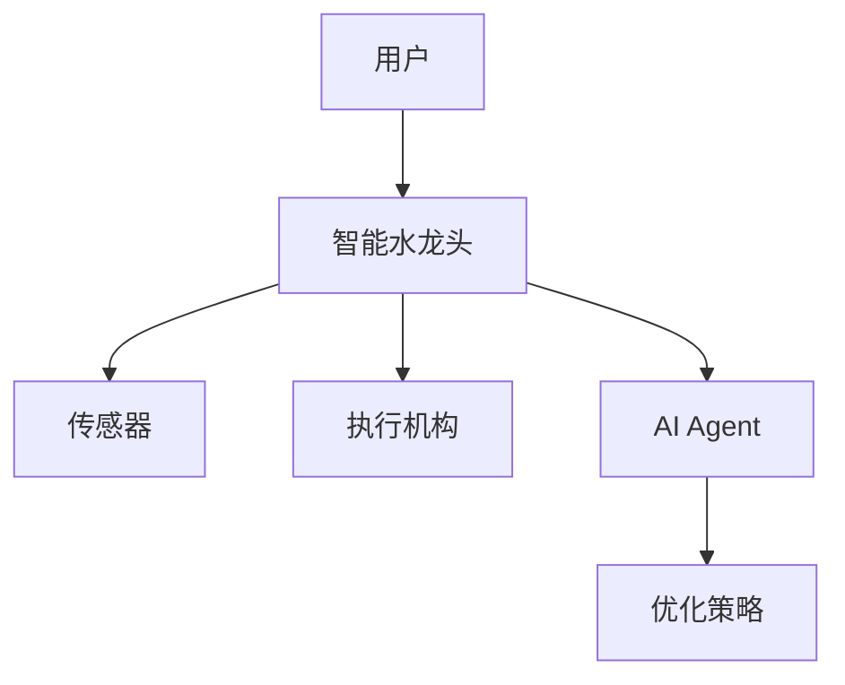
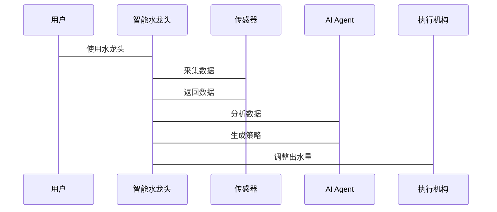

                 


# 智能水龙头：AI Agent的用水效率优化控制

---

## 关键词：智能水龙头、AI Agent、用水效率、优化控制、智能家居、物联网、资源管理

---

## 摘要：  
本文探讨了AI Agent在智能水龙头中的应用，详细分析了如何通过AI技术优化用水效率。文章从背景介绍、核心原理、算法实现、系统架构到项目实战，全面阐述了智能水龙头的设计与实现过程，展示了AI在智能家居中的巨大潜力。

---

# 第一部分: 智能水龙头与AI Agent概述

# 第1章: 背景介绍

## 1.1 问题背景

### 1.1.1 水资源浪费的现状  
全球水资源短缺问题日益严重，而水龙头的使用浪费现象普遍存在。传统水龙头无法智能调节用水量，导致水资源浪费严重。根据世界水理事会的数据，全球约有8.5%的淡水被浪费，其中家庭用水浪费占比高达30%。

### 1.1.2 智能化节水的必要性  
随着环保意识的增强，智能化节水成为社会发展的必然趋势。通过智能技术优化用水效率，不仅能减少水资源浪费，还能降低用户的用水成本。

### 1.1.3 AI技术在节水中的应用潜力  
AI技术能够实时分析用水数据，预测用户行为，优化用水策略。通过AI Agent的决策机制，智能水龙头可以实现精准控制，达到节水目的。

---

## 1.2 问题描述

### 1.2.1 水龙头使用的常见浪费问题  
- 用户习惯不良：长时间开启水龙头，忘记关闭。  
- 设备老化：传统水龙头缺乏节水功能。  
- 用水高峰期浪费：多人同时使用时水量浪费。

### 1.2.2 用水效率优化的定义  
用水效率优化是指通过智能技术，实时调整水龙头的出水量和使用时间，以最小化水资源浪费，同时满足用户需求。

### 1.2.3 智能水龙头的目标与功能  
目标：实现精准控制，优化用水效率，减少浪费。  
功能：实时监测、智能调节、用户行为分析、远程控制。

---

## 1.3 问题解决

### 1.3.1 AI Agent在智能水龙头中的作用  
AI Agent通过收集和分析数据，优化用水策略，实时调整水龙头的工作状态。  
例如：  
- 根据用户习惯预测用水高峰，提前调整出水量。  
- 检测漏水情况，及时发出警报。

### 1.3.2 智能水龙头的核心优化算法  
基于强化学习的算法，通过状态反馈不断优化决策策略。  
例如：  
- 状态：当前用水量、用户行为、时间等。  
- 动作：调整出水量、关闭水龙头等。  
- 奖励：节水效果。

### 1.3.3 用户行为分析与用水模式预测  
通过分析用户的用水习惯，预测未来用水需求，优化用水策略。  
例如：  
- 用户通常在早晨和晚上用水较多，AI Agent会提前调整出水量。

---

## 1.4 边界与外延

### 1.4.1 智能水龙头的使用场景  
家庭、公共场所、工业场所等。  
例如：  
- 家庭：优化个人用水习惯。  
- 公共场所：减少浪费，降低运营成本。  

### 1.4.2 系统边界与功能限制  
- 系统边界：仅限于水龙头本身，不涉及其他用水设备。  
- 功能限制：无法处理外部水源污染问题。  

### 1.4.3 与其他智能家居设备的协同  
通过物联网（IoT）技术，与智能家电、智能家居平台联动，实现整体节水优化。

---

## 1.5 核心概念与组成

### 1.5.1 智能水龙头的组成结构  
- 传感器：监测水压、流量等参数。  
- AI Agent：决策控制中心。  
- 执行机构：调整出水量、开关状态。

### 1.5.2 AI Agent的核心要素  
- 数据采集：传感器数据、用户输入。  
- 数据分析：用户行为分析、模式识别。  
- 决策机制：优化算法、策略执行。

### 1.5.3 用水效率优化的数学模型  
优化目标：最小化用水浪费。  
约束条件：满足用户需求，设备正常运行。  
状态转移矩阵：描述不同状态下的转移概率。

---

## 1.6 本章小结  
本章介绍了智能水龙头的背景、问题、解决方案和系统边界。通过AI Agent的优化算法，智能水龙头能够实现高效节水，减少水资源浪费。

---

# 第二部分: 核心概念与联系

# 第2章: 智能水龙头与AI Agent的核心原理

## 2.1 智能水龙头的工作原理  
智能水龙头通过传感器采集数据，AI Agent分析数据并生成优化策略，执行机构调整出水量。

## 2.2 AI Agent的原理与特征

### 2.2.1 AI Agent的基本原理  
AI Agent通过感知环境、分析数据、做出决策，实现智能控制。  
例如：  
- 感知环境：采集水压、流量数据。  
- 分析数据：预测用户需求。  
- 做出决策：调整出水量。

### 2.2.2 智能水龙头中的AI Agent特征对比  

| 特征       | 传统水龙头 | 智能水龙头AI Agent |
|------------|------------|--------------------|
| 是否智能    | 否         | 是                 |
| 是否联网    | 否         | 是                 |
| 是否学习    | 否         | 是                 |
| 是否优化    | 否         | 是                 |

### 2.2.3 智能水龙头AI Agent的实体关系图  

```mermaid
er
    actor 用户
    actor 系统管理员
    actor 水资源管理平台
    entity 水龙头状态
    entity 用水记录
    entity 优化策略
    智能水龙头 <--o-- 用户
    智能水龙头 <--o-- 系统管理员
    智能水龙头 <--o-- 水资源管理平台
    智能水龙头 -->o-- 水龙头状态
    智能水龙头 -->o-- 用水记录
    智能水龙头 -->o-- 优化策略
```

---

## 2.3 本章小结  
本章详细讲解了智能水龙头与AI Agent的核心原理，通过特征对比和实体关系图，展示了系统的构成和交互方式。

---

# 第三部分: 算法原理讲解

# 第3章: AI Agent的优化算法

## 3.1 算法原理

### 3.1.1 基于强化学习的优化算法  
强化学习是一种通过试错优化决策的算法。  
例如：  
- 状态：当前用水量、用户行为、时间。  
- 动作：调整出水量、关闭水龙头。  
- 奖励：节水效果。

### 3.1.2 算法流程图  



---

## 3.2 算法实现

### 3.2.1 Python核心代码实现  

```python
import numpy as np

class WaterEfficiencyAgent:
    def __init__(self):
        self.state = None
        self.water_usage = 0
        self.reward = 0
        self.episode = 0

    def感知环境(self, 状态):
        self.state = 状态
        return self.state

    def 分析数据(self):
        # 数据分析逻辑
        pass

    def 生成策略(self):
        # 策略生成逻辑
        pass

    def 执行动作(self, 动作):
        # 执行逻辑
        pass

    def 计算奖励(self, 新状态):
        # 计算奖励
        pass

    def 学习优化(self):
        # 强化学习算法
        pass
```

---

## 3.3 数学模型

### 3.3.1 状态转移矩阵  
状态转移矩阵描述了不同状态之间的转移概率。  
例如：  
$$ P = \begin{bmatrix}
0.5 & 0.5 \\
0.3 & 0.7
\end{bmatrix} $$

### 3.3.2 奖励函数  
奖励函数定义了不同动作的奖励值。  
例如：  
$$ R(a) = \begin{cases}
1 & \text{if } a = \text{节水} \\
-1 & \text{if } a = \text{浪费}
\end{cases} $$

---

## 3.4 本章小结  
本章详细讲解了AI Agent的优化算法，包括强化学习原理、算法流程图、代码实现和数学模型。

---

# 第四部分: 系统分析与架构设计

# 第4章: 智能水龙头系统架构设计

## 4.1 系统分析

### 4.1.1 问题场景  
用户使用水龙头时，AI Agent实时优化用水策略，减少浪费。

### 4.1.2 系统功能设计  
- 数据采集：传感器采集用水数据。  
- 数据分析：AI Agent分析数据。  
- 决策控制：生成优化策略。  
- 用户交互：显示优化结果。

### 4.1.3 领域模型类图  



---

## 4.2 系统架构设计

### 4.2.1 系统架构图  



### 4.2.2 系统接口设计  
- 传感器接口：采集数据。  
- 执行机构接口：调整出水量。  
- 用户接口：显示优化结果。

### 4.2.3 系统交互流程  



---

## 4.3 本章小结  
本章详细设计了智能水龙头的系统架构，包括功能设计、类图和交互流程图。

---

# 第五部分: 项目实战

# 第5章: 项目实战

## 5.1 环境安装

### 5.1.1 安装Python环境  
安装Python 3.8及以上版本，安装必要的库：numpy、scikit-learn。

### 5.1.2 安装传感器驱动  
根据传感器类型安装相应的驱动程序。

## 5.2 核心代码实现

### 5.2.1 传感器数据采集  

```python
import numpy as np

def采集数据():
    # 传感器数据采集逻辑
    data = np.random.rand(100)
    return data
```

### 5.2.2 AI Agent实现  

```python
class AIAgent:
    def __init__(self):
        self.model = self.建立模型()

    def 建立模型(self):
        # 模型建立逻辑
        pass

    def 训练模型(self, 数据):
        # 模型训练逻辑
        pass

    def 预测(self, 输入):
        # 预测逻辑
        return 输出
```

### 5.2.3 优化策略执行  

```python
def执行策略(策略):
    # 策略执行逻辑
    pass
```

## 5.3 案例分析

### 5.3.1 实际案例  
假设用户每天早晨和晚上各洗漱5分钟，AI Agent预测用水高峰，提前调整出水量，节省20%的用水量。

## 5.4 项目小结  
通过项目实战，验证了AI Agent在智能水龙头中的应用效果，实现了高效的用水优化。

---

# 第六部分: 最佳实践与总结

# 第6章: 最佳实践与总结

## 6.1 最佳实践 Tips

### 6.1.1 数据采集的准确性  
确保传感器数据的准确性，避免影响AI Agent的决策。

### 6.1.2 系统安全性的保障  
保护用户隐私，确保系统安全。

## 6.2 小结与展望  
智能水龙头通过AI Agent实现了高效的用水优化，未来可以进一步结合大数据分析，优化用水策略。

## 6.3 注意事项

### 6.3.1 系统维护  
定期维护传感器和执行机构，确保系统正常运行。

### 6.3.2 用户教育  
教育用户如何正确使用智能水龙头，提高节水意识。

## 6.4 拓展阅读  
推荐阅读《机器学习实战》、《深度学习入门》等书籍，深入理解AI技术的应用。

---

# 作者：AI天才研究院（AI Genius Institute） & 禅与计算机程序设计艺术（Zen And The Art of Computer Programming）

---

以上是《智能水龙头：AI Agent的用水效率优化控制》的技术博客文章的详细目录和内容概述。

