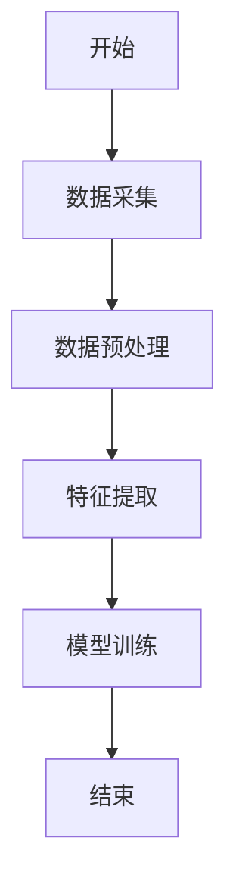
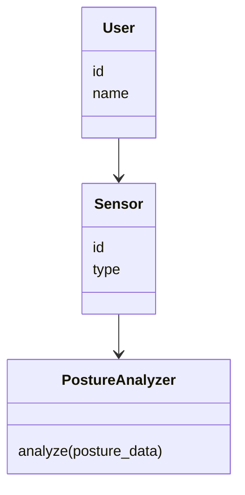
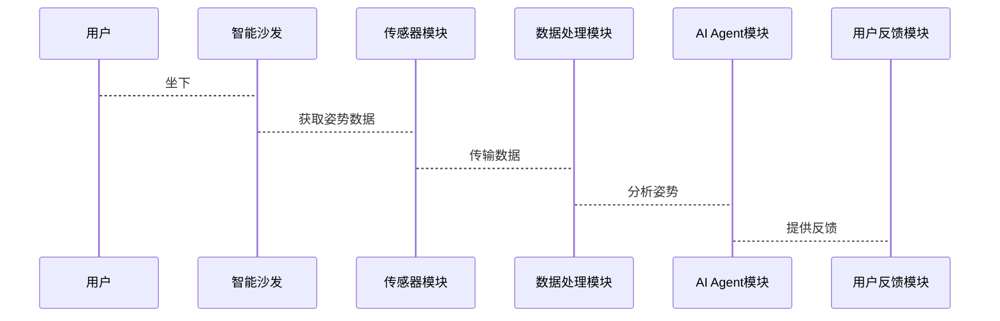

                 


# 智能沙发：AI Agent的姿势健康监测

## 关键词：AI Agent, 姿势健康监测, 智能沙发, 传感器技术, 数学模型, 机器学习, 系统架构

## 摘要：本文深入探讨了智能沙发的设计与实现，结合AI Agent技术，通过姿势健康监测改善用户体验。文章从背景到技术细节，再到实战案例，全面解析了智能沙发的创新应用。

---

# 第1章: AI Agent与姿势健康监测的背景介绍

## 1.1 问题背景与重要性

### 1.1.1 姿势健康问题的现状
现代社会中，久坐导致的健康问题日益严重，如颈椎病和腰椎病。姿势不正确是主要诱因。

### 1.1.2 AI技术在健康监测中的应用潜力
AI技术在医疗和健康监测领域的应用前景广阔，能实时分析姿势数据，提供健康建议。

### 1.1.3 智能沙发的创新意义
智能沙发结合AI技术，实时监测姿势，主动调整结构，预防健康问题。

## 1.2 问题描述与目标

### 1.2.1 姿势监测的基本需求
实时监测用户的坐姿，及时纠正不良姿势。

### 1.2.2 AI Agent在姿势健康监测中的目标
通过AI算法分析姿势数据，提供健康反馈和建议。

### 1.2.3 智能沙发的设计目标与核心功能
设计目标是改善用户姿势，核心功能包括实时监测、反馈和调整。

## 1.3 问题解决思路

### 1.3.1 姿势监测的技术路径
使用传感器采集数据，AI算法分析，提供反馈。

### 1.3.2 AI Agent的核心作用
AI Agent实时分析姿势数据，提供健康建议。

## 1.4 边界与外延

### 1.4.1 智能沙发的功能边界
限于姿势监测和反馈，不涉及其他健康监测功能。

### 1.4.2 与其他健康监测设备的区别
智能沙发注重姿势调整，其他设备监测其他健康指标。

### 1.4.3 未来可能的扩展方向
集成更多健康监测功能，如心率监测。

## 1.5 核心概念与组成

### 1.5.1 AI Agent的定义与组成
AI Agent是智能体，由感知、决策和执行模块组成。

### 1.5.2 姿势监测的核心要素
传感器、数据采集、姿势识别算法。

### 1.5.3 智能沙发的系统架构
传感器、数据处理单元、AI Agent、用户反馈界面。

---

# 第2章: AI Agent的核心概念与原理

## 2.1 AI Agent的基本原理

### 2.1.1 AI Agent的定义与分类
AI Agent是智能体，分为简单反射和复杂推理型。

### 2.1.2 基于AI的决策机制
通过感知环境，基于模型做出决策。

### 2.1.3 多智能体协作的基本原理
多智能体通过通信协作完成任务。

## 2.2 姿势监测的核心技术

### 2.2.1 姿势监测的传感器技术
使用加速度计和陀螺仪监测姿势。

### 2.2.2 数据采集与处理方法
采集姿势数据，预处理，特征提取。

### 2.2.3 姿势识别的算法原理
基于机器学习，训练分类模型识别姿势。

## 2.3 AI Agent与姿势监测的结合

### 2.3.1 AI Agent在姿势监测中的角色
实时分析姿势数据，提供反馈。

### 2.3.2 姿势数据的实时分析与反馈
AI Agent处理数据，提供实时反馈。

### 2.3.3 AI Agent的自适应学习能力
通过反馈优化姿势识别模型。

## 2.4 核心概念对比表

| 比较项       | 传统健康监测 | 智能沙发姿势监测 |
|--------------|--------------|-----------------|
| 监测对象     | 生理指标     | 坐姿            |
| 技术手段     | 传感器       | AI算法          |
| 应用场景     | 医疗         | 日常生活        |

## 2.5 ER实体关系图
```mermaid
erDiagram
    user {
        id
        name
        posture_data
    }
    sensor {
        id
        type
        location
    }
    posture_analysis {
        id
        analysis_result
        timestamp
    }
    user <----> sensor
    sensor <----> posture_analysis
```

---

# 第3章: 数学模型与算法原理

## 3.1 数学模型的建立

### 3.1.1 数据预处理
去除噪声，提取特征。

### 3.1.2 机器学习模型
使用随机森林或支持向量机分类姿势。

### 3.1.3 数学模型公式
分类模型：$$ y = \text{预测姿势} $$
特征提取：$$ X = [x_1, x_2, ..., x_n] $$

## 3.2 算法实现步骤

### 3.2.1 数据采集
传感器采集姿势数据。

### 3.2.2 数据预处理
去除噪声，归一化。

### 3.2.3 特征提取
提取关键特征，如坐姿角度。

### 3.2.4 模型训练
训练分类模型，优化参数。

## 3.3 算法流程图


## 3.4 代码实现示例

```python
import numpy as np
from sklearn.ensemble import RandomForestClassifier

# 示例数据
X = np.array([[1, 2, 3], [4, 5, 6], [7, 8, 9]])
y = np.array([0, 1, 0])

# 训练模型
model = RandomForestClassifier()
model.fit(X, y)

# 预测
new_sample = np.array([[10, 11, 12]])
prediction = model.predict(new_sample)
print(prediction)
```

---

# 第4章: 系统分析与架构设计

## 4.1 系统功能设计

### 4.1.1 领域模型


### 4.1.2 功能模块
数据采集、分析、反馈。

## 4.2 系统架构设计

### 4.2.1 架构图


## 4.3 接口设计
RESTful API接口，处理数据传输和反馈。

## 4.4 交互流程

### 4.4.1 交互流程图


---

# 第5章: 项目实战

## 5.1 环境配置

### 5.1.1 安装Python
安装Python 3.x，确保环境配置正确。

## 5.2 核心代码实现

### 5.2.1 传感器模拟
```python
import time
import numpy as np

# 传感器模拟数据
def generate_posture_data():
    return np.random.rand(3)
```

### 5.2.2 数据分析
```python
def analyze_posture(data):
    # 简单分析，返回姿势类别
    return 'good' if data[0] < 0.5 else 'bad'
```

### 5.2.3 反馈机制
```python
def provide_feedback(result):
    print(f"姿势 {result}，请调整！")
```

## 5.3 实际案例分析
分析用户数据，优化模型参数，提高准确率。

---

# 第6章: 总结与展望

## 6.1 项目总结
详细总结项目的实现过程和成果。

## 6.2 经验与教训
总结开发中的经验教训，如传感器精度问题。

## 6.3 未来展望
探讨未来可能的改进方向，如增加更多健康监测功能。

---

# 第7章: 最佳实践与小结

## 7.1 最佳实践 tips

### 7.1.1 开发建议
选择合适的传感器和算法，注重数据隐私。

### 7.1.2 代码优化
优化模型训练和数据处理效率。

### 7.1.3 测试建议
进行充分的测试，确保系统稳定性和准确性。

## 7.2 小结
回顾文章内容，强调AI技术在姿势健康监测中的重要性。

## 7.3 注意事项
注意数据隐私和传感器精度问题，确保用户体验。

## 7.4 拓展阅读
推荐阅读相关领域的书籍和论文。

---

# 作者：AI天才研究院/AI Genius Institute & 禅与计算机程序设计艺术 /Zen And The Art of Computer Programming

