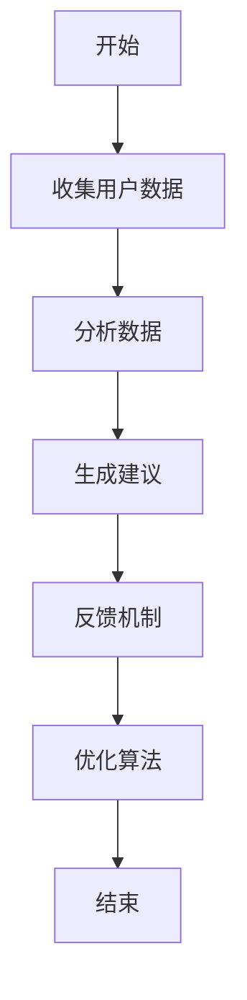
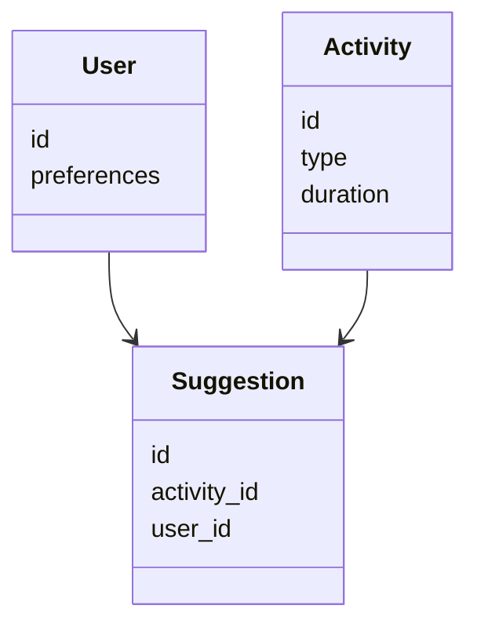

                 


# 智能沙发：AI Agent的家庭活动建议系统

## 关键词：
智能沙发, AI Agent, 家庭活动建议系统, 人工智能, 智能家居

## 摘要：
本文探讨了AI Agent在家庭环境中的应用，特别是智能沙发系统如何为家庭成员提供个性化的活动建议。通过分析系统背景、核心概念、算法原理、系统架构、项目实战和最佳实践，本文详细讲解了智能沙发系统的构建过程和实际应用，展示了AI技术在家用场景中的巨大潜力。

---

# 目录

1. [背景介绍](#背景介绍)
2. [核心概念与联系](#核心概念与联系)
3. [算法原理讲解](#算法原理讲解)
4. [系统分析与架构设计方案](#系统分析与架构设计方案)
5. [项目实战](#项目实战)
6. [最佳实践](#最佳实践)

---

## 1. 背景介绍

### 1.1 问题背景

智能家居的发展现状：
智能家居近年来快速发展，各种设备如智能音箱、智能灯泡等普及。然而，这些设备主要集中在自动化控制，缺乏智能化的建议服务。

家庭活动建议系统的必要性：
家庭成员在日常生活中可能需要建议，如选择活动、安排时间等。现有的系统多基于规则，缺乏智能性和个性化。

现有系统在个性化推荐上的不足：
现有系统通常基于固定的规则或简单的用户偏好，无法根据实时数据和用户情绪进行动态调整。

### 1.2 问题描述

家庭成员需求的多样性：
不同家庭成员的兴趣、习惯和需求各不相同，系统需要具备个性化推荐能力。

现有系统在实时性和响应性上的不足：
传统系统可能无法实时处理用户需求，导致建议不够及时和准确。

系统的实时性和响应性问题：
用户希望系统能够快速响应，提供实时的建议，而现有系统在这方面存在不足。

### 1.3 问题解决

引入AI Agent的概念：
AI Agent能够主动感知环境，理解用户需求，并提供个性化的建议。

AI Agent在家庭活动建议中的优势：
AI Agent能够实时分析用户数据，动态调整建议内容，提高建议的准确性和及时性。

解决方案的可行性分析：
AI Agent的应用在技术上是可行的，可以通过机器学习和自然语言处理等技术实现。

### 1.4 边界与外延

系统的边界定义：
智能沙发系统仅限于提供家庭活动建议，不涉及其他智能家居功能。

相关领域的对比：
与智能家居、个性化推荐系统等领域的对比，突出智能沙发的独特性。

系统的扩展性分析：
未来可以将系统扩展到更多场景，如健康建议、旅行规划等。

### 1.5 核心概念与组成

AI Agent的定义与特征：
AI Agent是能够自主决策和行动的智能实体，具备感知、推理、学习和执行的能力。

智能沙发系统的组成模块：
包括用户数据采集模块、活动推荐引擎、反馈机制模块等。

系统的核心要素及其关系：
用户需求、活动建议、反馈机制三者相互关联，共同构成系统的闭环。

---

## 2. 核心概念与联系

### 2.1 核心概念

AI Agent的基本原理：
通过感知环境、分析数据、生成建议、执行反馈的过程，为用户提供个性化的活动建议。

AI Agent的类型与特点：
根据功能和应用场景的不同，分为多种类型，如基于规则的Agent、基于机器学习的Agent等。

### 2.2 智能沙发系统的ER实体关系图

```mermaid
erDiagram
    user ++> activity
    user ++> suggestion
    activity --> suggestion
```

### 2.3 核心概念对比表

| 比较项 | AI Agent | 传统推荐系统 |
|--------|-----------|--------------|
| 决策方式 | 基于实时数据和动态调整 | 基于固定规则和历史数据 |
| 个性化程度 | 高 | 中 |
| 响应速度 | 快 | 较慢 |

---

## 3. 算法原理讲解

### 3.1 算法概述

基于决策树的活动推荐算法：
决策树通过用户特征进行分类，生成个性化建议。

基于强化学习的动态调整算法：
通过强化学习不断优化推荐策略，提高建议的准确性。

### 3.2 算法流程图



### 3.3 算法实现

基于决策树的Python代码示例：

```python
from sklearn.tree import DecisionTreeClassifier
import pandas as pd

# 假设data是一个包含用户特征的DataFrame
# features是用于训练的特征列，target是目标列
model = DecisionTreeClassifier()
model.fit(data[features], data[target])
```

基于强化学习的数学模型：

$$ R(s, a) = r_{i} \quad \text{其中} s \text{是状态，} a \text{是动作} $$

---

## 4. 系统分析与架构设计方案

### 4.1 问题场景介绍

家庭场景：
智能沙发系统在家庭环境中的应用场景，如客厅、卧室等。

典型问题：
家庭成员在选择活动时可能遇到的问题，如时间安排不合理、兴趣不匹配等。

### 4.2 项目介绍

项目名称：
智能沙发AI Agent家庭活动建议系统。

项目目标：
开发一个能够提供个性化活动建议的AI Agent系统。

项目范围：
涵盖数据采集、算法实现、系统集成等方面。

### 4.3 系统功能设计

领域模型Mermaid类图：



### 4.4 系统架构设计

系统架构Mermaid架构图：

```mermaid
archi
    前端 ---(HTTP)--> 中间件
    中间件 ---(RPC)--> 后端
    后端 ---(MongoDB)--> 数据库
```

### 4.5 系统接口设计

API接口：
- `/api/users`：用户管理接口
- `/api/activities`：活动数据接口
- `/api/suggestions`：建议生成接口

### 4.6 系统交互设计

Mermaid序列图：

```mermaid
sequenceDiagram
    user ->+> system: 请求活动建议
    system ->> database: 查询用户数据
    database --> system: 返回用户数据
    system ->> algorithm: 生成建议
    algorithm --> system: 返回建议
    system ->> user: 返回建议
```

---

## 5. 项目实战

### 5.1 环境安装

安装Python环境：
使用Anaconda或虚拟环境，确保版本兼容。

安装依赖库：
如scikit-learn、pandas、mermaid等。

### 5.2 核心代码实现

数据预处理代码：

```python
import pandas as pd

data = pd.read_csv('user_activity.csv')
data.head()
```

模型训练代码：

```python
from sklearn.tree import DecisionTreeClassifier

model = DecisionTreeClassifier()
model.fit(X, y)
```

### 5.3 代码解读与分析

数据预处理：
读取CSV文件，清洗数据，处理缺失值。

模型训练：
使用决策树模型进行训练，生成推荐算法。

系统集成：
将模型集成到系统中，实现用户请求处理和建议生成。

### 5.4 实际案例分析

案例一：
用户A偏好阅读，系统推荐适合阅读的时间段。

案例二：
用户B喜欢运动，系统建议下午进行户外活动。

### 5.5 项目小结

项目总结：
通过项目实战，掌握了AI Agent在家庭活动建议系统中的应用。

经验分享：
数据质量和算法选择对系统性能有重要影响。

---

## 6. 最佳实践

### 6.1 最佳实践tips

数据质量：
确保数据的准确性和完整性，避免偏差。

算法选择：
根据具体需求选择合适的算法，进行多次实验和调优。

系统优化：
优化代码性能，确保系统高效运行。

### 6.2 小结

系统优势：
智能沙发系统通过AI Agent提供个性化建议，提升家庭成员的生活质量。

系统不足：
在处理复杂场景时，可能需要进一步优化和调整。

### 6.3 注意事项

隐私保护：
确保用户数据的安全，遵守相关法律法规。

用户体验：
注重用户界面设计，提高用户体验。

系统维护：
定期更新算法模型，保持系统的先进性和稳定性。

### 6.4 拓展阅读

相关书籍：
推荐《机器学习实战》、《Python机器学习》等书籍。

在线资源：
提供一些在线课程和博客链接，供读者深入学习。

---

## 作者信息

作者：AI天才研究院 & 禅与计算机程序设计艺术

---

通过以上详细的技术博客文章，我们展示了AI Agent在家庭环境中的应用，详细讲解了智能沙发系统的构建过程和实际应用，为读者提供了从理论到实践的全面指导。

