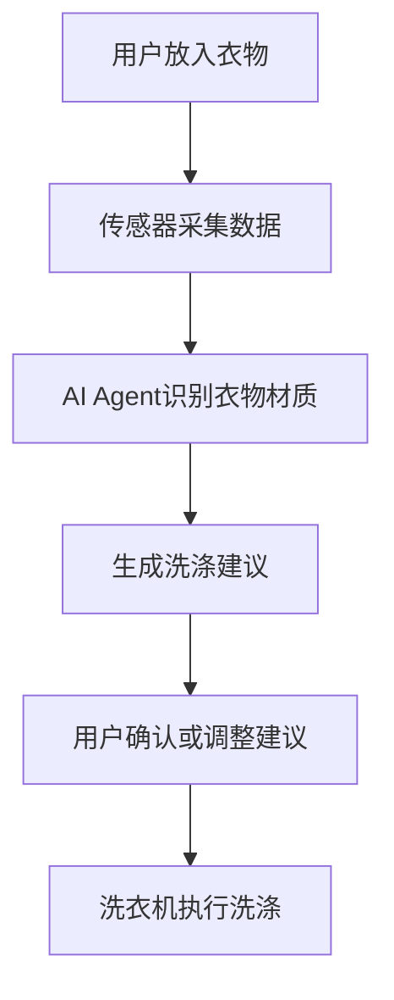
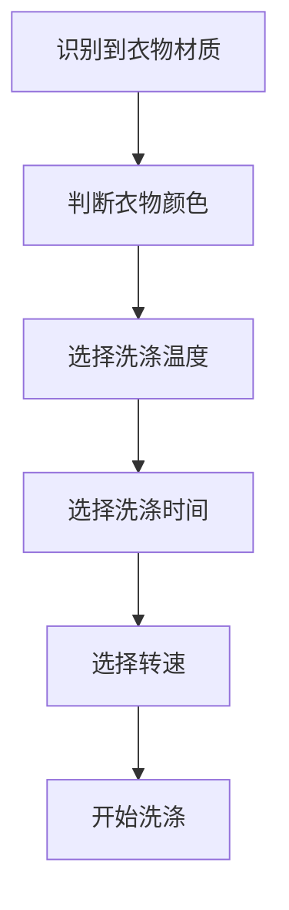
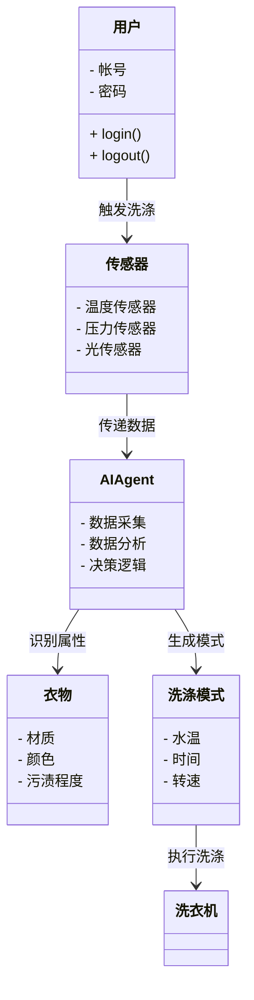
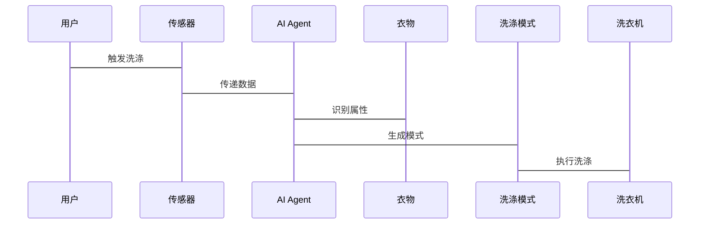

                 


# 智能洗衣机：AI Agent的衣物护理专家系统

> 关键词：智能洗衣机，AI Agent，衣物护理，系统架构，算法原理，项目实战，最佳实践

> 摘要：本文深入探讨了智能洗衣机结合AI Agent技术的衣物护理系统，从背景、核心概念、算法原理到系统架构、项目实战，全面解析了这一创新技术的应用与实现。文章通过详细的技术分析和案例解读，展示了如何利用AI技术提升传统家电的功能与用户体验，为智能家居领域的发展提供了新的思路。

---

## 第一章：背景介绍与核心概念

### 1.1 问题背景与问题描述

#### 1.1.1 洗衣机行业发展现状
洗衣机作为现代家庭不可或缺的家电之一，经历了从机械控制到电子控制的演变。然而，传统洗衣机在衣物护理方面仍存在诸多不足，例如无法智能识别衣物材质、无法根据环境调整洗涤模式等。

#### 1.1.2 现代衣物护理的需求痛点
随着人们生活水平的提高，衣物种类越来越多，对洗涤的要求也越来越高。用户希望洗衣机能够根据衣物材质、颜色、污渍程度等因素，自动调整洗涤模式，避免损坏衣物。

#### 1.1.3 AI技术在家电领域的应用趋势
AI技术的快速发展为家电行业带来了新的机遇。通过AI Agent（智能代理）技术，洗衣机可以实现更智能化的衣物护理，提升用户体验。

### 1.2 问题解决与边界定义

#### 1.2.1 AI Agent在衣物护理中的应用目标
AI Agent的目标是通过智能识别衣物属性，优化洗涤模式，提升洗涤效果，同时延长衣物寿命。

#### 1.2.2 智能洗衣机的边界与外延
智能洗衣机的边界包括：智能识别衣物材质、颜色、污渍程度；智能调整洗涤模式（如水温、洗涤时间、转速等）；与智能家居系统联动。外延包括：数据采集、云端存储与分析。

#### 1.2.3 核心概念与关键问题分析
- 核心概念：AI Agent、衣物识别、智能决策
- 关键问题：如何高效准确地识别衣物属性？如何优化洗涤模式以达到最佳效果？

### 1.3 核心概念与联系

#### 1.3.1 AI Agent的基本原理
AI Agent是一种能够感知环境并采取行动以实现目标的智能实体。在智能洗衣机中，AI Agent通过传感器采集数据，分析衣物属性，生成洗涤方案。

#### 1.3.2 衣物护理系统的功能模块
- 数据采集模块：通过传感器获取衣物材质、颜色、污渍信息
- AI识别模块：基于机器学习算法识别衣物属性
- 决策模块：根据识别结果优化洗涤模式
- 执行模块：控制洗衣机执行最优洗涤方案

#### 1.3.3 ER实体关系图架构（Mermaid）
```mermaid
er
  actor: 用户
  cloth: 衣物
  mode: 洗涤模式
  sensor: 传感器
  agent: AI Agent

  actor --> sensor: 按钮输入
  cloth --> sensor: 传感器数据
  sensor --> agent: 传递数据
  agent --> mode: 生成洗涤模式
  cloth --> mode: 优化洗涤效果
```

---

## 第二章：算法原理与数学模型

### 2.1 AI Agent的算法原理

#### 2.1.1 基于感知的衣物识别流程（Mermaid流程图）


#### 2.1.2 基于决策的洗涤模式选择（Mermaid流程图）


### 2.2 数学模型与公式

#### 2.2.1 洗涤模式选择的概率计算模型
$$ P(mode|cloth) = \frac{P(cloth|mode)P(mode)}{P(cloth)} $$

#### 2.2.2 衣物材质识别的分类算法
$$ f(x) = argmax_{c} P(c|x) $$

#### 2.2.3 示例：基于朴素贝叶斯的衣物识别
假设我们有三种材质：棉、羊毛、丝绸。传感器采集到的特征为纤维密度和吸水性。计算每种材质的概率：
$$ P(\text{棉}|x) = \frac{P(x|\text{棉})P(\text{棉})}{P(x)} $$

---

## 第三章：系统分析与架构设计

### 3.1 问题场景介绍

#### 3.1.1 项目介绍与目标设定
目标：通过AI Agent实现智能洗衣机的衣物护理功能。

### 3.2 系统功能设计

#### 3.2.1 领域模型（Mermaid类图）


#### 3.2.2 系统架构设计（Mermaid架构图）
```mermaid
C4
    客户端
        ↔︎
        网关
    网关 ↔︎
        服务
    服务 ↔︎
        数据库
```

#### 3.2.3 接口与交互设计（Mermaid序列图）


---

## 第四章：项目实战

### 4.1 环境安装与配置

#### 4.1.1 开发环境搭建
- 操作系统：Ubuntu 20.04
- Python版本：3.8
- 开发工具：VS Code

#### 4.1.2 依赖库安装
```bash
pip install numpy scikit-learn matplotlib
```

### 4.2 核心代码实现

#### 4.2.1 AI Agent核心算法代码
```python
import numpy as np
from sklearn.naive_bayes import GaussianNB

# 数据集：衣物材质、颜色、污渍程度
X = np.array([[1, 2, 3], [4, 5, 6], [7, 8, 9]])
y = np.array(['棉', '羊毛', '丝绸'])

# 训练模型
model = GaussianNB()
model.fit(X, y)

# 预测
new_cloth = np.array([[5, 6, 7]])
prediction = model.predict(new_cloth)
print("预测的材质为：", prediction[0])
```

#### 4.2.2 系统交互代码
```python
class AIAssistant:
    def __init__(self):
        self.sensors = Sensor()
        self.data = None

    def collect_data(self):
        self.data = self.sensors.read()

    def decide_mode(self):
        # 基于数据的决策逻辑
        pass

# 示例调用
agent = AIAssistant()
agent.collect_data()
agent.decide_mode()
```

---

## 第五章：最佳实践与小结

### 5.1 最佳实践 tips
- 数据采集要准确，确保传感器的精度
- 算法模型要定期更新，提升识别准确率
- 系统设计要注重扩展性，方便后续功能升级

### 5.2 小结
通过本文的详细分析与实战，我们可以看到，AI Agent在智能洗衣机中的应用不仅提升了用户体验，还为智能家居的发展提供了新的方向。

### 5.3 注意事项
- 数据隐私问题：确保用户数据的安全性
- 系统稳定性：确保AI Agent的决策逻辑可靠
- 用户教育：引导用户正确使用智能洗衣机

### 5.4 拓展阅读
- 深度学习在家电行业的应用
- 多智能体协同在智能家居中的实践
- AI算法的实时性优化

---

## 作者：AI天才研究院 & 禅与计算机程序设计艺术

---

以上是《智能洗衣机：AI Agent的衣物护理专家系统》的技术博客文章，涵盖了从背景介绍、核心概念、算法原理到系统架构、项目实战的全面解析，内容详实，逻辑清晰，适合技术爱好者和开发者阅读。

