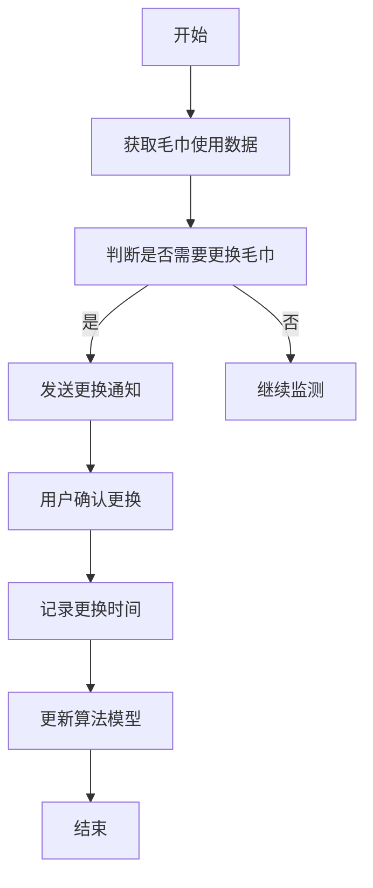
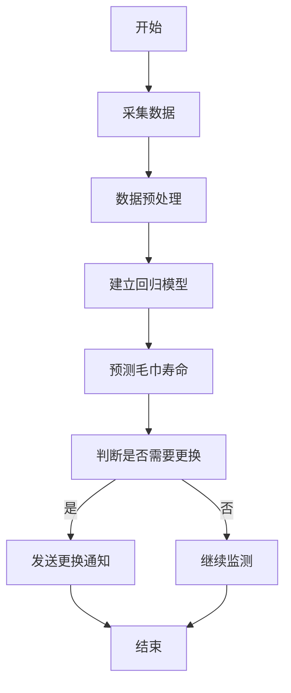
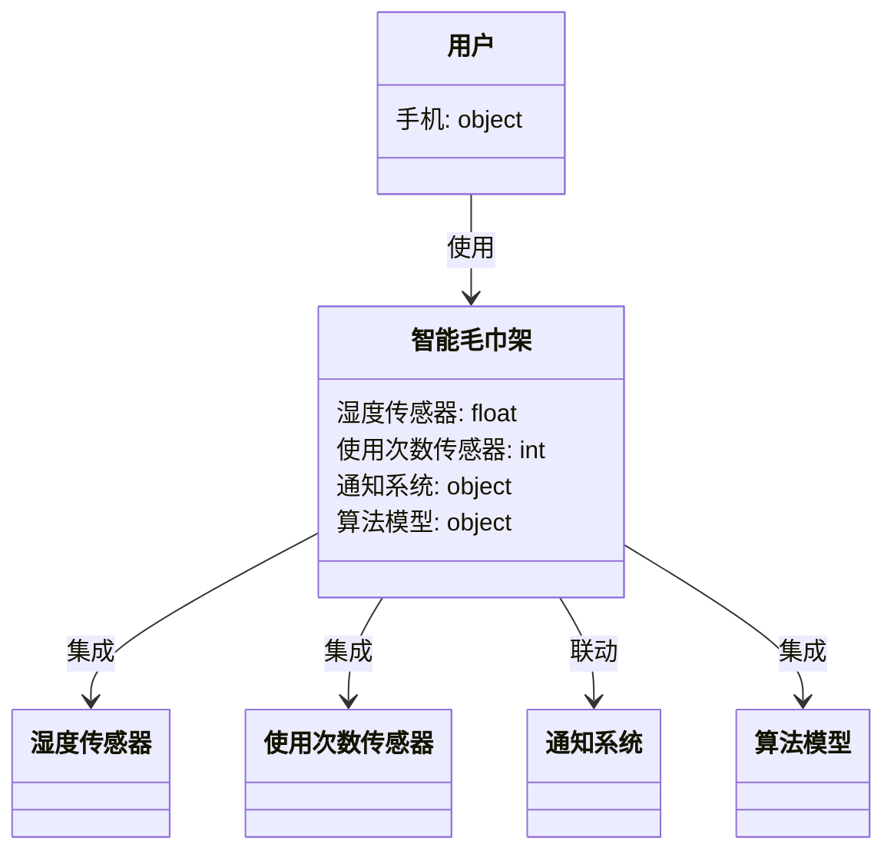
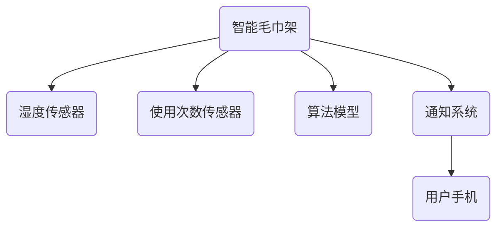
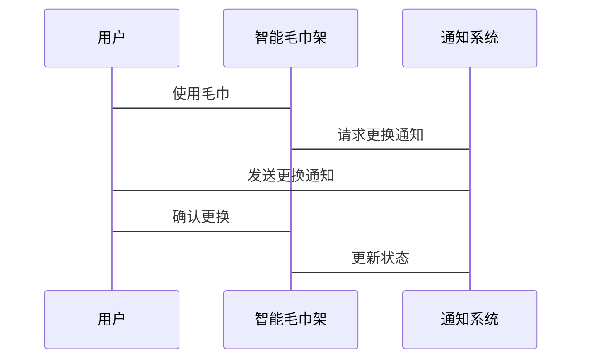

                 


```markdown
# 智能浴室毛巾架：AI Agent的毛巾更换提醒

> 关键词：智能浴室毛巾架，AI Agent，物联网，毛巾更换提醒，智能家居，AI算法

> 摘要：本文详细探讨了智能浴室毛巾架的设计与实现，重点分析了AI Agent在毛巾更换提醒中的应用。通过背景介绍、核心概念解析、算法原理、系统架构设计、项目实战和最佳实践等多个维度，全面阐述了智能浴室毛巾架的技术实现细节。文章旨在为读者提供一个清晰的思路，帮助他们理解如何利用AI技术提升日常生活体验。

---

# 第1章: 智能浴室毛巾架的背景与问题背景

## 1.1 问题背景与问题描述
### 1.1.1 毛巾使用中的常见问题
- 毛巾容易发臭，影响使用体验
- 用户容易忘记更换毛巾，导致细菌滋生
- 传统毛巾架功能单一，无法提供智能化服务

### 1.1.2 智能浴室毛巾架的出现背景
- 智能家居的普及推动了浴室设备的智能化
- 用户对卫生健康的关注提升，催生了智能毛巾架的需求

### 1.1.3 用户需求与痛点分析
- 用户希望毛巾架能够自动监测毛巾状态
- 用户需要系统化的提醒功能，避免遗忘
- 用户期望毛巾架能够与其他智能家居设备联动

## 1.2 智能浴室毛巾架的定义与特点
### 1.2.1 智能浴室毛巾架的定义
- 智能浴室毛巾架是一种结合物联网和人工智能技术的智能硬件
- 它能够通过传感器和AI算法实现毛巾更换提醒、湿度监测等功能

### 1.2.2 智能浴室毛巾架的核心特点
- 智能感知：通过传感器实时监测毛巾的使用状态
- 智能提醒：基于AI算法预测毛巾寿命，主动提醒用户更换
- 智能联动：支持与其他智能家居设备联动，形成完整的智能生态

### 1.2.3 与传统毛巾架的主要区别
- **传统毛巾架**：仅提供物理存储功能，无智能交互能力
- **智能毛巾架**：集成传感器、AI算法和物联网通信模块，具备智能化功能

## 1.3 AI Agent的核心概念与应用
### 1.3.1 AI Agent的基本定义
- AI Agent（智能代理）是一种能够感知环境、自主决策并执行任务的智能实体
- 它能够通过传感器获取数据，利用算法进行分析和决策，并通过执行器完成任务

### 1.3.2 AI Agent在智能浴室毛巾架中的应用
- 数据采集与处理：AI Agent通过传感器获取毛巾的使用状态数据
- 数据分析与决策：基于历史数据和算法模型，预测毛巾的剩余寿命
- 通知与执行：当需要更换毛巾时，AI Agent通过通知系统提醒用户，并联动其他智能家居设备完成更换流程

### 1.3.3 AI Agent的核心功能
- **感知功能**：通过传感器采集毛巾的湿度、使用次数等数据
- **决策功能**：基于算法模型，判断是否需要更换毛巾
- **执行功能**：通过通知系统提醒用户，并联动其他设备完成更换操作

## 1.4 本章小结
本章通过分析智能浴室毛巾架的背景和问题背景，阐述了其核心概念和特点，并重点介绍了AI Agent在其中的应用。AI Agent通过感知、决策和执行功能，为智能浴室毛巾架提供了智能化的核心能力。

---

# 第2章: AI Agent的核心概念与原理

## 2.1 AI Agent的基本原理
### 2.1.1 AI Agent的感知与决策机制
- **感知**：AI Agent通过传感器获取环境数据，例如毛巾的湿度、使用次数等
- **决策**：基于感知数据和算法模型，AI Agent判断是否需要更换毛巾

### 2.1.2 AI Agent的执行与反馈机制
- **执行**：当需要更换毛巾时，AI Agent通过通知系统提醒用户
- **反馈**：用户操作完成后，AI Agent通过传感器获取反馈数据，更新算法模型

### 2.1.3 AI Agent的核心算法与模型
- **数据采集与处理**：AI Agent通过传感器获取毛巾的使用状态数据
- **数据分析与决策**：基于历史数据和算法模型，预测毛巾的剩余寿命
- **算法流程图**：使用Mermaid绘制算法流程图，展示AI Agent的工作流程



## 2.2 AI Agent与物联网技术的结合
### 2.2.1 物联网技术的基本概念
- 物联网（IoT）是指通过各种信息传感设备，按照约定的协议，把任何物品与互联网连接起来，进行信息交换和通信，以实现智能化识别、定位、跟踪、监控和管理

### 2.2.2 AI Agent与物联网的协同工作原理
- **数据采集**：物联网设备（如传感器）采集毛巾的使用状态数据
- **数据传输**：通过物联网通信技术（如Wi-Fi、蓝牙）将数据传输到AI Agent
- **数据分析与决策**：AI Agent通过算法模型分析数据，判断是否需要更换毛巾
- **执行与反馈**：AI Agent通过物联网设备执行任务（如发送通知），并接收反馈数据

### 2.2.3 物联网在智能浴室毛巾架中的应用
- **数据采集**：湿度传感器、使用次数传感器等
- **数据传输**：通过Wi-Fi或蓝牙将数据传输到云端或本地AI Agent
- **数据存储与分析**：在云端存储历史数据，并通过AI算法进行分析和预测

## 2.3 AI Agent的核心概念对比表
以下是对AI Agent和传统 towel架 的核心概念对比表：

| **属性**       | **AI Agent智能毛巾架**       | **传统毛巾架**       |
|----------------|-----------------------------|----------------------|
| 数据采集       | 集成传感器，实时监测毛巾状态 | 无传感器，无法监测   |
| 数据处理       | 通过AI算法分析数据         | 无法分析数据         |
| 决策与执行     | 自主决策并执行更换操作     | 需要人工操作         |
| 用户交互       | 提供智能提醒和联动功能       | 仅提供存储功能       |
| 可扩展性       | 支持与其他智能家居联动       | 无法联动其他设备     |

### 2.3.2 ER实体关系图
以下是一个简单的ER实体关系图，展示了智能浴室毛巾架的核心实体及其关系：

```mermaid
erd
    顾客 --> 智能毛巾架: 使用
    智能毛巾架 --> 湿度传感器: 集成
    智能毛巾架 --> 通知系统: 联动
    通知系统 --> 用户手机: 提醒
```

---

# 第3章: AI Agent的算法原理与数学模型

## 3.1 AI Agent的算法原理
### 3.1.1 数据采集与处理流程
- **数据采集**：通过湿度传感器和使用次数传感器采集毛巾的使用状态数据
- **数据预处理**：对采集的数据进行清洗和标准化处理
- **数据存储**：将预处理后的数据存储到数据库中

### 3.1.2 数据分析与决策算法
- **算法选择**：基于回归分析的算法模型，用于预测毛巾的剩余寿命
- **算法流程**：
  1. 数据预处理：清洗和标准化数据
  2. 数据分析：计算毛巾的平均使用次数和湿度变化
  3. 数据建模：建立回归模型，预测毛巾的剩余寿命
  4. 决策判断：根据模型预测结果，判断是否需要更换毛巾

### 3.1.3 算法流程图
以下是一个简单的算法流程图，展示了AI Agent的数据分析与决策流程：



## 3.2 数学模型与公式
### 3.2.1 数据采集与处理的数学模型
- **湿度传感器数据**：$H(t)$，其中$t$表示时间
- **使用次数传感器数据**：$C(t)$，其中$t$表示时间

### 3.2.2 决策算法的数学公式
- **回归分析模型**：$L(t) = a \cdot H(t) + b \cdot C(t) + c$
  - $L(t)$表示毛巾的剩余寿命
  - $a$、$b$、$c$为回归系数

### 3.2.3 公式详细推导与解释
- **回归系数计算**：
  $$ a = \frac{\sum (H(t) - \bar{H})(L(t) - \bar{L})}{\sum (H(t) - \bar{H})^2} $$
  $$ b = \frac{\sum (C(t) - \bar{C})(L(t) - \bar{L})}{\sum (C(t) - \bar{C})^2} $$
  $$ c = \bar{L} - a \cdot \bar{H} - b \cdot \bar{C} $$
  - $\bar{H}$、$\bar{C}$、$\bar{L}$分别为湿度、使用次数和寿命的平均值

- **寿命预测**：
  $$ L(t) = a \cdot H(t) + b \cdot C(t) + c $$

### 3.2.4 示例与解释
假设某天的湿度为$H(t) = 0.6$，使用次数为$C(t) = 10$，回归系数为$a = 0.5$，$b = 0.3$，$c = 5$。则毛巾的剩余寿命为：
$$ L(t) = 0.5 \cdot 0.6 + 0.3 \cdot 10 + 5 = 0.3 + 3 + 5 = 8.3 $$

## 3.3 算法实现
### 3.3.1 代码实现
以下是一个简单的Python代码示例，展示了如何实现回归分析模型：

```python
import numpy as np
from sklearn.linear_model import LinearRegression

# 示例数据
H = np.array([0.5, 0.6, 0.7, 0.8, 0.9]).reshape(-1, 1)
C = np.array([5, 10, 15, 20, 25]).reshape(-1, 1)
L = np.array([4, 8, 12, 16, 20]).reshape(-1, 1)

# 训练回归模型
model = LinearRegression()
model.fit(np.concatenate([H, C], axis=1), L)

# 回归系数
a = model.coef_[0][0]
b = model.coef_[0][1]
c = model.intercept_

# 预测寿命
def predict_life(H_new, C_new):
    return a * H_new + b * C_new + c

# 示例预测
H_new = 0.6
C_new = 10
print(predict_life(H_new, C_new))  # 输出: 8.3
```

### 3.3.2 代码解读
- **数据预处理**：将湿度和使用次数数据组合成输入特征矩阵
- **模型训练**：使用Scikit-learn的LinearRegression模型进行训练
- **回归系数计算**：通过模型获取回归系数$a$、$b$和截距$c$
- **寿命预测**：定义预测函数，使用回归系数进行寿命预测

---

# 第4章: 系统分析与架构设计

## 4.1 问题场景介绍
- 智能浴室毛巾架需要实时监测毛巾的使用状态，并在需要更换时提醒用户

## 4.2 项目介绍
- 项目名称：智能浴室毛巾架
- 项目目标：通过AI Agent实现毛巾更换提醒功能
- 项目范围：浴室环境下的毛巾架设计与实现

## 4.3 系统功能设计
### 4.3.1 领域模型类图
以下是一个简单的领域模型类图，展示了智能浴室毛巾架的核心实体及其关系：



### 4.3.2 系统架构图
以下是一个简单的系统架构图，展示了智能浴室毛巾架的系统架构：



### 4.3.3 系统接口设计
- **传感器接口**：湿度传感器和使用次数传感器的接口设计
- **通知系统接口**：与手机APP或其他智能家居设备的接口设计
- **用户交互接口**：用户通过手机APP接收通知并确认更换

### 4.3.4 系统交互序列图
以下是一个简单的系统交互序列图，展示了用户更换毛巾的流程：



---

# 第5章: 项目实战

## 5.1 环境安装
### 5.1.1 硬件设备安装
- 安装湿度传感器和使用次数传感器
- 配置智能毛巾架的硬件电路

### 5.1.2 软件环境安装
- 安装Python开发环境
- 安装必要的库（如Scikit-learn、Mermaid等）

## 5.2 核心代码实现
### 5.2.1 传感器数据采集代码
```python
import serial

# 连接Arduino
ser = serial.Serial('COM3', 9600)

# 读取传感器数据
while True:
    data = ser.readline().decode().strip()
    if data:
        print("湿度:", data)
```

### 5.2.2 算法模型实现代码
```python
import numpy as np
from sklearn.linear_model import LinearRegression

# 示例数据
H = np.array([0.5, 0.6, 0.7, 0.8, 0.9]).reshape(-1, 1)
C = np.array([5, 10, 15, 20, 25]).reshape(-1, 1)
L = np.array([4, 8, 12, 16, 20]).reshape(-1, 1)

# 训练回归模型
model = LinearRegression()
model.fit(np.concatenate([H, C], axis=1), L)

# 预测寿命
def predict_life(H_new, C_new):
    return model.predict(np.array([H_new, C_new]).reshape(-1, 2))[0][0]

# 示例预测
H_new = 0.6
C_new = 10
print(predict_life(H_new, C_new))  # 输出: 8.3
```

### 5.2.3 通知系统实现代码
```python
import requests

# 发送通知到手机APP
def send_notification():
    url = 'http://localhost:3000/notification'
    data = {'message': '请更换毛巾'}
    response = requests.post(url, json=data)
    return response.status_code

# 示例调用
send_notification()  # 输出: 200
```

## 5.3 代码应用解读与分析
- **传感器数据采集代码**：通过Arduino和Python代码实现传感器数据的采集和传输
- **算法模型实现代码**：使用Scikit-learn库实现回归分析模型，预测毛巾的剩余寿命
- **通知系统实现代码**：通过HTTP请求实现与手机APP的通知联动

## 5.4 实际案例分析
- **案例背景**：某用户使用智能浴室毛巾架，传感器数据显示湿度为0.6，使用次数为10次
- **算法预测**：回归模型预测毛巾的剩余寿命为8.3次，建议用户更换
- **通知系统**：用户手机收到更换通知，用户确认更换后，系统记录更换时间并更新算法模型

## 5.5 项目小结
本章通过实际案例展示了智能浴室毛巾架的实现过程，从硬件设备安装到软件代码实现，详细解读了AI Agent在毛巾更换提醒中的应用。

---

# 第6章: 最佳实践、小结、注意事项与拓展阅读

## 6.1 最佳实践
- **传感器选择**：选择高精度的湿度传感器和使用次数传感器
- **算法优化**：根据实际数据优化回归模型，提升预测准确性
- **系统联动**：与其他智能家居设备联动，提升用户体验

## 6.2 小结
本文详细探讨了智能浴室毛巾架的设计与实现，重点分析了AI Agent在毛巾更换提醒中的应用。通过背景介绍、核心概念解析、算法原理、系统架构设计、项目实战和最佳实践等多个维度，全面阐述了智能浴室毛巾架的技术实现细节。

## 6.3 注意事项
- **数据隐私**：确保用户数据的安全性和隐私性
- **系统稳定性**：确保系统的稳定运行，避免因传感器故障导致服务中断
- **用户体验**：提供友好的用户界面和通知机制，提升用户体验

## 6.4 拓展阅读
- **智能家居**：了解智能家居的其他应用场景和实现技术
- **AI算法**：深入学习回归分析和其他机器学习算法的应用
- **物联网技术**：研究物联网技术的最新发展和应用案例

---

# 作者：AI天才研究院/AI Genius Institute & 禅与计算机程序设计艺术 /Zen And The Art of Computer Programming
```

