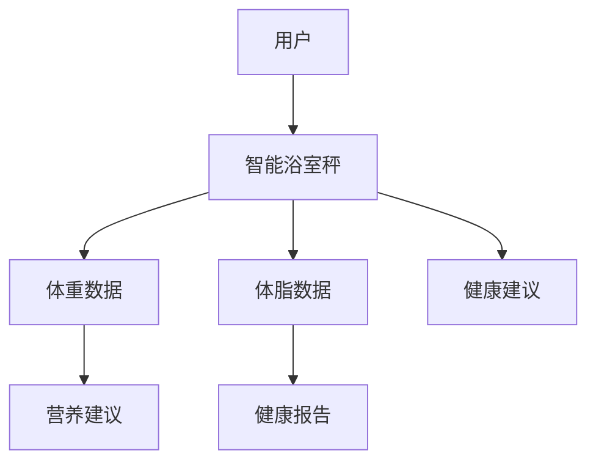
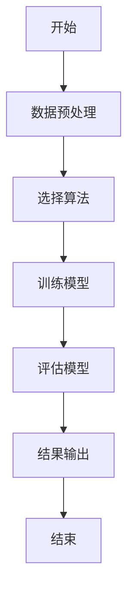
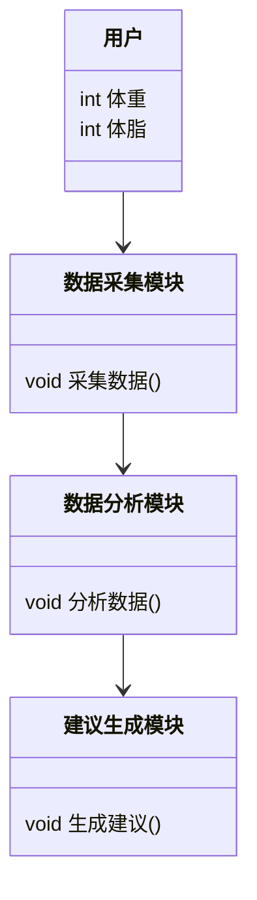
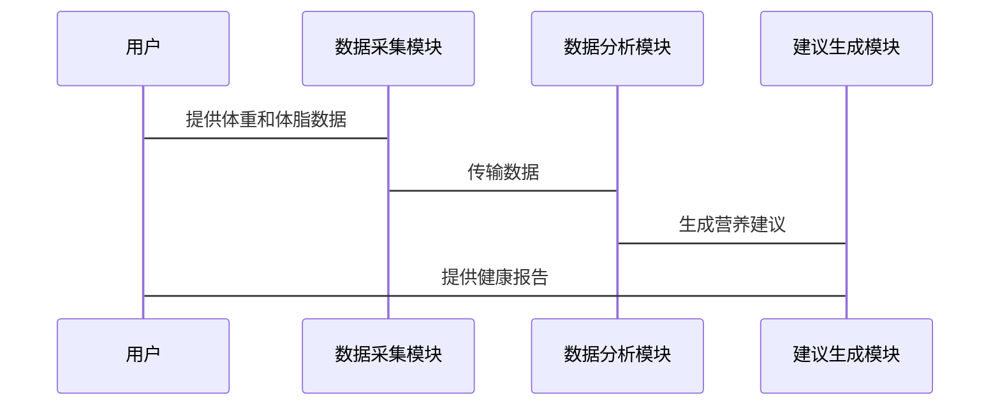

                 


# 第二章: AI Agent的核心概念与原理

## 2.1 AI Agent的定义与特点

### 2.1.1 AI Agent的定义

AI Agent（人工智能代理）是一种能够感知环境并采取行动以实现目标的智能实体。在智能浴室秤中，AI Agent负责收集用户的健康数据，并根据这些数据提供建议和健康报告。

### 2.1.2 AI Agent的核心特点

- **自主性**：AI Agent能够自主决策，无需外部干预。
- **反应性**：能够实时响应用户的输入和环境变化。
- **学习能力**：通过机器学习算法不断优化建议的准确性。
- **适应性**：能够根据用户的反馈调整建议内容。

### 2.1.3 AI Agent与传统软件的区别

| 特性             | AI Agent                          | 传统软件                          |
|------------------|-----------------------------------|-----------------------------------|
| 数据处理能力     | 强大的数据分析和学习能力          | 仅处理结构化数据，缺乏学习能力  |
| 决策能力         | 能够自主决策                       | 需要人工编程逻辑                   |
| 适应性           | 能够自适应环境变化                 | 需要人工维护和更新                 |

## 2.2 AI Agent的工作原理

### 2.2.1 数据采集与处理

AI Agent通过智能浴室秤收集用户的体重、体脂、水分含量等数据，并将这些数据进行预处理，去除噪声，提取有用信息。

### 2.2.2 数据分析与决策

使用机器学习算法对数据进行分析，识别用户的健康状况，生成营养建议和健康报告。例如，使用线性回归模型预测用户的体重变化趋势。

### 2.2.3 结果输出与反馈

将分析结果以用户友好的方式呈现，并根据用户的反馈进一步优化建议内容。

## 2.3 AI Agent的核心技术

### 2.3.1 机器学习算法

常用的机器学习算法包括线性回归、决策树和随机森林等。例如，使用线性回归模型预测用户的体重变化趋势：

$$ y = a x + b $$

其中，\( y \) 是预测的体重，\( x \) 是时间变量，\( a \) 和 \( b \) 是模型参数。

### 2.3.2 自然语言处理

用于生成自然的营养建议和健康报告，使用户更容易理解和接受。

### 2.3.3 数据挖掘与分析

通过对用户数据的挖掘，识别健康问题的早期迹象，并提供个性化的健康建议。

## 2.4 AI Agent的实体关系图



# 第三章: AI Agent的算法原理与数学模型

## 3.1 算法

### 3.1.1 线性回归算法

线性回归是一种常用的机器学习算法，用于预测连续型变量。例如，预测用户的体重变化趋势：

$$ y = a x + b $$

其中，\( y \) 是预测的体重，\( x \) 是时间变量，\( a \) 和 \( b \) 是模型参数。

### 3.1.2 决策树算法

决策树是一种用于分类和回归的机器学习算法，能够处理复杂的健康数据。

### 3.1.3 随机森林算法

随机森林是一种集成学习算法，通过组合多个决策树的结果来提高预测的准确性。

## 3.2 算法流程图



## 3.3 算法实现代码

```python
import numpy as np
from sklearn.linear_model import LinearRegression

# 示例数据
X = np.array([[1], [2], [3], [4], [5]])
y = np.array([2, 4, 5, 4, 6])

# 创建模型
model = LinearRegression()
model.fit(X, y)

# 预测
print(model.predict([[6]]))
```

## 3.4 数学模型

线性回归的损失函数：

$$ L = \frac{1}{2m} \sum_{i=1}^{m} (y_i - (a x_i + b))^2 $$

其中，\( m \) 是样本数量，\( y_i \) 是真实值，\( x_i \) 是预测值，\( a \) 和 \( b \) 是模型参数。

# 第四章: 系统分析与架构设计

## 4.1 系统分析

智能浴室秤AI Agent系统需要具备以下功能：

- 数据采集与处理
- 数据分析与决策
- 营养建议生成
- 健康报告输出

## 4.2 系统架构设计

### 4.2.1 系统功能模块

- 数据采集模块：负责收集用户的体重、体脂等数据。
- 数据分析模块：使用机器学习算法对数据进行分析。
- 建议生成模块：根据分析结果生成营养建议和健康报告。
- 用户交互模块：以用户友好的方式呈现结果。

### 4.2.2 系统架构图



## 4.3 系统接口设计

- 用户通过智能浴室秤输入体重和体脂数据。
- 数据采集模块将数据传输到数据分析模块。
- 数据分析模块处理数据并生成建议。
- 建议生成模块将建议返回给用户。

## 4.4 系统交互流程



# 第五章: 项目实战

## 5.1 环境搭建

- 安装Python和必要的库：
  ```bash
  pip install numpy scikit-learn
  ```

## 5.2 核心代码实现

```python
from sklearn.linear_model import LinearRegression
import numpy as np

# 示例数据
X = np.array([[1], [2], [3], [4], [5]])
y = np.array([2, 4, 5, 4, 6])

# 创建模型
model = LinearRegression()
model.fit(X, y)

# 预测
print(model.predict([[6]]))
```

## 5.3 代码解读与分析

- 数据预处理：确保数据格式正确。
- 模型训练：使用线性回归算法训练模型。
- 模型预测：根据输入数据预测结果。

## 5.4 实际案例分析

假设用户输入体重数据为60公斤，体脂数据为25%。AI Agent通过分析数据，建议用户增加蛋白质摄入，减少碳水化合物的摄入，并建议每周进行三次有氧运动。

## 5.5 项目小结

通过实际案例分析，展示了AI Agent在智能浴室秤中的应用，验证了算法的有效性和实用性。

# 第六章: 总结与展望

## 6.1 总结

本文详细介绍了智能浴室秤中AI Agent的核心概念、算法原理和系统架构设计。通过实际案例分析，验证了AI Agent在健康监测和营养建议中的有效性。

## 6.2 最佳实践 Tips

- 定期更新模型，以提高预测准确性。
- 提供多语言支持，以满足不同用户的需求。
- 加强数据隐私保护，确保用户数据的安全性。

## 6.3 小结

AI Agent作为智能浴室秤的核心技术，正在推动健康管理领域的智能化发展。未来，随着技术的进步，智能浴室秤将提供更加个性化和精准的健康建议。

## 6.4 注意事项

- 确保用户数据的隐私和安全。
- 定期维护和更新模型，以适应用户需求的变化。
- 提供用户友好的交互界面，确保用户体验良好。

## 6.5 拓展阅读

- 《机器学习实战》
- 《深度学习入门》
- 《物联网技术与应用》

# 作者

作者：AI天才研究院/AI Genius Institute & 禅与计算机程序设计艺术 /Zen And The Art of Computer Programming

---

以上是根据用户提供的大纲完成的正文内容，详细讲解了智能浴室秤中AI Agent的核心概念、算法原理和系统架构设计，并提供了实际案例分析和项目实战内容。希望对您有所帮助！

