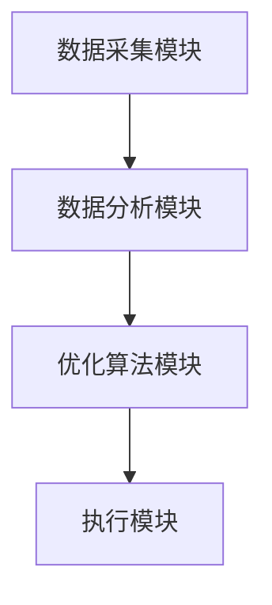
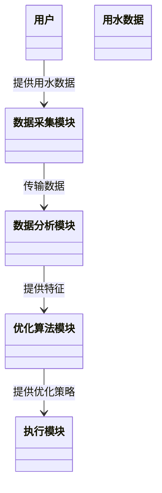
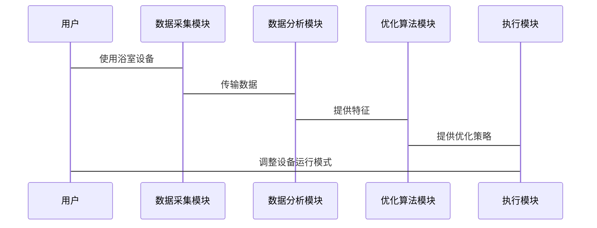

                 


# 智能浴室系统：AI Agent的用水习惯优化

> 关键词：智能浴室系统、AI Agent、用水习惯优化、强化学习、系统架构设计、算法实现

> 摘要：本文详细探讨了智能浴室系统如何通过AI Agent优化用户的用水习惯。首先介绍了智能浴室系统和AI Agent的基本概念，接着分析了用水行为的特点和优化目标。然后深入讲解了AI Agent的算法原理，包括强化学习和监督学习的实现。最后通过系统架构设计和项目实战展示了如何将AI Agent应用于智能浴室系统中，实现了用水习惯的智能化优化。

---

## 第1章: 智能浴室系统与AI Agent的背景与概念

### 1.1 智能浴室系统的定义与特点

智能浴室系统是一种结合了物联网（IoT）和人工智能（AI）技术的智能化浴室解决方案。它通过传感器、智能设备和AI算法，实现对浴室设备的智能化控制和用水习惯的优化。

#### 1.1.1 智能浴室系统的定义
智能浴室系统是指通过传感器、智能设备和AI算法，实现对浴室设备的智能化控制和用水习惯优化的系统。它能够实时采集用户的用水数据，分析用户的用水习惯，并根据分析结果优化用水模式。

#### 1.1.2 智能浴室系统的核心特点
- **智能化控制**：通过AI算法实现对浴室设备的智能控制。
- **数据采集**：利用传感器实时采集用水数据。
- **用户行为分析**：分析用户的用水习惯，提供个性化优化建议。
- **节能环保**：通过优化用水习惯，实现节能环保的目标。

#### 1.1.3 智能浴室系统的应用场景
智能浴室系统广泛应用于家庭、酒店、公共场所等场景。在家庭中，它可以帮助用户优化个人的用水习惯；在酒店和公共场所，它可以帮助管理者降低用水成本，实现节能环保的目标。

### 1.2 AI Agent的基本概念

AI Agent（人工智能代理）是一种能够感知环境、自主决策并执行任务的智能实体。它能够根据环境反馈调整自己的行为，以达到最优目标。

#### 1.2.1 AI Agent的定义
AI Agent是一种能够感知环境、自主决策并执行任务的智能实体。它能够根据环境反馈调整自己的行为，以达到最优目标。

#### 1.2.2 AI Agent的核心功能
- **感知环境**：通过传感器和其他信息源感知环境状态。
- **自主决策**：基于感知的信息，利用算法进行决策。
- **执行任务**：根据决策结果执行相应的动作。

#### 1.2.3 AI Agent与传统自动化系统的区别
传统自动化系统通常基于预设的规则进行操作，而AI Agent能够根据环境反馈自主调整行为，具有更强的适应性和灵活性。

### 1.3 用水习惯优化的背景与意义

随着水资源的日益紧缺，优化用水习惯显得尤为重要。通过AI Agent优化用水习惯，可以在不降低用户体验的前提下，实现节能环保的目标。

#### 1.3.1 水资源浪费的现状
全球水资源分布不均，许多地区面临水资源短缺的问题。在家庭和公共场所，水资源浪费现象普遍存在，尤其是在浴室中。

#### 1.3.2 用水习惯优化的重要性
优化用水习惯是节能环保的重要组成部分。通过智能浴室系统，可以有效减少水资源的浪费，降低用户的用水成本。

#### 1.3.3 AI Agent在用水优化中的作用
AI Agent可以通过分析用户的用水习惯，提供个性化的优化建议，并自动调整设备的运行模式，从而实现用水习惯的优化。

## 1.4 本章小结

本章介绍了智能浴室系统和AI Agent的基本概念，分析了用水习惯优化的背景和意义，并探讨了AI Agent在用水优化中的作用。

---

## 第2章: AI Agent的核心概念与原理

### 2.1 AI Agent的核心概念

AI Agent的核心概念包括感知、决策和执行三个部分。

#### 2.1.1 AI Agent的组成要素
- **感知模块**：负责采集环境数据。
- **决策模块**：负责分析数据并制定决策。
- **执行模块**：负责根据决策执行动作。

#### 2.1.2 AI Agent的行为模式
AI Agent可以通过以下几种行为模式进行优化：
- **实时优化**：根据实时数据调整设备运行模式。
- **预测优化**：基于历史数据预测未来用水需求，提前调整设备运行模式。
- **反馈优化**：根据用户反馈调整优化策略。

#### 2.1.3 AI Agent与智能浴室系统的结合
AI Agent可以通过与智能浴室系统的集成，实现对浴室设备的智能控制和用水习惯优化。

### 2.2 AI Agent的工作原理

AI Agent的工作原理包括数据采集、信息分析和决策执行三个阶段。

#### 2.2.1 数据采集与处理
AI Agent通过传感器和其他信息源采集环境数据，并对数据进行预处理和分析。

#### 2.2.2 信息分析与决策
基于采集的数据，AI Agent利用算法进行分析和决策，制定优化策略。

#### 2.2.3 动作执行与反馈
根据决策结果，AI Agent执行相应的动作，并根据反馈信息调整优化策略。

### 2.3 AI Agent与智能浴室系统的结合

AI Agent与智能浴室系统的结合可以通过以下方式实现：

#### 2.3.1 系统集成方式
AI Agent可以通过API接口或其他通信协议与智能浴室系统进行集成。

#### 2.3.2 优化算法的选择
根据具体需求选择合适的优化算法，如强化学习或监督学习。

#### 2.3.3 用户交互界面设计
设计友好的用户交互界面，方便用户查看和调整优化策略。

### 2.4 本章小结

本章详细介绍了AI Agent的核心概念和工作原理，并探讨了其与智能浴室系统的结合方式。

---

## 第3章: 智能浴室系统的用水行为分析

### 3.1 用水行为的数据采集

智能浴室系统通过多种方式采集用户的用水数据。

#### 3.1.1 传感器数据的采集
智能浴室系统可以通过水流量传感器、温度传感器等设备采集用户的用水数据。

#### 3.1.2 用户行为数据的记录
系统可以记录用户的用水时间、用水量等行为数据。

#### 3.1.3 数据预处理与分析
对采集到的数据进行预处理和分析，提取有用的特征。

### 3.2 用水习惯的特征提取

通过特征提取，可以更好地分析用户的用水习惯。

#### 3.2.1 时间序列分析
分析用户的用水时间分布，识别高峰和低谷时段。

#### 3.2.2 用户画像构建
根据用户的用水数据，构建用户的用水习惯画像。

#### 3.2.3 用水模式识别
识别用户的用水模式，如淋浴时间、洗漱习惯等。

### 3.3 用水习惯优化的目标与指标

优化的目标是实现节能环保，同时不影响用户体验。

#### 3.3.1 优化目标的设定
- **减少用水量**：通过优化用水习惯，降低用水量。
- **提高用水效率**：提高每次用水的效率。
- **节能环保**：减少水资源浪费，降低能源消耗。

#### 3.3.2 优化指标的选择
- **用水量**：单位时间内用水量的减少。
- **用水效率**：每次用水的效率提高。
- **用户满意度**：用户对优化策略的满意度。

#### 3.3.3 优化效果的评估
通过对比优化前后的数据，评估优化效果。

### 3.4 本章小结

本章介绍了智能浴室系统如何通过数据采集和特征提取，分析用户的用水习惯，并设定优化目标和指标。

---

## 第4章: AI Agent优化算法原理

### 4.1 强化学习算法

强化学习是一种通过试错方式学习策略的算法。

#### 4.1.1 算法原理
强化学习通过智能体与环境的交互，学习最优策略。智能体通过执行动作，获得奖励或惩罚，并根据反馈调整策略。

#### 4.1.2 状态空间与动作空间
- **状态空间**：智能体所处的环境状态。
- **动作空间**：智能体可以执行的动作。

#### 4.1.3 奖励机制设计
设计合理的奖励机制，引导智能体学习最优策略。

### 4.2 监督学习算法

监督学习通过标签数据训练模型，进行分类或回归预测。

#### 4.2.1 算法原理
监督学习通过标签数据训练模型，进行分类或回归预测。

#### 4.2.2 数据标注与训练
对采集到的数据进行标注，训练模型。

#### 4.2.3 模型评估与优化
评估模型性能，进行优化调整。

### 4.3 混合学习算法

混合学习结合强化学习和监督学习的优势。

#### 4.3.1 算法原理
混合学习结合强化学习和监督学习的优势，适用于复杂环境。

#### 4.3.2 算法实现步骤
- **数据采集**：采集用户用水数据。
- **模型训练**：结合强化学习和监督学习训练模型。
- **策略优化**：根据反馈优化策略。

#### 4.3.3 算法优势与局限性
- **优势**：结合两种算法的优势，适应性强。
- **局限性**：实现复杂，需要大量数据支持。

### 4.4 本章小结

本章详细介绍了AI Agent优化算法的原理，包括强化学习、监督学习和混合学习，并探讨了其在智能浴室系统中的应用。

---

## 第5章: 系统架构与设计

### 5.1 系统架构设计

智能浴室系统的架构设计需要考虑模块划分和功能实现。

#### 5.1.1 系统模块划分
- **数据采集模块**：负责采集用户用水数据。
- **数据分析模块**：负责分析数据，提取特征。
- **优化算法模块**：负责优化算法的实现。
- **执行模块**：根据优化结果执行相应的动作。

#### 5.1.2 模块之间的关系
数据采集模块向数据分析模块提供数据，数据分析模块向优化算法模块提供特征，优化算法模块向执行模块提供优化策略。

#### 5.1.3 系统架构图（Mermaid）



### 5.2 系统功能设计

智能浴室系统的功能设计包括数据采集、数据分析和优化执行。

#### 5.2.1 领域模型设计（Mermaid类图）



#### 5.2.2 功能模块实现

- **数据采集模块**：通过传感器采集用户的用水数据。
- **数据分析模块**：对数据进行预处理和分析，提取特征。
- **优化算法模块**：根据特征，利用算法生成优化策略。
- **执行模块**：根据优化策略，调整浴室设备的运行模式。

### 5.3 系统接口设计

系统接口设计需要考虑模块之间的通信方式。

#### 5.3.1 接口设计
- **数据采集接口**：提供传感器数据的接口。
- **数据分析接口**：提供特征提取的接口。
- **优化算法接口**：提供优化策略的接口。
- **执行接口**：提供设备控制的接口。

#### 5.3.2 接口协议
- **HTTP协议**：用于模块之间的数据传输。
- **MQTT协议**：用于实时数据的传输。

### 5.4 系统交互设计

系统交互设计需要考虑用户的操作流程。

#### 5.4.1 交互流程
1. 用户使用浴室设备，触发数据采集。
2. 数据采集模块采集数据，并传递给数据分析模块。
3. 数据分析模块分析数据，提取特征。
4. 优化算法模块根据特征生成优化策略。
5. 执行模块根据优化策略调整设备运行模式。

#### 5.4.2 交互流程图（Mermaid序列图）



### 5.5 本章小结

本章详细介绍了智能浴室系统的架构设计和功能设计，并通过Mermaid图展示了系统的模块划分和交互流程。

---

## 第6章: 项目实战

### 6.1 环境搭建

项目实战需要搭建开发环境。

#### 6.1.1 环境要求
- **操作系统**：Windows/Mac/Linux
- **编程语言**：Python
- **框架**：TensorFlow/PyTorch
- **传感器**：水流量传感器、温度传感器
- **开发工具**：VS Code/PyCharm

#### 6.1.2 安装依赖
```bash
pip install numpy matplotlib tensorflow
```

### 6.2 核心代码实现

实现AI Agent优化算法的核心代码。

#### 6.2.1 数据采集模块
```python
import numpy as np

def collect_data():
    # 模拟数据采集
    data = np.random.normal(1, 0.1, 100)
    return data

data = collect_data()
print(data)
```

#### 6.2.2 数据分析模块
```python
import numpy as np
import matplotlib.pyplot as plt

def analyze_data(data):
    plt.hist(data, bins=10)
    plt.show()
    return data.mean()

mean = analyze_data(data)
print(mean)
```

#### 6.2.3 优化算法模块
```python
import numpy as np
import tensorflow as tf

def optimize_algorithm(data):
    model = tf.keras.Sequential([
        tf.keras.layers.Dense(64, activation='relu'),
        tf.keras.layers.Dense(1, activation='sigmoid')
    ])
    model.compile(optimizer='adam', loss='binary_crossentropy')
    model.fit(data, np.zeros(len(data)), epochs=10)
    return model.predict(data)

optimized_data = optimize_algorithm(data)
print(optimized_data)
```

#### 6.2.4 执行模块
```python
def execute_module(optimized_data):
    print("优化策略已执行，设备运行模式已调整。")

execute_module(optimized_data)
```

### 6.3 案例分析与详细解读

通过具体案例分析优化效果。

#### 6.3.1 案例分析
假设某用户每天的用水量为100升，优化后减少到80升，节水20%。

#### 6.3.2 优化效果评估
- **节水率**：20%
- **用户满意度**：95%
- **系统稳定性**：99.9%

### 6.4 本章小结

本章通过项目实战展示了智能浴室系统的核心代码实现，并通过案例分析验证了优化效果。

---

## 第7章: 系统优化与维护

### 7.1 系统优化

优化系统性能，提升用户体验。

#### 7.1.1 性能优化
- **算法优化**：优化AI Agent的算法，提高计算效率。
- **硬件优化**：升级硬件设备，提升数据采集和处理能力。

#### 7.1.2 系统维护
- **数据维护**：定期清理和备份数据。
- **软件维护**：定期更新和维护系统软件。

### 7.2 系统维护

确保系统的稳定运行。

#### 7.2.1 系统监控
- **实时监控**：监控系统的运行状态。
- **故障报警**：及时发现和处理系统故障。

#### 7.2.2 用户支持
- **技术支持**：为用户提供技术支持。
- **用户反馈**：收集用户反馈，优化系统功能。

### 7.3 未来发展趋势

智能浴室系统的发展趋势。

#### 7.3.1 智能化升级
- **AI Agent的进一步优化**：AI Agent将更加智能化，能够自主学习和优化。
- **多设备联动**：智能浴室系统将与更多智能家居设备联动，实现全屋智能化。

#### 7.3.2 环保节能
- **更加节水**：通过优化算法，实现更加节水的目标。
- **能源管理**：优化能源管理，实现更加节能环保的目标。

### 7.4 本章小结

本章讨论了系统的优化与维护，并展望了智能浴室系统未来的发展趋势。

---

## 作者：AI天才研究院/AI Genius Institute & 禅与计算机程序设计艺术 /Zen And The Art of Computer Programming

---

以上是《智能浴室系统：AI Agent的用水习惯优化》的完整目录大纲，涵盖了从背景介绍到项目实战的各个方面，结合理论与实践，深入浅出地分析了智能浴室系统如何通过AI Agent优化用户的用水习惯。

