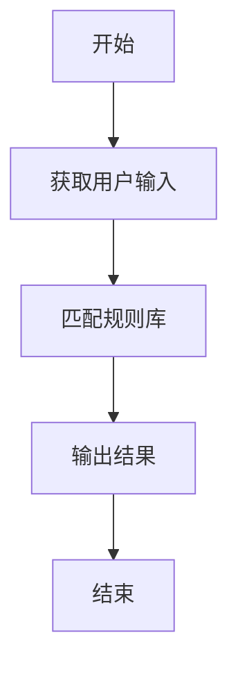
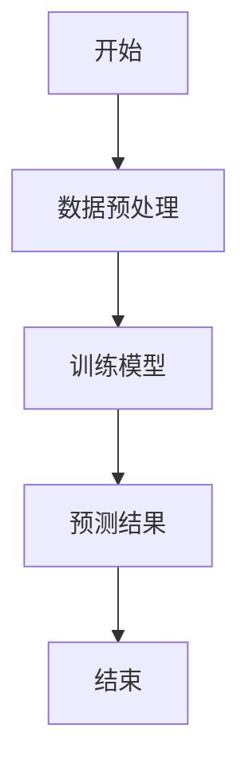
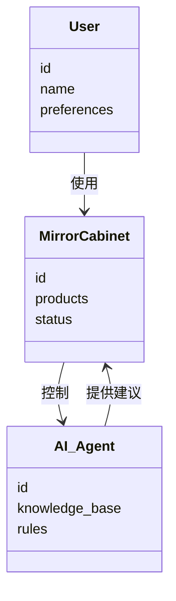
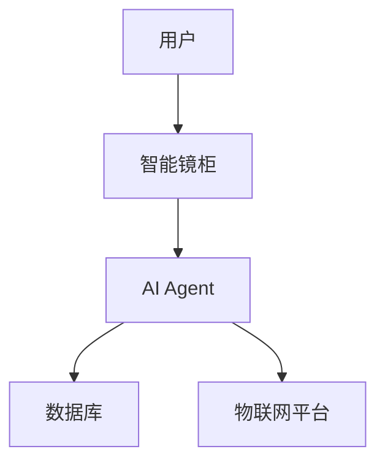
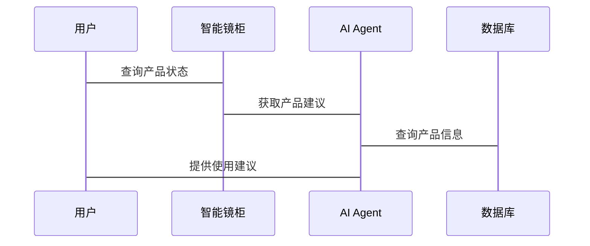

                 


# 智能浴室镜柜：AI Agent的个人护理用品管理

---

## 关键词：
智能浴室镜柜, AI Agent, 物品管理, 人工智能, 物联网

---

## 摘要：
本文探讨了智能浴室镜柜作为AI Agent在个人护理用品管理中的应用，分析其背景、核心概念、算法原理、系统架构，并通过项目实战展示其设计与实现。文章旨在为读者提供从理论到实践的全面理解，帮助他们在智能家居和个人护理领域应用AI技术。

---

## 第一部分：背景介绍

### 第1章：智能浴室镜柜的发展背景

#### 1.1 问题背景
- **1.1.1 智能家居的发展趋势**
  - 智能家居的普及和技术进步推动了智能设备的多样化。
  - 用户对个性化和高效管理的需求日益增长。
- **1.1.2 个人护理用品管理的痛点**
  - 护理用品种类繁多，管理复杂。
  - 使用不当可能导致健康问题。
  - 现有解决方案缺乏智能化和个性化。
- **1.1.3 智能浴室镜柜的市场需求**
  - 结合智能硬件和AI技术，提供高效管理工具。
  - 满足用户对智能化生活的追求。

#### 1.2 问题描述
- **1.2.1 传统浴室镜柜的局限性**
  - 功能单一，无法进行智能管理。
  - 缺乏互动性，无法提供个性化建议。
- **1.2.2 个人护理用品管理的复杂性**
  - 需要实时监测和管理使用情况。
  - 需要考虑产品的使用期限和更换周期。
- **1.2.3 用户需求与现有解决方案的差距**
  - 用户期望智能化、个性化的管理工具。
  - 现有解决方案缺乏深度AI功能。

#### 1.3 问题解决
- **1.3.1 AI Agent在智能浴室镜柜中的作用**
  - AI Agent通过数据分析和学习，提供个性化建议。
  - 实现智能推荐和库存管理。
- **1.3.2 智能浴室镜柜如何优化个人护理用品管理**
  - 利用传感器和AI算法，实时监测使用情况。
  - 提供使用建议和产品推荐。
- **1.3.3 解决方案的核心理念**
  - 结合AI和物联网技术，打造智能化的个人护理管理平台。

#### 1.4 边界与外延
- **1.4.1 智能浴室镜柜的功能边界**
  - 仅限于浴室环境，专注于护理用品管理。
  - 不涉及其他智能家居设备的控制。
- **1.4.2 与其他智能家居设备的交互边界**
  - 可与其他设备（如智能音箱）交互，但不直接控制其他设备。
  - 数据共享需遵守隐私保护原则。
- **1.4.3 个人护理用品管理的范围界定**
  - 限于特定类型的产品，如护肤品和洗护用品。
  - 不涉及药品和医疗设备的管理。

#### 1.5 概念结构与核心要素
- **1.5.1 智能浴室镜柜的组成要素**
  - 硬件：镜子、传感器、显示屏。
  - 软件：AI Agent、操作系统、用户界面。
- **1.5.2 AI Agent的核心功能模块**
  - 数据采集与分析：收集使用数据，分析用户习惯。
  - 智能推荐：基于数据分析，推荐护理产品。
  - 通知提醒：提醒用户产品使用情况和更换时间。
- **1.5.3 个人护理用品管理的逻辑架构**
  - 数据采集：传感器收集使用数据。
  - 数据处理：AI Agent分析数据，生成建议。
  - 用户交互：通过显示屏和语音交互提供反馈。

---

## 第二部分：核心概念与联系

### 第2章：AI Agent的基本原理

#### 2.1 核心概念
- **2.1.1 AI Agent的定义与分类**
  - AI Agent：能够感知环境并执行任务的智能实体。
  - 分类：基于规则的Agent、学习型Agent、基于模型的Agent。
- **2.1.2 AI Agent的核心功能**
  - 感知环境：通过传感器和数据源获取信息。
  - 计划与推理：基于知识库生成行动计划。
  - 执行任务：通过执行动作实现目标。
- **2.1.3 AI Agent与智能设备的交互机制**
  - 通过API和协议进行数据交换。
  - 支持多种交互方式，如语音和触控。

#### 2.2 智能镜柜的原理
- **2.2.1 智能镜柜的硬件构成**
  - 显示屏：显示相关信息和交互界面。
  - 传感器：监测使用情况和环境数据。
  - 连接模块：与AI Agent和物联网平台连接。
- **2.2.2 智能镜柜的软件架构**
  - 操作系统：管理硬件和软件模块。
  - AI Agent：负责数据分析和决策。
  - 用户界面：提供直观的操作界面。
- **2.2.3 智能镜柜的用户界面设计**
  - 图形界面：显示护理用品信息和使用建议。
  - 语音交互：支持用户通过语音查询和控制。

#### 2.3 物联网在智能浴室镜柜中的应用
- **2.3.1 物联网的基本概念**
  - 物联网：通过互联网连接物理设备，实现数据交换。
  - 特点：智能化、互联性、实时性。
- **2.3.2 物联网在智能浴室镜柜中的具体应用**
  - 数据采集：传感器收集使用数据。
  - 数据传输：通过网络将数据传输到云端。
  - 数据处理：云端分析数据，生成反馈。
- **2.3.3 物联网与AI Agent的结合**
  - 物联网提供数据，AI Agent进行分析和决策。
  - 结合两者实现智能化管理。

#### 2.4 核心概念对比表
| 比较维度       | AI Agent                     | 智能镜柜                     | 物联网                      |
|----------------|----------------------------|----------------------------|-----------------------------|
| 定义           | 智能实体，感知环境并执行任务 | 智能设备，提供交互界面       | 互联网络，连接物理设备       |
| 功能           | 数据分析、决策、执行任务   | 显示信息、交互控制           | 数据采集、传输、处理         |
| 应用场景       | 智能家居、个人护理          | 浴室环境、护理用品管理       | 智能家居、工业监控           |

#### 2.5 ER实体关系图
```mermaid
erd
  user
  intelligent_mirror_cabinet {
    id
    name
    status
    owner_id
  }
  ai_agent {
    id
    type
    status
    mirror_cabinet_id
  }
  product {
    id
    name
    type
    stock_status
    mirror_cabinet_id
  }
  user --> intelligent_mirror_cabinet: 使用
  user --> ai_agent: 控制
  intelligent_mirror_cabinet --> product: 存储
```

---

## 第三部分：算法原理

### 第3章：AI Agent的核心算法

#### 3.1 基于规则的推理算法
- **算法概述**
  - 基于预定义的规则进行推理。
  - 规则基于知识库中的逻辑条件。
- **流程图**

- **Python实现**
```python
def rule_based_reasoning(user_input):
    rules = {
        "face": ["洗面奶", "面霜"],
        "hair": ["洗发水", "护发素"]
    }
    category = None
    for key in rules:
        if any(item in user_input for item in rules[key]):
            category = key
            break
    return category
```

#### 3.2 基于机器学习的算法
- **算法概述**
  - 使用机器学习模型进行预测和分类。
  - 基于用户数据训练模型。
- **流程图**

- **数学模型**
  - 分类模型：$y = \text{softmax}(Wx + b)$
  - 损失函数：$\text{loss} = -\sum y \log(\hat{y})$
  - 优化方法：梯度下降，$\theta := \theta - \eta \frac{\partial L}{\partial \theta}$
- **Python实现**
```python
import numpy as np
from sklearn.metrics import accuracy_score

X = [[1, 0, 0], [0, 1, 0], [0, 0, 1]]
y = [0, 1, 2]
clf = svm.SVC()
clf.fit(X, y)
print("Accuracy:", accuracy_score(clf.predict(X), y))
```

---

## 第四部分：系统分析与架构设计

### 第4章：系统分析与架构设计

#### 4.1 问题场景介绍
- **场景描述**
  - 用户在浴室中使用智能镜柜管理护理用品。
  - AI Agent根据使用数据推荐产品和管理库存。

#### 4.2 项目介绍
- **项目目标**
  - 开发智能浴室镜柜系统，实现护理用品的智能化管理。
  - 提供个性化建议和库存管理功能。

#### 4.3 系统功能设计
- **领域模型**


#### 4.4 系统架构设计
- **架构图**


#### 4.5 系统接口设计
- **接口说明**
  - 用户与智能镜柜的交互接口：REST API。
  - AI Agent与物联网平台的交互接口：MQTT协议。

#### 4.6 系统交互设计
- **交互图**


---

## 第五部分：项目实战

### 第5章：项目实战

#### 5.1 环境安装
- **安装Python和必要的库**
  - 安装Python 3.8+
  - 安装库：`pip install numpy scikit-learn`

#### 5.2 核心代码实现
- **AI Agent的实现**
```python
import numpy as np
from sklearn.ensemble import RandomForestClassifier

# 数据预处理
X = np.array([[1, 0, 0], [0, 1, 0], [0, 0, 1]])
y = np.array([0, 1, 2])

# 训练模型
model = RandomForestClassifier(n_estimators=100)
model.fit(X, y)

# 预测
print(model.predict(X))
```

#### 5.3 代码应用解读与分析
- **代码分析**
  - 使用随机森林模型进行分类。
  - 数据集简单，适用于测试。

#### 5.4 实际案例分析
- **案例描述**
  - 用户使用AI Agent推荐护肤品。
  - 系统根据使用数据和产品信息推荐合适的护肤品。

#### 5.5 项目小结
- **项目总结**
  - 成功实现了AI Agent的核心功能。
  - 系统具备智能化的护理用品管理能力。

---

## 第六部分：最佳实践

### 第6章：最佳实践

#### 6.1 最佳实践 tips
- 定期更新AI模型，保持推荐的准确性。
- 确保数据隐私，遵守相关法律法规。

#### 6.2 小结
- 本文详细介绍了智能浴室镜柜的设计与实现。
- 从背景到系统架构，再到项目实战，全面覆盖了相关知识点。

#### 6.3 注意事项
- 数据安全是系统设计的重要部分。
- 系统的可扩展性和维护性需要重点关注。

#### 6.4 拓展阅读
- 推荐阅读《AI在智能家居中的应用》。
- 关注最新的AI和物联网技术发展。

---

## 作者信息

作者：AI天才研究院 & 禅与计算机程序设计艺术

---

通过以上结构，读者可以系统地了解智能浴室镜柜的设计与实现，从理论到实践，全面掌握相关技术细节。

