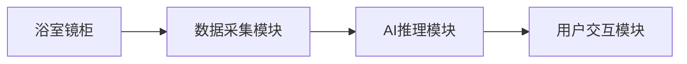
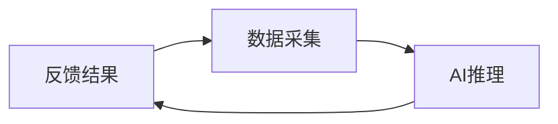
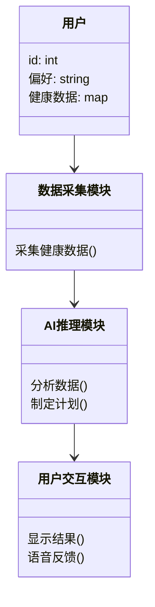
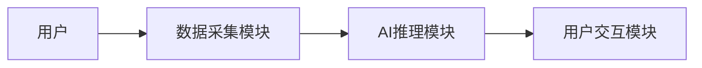
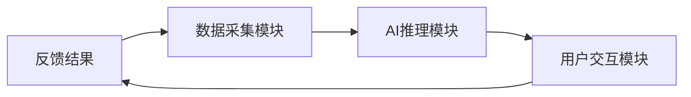

                 


# 智能浴室镜柜：AI Agent的个人护理计划制定

> 关键词：智能浴室镜柜、AI Agent、个人护理计划、算法原理、系统架构、项目实战

> 摘要：本文详细探讨了智能浴室镜柜作为AI Agent在个人护理计划制定中的应用。通过分析其背景、核心概念、算法原理、系统架构及项目实战，展示了AI技术如何提升个人护理体验。文章内容涵盖技术背景、系统设计、算法实现及实际应用，为读者提供了全面的技术解读。

---

## 第一部分: 背景介绍

### 第1章: 智能浴室镜柜的背景与现状

#### 1.1 智能浴室镜柜的背景
- **传统浴室镜柜的功能局限**：传统浴室镜柜主要作为存储和装饰工具，缺乏智能化功能。
- **智能化趋势的推动**：随着智能家居的普及，浴室设备的智能化成为趋势。
- **AI技术在浴室设备中的应用潜力**：AI技术可以提升浴室设备的交互能力，提供个性化服务。

#### 1.2 AI Agent的定义与特点
- **AI Agent的基本概念**：AI Agent是一种智能体，能够感知环境、执行任务并提供服务。
- **AI Agent的核心功能**：数据采集、分析、推理和反馈。
- **AI Agent与传统软件的区别**：AI Agent具备自主性和学习能力，能够适应环境变化。

#### 1.3 个人护理计划的制定需求
- **个人护理计划的重要性**：个性化护理有助于提升健康水平和生活质量。
- **智能化护理计划的优势**：AI技术能够根据个人需求动态调整护理计划。
- **智能浴室镜柜的场景应用**：通过AI Agent实现个性化护理计划的制定和执行。

#### 1.4 本章小结
- 本章介绍了智能浴室镜柜的背景及其在AI技术推动下的智能化趋势，强调了AI Agent在个人护理中的潜力。

---

## 第二部分: 核心概念与联系

### 第2章: 智能浴室镜柜的核心概念

#### 2.1 AI Agent在智能浴室镜柜中的作用
- **AI Agent作为个人护理助手的角色**：AI Agent通过数据采集和分析，为用户提供个性化的护理建议。
- **AI Agent的核心功能模块**：数据采集模块、推理模块和反馈模块。
- **AI Agent与智能硬件的协同工作**：AI Agent通过与浴室镜柜的硬件交互，实现数据的采集和处理。

#### 2.2 智能浴室镜柜的系统架构
- **系统组成与功能划分**：包括数据采集模块、AI推理模块和用户交互模块。
- **系统核心模块的实体关系图**：展示了系统中各实体之间的关系。



- **AI Agent的交互流程**：用户输入需求，AI Agent进行分析和推理，并反馈结果。



#### 2.3 本章小结
- 本章详细介绍了AI Agent在智能浴室镜柜中的作用，分析了系统的架构和交互流程。

---

## 第三部分: 算法原理讲解

### 第3章: AI Agent的核心算法

#### 3.1 基于规则的推理算法
- **规则推理的基本原理**：通过预定义的规则进行推理。
- **规则推理的应用场景**：适用于简单的逻辑推理任务。
- **规则推理的实现步骤**：
  1. 数据采集：获取用户的健康数据。
  2. 规则匹配：将数据与预定义规则进行匹配。
  3. 结果输出：根据匹配结果输出护理建议。

#### 3.2 机器学习模型
- **机器学习的基本原理**：通过数据训练模型，实现对用户需求的预测和分类。
- **常用机器学习算法**：决策树、随机森林、神经网络。
- **机器学习模型的实现步骤**：
  1. 数据预处理：清洗和归一化数据。
  2. 模型训练：使用训练数据训练模型。
  3. 模型预测：对新数据进行预测并输出结果。

#### 3.3 自然语言处理技术
- **自然语言处理的基本原理**：通过文本分析技术理解用户的语言需求。
- **常用自然语言处理算法**：词袋模型、TF-IDF、BERT。
- **自然语言处理的实现步骤**：
  1. 文本预处理：分词、去停用词。
  2. 特征提取：提取文本特征。
  3. 模型训练：训练分类模型。
  4. 文本分类：对用户输入进行分类并输出结果。

#### 3.4 本章小结
- 本章介绍了AI Agent中常用的算法，包括基于规则的推理、机器学习和自然语言处理技术。

---

## 第四部分: 系统分析与架构设计方案

### 第4章: 智能浴室镜柜的系统架构设计

#### 4.1 问题场景介绍
- **问题场景**：用户需要通过智能浴室镜柜制定个性化的护理计划。
- **系统功能需求**：数据采集、健康监测、计划制定和交互反馈。

#### 4.2 系统功能设计
- **用户数据采集**：通过传感器采集用户的健康数据。
- **健康监测**：分析用户的健康数据，识别潜在问题。
- **计划制定**：根据用户需求和健康数据，制定个性化护理计划。
- **交互反馈**：通过镜面显示和语音反馈与用户互动。

#### 4.3 领域模型设计
- **领域模型的类图**：


#### 4.4 系统架构设计
- **系统架构图**：


#### 4.5 系统接口设计
- **数据采集接口**：传感器数据的采集和传输。
- **AI推理接口**：接收数据并返回推理结果。
- **用户交互接口**：显示结果和语音反馈。

#### 4.6 系统交互流程
- **交互流程图**：


#### 4.7 本章小结
- 本章详细介绍了智能浴室镜柜的系统架构设计，包括功能设计、类图和交互流程。

---

## 第五部分: 项目实战

### 第5章: 智能浴室镜柜的实现

#### 5.1 环境安装
- **安装Python环境**：使用Anaconda或虚拟环境。
- **安装依赖库**：numpy、pandas、scikit-learn、tensorflow、mermaid、LaTeX。

#### 5.2 核心代码实现
- **数据采集模块**：传感器数据的采集和预处理。
  ```python
  import numpy as np
  def collect_data():
      # 模拟传感器数据采集
      data = np.random.randn(100, 5)
      return data
  ```

- **AI推理模块**：基于机器学习的护理计划制定。
  ```python
  from sklearn.tree import DecisionTreeClassifier
  def train_model(data, labels):
      model = DecisionTreeClassifier()
      model.fit(data, labels)
      return model
  ```

- **用户交互模块**：显示结果和语音反馈。
  ```python
  import winsound
  def feedback(message):
      print(message)
      winsound.Beep(1000, 500)
  ```

#### 5.3 实际案例分析
- **案例分析**：用户A的健康数据分析和护理计划制定。
- **代码实现**：通过代码实现数据采集、模型训练和结果反馈。

#### 5.4 本章小结
- 本章通过实际案例分析和代码实现，展示了智能浴室镜柜的实现过程。

---

## 第六部分: 最佳实践

### 第6章: 最佳实践与注意事项

#### 6.1 最佳实践
- **数据隐私保护**：确保用户数据的安全性和隐私性。
- **系统稳定性**：保证系统的高可用性和稳定性。
- **用户体验优化**：通过用户反馈不断优化系统交互体验。

#### 6.2 小结
- 总结全文内容，强调智能浴室镜柜在AI技术推动下的重要性。

#### 6.3 注意事项
- **数据采集的准确性**：确保传感器数据的准确性。
- **模型的可解释性**：保证AI推理结果的可解释性。
- **系统的可扩展性**：确保系统能够适应未来的需求变化。

#### 6.4 拓展阅读
- **推荐书籍**：《AI: 一种现代的方法》、《机器学习实战》。
- **推荐资源**：AI和机器学习相关的技术博客、论文和在线课程。

---

## 作者信息

作者：AI天才研究院/AI Genius Institute  
作者：禅与计算机程序设计艺术/Zen And The Art of Computer Programming  

---

**文章标题**：智能浴室镜柜：AI Agent的个人护理计划制定  
**文章关键词**：智能浴室镜柜、AI Agent、个人护理计划、算法原理、系统架构、项目实战  
**文章摘要**：本文详细探讨了智能浴室镜柜作为AI Agent在个人护理计划制定中的应用。通过分析其背景、核心概念、算法原理、系统架构及项目实战，展示了AI技术如何提升个人护理体验。文章内容涵盖技术背景、系统设计、算法实现及实际应用，为读者提供了全面的技术解读。

---

通过以上内容，您可以根据实际需求进一步补充和扩展各个章节的具体内容。如果需要进一步调整或添加更多细节，请随时告知！

