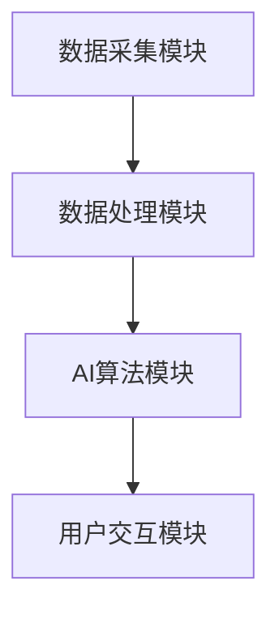

                 


# 智能浴室镜：AI Agent的健康状态评估

> 关键词：智能浴室镜、AI Agent、健康评估、传感器技术、人工智能算法

> 摘要：本文探讨了智能浴室镜作为AI Agent在健康状态评估中的应用。通过分析传感器技术、人工智能算法和系统架构设计，文章详细阐述了如何通过智能浴室镜实现健康评估，及其在日常生活中的实际应用价值。

---

# 第1章: 智能浴室镜与AI Agent的背景介绍

## 1.1 智能浴室镜的发展历程

### 1.1.1 传统浴室镜的功能与局限性

传统浴室镜仅用于日常洗漱，缺乏智能化功能。用户只能通过镜子看到表面现象，无法获取健康数据。

### 1.1.2 智能化浴室镜的兴起

随着科技的发展，智能浴室镜集成了传感器、摄像头、AI算法等技术，能够采集和分析用户的生理数据，如心率、体温、皮肤状况等。

### 1.1.3 AI技术在浴室镜中的应用前景

AI技术使得浴室镜能够实时分析用户的健康数据，提供个性化的健康建议，甚至预测潜在的健康问题。

## 1.2 AI Agent的基本概念与特点

### 1.2.1 什么是AI Agent

AI Agent（智能体）是一种能够感知环境、自主决策并执行任务的智能系统。在智能浴室镜中，AI Agent负责数据采集、分析和反馈。

### 1.2.2 AI Agent的核心特点

1. **自主性**：AI Agent能够独立运行，无需人工干预。
2. **反应性**：能够实时感知环境变化并做出反应。
3. **学习能力**：通过机器学习算法不断优化健康评估模型。

### 1.2.3 AI Agent在健康评估中的应用

AI Agent通过分析用户的生理数据、行为数据和环境数据，提供精准的健康评估和建议。

## 1.3 智能浴室镜的用户需求与市场分析

### 1.3.1 用户需求分析

用户希望智能浴室镜能够提供健康监测、个性化建议、数据同步等功能，满足日常健康管理需求。

### 1.3.2 市场现状与发展趋势

随着人们对健康关注度的提高，智能浴室镜市场逐渐扩大，预计未来几年将保持快速增长。

### 1.3.3 智能浴室镜的潜在应用场景

智能浴室镜可用于家庭健康监测、医疗辅助、健康管理平台等场景，为用户提供便捷的健康服务。

---

# 第2章: 智能浴室镜中的健康状态评估核心概念

## 2.1 健康状态评估的基本原理

### 2.1.1 健康状态评估的定义

健康状态评估是通过分析用户的生理、行为和环境数据，判断其健康状况的过程。

### 2.1.2 健康状态评估的关键指标

1. **生理指标**：心率、体温、皮肤状况等。
2. **行为指标**：运动频率、作息规律等。
3. **环境指标**：空气质量、温湿度等。

### 2.1.3 健康状态评估的数学模型

健康评估模型可以通过多种算法实现，如线性回归、支持向量机（SVM）和神经网络等。

---

# 第3章: 智能浴室镜的AI Agent健康评估算法原理

## 3.1 健康状态评估的算法概述

### 3.1.1 基于生理数据的健康评估算法

使用传感器采集心率、体温等数据，通过机器学习模型进行健康评估。

### 3.1.2 基于行为数据的健康评估算法

分析用户的日常行为数据，如运动量、睡眠质量，评估健康状况。

### 3.1.3 基于环境数据的健康评估算法

监测环境数据，如空气质量，评估用户健康风险。

## 3.2 健康评估算法的数学模型

### 3.2.1 线性回归模型

$$ y = \beta_0 + \beta_1 x + \epsilon $$

其中，$y$ 是健康评估结果，$x$ 是输入特征，$\beta$ 是系数，$\epsilon$ 是误差项。

### 3.2.2 支持向量机模型

SVM通过构建超平面，将数据分为健康和非健康两类。

### 3.2.3 神经网络模型

使用深度学习模型，如卷积神经网络（CNN）进行健康评估。

---

# 第4章: 智能浴室镜的系统架构设计

## 4.1 系统功能设计

### 4.1.1 数据采集模块

通过传感器采集用户的生理数据、行为数据和环境数据。

### 4.1.2 数据处理模块

对采集到的数据进行预处理、特征提取和数据融合。

### 4.1.3 AI算法模块

使用机器学习算法对数据进行分析，生成健康评估结果。

### 4.1.4 用户交互模块

通过镜子显示健康评估结果，并提供个性化建议。

## 4.2 系统架构图



---

# 第5章: 项目实战：智能浴室镜的开发与实现

## 5.1 开发环境与工具

### 5.1.1 硬件设备

- 摄像头：用于捕捉用户面部特征。
- 心率传感器：采集用户心率数据。
- 环境传感器：监测空气质量、温湿度。

### 5.1.2 软件工具

- Python：用于数据处理和算法实现。
- TensorFlow：用于机器学习模型训练。
- OpenCV：用于图像处理。

## 5.2 核心代码实现

### 5.2.1 数据采集代码

```python
import cv2
import numpy as np

def capture_face():
    cap = cv2.VideoCapture(0)
    while True:
        ret, frame = cap.read()
        cv2.imshow('Face Capture', frame)
        if cv2.waitKey(1) & 0xFF == ord('q'):
            break
    cap.release()
    cv2.destroyAllWindows()
    return frame
```

### 5.2.2 健康评估算法实现

```python
from sklearn.linear_model import LinearRegression

# 示例数据
X = np.array([[20, 70], [25, 80], [30, 85]])
y = np.array([60, 70, 75])

model = LinearRegression()
model.fit(X, y)

# 预测新数据
new_X = np.array([[22, 75]])
predicted_y = model.predict(new_X)
print(predicted_y)
```

## 5.3 测试与优化

### 5.3.1 测试案例

- 测试不同光照条件下的心率检测准确性。
- 测试不同环境数据对健康评估的影响。

### 5.3.2 优化建议

- 提高传感器的灵敏度和准确性。
- 优化算法模型，提升健康评估的准确率。

---

# 第6章: 总结与展望

## 6.1 总结

智能浴室镜通过AI Agent实现了健康状态评估，为用户提供便捷的健康管理工具。本文详细介绍了系统的开发背景、核心算法、系统架构和实现案例。

## 6.2 优缺点分析

### 优点：

1. 高效便捷：用户可以在日常生活中轻松获取健康数据。
2. 精准评估：AI算法能够准确分析健康状况。

### 缺点：

1. 依赖传感器：传感器的精度和稳定性直接影响评估结果。
2. 隐私问题：健康数据的安全性需要高度重视。

## 6.3 未来展望

未来，智能浴室镜将更加智能化，结合物联网和大数据技术，提供更全面的健康服务。同时，AI算法将不断优化，提高健康评估的准确性和实时性。

---

# 最佳实践 Tips

1. **数据安全**：确保用户健康数据的安全存储和传输。
2. **用户体验**：优化界面设计，提升用户使用体验。
3. **持续学习**：定期更新算法模型，保持健康评估的准确性。

---

# 作者：AI天才研究院/AI Genius Institute & 禅与计算机程序设计艺术 /Zen And The Art of Computer Programming

