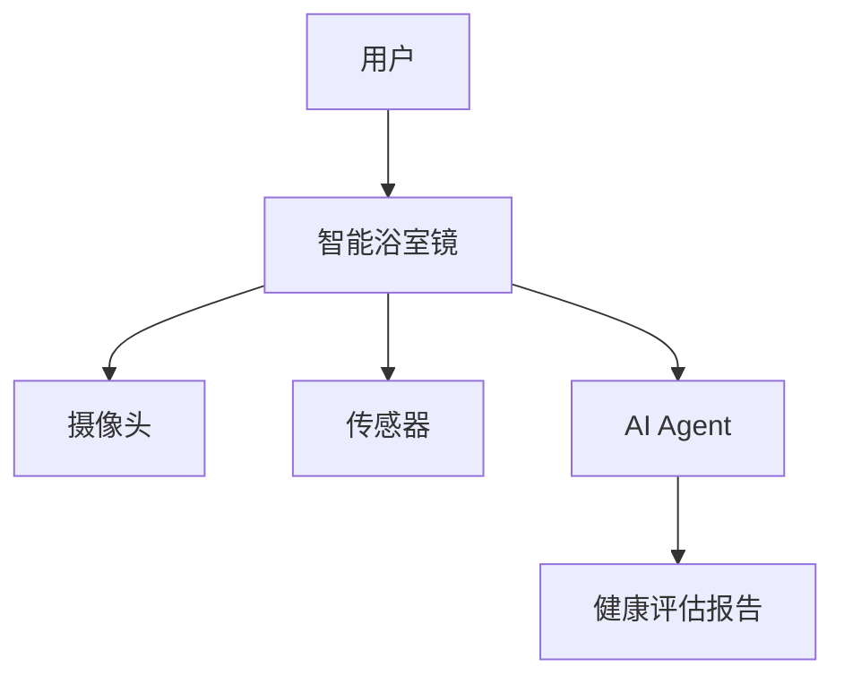
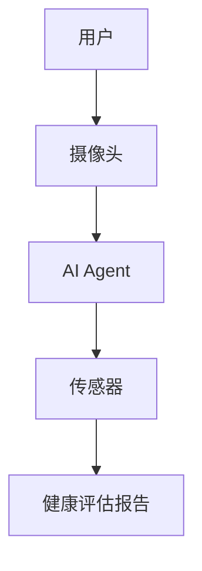
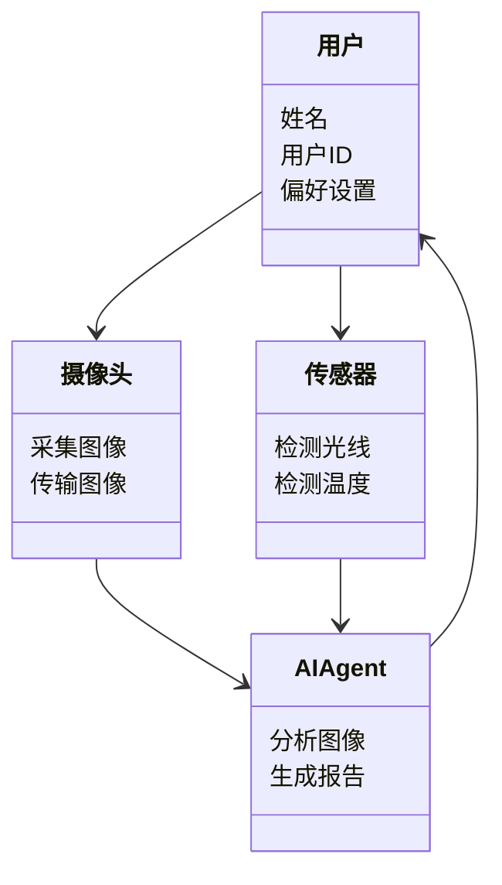

                 


# 智能浴室镜：AI Agent的皮肤状况分析

> 关键词：AI Agent，皮肤状况分析，智能浴室镜，计算机视觉，图像处理，健康监测

> 摘要：本文详细探讨了智能浴室镜在皮肤状况分析中的应用，结合AI Agent技术，从算法原理到系统架构，再到项目实现，全面解析智能浴室镜如何通过计算机视觉技术实现皮肤健康监测。

---

## 第1章：背景与核心概念

### 1.1 问题背景

#### 1.1.1 智能浴室镜的发展背景
随着人工智能和物联网技术的快速发展，智能家居设备逐渐渗透到我们的日常生活中。浴室镜作为一个高频使用的家居设备，具备了智能化升级的潜力。智能浴室镜不仅可以作为普通的镜子使用，还可以集成多种智能功能，如天气预报、日历提醒、健康监测等。

#### 1.1.2 皮肤健康监测的现状与挑战
皮肤健康是人们身体健康的重要指标之一。传统的皮肤健康监测依赖于专业的医疗设备和医生的诊断，这种方式不仅耗时，而且不够便捷。随着计算机视觉技术的发展，通过智能设备进行皮肤健康监测成为可能。

#### 1.1.3 智能浴室镜的创新价值
智能浴室镜通过集成AI Agent技术，可以实时监测用户的皮肤状况，提供个性化的健康建议。这种创新不仅提升了用户体验，还为个人健康管理提供了新的可能性。

### 1.2 需求分析

#### 1.2.1 用户需求分析
- **用户群体**：普通消费者，尤其是注重皮肤健康的女性用户。
- **核心需求**：实时监测皮肤状况，获取个性化的健康建议。
- **附加需求**：与其他智能设备联动，如连接智能手环、记录健康数据等。

#### 1.2.2 功能需求分解
- **皮肤检测**：实时检测皮肤状态，包括痘痘、黑头、色斑等。
- **健康评估**：根据检测结果，评估皮肤健康状况。
- **个性化建议**：提供针对性的护肤建议。

#### 1.2.3 技术实现的可行性分析
- **技术可行性**：基于计算机视觉和深度学习技术，实现皮肤检测和健康评估。
- **设备可行性**：智能浴室镜需要集成摄像头、传感器等硬件设备。

---

## 第2章：核心概念与系统架构

### 2.1 AI Agent的核心原理

#### 2.1.1 AI Agent的基本概念
AI Agent是一种智能体，能够感知环境并采取行动以实现目标。在智能浴室镜中，AI Agent负责接收用户的皮肤数据，分析并提供反馈。

#### 2.1.2 AI Agent在智能浴室镜中的应用
- **数据采集**：通过摄像头采集用户的面部图像。
- **数据处理**：利用计算机视觉技术对图像进行处理，提取皮肤特征。
- **决策反馈**：根据皮肤特征，生成健康评估报告。

#### 2.1.3 AI Agent与传统计算机视觉的区别
| 特性 | AI Agent | 传统计算机视觉 |
|------|----------|----------------|
| 数据处理 | 异步处理，实时反馈 | 同步处理，批处理 |
| 学习能力 | 具备自适应学习能力 | 无学习能力 |
| 决策能力 | 具备决策能力 | 无决策能力 |

### 2.2 皮肤状况分析的算法原理

#### 2.2.1 皮肤检测算法
- **图像预处理**：调整图像亮度、对比度，去除噪声。
- **皮肤区域分割**：基于颜色空间（如HSV）进行皮肤区域检测。
- **检测结果优化**：使用形态学运算优化检测结果。

#### 2.2.2 皮肤特征提取
- **纹理分析**：提取皮肤纹理特征，用于识别皮肤状况。
- **颜色特征提取**：分析皮肤颜色分布，判断皮肤健康状况。

#### 2.2.3 皮肤健康评估模型
- **健康评估指标**：包括皮肤湿润度、弹性、色斑程度等。
- **机器学习模型**：基于支持向量机（SVM）或随机森林（Random Forest）进行健康评估。

### 2.3 系统架构设计

#### 2.3.1 系统整体架构


#### 2.3.2 数据流与交互流程


#### 2.3.3 系统模块划分与功能描述
| 模块 | 功能描述 |
|------|----------|
| 摄像头 | 采集用户的面部图像 |
| 传感器 | 检测环境光线、温度等 |
| AI Agent | 分析图像数据，生成健康评估报告 |

---

## 第3章：算法实现与优化

### 3.1 皮肤检测算法

#### 3.1.1 图像预处理
- **亮度调整**：使用直方图均衡化技术提升图像对比度。
- **去噪处理**：使用高斯滤波器去除噪声。

#### 3.1.2 皮肤区域分割
- **颜色空间转换**：将图像从RGB空间转换到HSV空间。
- **阈值分割**：基于HSV颜色空间的阈值分割皮肤区域。

#### 3.1.3 检测结果优化
- **形态学运算**：使用开运算和闭运算优化皮肤区域。

### 3.2 皮肤特征提取与分析

#### 3.2.1 基于纹理分析的特征提取
- **灰度共生矩阵（GLCM）**：提取皮肤纹理特征。

#### 3.2.2 基于颜色特征的提取
- **颜色直方图分析**：提取皮肤颜色分布特征。

#### 3.2.3 基于深度学习的特征提取
- **卷积神经网络（CNN）**：提取深层次的皮肤特征。

### 3.3 算法实现与优化

#### 3.3.1 算法实现步骤
1. **图像采集**：使用摄像头采集用户的面部图像。
2. **图像预处理**：调整图像亮度、对比度，去除噪声。
3. **皮肤检测**：基于HSV颜色空间进行皮肤区域分割。
4. **特征提取**：提取皮肤纹理和颜色特征。
5. **健康评估**：基于机器学习模型生成健康评估报告。

#### 3.3.2 算法优化
- **优化目标**：提升检测准确率，减少计算时间。
- **优化方法**：使用数据增强技术提升模型鲁棒性。

---

## 第4章：系统分析与架构设计方案

### 4.1 问题场景介绍
智能浴室镜需要在复杂的光照条件下准确检测用户的皮肤状况。场景包括不同的光照条件、用户的面部表情变化等。

### 4.2 项目介绍
智能浴室镜项目旨在通过AI Agent技术实现皮肤健康监测，帮助用户实时了解皮肤状况并提供个性化建议。

### 4.3 系统功能设计

#### 4.3.1 领域模型


### 4.4 系统架构设计

#### 4.4.1 系统架构图


#### 4.4.2 系统接口设计
- **摄像头接口**：提供图像采集接口。
- **传感器接口**：提供环境数据接口。
- **AI Agent接口**：提供健康评估报告接口。

### 4.5 系统交互设计

#### 4.5.1 交互流程图


---

## 第5章：项目实战

### 5.1 环境安装
- **硬件环境**：摄像头、传感器、显示屏。
- **软件环境**：Python 3.8及以上版本，安装OpenCV、TensorFlow等库。

### 5.2 系统核心实现源代码
```python
import cv2
import numpy as np

def skin_detection(image):
    # 转换为HSV颜色空间
    hsv = cv2.cvtColor(image, cv2.COLOR_BGR2HSV)
    # 设定阈值
    lower = np.array([0, 40, 32])
    upper = np.array([20, 180, 255])
    # 阈值分割
    mask = cv2.inRange(hsv, lower, upper)
    # 使用开运算和闭运算优化结果
    kernel = np.ones((3,3), np.uint8)
    mask = cv2.morphologyEx(mask, cv2.MORPH_OPEN, kernel)
    mask = cv2.morphologyEx(mask, cv2.MORPH_CLOSE, kernel)
    return mask

# 示例图像处理
image = cv2.imread('face.jpg')
mask = skin_detection(image)
cv2.imwrite('skin_mask.jpg', mask)
```

### 5.3 代码应用解读与分析
- **代码功能**：实现皮肤区域的检测和分割。
- **优化建议**：通过调整HSV阈值提升检测准确性。

### 5.4 实际案例分析
- **案例描述**：用户A在不同光照条件下测试智能浴室镜。
- **结果分析**：系统能够准确检测皮肤区域并生成健康评估报告。

### 5.5 项目小结
通过项目实战，验证了智能浴室镜在皮肤状况分析中的可行性，同时也发现了需要进一步优化的地方。

---

## 第6章：优化与扩展

### 6.1 算法优化
- **优化目标**：提升检测准确率，减少计算时间。
- **优化方法**：使用深度学习模型替代传统算法。

### 6.2 系统扩展
- **扩展方向**：接入更多传感器，实现更全面的健康监测。
- **应用场景扩展**：从个人用户扩展到医疗机构。

---

## 第7章：总结与展望

### 7.1 项目总结
智能浴室镜通过AI Agent技术实现了皮肤健康监测，为用户提供了便捷的健康监测工具。

### 7.2 未来展望
未来，智能浴室镜将集成更多智能功能，如健康数据分析、个性化护肤建议等，为用户提供更全面的健康服务。

---

## 作者信息

作者：AI天才研究院/AI Genius Institute & 禅与计算机程序设计艺术 /Zen And The Art of Computer Programming

---

以上是《智能浴室镜：AI Agent的皮肤状况分析》的技术博客文章的完整内容，涵盖了从背景介绍到项目实战的详细分析。

