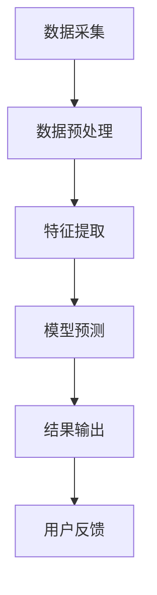

                 


# 智能浴室防滑垫：AI Agent的跌倒风险评估

## 关键词：智能浴室防滑垫, AI Agent, 跌倒风险评估, 传感器数据, 深度学习, 系统架构设计, 项目实战

## 摘要

本文深入探讨了智能浴室防滑垫在跌倒风险评估中的应用，结合AI代理技术，分析了传感器数据的采集与处理，详细阐述了基于深度学习的跌倒风险评估算法的原理与实现，设计了系统的架构方案，并通过项目实战展示了如何将理论应用于实践。文章最后总结了最佳实践经验和未来的发展方向。

---

## 第一部分：智能浴室防滑垫的背景与需求

### 第1章：智能浴室防滑垫的背景介绍

#### 1.1 跌倒风险评估的背景与重要性
- **1.1.1 跌倒问题的全球现状**  
  跌倒是老年人和行动不便人群的主要安全问题之一，每年导致大量伤亡和医疗费用。
- **1.1.2 智能浴室防滑垫的提出背景**  
  浴室是跌倒事故的高发场所，传统的防滑垫无法主动预防跌倒，智能防滑垫通过传感器和AI代理提供实时评估。
- **1.1.3 跌倒风险评估的核心意义**  
  通过实时监测和评估，智能防滑垫能够提前预警，降低跌倒风险。

#### 1.2 智能浴室防滑垫的核心概念
- **1.2.1 什么是智能浴室防滑垫**  
  智能防滑垫集成了传感器和AI代理，能够实时监测使用者的步态、重心分布等数据。
- **1.2.2 跌倒风险评估的基本原理**  
  通过传感器数据，AI代理分析使用者的行为模式，评估跌倒风险。
- **1.2.3 智能防滑垫的边界与外延**  
  智能防滑垫不仅提供数据采集功能，还能够通过AI代理实现风险预警和干预。

### 第2章：跌倒风险评估的核心概念与联系

#### 2.1 跌倒风险评估的原理
- **2.1.1 传感器数据采集原理**  
  阅读相关传感器数据采集原理，包括加速度、压力分布等。
- **2.1.2 数据分析与风险评估方法**  
  使用机器学习算法对传感器数据进行分析，评估跌倒风险。
- **2.1.3 AI代理在风险评估中的作用**  
  AI代理负责数据的实时处理和风险评估，提供预警和干预建议。

#### 2.2 核心概念对比分析
- **2.2.1 传统防滑垫与智能防滑垫的对比**  
  列表对比传统防滑垫和智能防滑垫的功能、优缺点等。
- **2.2.2 跌倒风险评估的关键指标**  
  包括步态、重心分布、平衡能力等。
- **2.2.3 AI代理与传统评估方法的优劣分析**  
  对比AI代理的实时性和传统评估方法的局限性。

#### 2.3 实体关系图（ER图）
```mermaid
erd
  title 实体关系图
  User {
    id
    name
  }
  SensorData {
    id
    timestamp
    dataValue
  }
  RiskAssessment {
    id
    assessmentResult
    timestamp
  }
  User --> SensorData: 产生
  SensorData --> RiskAssessment: 输入
  RiskAssessment --> User: 提供结果
```

---

## 第二部分：AI代理的算法原理与实现

### 第3章：AI代理的算法原理

#### 3.1 跌倒风险评估算法概述
- **3.1.1 算法目标与输入输出**  
  算法目标是评估跌倒风险，输入包括传感器数据，输出包括风险等级和预警信息。
- **3.1.2 算法流程图**  
  ```mermaid
  graph TD
      A[开始] --> B[数据采集]
      B --> C[数据预处理]
      C --> D[特征提取]
      D --> E[模型预测]
      E --> F[结果输出]
      F --> G[结束]
  ```

#### 3.2 算法实现代码
- **3.2.1 数据预处理代码**
```python
import numpy as np
import pandas as pd

def preprocess_data(data):
    # 数据清洗
    data = data.dropna()
    # 标准化处理
    data = (data - data.mean()) / data.std
    return data
```

#### 3.3 算法数学模型
- **3.3.1 深度学习模型**  
  使用深度神经网络对传感器数据进行特征提取和分类。
- **3.3.2 数学公式**  
  $$P(\text{跌倒}) = \sigma(w \cdot x + b)$$
  其中，$w$ 是权重，$x$ 是输入特征，$b$ 是偏置，$\sigma$ 是sigmoid函数。

---

## 第三部分：系统分析与架构设计

### 第4章：系统分析与架构设计

#### 4.1 系统应用场景
- **4.1.1 老年人家庭**  
  主要用于老年人的浴室防滑。
- **4.1.2 医院病房**  
  用于患者跌倒风险评估和预警。

#### 4.2 系统功能设计
- **4.2.1 数据采集模块**  
  采集加速度、压力分布等数据。
- **4.2.2 AI评估模块**  
  实时评估跌倒风险并提供预警。
- **4.2.3 用户反馈模块**  
  提供反馈信息，优化系统性能。

#### 4.3 系统架构图


---

## 第四部分：项目实战

### 第5章：项目实战

#### 5.1 环境安装与配置
- **5.1.1 安装Python环境**  
  安装Python 3.8及以上版本。
- **5.1.2 安装依赖库**  
  使用pip安装numpy、pandas、tensorflow等库。

#### 5.2 核心代码实现
- **5.2.1 传感器数据采集代码**
```python
import numpy as np
import pandas as pd
import tensorflow as tf

def load_sensor_data():
    # 模拟传感器数据
    data = np.random.randn(100, 5)
    return data
```

#### 5.3 代码功能解读与分析
- **5.3.1 数据预处理功能**  
  对传感器数据进行清洗和标准化处理。
- **5.3.2 模型训练功能**  
  使用深度学习模型对数据进行训练，优化模型参数。

#### 5.4 实际案例分析
- **5.4.1 案例背景**  
  某老年人家中安装智能防滑垫，实时监测其步态数据。
- **5.4.2 数据分析与评估**  
  通过模型分析发现其跌倒风险较高，系统发出预警。

#### 5.5 项目小结
- **5.5.1 项目总结**  
  智能防滑垫在跌倒风险评估中的应用效果显著。
- **5.5.2 经验分享**  
  系统设计的关键点和注意事项。

---

## 第五部分：总结与展望

### 第6章：总结与展望

#### 6.1 最佳实践 tips
- **6.1.1 小结**  
  智能浴室防滑垫结合AI代理技术，显著降低了跌倒风险。
- **6.1.2 注意事项**  
  在实际应用中，需注意数据隐私和系统稳定性。
- **6.1.3 拓展阅读**  
  推荐阅读相关领域的最新研究论文和技术报告。

#### 6.2 未来展望
- **6.2.1 技术发展方向**  
  结合边缘计算和物联网技术，提升系统的实时性和智能化水平。
- **6.2.2 应用场景拓展**  
  将智能防滑垫技术应用于更多场景，如公共浴室、健身房等。

---

## 作者

作者：AI天才研究院/AI Genius Institute & 禅与计算机程序设计艺术 /Zen And The Art of Computer Programming

---

以上是文章的目录大纲，涵盖了从背景介绍到项目实战的各个方面，结构清晰，逻辑严谨。接下来，您可以根据这个大纲逐步撰写文章的具体内容。

