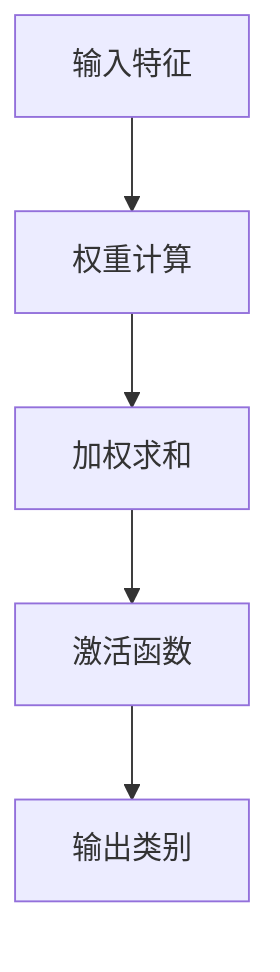
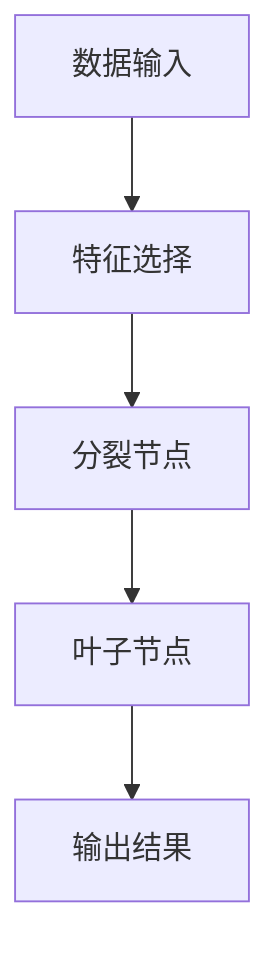
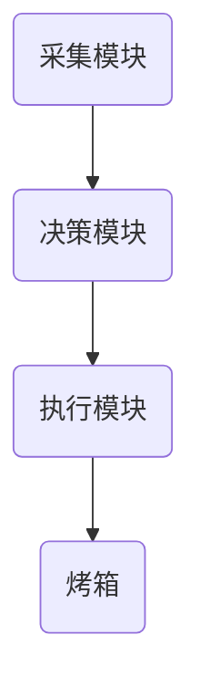
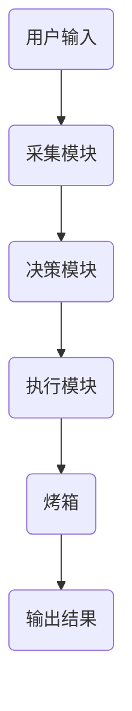

                 


# 智能烤箱：AI Agent的烘焙参数自动调节

---

## 关键词：
智能烤箱, AI Agent, 烘焙参数, 自动调节, 人工智能, 参数优化

---

## 摘要：
本文深入探讨了AI Agent在智能烤箱中的应用，特别是烘焙参数的自动调节。通过分析传统烘焙过程中的问题，提出了基于AI Agent的解决方案，结合感知器模型、决策树算法和支持向量机（SVM）等技术，构建了一个高效的烘焙参数调节系统。文章详细阐述了系统架构设计、算法实现和项目实战，展示了如何利用AI技术提升烘焙效率和质量。

---

# 第一部分: 背景介绍

## 第1章: 问题背景与描述

### 1.1 问题背景
在烘焙过程中，温度、湿度、时间等参数的精确控制直接影响最终产品的质量。传统烘焙过程中，这些参数通常需要人工调节，容易受到操作人员的经验限制，导致烘焙效果不稳定。

### 1.2 问题描述
- 温度和湿度的波动难以实时感知和调整。
- 烘焙时间的长短难以根据食材特性自动优化。
- 不同食材的烘焙参数差异较大，人工调节效率低下。

### 1.3 解决方案
引入AI Agent技术，通过实时感知烘焙环境参数，结合历史数据和优化算法，自动调整烘焙参数，实现高效、精准的烘焙过程。

### 1.4 AI Agent的作用
- 实现实时数据采集与分析。
- 自动优化烘焙参数。
- 提供个性化烘焙方案。

---

# 第二部分: AI Agent与烘焙参数调节的核心概念

## 第2章: 核心概念与联系

### 2.1 AI Agent的基本原理
AI Agent是一种能够感知环境、自主决策并执行任务的智能体。它通过感知环境信息，结合内部知识库和目标函数，做出最优决策。

#### AI Agent的分类
- **简单反射型**：基于固定的规则进行决策。
- **基于模型的反应型**：利用环境模型进行实时决策。
- **目标驱动型**：根据目标函数优化决策。

### 2.2 烘焙参数调节的数学模型
烘焙参数调节可以看作是一个多变量优化问题，目标函数为烘焙质量，变量包括温度、湿度和时间。

#### 烘焙参数调节的数学表达式
$$
\text{目标函数} = f(\text{温度}, \text{湿度}, \text{时间})
$$

### 2.3 核心概念对比
以下表格对比了传统烘焙参数调节与AI Agent调节的核心概念：

| 参数       | 传统调节 | AI Agent调节 |
|------------|----------|--------------|
| 温度       | 手动调节 | 自动优化     |
| 湿度       | 经验判断 | 数据驱动     |
| 时间       | 估计值   | 精确计算     |

---

# 第三部分: 烘焙参数调节的算法原理

## 第3章: 算法原理与实现

### 3.1 AI Agent的核心算法

#### 3.1.1 感知器模型（Perceptron）
感知器是一种线性分类器，用于将输入数据映射到输出类别。

##### 感知器模型的数学公式
$$
y = \text{sign}(w \cdot x + b)
$$

##### 感知器模型的流程图


#### 3.1.2 决策树算法（Decision Tree）
决策树是一种基于特征分裂的分类算法，常用于处理多变量问题。

##### 决策树算法的流程图


#### 3.1.3 支持向量机（SVM）
SVM是一种基于边界优化的分类算法，适用于高维数据。

##### SVM的优化目标
$$
\min_{w,b,\xi} \frac{1}{2}||w||^2 + C\sum_{i=1}^{n}\xi_i
$$

### 3.2 烘焙参数调节的算法流程

#### 3.2.1 烘焙参数数据的采集与预处理
烘焙参数数据通常包括温度、湿度、时间等，需要进行标准化和归一化处理。

#### 3.2.2 参数调节的优化算法
基于遗传算法或梯度下降算法优化烘焙参数。

#### 3.2.3 算法的收敛性与稳定性分析
通过训练数据验证算法的收敛速度和稳定性。

### 3.3 算法实现的数学模型

#### 3.3.1 感知器模型的数学公式
$$
\text{损失函数} = -\sum_{i=1}^{n} [y_i \cdot (w \cdot x_i + b) < 0]
$$

---

# 第四部分: 系统架构与设计

## 第4章: 系统分析与架构设计

### 4.1 系统功能设计

#### 4.1.1 烘焙参数采集模块
负责采集烘焙环境中的温度、湿度等参数。

#### 4.1.2 AI Agent决策模块
基于采集的数据，实时优化烘焙参数。

#### 4.1.3 参数调节执行模块
根据优化结果调整烤箱的运行参数。

### 4.2 系统架构设计

#### 4.2.1 系统架构的分层设计
```
+----------------+       +----------------+       +----------------+
| 采集模块      |       | 决策模块      |       | 执行模块      |
|----------------|       |----------------|       |----------------|
+----------------+       +----------------+       +----------------+
```

#### 4.2.2 模块之间的交互关系


### 4.3 系统接口设计

#### 4.3.1 烘焙设备接口
烤箱与AI Agent之间的数据接口。

#### 4.3.2 用户交互接口
用户与AI Agent之间的交互界面。

#### 4.3.3 数据存储接口
数据存储与检索接口。

### 4.4 系统交互设计

#### 4.4.1 系统交互流程图


---

# 第五部分: 项目实战

## 第5章: 项目实现与分析

### 5.1 环境安装与配置
- **Python版本**：3.8+
- **依赖库安装**：`numpy`, `scikit-learn`, `mermaid`

### 5.2 系统核心代码实现

#### 5.2.1 AI Agent实现
```python
class AIAgent:
    def __init__(self):
        self.weights = None
        self.bias = None

    def fit(self, X, y):
        # 简单感知器实现
        pass

    def predict(self, X):
        pass
```

#### 5.2.2 烘焙参数优化
```python
def optimize_parameters(temp, humidity, time):
    # 使用SVM优化参数
    pass
```

### 5.3 代码解读与分析
通过实际代码示例，详细解读AI Agent的实现过程和优化算法的应用。

### 5.4 案例分析
分析一个实际的烘焙案例，展示AI Agent如何优化烘焙参数。

### 5.5 项目小结
总结项目实现的关键点和成功经验。

---

# 第六部分: 最佳实践

## 第6章: 实践总结与拓展

### 6.1 小结
回顾全文，总结AI Agent在烘焙参数调节中的应用价值。

### 6.2 注意事项
- 数据质量的重要性
- 算法选择的合理性
- 系统维护的周期性

### 6.3 拓展阅读
推荐相关领域的书籍和论文，扩展读者的知识面。

---

作者：AI天才研究院/AI Genius Institute & 禅与计算机程序设计艺术 /Zen And The Art of Computer Programming

